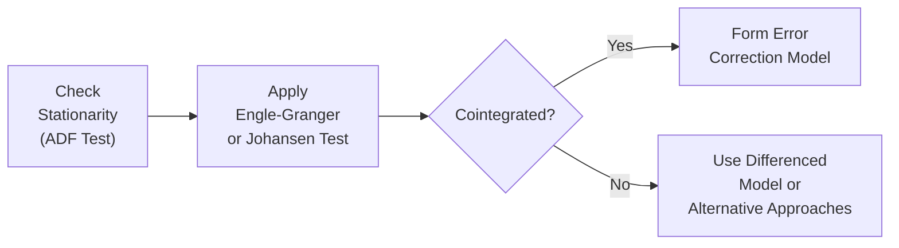

## Background and Motivation

Ever chatted with a friend about how two assets seem to “move together” in the market? Sometimes, they follow a common path because they’re driven by similar fundamentals—maybe they’re both large-cap tech stocks, or perhaps they are two types of government bonds. But here’s the catch: just because prices look similar doesn’t necessarily mean they share a long-term stable relationship. That’s where cointegration comes in.

Cointegration is a concept that captures long-run equilibrium relationships among time-series variables, even when each individual series itself might wander around (i.e., be non-stationary). In finance, this is crucial for understanding everything from pairs trading strategies to interest-rate dynamics. If two series, say Yₜ and Xₜ, are both integrated of order 1 (I(1))—in other words, they both contain a unit root—yet a certain linear combination of them (a₁Yₜ + a₂Xₜ) is stationary (I(0)), then they are cointegrated. This tells us there’s a stable, long-term link between them, even if they drift up or down in the short run.

## Preliminaries: Stationarity and Integrated Processes

Before diving into cointegration, it’s important to recall the basics of integrated processes and stationarity (see also “12.3 Unit Roots, Stationarity, and Forecasting” in this book). A stationary process is one whose statistical properties—including mean and variance—do not depend on time. Many real-world financial time series like prices and exchange rates are not stationary; they often exhibit trends or random walk behavior. When a series must be differenced (subtracted from its own lag) once to become stationary, we say it’s I(1). This concept forms the foundation for cointegration analyses.

## Defining Cointegration

If Yₜ and Xₜ are each I(1) processes, but a linear combination such as:

a₁Yₜ + a₂Xₜ = Zₜ,

ends up being I(0), we say Yₜ and Xₜ are cointegrated. The intuition is that although Yₜ and Xₜ individually evolve over time in a non-stationary manner, they never truly drift too far apart in the long run, because some linear relationship “glues” them together.

It’s like two random walkers who occasionally stray, yet remain tethered by an invisible rope. They might each wander, but the rope (the long-run relationship) keeps them from diverging indefinitely. In financial markets, these walkers could be pairs of assets, interest rates, or currency exchange rates that reflect common factors or equilibrium forces.

## Error Correction Models (ECMs)

When two or more series are cointegrated, we can model their short-run adjustments in a way that respects their long-run equilibrium. That’s the beauty of an Error Correction Model (ECM). Suppose we suspect that Yₜ should move toward some equilibrium driven by Xₜ. An ECM handles both short-run dynamics and an adjustment mechanism toward the long-run relationship.

A simple bivariate ECM looks like:


\Delta Y_{t} \;=\; \alpha + \beta \,\Delta X_{t} \;+\; \gamma \,EC_{t-1} \;+\; \varepsilon_{t},


where:

• \\( \Delta Y_{t} \\) is the change (the first difference) in \\( Y_t \\).  
• \\( \Delta X_{t} \\) is the change in \\( X_t \\).  
• \\( EC_{t-1} \\) is the “error correction term,” typically the previous period’s deviation from the long-run relationship, often represented as \\((Y_{t-1} - \phi X_{t-1})\\).  
• \\( \gamma \\) measures how strongly the system corrects last period’s misalignment from the stable equilibrium.  

This model says that if your system was out of sync last period (because \\( Y_{t-1} \\) was a little too high or too low compared to its implied equilibrium with \\( X_{t-1} \\)), part of today’s change in \\( Y_t \\) will try to correct that gap. From a financial perspective, it’s analogous to saying that if one asset’s price is out of line with its cointegrated partner, market forces—arbitrage, for example—will push prices back in line over time.

## Practical Example: Pairs Trading

Picture this: I once had a friend who tried to do pairs trading with two major energy companies. He noticed they were highly correlated, so whenever one dipped relative to the other, he would buy the underperformer and short the outperformer. Over time, though, he discovered that a high correlation alone wasn’t enough. Occasionally, those stocks diverged massively—and they stayed that way. Ouch.

What he really needed was to test for cointegration. If those stocks were truly cointegrated, he’d be confident that any short-term misalignment would eventually revert, giving him a profitable mean-reversion trade. Without cointegration, a “cheap” asset might just keep getting cheaper relative to its so-called partner. The ECM framework quantifies this: if you’re cointegrated, you can track the equilibrium error and expect a partial correction in subsequent time periods.

## Testing for Cointegration

### 1. Test for Stationarity (Unit Roots)

As a first step, each individual time series must be tested for a unit root. This is typically done using the Augmented Dickey-Fuller (ADF) test or the Phillips-Perron test (see “12.3 Unit Roots, Stationarity, and Forecasting” for more details). You want to confirm that each series is indeed I(1).

### 2. Engle-Granger Two-Step Method

Engle-Granger’s classic approach involves:  
• Regressing \\( Y_t \\) on \\( X_t \\) to get the residuals \\( \hat{u}_t \\).  
• Testing whether \\( \hat{u}_t \\) is stationary (e.g., via an ADF test on \\( \hat{u}_t \\)).  

If you find that the residuals are stationary, it implies that \\( Y_t \\) and \\( X_t \\) are cointegrated. You can then build an ECM incorporating the lagged residuals as the error correction term.

### 3. Johansen Test

For a broader, multivariate setup (where you might have more than two series), the Johansen test is often preferred. It uses a vector autoregression (VAR) framework to identify the number of cointegrating relationships among several I(1) variables. This is particularly handy in more complex financial applications, such as modeling multiple yield curves or currency cross rates.

## Visualizing the Process

Below is a simple flowchart summarizing a typical cointegration testing process:

## Importance in Finance

Cointegration often underscores efficient market dynamics, where related assets or markets cannot diverge too far without inviting arbitrage trades that restore equilibrium. Common financial examples include:

• Spot and futures prices for commodities.  
• Different maturities of government bonds.  
• Exchange rates under certain currency regimes.  

From a risk management standpoint, if you know two assets are cointegrated, any short-term deviation might present either a trading opportunity (pairs trading) or a hedging insight. Also, cointegration can provide an anchor for long-term forecasts. In other words, if you forecast a sudden break in the cointegrated relationship, you had better have a great fundamental reason for that break!

## ECM in Action: The Short-Run/Long-Run Dance

Think of the ECM as capturing two parallel dances: a short-run dance and a long-run dance. In the short run, variables \\(\Delta Y_t\\) and \\(\Delta X_t\\) might bounce around with daily or monthly news. But if they stray too far, the “error correction piece” (seen in \\( \gamma EC_{t-1} \\)) tugs them back toward the stable, longtime groove.

This dynamic is consistent with real-world market observations. Bond yields might deviate for a while because of sudden risk-on or risk-off behavior, but eventually, if they are cointegrated (say, yields on two closely related government securities), we expect them to revert to a fundamental spread. The ECM’s “error term” captures precisely that correction mechanism.

## Common Challenges and Pitfalls

• Misidentifying Stationarity: If one or both series are not truly I(1), cointegration tests can give misleading results.  
• Data Snooping: Searching for cointegration among large sets of assets can lead to spurious relationships—just because something fits today’s data doesn’t mean it’s truly stable.  
• Structural Breaks: Real-world economic relationships can change. A trade war or a new regulation might break previously strong cointegration.  
• Overfitting with Multivariate Methods: Johansen tests can become computationally heavy and require careful interpretation, especially if you’re dealing with many variables.  

## Exam Relevance and Strategies

On the CFA exams—particularly Levels II and III—understanding how to handle non-stationary time series, test for cointegration, and then apply ECMs is big. You might encounter scenario-based questions that ask you to interpret test results or choose the appropriate model for forecast accuracy and risk assessment. 

• Be ready to articulate why cointegration is important in a pairs trading context or for analyzing interest rate differentials.  
• Know the difference between Engle-Granger and Johansen approaches.  
• Remember that if time series are cointegrated, using an ECM is typically more accurate than simply differencing the data.  

As you study, try to connect these tests with real-life financial relationships. That tangible link makes it easier to answer conceptual exam questions.  

## Conclusion

Cointegration and Error Correction Models form a powerful framework for capturing both the short-term fluctuations and the long-run equilibrium relationships in financial time series. Whenever you suspect that two asset prices, interest rates, or economic variables share a deeper connection, cointegration testing is the key stepping stone. If you confirm cointegration, an ECM elegantly weaves together short-run changes and the self-correcting long-run dynamic. 

In practice, these models remind us that markets often have hidden “tethers,” and understanding them can unlock profitable trading, robust hedges, or improved risk management insights. If anything, it underscores the essential balance between the forces that push market variables apart and those that pull them back together.

## References and Suggested Readings

• Engle, R.F. & Granger, C.W.J. (1987), “Co-integration and Error Correction: Representation, Estimation, and Testing.” Econometrica.  
• Johansen, S. (1995), “Likelihood-Based Inference in Cointegrated Vector Autoregressive Models.”  
• Tsay, R.S. (2010), “Analysis of Financial Time Series.” Wiley.  
• CFA Institute’s Official Curriculum on advanced time-series topics (Level II).  

---

## Final Exam Tips

• Double-check the stationarity of each time series before attempting cointegration tests.  
• Remember Engle-Granger is simpler for bivariate cases, while Johansen is more comprehensive for multiple series.  
• Don’t forget: If cointegration is confirmed, incorporate the error correction term. Otherwise, rely on differencing or other transformations.  
• Watch out for structural breaks: if your data has a known shift (e.g., policy change), you may need segmented cointegration tests or advanced approaches.

## Test Your Knowledge: Cointegration and ECM Concepts



### Which statement best describes cointegration?

- [ ] Two stationary time series that share no correlation.
- [ ] Two I(2) time series that become I(1) after differencing once.
- [x] Two or more I(1) time series whose linear combination is I(0).
- [ ] Two or more I(1) time series that exhibit an unbounded random walk.

> **Explanation:** Cointegration occurs when each series is individually I(1), but their linear combination is stationary (I(0)).

### Which of the following is a standard tool for testing cointegration in a univariate context?

- [x] The Engle-Granger two-step method.
- [ ] The Durbin-Watson test.
- [ ] Principal Component Analysis.
- [ ] The Hansen Stability Test.

> **Explanation:** The Engle-Granger two-step method is commonly applied for testing cointegration in a bivariate (univariate regression) framework.

### In an Error Correction Model (ECM), what is the primary role of the error correction term (EC)?

- [ ] It represents a purely random shock to the series.
- [x] It measures the extent of deviation from the long-term equilibrium in the previous period.
- [ ] It ensures that all series remain non-stationary in the short run.
- [ ] It adds noise to prevent overfitting.

> **Explanation:** The error correction term typically captures last period’s imbalance from the long-run relationship, driving adjustments in the dependent variable.

### If cointegration is not found between two I(1) variables, which modeling approach is typically more appropriate?

- [ ] Use the original levels of the data without changes.
- [ ] Apply a Vector Error Correction Model (VECM).
- [ ] Model in second differences.
- [x] Use differenced series in a standard ARIMA or regression model.

> **Explanation:** If no cointegration is established, it’s safer to difference the series (if they are indeed I(1)) and proceed with stationarity-based models.

### When would the Johansen test be preferred over Engle-Granger?

- [x] When analyzing multiple time series for possible cointegration relationships.
- [ ] When dealing with only two variables.
- [x] When one series is I(2) and the other is I(1).
- [ ] When a nonparametric approach is required.

> **Explanation:** The Johansen test is particularly useful in a multivariate context, with more than two I(1) series; it also provides insight into the number of cointegrating vectors.

### Which of the following best illustrates the ECM concept?

- [x] Short-term price changes correct in response to a prior period’s deviation from a long-run relationship.
- [ ] The regression of a stationary variable on another stationary variable.
- [ ] A model where both variables are differenced to the second order.
- [ ] A model that excludes any lag structure.

> **Explanation:** An ECM explicitly incorporates the error correction term to reflect correction toward the equilibrium when short-term deviations occur.

### Suppose you run an Engle-Granger test on two series, Yₜ and Xₜ. Which step correctly applies Engle-Granger?

- [ ] First test if the residuals have an ARCH effect.
- [ ] Apply a t-test on the slope to see if it’s significant.
- [x] Regress Yₜ on Xₜ, then test the residuals for stationarity.
- [ ] Differentiate both series, then test if they’re cointegrated in the differences.

> **Explanation:** The Engle-Granger method regresses Yₜ against Xₜ and then performs a stationarity test on the residual. If residuals are stationary, cointegration is confirmed.

### An analyst finds that two equity indices share a long-run moving equilibrium. This suggests:

- [ ] The indices are well-hedged.
- [ ] They must be perfectly correlated.
- [x] They are cointegrated, possibly calling for an ECM approach.
- [ ] No further tests are necessary because correlation is sufficient.

> **Explanation:** The presence of a stable long-run equilibrium relationship implies cointegration, which can be modeled with an ECM.

### Intraday prices of a spot commodity and its futures contract are found to be cointegrated. Which of the following is a likely outcome?

- [x] Spot and futures prices will tend to revert to a stable spread over time.
- [ ] No arbitrage opportunities exist if the correlation is below 1.
- [ ] One price can permanently diverge without correction.
- [ ] The pair cannot be used in ECM modeling.

> **Explanation:** Cointegrated spot and futures series typically revolve around a cost-of-carry relationship, causing reversion to a stable spread.

### True or False: If Yₜ and Xₜ are cointegrated, differencing Yₜ and Xₜ and then ignoring the error correction term may lead to a loss of long-run information in the model.

- [x] True
- [ ] False

> **Explanation:** Differencing cointegrated series without incorporating an error correction term omits the long-term equilibrium relationship, losing crucial information about how short-term deviations correct over time.


