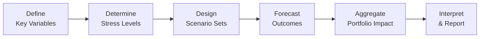

## Introduction and Context

Scenario analysis is one of those topics that sounds fancy at first, but it's essentially about asking, “What if...?” and systematically exploring the answer. It’s like saying, “What if interest rates spike in the next quarter? How might my portfolio behave, especially if equity markets also move in tandem or if the central bank intervenes?” You’d be surprised how that helps you see vulnerabilities you wouldn’t catch by just looking at a single metric like standard deviation or Value at Risk (VaR). 

Anyway, I remember doing a scenario analysis project years ago when I was knee-deep in analyzing a handful of convertible bonds. One day we realized our standard deviation-based risk measures weren’t telling the full story of how these bonds might blow up if interest rates and equity markets went in certain extreme directions at the same time. That insight changed the way we allocated capital—and probably saved us some sleepless nights.

In this section, we’ll discuss how you can systematically perform scenario analysis for risk assessment, an approach that has become an integral part of the bigger risk management picture in finance. We’ll define terminology, walk through steps, and highlight practical applications. And yes, we’ll keep it slightly conversational so it’s not another dry piece of finance text.

## Why Scenario Analysis Matters

Scenario analysis helps you step out of a purely statistical worldview. Sure, you might love your normal distributions and volatility measures (as introduced in Chapter 3 on Statistical Measures of Asset Returns), but as we all know, markets can be quite non-linear and full of surprises. By imagining a potential future or “scenario” and then looking at how your portfolio might fare, you identify:

• Potential tail events (e.g., a global recession).  
• Changes in correlations among assets.  
• Vulnerabilities of portfolios with options, convertible bonds, or other non-linear instruments.  

It’s not just about numbering the outcomes—it’s about challenging your assumptions, especially in the face of major macroeconomic or geopolitical shocks.

## Key Definitions and Glossary

### Scenario Analysis
A method for projecting various future states of the market or economy and modeling portfolio outcomes under these assumed conditions. Scenario analysis typically covers scenarios with different permutations of key market factors—interest rates, GDP growth, inflation, currency rates, etc.

### Macroeconomic Shocks
Unforeseen, large-scale economic events (e.g., financial crises or drastic policy changes) that can substantially alter market behavior. Such shocks can be introduced into scenarios to examine worst-case or extreme outcomes.

### Single-Factor Scenario
A scenario in which only one variable (e.g., interest rates) changes significantly, with other factors held constant. This is often used to isolate the sensitivity of a portfolio to a specific risk driver.

### Multi-Factor Scenario
A scenario involving simultaneous changes in multiple variables (e.g., interest rates, credit spreads, equity prices, growth rates). This is more realistic since in the real world, variables can move together or reinforce each other.

### Non-linear Portfolios
Portfolios containing instruments whose payoffs are not a straightforward linear function of the underlying asset prices or rates. Examples are options, convertible bonds, or structured products. These are especially prone to surprising outcomes if you only rely on simple volatility metrics.

### Stress Levels
Magnitudes of variable shocks used in scenario analysis, often set based on tail events or historically rare levels. Stress levels can come from historical episodes such as the Global Financial Crisis or from hypothetical extremes.

## The Scenario Analysis Process

Below is a broad outline of how risk managers typically frame scenario analysis in practice:

1. Define Key Variables: Identify major market, macroeconomic, and potentially idiosyncratic variables that affect your portfolio—such as interest rates, credit spreads, commodity prices, GDP growth, or inflation data.  
2. Determine Stress Levels: Decide how extreme you want the move to be (e.g., a 300-basis-point shift in interest rates or a 30% drop in equity prices). These levels might be informed by historical data (as introduced in Chapter 4) or entirely hypothetical.  
3. Design Scenario Sets: You’ll often have a base case, a worst case, and a best case at minimum. But you can get creative—some risk managers run multiple worst-case scenarios, each focusing on different potential crises.  
4. Forecast Outcomes per Scenario: Use financial models to estimate how each factor shift might affect each asset or portfolio component.  
5. Aggregate Portfolio Impact: Sum up or net out gains and losses across individual positions. Take into account possible correlations or interactions.  
6. Interpret Results and Report: Present these results to decision-makers or clients, highlighting which scenario is most damaging and why.

A common way to visualize these steps is shown below:

### Incorporating Qualitative Judgment

Quantitative models often rely on historical data, but let’s be honest: sometimes history doesn’t perfectly predict the future. For instance, central banks might employ unconventional monetary policies that you haven’t seen in your historical sample (think negative interest rates, or large-scale asset purchases). This is where you or your team can make a judgment call—extending or adjusting the data-based parameters to reflect new or unusual policy actions. Balancing the quantitative and the qualitative can help you create more nuanced, realistic scenarios.

## Single-Factor vs. Multi-Factor Scenarios

• Single-Factor Scenario: Let’s say you have a portfolio heavily exposed to interest rate risk. You might push interest rates up by 200 bps from current levels and keep all other factors (e.g., inflation, GDP growth) fixed. This allows you to see, quite precisely, how much of your portfolio’s performance is hinging on interest rate changes.  

• Multi-Factor Scenario: In the real world, interest rates rarely move in a vacuum. Suppose inflation jumps unexpectedly and the central bank responds by raising interest rates more than the market anticipates. Equity markets might tumble, credit spreads might widen, and currencies could shift. A multi-factor scenario would combine changes to all these variables to see how they collectively impact your portfolio.

## Handling Non-Linear Portfolios

Scenario analysis is particularly vital when the payoff structure isn’t linear, as is the case with options or convertible instruments. Why? Because a small shift in underlying prices might create a disproportionately large move in the portfolio’s overall value. Non-linear portfolios can behave one way in stable markets and behave in an entirely different way in stressed conditions. By analyzing them under different permutations of market variables, you often uncover patterns that standard deviation or beta measures alone might not reveal.

## Best-Case, Worst-Case, and Base-Level Scenarios

A typical scenario set often includes:

• Best-Case Scenario: Maybe your forecast or your “dream scenario” is that GDP growth stays robust, interest rates remain moderate, inflation is under control, and corporate earnings are strong. A lot of times, folks do this scenario to see the potential upside.  

• Worst-Case Scenario: Think a global recession triggered by a sharp market correction, geopolitical conflict, or a spike in oil prices that leads to high inflation and a rapid policy response. By exploring the worst-case scenario, you recognize how your portfolio’s losses might balloon, or how correlations might move closer to 1 as everything sells off.  

• Base-Case Scenario: This is typically your “as expected” or “most likely” scenario, reflecting current consensus about how markets and the economy will unfold over your forecast horizon.  

It’s not uncommon to run multiple versions of each scenario. For instance, you could set a “moderate recession” scenario, then a more “severe recession” scenario, each with different intensities of the same macro shocks.

## Linking Scenario Analysis to Other Risk Assessments

By combining scenario analysis with the techniques learned in other chapters, you create a more comprehensive risk framework:

• From Chapter 5 (Portfolio Mathematics), you know how to compute expected returns, variance, and correlation. Use these measures to see how correlated your assets might become under stressed conditions.  
• In Chapter 6 (Simulation Methods), you learned about Monte Carlo approaches. Scenario analysis can be integrated into or run alongside Monte Carlo methods to produce a distribution of possible portfolio outcomes.  
• In Chapter 12 (Time-Series Analysis), you explored autoregressive and moving average models. These can inform the assumptions about how variables might evolve over time.

## Practical Financial Examples

Let’s illustrate a straightforward multi-factor scenario for a balanced equity-bond portfolio:

• Current Portfolio: 60% equity (diversified global equities), 40% corporate bonds (investment-grade).  
• Key Variables to Shock: GDP growth, interest rates, equity market index level, and corporate credit spreads.  
• Scenario Setup:  
  – Worst-Case: GDP growth drops from 2% to -1%, interest rates rise 100 bps, equity markets decline by 20%, and credit spreads widen by 200 bps.  
  – Base-Case: GDP growth at 2%, interest rates remain stable, equity markets rise 5%, credit spreads widen slightly by 25 bps.  
  – Best-Case: GDP growth above 3%, interest rates unchanged, equity markets rise 10%, credit spreads narrow by 10 bps.  

When you input these shocks into your portfolio model, you might find the worst-case scenario yields a -12% portfolio return (driven by both equity losses and losses on corporate bonds), while the best-case scenario yields a +8% return. The base case might sit somewhere in between, say +2%. The insight you get is how extreme each outcome is and where you might rebalance or hedge ahead of time.

## Best Practices and Common Pitfalls

• Use Realistic Stress Levels: An overly mild stress scenario can lull you into complacency, while a doomsday scenario might be so extreme it’s practically detached from reality.  
• Remember Correlations Can Change: Correlations in normal times might differ dramatically in stressed markets.  
• Include Qualitative Factors: Don’t just rely on historical data—factor in possible future policy moves or idiosyncratic shocks.  
• Don’t Over-Complicate: If you have too many scenarios, your decision-makers (or even you) may get lost in the data. Stick to a manageable set of them, each addressing a primary concern.  
• Revisit Regularly: Market conditions evolve, so keep updating your scenario analysis with new data and new risk concerns.

## Relationship to Stress Testing

Scenario analysis and stress testing are siblings (discussed in more detail in Subchapter 13.3). Stress testing often involves extremely adverse but plausible events. In practice, stress testing is considered part of scenario analysis—just with the “screw turned” more toward worst-case extremes like 2008-level meltdown conditions. Regulatory authorities frequently require stress tests to ensure the financial system’s stability.

## Bringing It All Together: Making Informed Decisions

The ultimate point of scenario analysis is to help you make better-informed decisions about asset allocation, risk budgeting, or hedging. It can shape a firm’s entire strategy. If you discover that a particular scenario could wipe out half your portfolio return, you might mitigate that risk by:

• Buying options for downside protection.  
• Diversifying into less correlated assets.  
• Holding additional liquidity to weather short-term drawdowns.

Scenario analysis also plays a significant role in constructing an Investment Policy Statement (IPS), as it informs both your ability and willingness to take risk in various economic contexts.

## Exam Tips for Scenario Analysis

• Articulate Key Assumptions: On the CFA exam (including potential essay-style questions), make sure you can outline the assumptions behind each scenario.  
• Show Your Work: If you’re asked to produce a scenario analysis for a hypothetical portfolio, demonstrate how you arrived at the variable changes.  
• Be Ready to Compare Scenarios: Sometimes the exam asks for direct comparisons—e.g., “Under which scenario does the portfolio experience the largest drawdown?”  
• Link to Other Tools: They might ask how scenario analysis complements or differs from VaR, or how it ties into risk budgeting.  
• Time Management: Scenario-based questions can get lengthy. Keep your outline crisp, define your variables and assumptions quickly, and then move on to highlight the results.

## References, Suggested Reading, and Links

• Fabozzi, F. J., & Markowitz, H. (Eds.). (2002). The Theory and Practice of Investment Management. John Wiley & Sons.  
• Risk.net articles on scenario analysis:  
  [Risk.net: Scenario Analysis](https://www.risk.net/topic/scenario-analysis)  
• Brigo, D., et al. (2010). Credit Models and the Crisis: A Journey into CDOs, Copulas, Correlations, and Dynamic Models. John Wiley & Sons.  

Also, remember to revisit Chapter 5 (Portfolio Mathematics), Chapter 6 (Simulation Methods), and Chapter 13.1 (Principles of Back-Testing in Finance) for complementary insights.

----

## Test Your Knowledge: Scenario Analysis in Risk Assessment Quiz



### When considering scenario analysis, a multi-factor scenario is characterized by:
- [ ] A single macroeconomic shock, holding everything else constant.
- [x] Multiple variables changing in tandem (e.g., interest rates, credit spreads, equity prices).
- [ ] One factor changing upward and the other changing downward, offsetting each other.
- [ ] Only boycotting all historically improbable economic events.

> **Explanation:** In a multi-factor scenario, multiple market variables shift together—much more realistic than focusing on just one factor at a time.

### Which of the following highlights a reason scenario analysis can capture portfolio vulnerabilities better than standard deviation alone?
- [ ] Standard deviation is always underestimating returns.
- [ ] Scenario analysis uses only one factor change.
- [ ] Standard deviation is rarely computed correctly.
- [x] Scenario analysis can reveal non-linear outcomes that simple variance measures miss.

> **Explanation:** Non-linear exposures (e.g., from options) are poorly captured by variance-based measures. Scenario analysis allows for diverse moves across multiple variables, exposing such non-linearities.

### Imagine you have a portfolio of convertible bonds. Which statement best describes how scenario analysis may enrich your risk assessment compared to value at risk (VaR)?
- [ ] Scenario analysis is exact, while VaR is only approximate.
- [ ] VaR is purely hypothetical, but scenario analysis is only historical.
- [x] Scenario analysis can incorporate distinct paths of underlying asset prices, revealing non-linear payoffs that VaR might underestimate.
- [ ] VaR typically outperforms scenario analysis in capturing black swan events.

> **Explanation:** Convertible bonds have both bond-like and option-like features. Scenario analysis can explicitly model different paths and magnitudes of shocks, revealing non-linear payoffs less transparent in VaR.

### When designing stress levels for scenario analysis:
- [ ] Choose only the smallest plausible movements for your variables to stay conservative.
- [x] Use historically observed extreme shocks or hypothetical but plausible extremes as a guide.
- [ ] Avoid referencing historical data, since it’s irrelevant.
- [ ] Estimate them by flipping a coin for each scenario.

> **Explanation:** Stress levels often come from historically observed tail events or plausible extremes. This approach ensures scenarios remain relevant yet sufficiently stressful.

### A best-case scenario typically includes:
- [x] Strong GDP growth, stable interest rates, favorable capital market conditions.
- [ ] Only tail events, such as central bank policy errors or wars.
- [ ] Full breakdown of markets and maximum panic.
- [ ] A scenario guaranteed never to occur in reality.

> **Explanation:** Best-case scenarios assume favorable macroeconomic and market conditions—like strong growth, stable interest rates, and healthy earnings.

### Which of the following is NOT a common pitfall in scenario analysis?
- [ ] Overlooking correlation changes in stressed markets.
- [ ] Overcomplicating scenarios with too many variables.
- [ ] Failing to update scenarios as markets evolve.
- [x] Ensuring each shock is mildly realistic and aligned with past data.

> **Explanation:** Being mindful of realistic stress levels is actually a best practice, not a pitfall. The other options describe genuine pitfalls that undermine scenario analysis.

### A risk manager wants to isolate the effect of a single variable change on a portfolio. The most appropriate type of scenario analysis is:
- [x] A single-factor scenario.
- [ ] A multi-factor scenario.
- [ ] A correlated-scenario-only approach.
- [ ] None, because scenario analysis does not allow isolation of a single variable.

> **Explanation:** Single-factor scenarios allow the risk manager to assess the sensitivity of a portfolio to one major variable while holding others constant.

### Scenario analysis for a portfolio containing commodity derivatives should always consider:
- [ ] Only interest rate moves, ignoring commodity prices.
- [ ] Stable commodity prices because they have negligible influence.
- [ ] Multi-factor scenarios that exclude inventory-level shocks.
- [x] Fluctuations in commodity prices and possibly currency and demand-side shocks, given commodity price sensitivity.

> **Explanation:** Commodity-derivative portfolios are heavily sensitive to commodity price changes, along with other macro factors such as currency levels, global demand, and interest rates.

### In the context of scenario analysis, which of the following statements is correct regarding qualitative judgment?
- [ ] Only historical data should be used; expert judgment skews results.
- [x] Experts may adjust assumptions to account for unique policy actions or emerging market factors not captured by history.
- [ ] Qualitative inputs are irrelevant for large-scale scenario design.
- [ ] Qualitative judgment should replace quantitative data.

> **Explanation:** Combining qualitative insights and quantitative data helps ensure scenarios are relevant—particularly when facing new or unprecedented policy or market actions.

### Scenario analysis is useful because it:
- [x] Reveals potential outcomes under specified “what-if” conditions.
- [ ] Replaces all other forms of risk measurement.
- [ ] Guarantees protection against tail events.
- [ ] Is always more accurate than VaR.

> **Explanation:** Scenario analysis is a valuable tool for exploring outcomes under distinct sets of assumptions. It does not replace other risk measures, nor does it ensure protection against extreme events.


