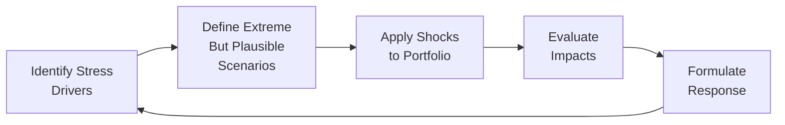

## Introduction
Stress testing is a specialized form of scenario analysis that zeroes in on how a portfolio might perform under severe, yet plausible, market disruptions. Think of it as cranking up the volume on volatility—like exploring how your equity holdings would react if the stock market plunged by 30% overnight or if interest rates shot up by 300 basis points over the course of a month. When I first dipped my toes into risk management, I remember thinking: “Um, do we really need to consider all these ‘end-of-the-world’ type events?” And the answer was always a resounding “Yes,” because without stress testing, you’re basically ignoring the possibility of a perfect storm—and that can leave your portfolio dangerously exposed.

In Chapter 13.2, we discussed scenario analysis and how it examines a range of possible outcomes based on certain assumptions. Stress testing is in the same family, but it ramps up the intensity. Instead of simply asking, “What if the market goes down 5%?” we might ask, “What if there’s a sudden spike in inflation, a sharp rise in unemployment, a fall in GDP, and a partial freeze in credit markets, all at once?” If that sounds extreme, well, that’s exactly the point. Real-world market meltdowns often involve multiple, correlated shocks happening together, so a robust stress test tries to account for all of them as a collective threat.

## The Purpose of Stress Testing
Stress testing has evolved into a critical tool for regulators and practitioners alike. In the wake of major financial crises (hello 2008!), regulatory bodies such as the Basel Committee on Banking Supervision started mandating systematic stress tests to ensure financial institutions maintain enough capital reserves to weather truly bad times.

• Strengthening Risk Management: By identifying how a portfolio responds to extreme changes in risk factors (e.g., stock prices, interest rates, credit spreads), stress tests give you a blueprint for proper position sizing, capital allocation, or even complete design overhauls of the portfolio if necessary.

• Meeting Regulatory Requirements: Under frameworks such as the Basel Accords (for banks) or various solvency regulation regimes (for insurance companies), mandatory stress tests highlight your capacity to maintain specified capital or liquidity thresholds.

• Informing Strategic Decision‑Making: Maybe your stress test reveals you’re overexposed to interest-rate risk or your liquidity cushion is too small if your largest counterparty defaults. Stress testing results help shape strategic decisions, like adjusting leverage, diversifying sectors, or accumulating more high-quality liquid assets.

• Communicating Risks to Stakeholders: If you’re managing money for external clients or shareholders, stress testing results can help them understand worst-case scenarios. It’s reassuring to show that you’ve already war-gamed a wide range of dire market movements—and have solutions in place.

## Key Steps in Stress Testing
Before we jump into the juicy details, let’s outline a straightforward approach. I like to think of this as a cyclical process:

1. Identify Stress Drivers: Pinpoint the major risk factors that could ripple through your portfolio. Are you worried about substantial equity drawdowns, commodity price shocks, or real estate collapses? Chapter 13.2 on scenario analysis provides a broader framework for identifying potential threats.

2. Specify Extreme but Plausible Scenarios: Determine how you’ll shock the system. For instance, you might assume volatility doubles, interest rates spike by 300 basis points, or credit spreads widen dramatically. Use historical crises or hypothetical worst-case events as your guide.

3. Apply Shocks to Portfolio Positions: Adjust or “shock” each asset’s inputs (e.g., discount rates, growth expectations, foreign exchange rates) to mirror your chosen stress scenario. In some cases, you might combine multiple shocks to simulate correlated market meltdowns.

4. Evaluate Portfolio Impacts: Recalculate portfolio value, potential losses, liquidity metrics, or capital adequacy. The deeper analysis often comes with advanced methods—like Monte Carlo simulations from Chapter 6—where you might run thousands of stress scenarios to see how your portfolio fares.

5. Formulate a Response: If the results show potential meltdown territory, you might reduce leverage, cut exposure to volatile assets, or buy hedging instruments. In a mild scenario, you might be fine. But it’s always good to see that in black and white (or in the color-coded risk dashboard) instead of guessing.

Below is a simple flowchart of the stress testing process to visualize these steps:

## Types of Stress Tests
### Worst-Case Stress Tests
These are the big, scary ones—where you assume the most extreme market movements. The idea is to see how your portfolio would hold up in a situation reminiscent of the 1987 crash, the 2008 financial crisis, or COVID-era volatility. While it may feel unrealistic to assume everything goes wrong at once, real markets can correlate in surprising ways during crises, so you’d rather be safe than sorry.

### Reverse Stress Testing
Reverse stress testing is kind of the “investigative detective” technique in risk management. Instead of starting with a market shock and seeing what losses result, you begin by defining the point at which your portfolio becomes unviable—maybe that’s a 60% drop in overall value or your capital ratio dips below a key threshold. Then you work backward to figure out what magnitude of change in each risk factor (interest rates, equity prices, default rates, etc.) would push you to that fateful point. This approach is increasingly popular among regulators and boards because it highlights the “worst-of-the-worst” that could cause catastrophic failure.

### Liquidity Stress Testing
Ever notice how, in a real crisis, market liquidity can evaporate, just when you need it most? Liquidity stress tests assess if you have enough cash or easily sellable assets to meet obligations when things get hairy. This might involve modeling extremely wide bid-ask spreads, large redemptions by clients, or abrupt funding cutoffs from creditors. For banks, in particular, such tests check compliance with mandated liquidity coverage ratios (LCR) and other regulatory liquidity standards.

## Layering Stress Drivers
One of the hallmarks of a thorough stress test is layering multiple shocks together. For example, a spike in interest rates might also trigger:

• A slump in property values (as mortgage rates climb, housing demand falls).  
• An uptick in default rates (because of higher borrowing costs).  
• Exchange-rate volatility (as global capital shifts to higher-yielding currencies).  

Hence, stressing your portfolio in isolation—like looking at interest rates alone—might not capture that real crises often involve multiple interlocking shocks. In Chapter 5 (Portfolio Mathematics), we learned about correlations and how assets behave in tandem. Under extreme stress, correlations can shift dramatically (often headed toward 1.0). That’s why layering is crucial: it highlights these hidden interdependencies.

## Regulatory Stress Testing Requirements
Some of you might be aiming for careers at large financial institutions, so let’s talk about regulatory frameworks. Banks governed by the Basel Accords face regular, standardized stress testing. In many jurisdictions, it’s not optional: you have to show you’ll maintain a specified capital ratio even if the economy tanks or if interest rates skyrocket. Insurers, meanwhile, face solvency requirements that demand robust stress tests for liabilities linked to hurricanes, pandemics, or severe market downturns simultaneously.

While these mandated stress tests can be elaborate (the results sometimes get covered in the financial press!), the logic is similar to the do-it-yourself approach: define extreme but plausible scenarios, model the impact, see where capital or liquidity shortfalls might arise, then fix those weaknesses.

## Interpreting the Results
After you run the stress test, you’ll typically get quantitative outputs—like potential losses (in monetary terms or as a percentage of the portfolio), liquidity ratios under stress, or changes in leverage or risk-based capital measures. Here’s the big question: “So, what next?” (I remember my first big stress test results felt like a mountain of data. I honestly stared at the spreadsheets and thought, “Now what do I do with all these numbers?”)

1. Check Adequacy of Capital or Reserves: If the losses are so high you blow through your risk buffer, you might need to raise capital, lower exposures, or purchase insurance or derivatives to hedge.

2. Evaluate Asset Allocation Shifts: Maybe your equity portion is more vulnerable than you realized, or your bond portfolio is heavily concentrated in high yield. Stress test results can inform rebalancing decisions or the timing of new trades.

3. Decide on Liquidity Management: If liquidity stress tests show you’d be forced to liquidate illiquid assets at steep discounts, consider building a bigger buffer of short-term liquid instruments.

4. Communicate Findings: Senior management, clients, or regulators need to understand the results without wading through 50 pages of technical jargon. Summaries and visual dashboards often help deliver the message quickly and effectively.

## Practical Example
Let’s walk through a simplified example. Suppose you manage a portfolio of:

• 50% in global equities  
• 30% in government bonds  
• 20% in corporate high-yield bonds  

You worry about two big risk factors: (1) a 25% equity market drop, and (2) a 200-basis-point interest rate rise.

Scenario Setup:
• You apply both shocks simultaneously: equities down 25%, bonds lose value depending on their duration.  
• Government bonds might drop in price by, say, 5% (assuming a moderate duration).  
• High-yield corporate bonds might fall 10% due to higher credit spreads and rate sensitivity.  

Stress Testing Steps:
• Reprice your holdings. Let’s say your $100 million portfolio (pre-stress) loses $12.5 million on equities, $1.5 million on government bonds, and $2 million on high yield.  
• Check if any margin calls would arise if much of your portfolio were pledged as collateral.  
• Assess new capital ratios. If you started with $15 million in “risk buffer,” you might be down to $(-1) million, indicating a shortfall.  

Interpretation and Response:
• The combined shock scenario implies you don’t have enough cushion. You might reduce high-yield exposure, or add derivatives that profit from rate hikes. Possibly you’d raise fresh equity capital, or hold a chunk of your portfolio in more stable, lower-duration instruments.

## Common Pitfalls and Best Practices
• Overlooking Correlations: If you treat each risk factor separately, you risk underestimating combined losses.  
• Inconsistent Data Inputs: Garbage in, garbage out. Make sure your input assumptions (interest rates, correlation matrices, default probabilities) align with each other and with your scenario narrative.  
• Focusing Only on Historical Data: Past crises are great references, but future ones could play out differently. Incorporating forward-looking or hypothetical shocks is key.  
• Neglecting Liquidity Management: Even if mark-to-market losses aren’t crippling, an inability to sell assets or meet funding demands can be fatal.  
• Not Revisiting Scenarios: Stress testing isn’t “one-and-done.” It’s iterative. As markets and portfolios change, so should your stress scenarios.

## Reverse Stress Testing in Action
I once attended a workshop on reverse stress tests where the instructor challenged us to assume that a portfolio lost half its value. We had to trace back which combination of risk factors—like a 40% equity drop, 10% default rates on corporate bonds, and a 25% decline in property prices—would produce that meltdown. It was illuminating. We realized that events we considered separate could compound each other fiercely, leading to basically the worst-case result. This approach forced us to question underlying assumptions about diversification.

## Conclusion and Exam Relevance
Stress tests aren’t just about being dramatic. They’re about ensuring you’re prepared. Regulators use them to keep financial institutions stable, but from an investor’s standpoint, they’re crucial for sound risk management. In the context of the CFA exam, you might be asked to interpret hypothetical data from a stress test, evaluate a portfolio’s resilience, or propose portfolio adjustments based on extreme but plausible events. Understanding how to construct, apply, and interpret stress tests (including reverse stress testing) is a key skill that sits right between quantitative analysis (covered throughout Volume 1) and risk management.

By now, you should feel pretty comfortable about not just the “why” of stress testing but the “how.” And hey, next time someone says, “Are you actually expecting the market to drop 25% in a week?” you can reply, “Well, maybe not. But I’m prepared if it does.”

## References and Suggested Reading
- Basel Committee on Banking Supervision (2018). “Stress Testing Principles.” Bank for International Settlements.  
- Glasserman, P. (2014). Monte Carlo Methods in Financial Engineering. Springer.  
- Matz, L., & Neu, P. (2006). Liquidity Risk Measurement and Management: A Practitioner’s Guide to Global Best Practices. John Wiley & Sons.  
- For insights on layering scenarios and correlations, see Chapter 5 (Portfolio Mathematics) of this volume.  
- For deeper scenario-building guidance, refer to Chapter 13.2 (Scenario Analysis for Risk Assessment).  

## Test Your Knowledge: Stress Testing Portfolio Performance



### In a stress test scenario analysis, which of the following is generally emphasized?
- [ ] Predicting normal market conditions
- [x] Evaluating portfolio performance under extreme but plausible market events
- [ ] Identifying bullish market catalysts for outperformance
- [ ] Narrow spreads and stable interest rates

> **Explanation:** Stress tests zoom in on the worst-case (but still plausible) scenarios in order to measure the potential losses or liquidity challenges faced by a portfolio.

### Which of the following best describes reverse stress testing?
- [ ] Starting with a scenario and estimating losses
- [x] Determining the point of portfolio failure and then working backward to identify the scenario causing it
- [ ] Assessing liquidity under normal market fluctuations
- [ ] Applying random shocks to arbitrary macro variables

> **Explanation:** Reverse stress testing identifies the thresholds at which a portfolio or institution collapses, then maps those intolerable outcomes back to specific market conditions.

### What is the primary objective of liquidity stress testing?
- [x] Ensuring the portfolio can meet redemption or funding requirements during market disruptions
- [ ] Maximizing portfolio returns in normal times
- [ ] Eliminating all forms of market risk
- [ ] Enhancing profitability through speculation

> **Explanation:** Liquidity stress tests gauge a portfolio’s capacity to generate cash or liquid positions without incurring catastrophic losses or missing payout obligations during stressed conditions.

### Under regulatory stress testing guidelines, financial institutions are typically required to:
- [ ] Hide the magnitude of portfolio losses from stakeholders
- [ ] Circumvent any discussion of capital adequacy
- [x] Demonstrate that they hold sufficient capital to handle severe market shocks
- [ ] Increase correlation across assets to reduce volatility

> **Explanation:** Regulators mandate stress tests to ensure institutions have sufficient capital reserves to cope with major market, credit, or liquidity disruptions.

### In stress testing, why is it important to layer different risk drivers simultaneously?
- [x] Because real-world market crises often involve correlated factors acting together
- [ ] Because it simplifies data inputs
- [x] Because single-factor shocks rarely capture systemic risk
- [ ] Because adding multiple shocks reduces the total measured risk

> **Explanation:** Combining different shocks (e.g., interest rate spikes, credit events, and equity crashes) better reflects how markets behave under strain, where various risks can compound one another.

### If a stress test reveals that potential losses exceed your current risk buffer:
- [x] You may need to raise capital or reduce risk exposures
- [ ] No action is required if the portfolio seems diversified
- [ ] It indicates the stress scenario is unrealistic
- [ ] The test is invalid

> **Explanation:** Stress test results that exceed risk tolerance thresholds typically prompt strategic actions such as de‑leveraging, hedging, or adjusting asset allocations.

### Which of the following would typically be considered a “worst-case” scenario for an equity‑heavy portfolio?
- [x] A sudden 40% drop in equity prices combined with a credit spread widening
- [ ] A 2% annual equity decline
- [x] Concurrent stock crash and liquidity crunch
- [ ] Only a mild dip in consumer sentiment

> **Explanation:** A sharp equity drop accompanied by increased credit spreads and liquidity crunches exemplifies a high-stress environment for an equity-heavy portfolio.

### When interpreting stress test results, a common pitfall is:
- [x] Relying exclusively on past data without considering emerging risks
- [ ] Overestimating liquidity needs
- [ ] Overdiversifying the portfolio
- [ ] Including too many hypothetical risk drivers

> **Explanation:** Solely using historical data might fail to capture future evolutions or rare events that haven’t yet occurred, leading to an underestimation of potential losses.

### Which statement about regulatory stress testing is most accurate?
- [x] It is often mandatory for banks under the Basel Accords
- [ ] Only hedge funds are required to conduct such tests
- [ ] It faces no public disclosure requirements
- [ ] It is meant to guarantee a profit in all markets

> **Explanation:** Under the Basel rules, banks must conduct regular stress tests to meet capital and liquidity standards; these results often undergo regulatory review (and sometimes public disclosure).

### Stress tests generally assume:
- [x] True
- [ ] False

> **Explanation:** Stress tests generally assume extreme but plausible market events, not certain or guaranteed ones. The goal is to gauge how a portfolio holds up under such extraordinary conditions.


