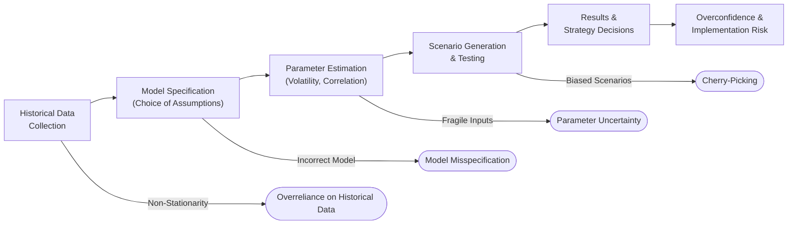

## Introduction

Well, I’ve got to admit: back‑testing has always felt like a treasure hunt to me—like you’re rummaging through historical data in hopes of striking gold by discovering the perfect trading strategy. But I’ve also had those unfortunate moments where I got super excited over a “foolproof” historical pattern, only to watch it crumble as soon as real-world markets shifted direction. This experience captures the basic tension in model‑based testing: however rigorous or mathematically elegant, it isn’t foolproof.

This reading is part of Chapter 13: Back‑Testing and Scenario Analysis in CFA® 2025 Level I, Volume 1: Quantitative Methods. Specifically, we’re looking at key limitations and pitfalls of model‑based testing (Section 13.4). Throughout the earlier sections of Chapter 13 (including 13.1, 13.2, and 13.3), we've seen how back‑testing can be a powerful tool for evaluating strategies and stress testing portfolio performance. But these methods can mislead us if we’re not careful. Here, we’ll explore the primary pitfalls: overreliance on historical data, model misspecification, parameter uncertainty, and cherry‑picking scenarios. We’ll also look at best practices, real-life examples, and some ways to stay grounded in reality.

## Overreliance on Historical Data

When back‑testing, it’s tempting to believe that history will repeat itself in an orderly fashion. After all, we spend hours calibrating models to historical volatility, interest rates, correlations, and other metrics. We think: “If it worked before, it should work again.” But markets can be a tad sneaky. New monetary policies emerge, technology disrupts entire industries, and investor psychology shifts.

### The Non‑Stationarity Problem

One big culprit here is what you might have heard referred to as non‑stationarity. This term means that the statistical properties of a time series—like its mean, variance, or correlation structure—are not constant over time. So, if your back‑test uses data from a period of stable inflation and moderate interest rates, then tries to make predictions about a world with significantly different macroeconomic factors, the result can be pretty misleading.

Consider a hypothetical scenario: you have a bond portfolio with a strategy that performed amazingly throughout a period of steadily declining interest rates. Now, if the future environment flips to match conditions where rates rise sharply, your historical data reference is fundamentally at odds with what’s happening in real time. In short, your model might be built on a historical “regime” that no longer exists.

### Abrupt Breakpoints

Another dimension to the same problem: abrupt breakpoints in the data. In Chapter 12 (Time‑Series Analysis), we learned about structural breaks—points in time where the financial series changes its behavior abruptly (e.g., central bank policy shifts or sudden market shocks). If your back‑test lumps all data together, ignoring these breaks, you’ll get a skewed sense of stability. This can lead you to under- or overestimate risk, or to trust certain correlation assumptions that have changed drastically.

## Model Misspecification

Then comes the issue of model misspecification. Even if you have reliable data, you must specify a model that accurately describes the relationship between your variables. Often, we default to “standard” assumptions such as normally distributed returns or constant correlations—partly because it simplifies the math. And, well, academically, the normal distribution is a convenient friend. 

### Incorrect Distributional Assumptions

But if your portfolio contains assets prone to “fat tails” (like emerging market equities or options), the normal distribution might hide the true risk. Consider the 2007–2008 Global Financial Crisis. Many Value at Risk (VaR) models used fairly benign (and, in hindsight, naive) distributional assumptions. Real‑world losses turned out to be far outside the predicted confidence intervals—leading folks to realize the models were patently mis-specified for a crisis environment. 

In simpler terms, you’re performing a scenario analysis or building a stress testing model that says: “Worst-case daily loss is—maybe—4%.” Then along comes a day with a 10% drop. Your model can’t see that coming because it’s anchored by an assumption that extreme outcomes are extremely rare.

### Hidden Nonlinearities and Contagion Effects

Model misspecification often underestimates how assets interact, especially during times of stress. Nonlinear instruments like options can behave unexpectedly when implied volatility spikes. Similarly, contagion effects (i.e., how a failure in one part of the market can cause disturbances in seemingly unrelated parts) also throw a wrench in simplistic correlation assumptions. 

If your model assumes correlation is small, it may guess that a meltdown in subprime mortgages won’t seriously affect corporate bond prices. But real crises often trigger chain reactions, as investors across multiple markets “rush for the exits” simultaneously. So, a well-intentioned back‑test that overlooks nonlinearities or contagion might look good on paper but fool you in practice.

## Parameter Uncertainty

Even when a model’s structure is correct, we can still fumble on the actual parameters that go into it—like volatility, correlation, or the mean return. Think about it this way: your training data might be fairly small, or it might overrepresent calm periods relative to volatile ones. And if you’re estimating a bunch of parameters from a limited sample, you could inadvertently pick up spurious relationships or simply have too few data points to capture “true” phenomenon.

### Estimation Risk

Parameter estimation risk (sometimes called parameter uncertainty risk) refers to the possibility that your estimated parameters are off because of a small sample size, unrepresentative data, or outliers. The smaller the dataset, the more uncertain you should be about your parameter estimates—the standard errors of your estimates can be huge, which in turn means your entire forecast is on shaky ground.

A classic example is correlation estimation in short windows. “Oh, these two assets have a correlation of 0.85,” we might say—for a single quarter. Add a bit more historical data, maybe from a different market environment, and that correlation can plunge to 0.2. If the correlation assumption is central to your portfolio’s risk forecast, that forecast can jump all over the place.

### Sensitivity Analysis

One solution is to perform a sensitivity analysis—essentially, vary your assumed parameters within logical ranges to see how drastically your outcomes change. For instance, if your forecasted volatility is 10%, what happens if it’s actually 15%? If your correlation is 0.3, how does that shift your VaR if the actual figure is 0.6? By testing these boundary conditions, you identify how fragile your model might be.

Moreover, it’s not enough just to note the results. It’s crucial to reevaluate your investment strategy based on potential outcomes from these “worst‑case” or “what if?” parameters. After all, you’d rather discover vulnerabilities on a spreadsheet than live them in real markets.

## Cherry‑Picking Scenarios

Cherry‑picking is, in a sense, the most human of all these pitfalls—and ironically, it’s also the easiest to slip into unintentionally. If you’ve ever indulged in a bit of wishful thinking, you’ll know the underlying psychological forces at play. 

### Selective Historical Window

A classic cherry-picking move is to select a time period that conveniently demonstrates your model’s success. Maybe you skip 2008–2009 in your test data, or you start your analysis right after a major crash to make your returns look better. In practice, it’s possible to justify excluding “extreme outliers” in the name of having a “clean” data sample. But those outliers might be exactly the times when your risk model needs the most scrutiny.

Consistent guidelines for data inclusion and scenario selection—coupled with external audits—are usually your best defense here. If there’s a random anecdote I can share, it’s that in my early years, I once managed to unconsciously (or maybe semi‑consciously) ignore data that contradicted my initial hypothesis. Trust me, it might feel good to confirm your belief, but it comes back to bite you when the market does something inconveniently similar to the data you ignored.

### Favorable Market Regimes

Another type of cherry‑picking is focusing on “favorable” market regimes. Suppose your strategy thrives in low-volatility environments. You might load your simulation with mostly stable market years, concluding that “the model never loses more than 2% in any quarter.” Then a high volatility regime hits, and your drawdown is 20%. 

The remedy? Stress testing with a variety of market regimes, including high inflation, low inflation, currency crises, and commodity booms. This is where you might consult Chapter 13.3 on Stress Testing Portfolio Performance and Chapter 13.6 on extending scenario analysis to macroeconomic stress. The more scenarios you test, the more resistant you become to the danger of cherry-picking.

## Overview of Pitfalls Using a Diagram

Below is a simplified Mermaid.js diagram illustrating how different stages of model‑based testing link to potential pitfalls. Notice how each step of the process can suffer from its own type of limitation:

You can see how these pitfalls funnel through the entire decision chain. If any one link is weak—say your parameter estimates are fragile—your final result can be misleading.

## Glossary

• Model Risk: The possibility of incurring losses because the modeling process itself is flawed or incomplete. This includes erroneous assumptions, data mishandlings, and calculation mistakes.  
• Non‑Stationarity: The condition where a time series’ statistical properties (mean, variance, correlations) shift over time, implying that models calibrated on one set of data may not hold true in the future.  
• Parameter Estimation Risk: The risk that your estimated parameters (volatility, correlation, etc.) are off due to data limitations, outliers, or real shifts in underlying dynamics.  
• Contagion Effect: Stress or crisis that originates in one segment of the markets or economy and spills over into other segments in unexpected ways.

## Best Practices to Mitigate Pitfalls

• Diversify Data Sources: Rely not just on one historical period, but incorporate multiple datasets—perhaps from different market regimes—to check the robustness of your model.  
• Validate with Out-of-Sample Testing: Divide your dataset into training and validation segments. Build your model on the training portion, then test it on fresh data.  
• Use Stress Testing and Scenario Analysis: Don’t limit yourself to “normal times.” Actively incorporate as many outlandish or crisis-like scenarios as feasible.  
• Perform Sensitivity Analyses: Vary key parameters (especially those with high uncertainty) to see if the model outcomes remain consistent.  
• Document All Assumptions: Clear documentation is vital for transparency and for making sure no unconscious cherry-picking creeps in.  
• Seek Independent Review: Have third parties or colleagues verify the model structure and data selection. External audits can catch subtle biases you might overlook.  
• Continuously Update Model: Market conditions evolve, so your model’s assumptions and parameters should be periodically revisited and recalibrated based on fresh data.

## Conclusion

It’s a given by now, but let’s say it anyway: model‑based testing can be extremely illuminating, yet every model has blind spots. We can’t just assume that an approach validated by a set of historical data will hold in perpetuity. Whether it’s failing to capture tail events, ignoring new regime shifts, or letting our own biases slip in, we need to keep our eyes open for ways the model might fail.

In your studies for the CFA Level I (though these lessons resonate through Levels II and III as well), remember that exam questions about back‑testing or scenario analysis often hinge on recognizing these pitfalls. They might ask you to identify how a model’s assumption (like normal distributions) can cause you to underestimate risk, or how ignoring a particular crisis scenario might skew test results. Before you finalize any investment or risk management strategy, always ask: Did I thoroughly check for frequent blind spots like cherry‑picking, parameter uncertainty, or model misspecification?

Ultimately, the best hedge against these pitfalls is critical thinking, a willingness to challenge your own assumptions, and a continuous improvement mindset.

## References

• Jorion, P. (2007). Value at Risk: The New Benchmark for Managing Financial Risk (3rd ed.). McGraw‑Hill.  
• Taleb, N. N. (2007). The Black Swan: The Impact of the Highly Improbable. Random House.  
• Kupiec, P.H. (1995). “Techniques for Verifying the Accuracy of Risk Measurement Models.” The Journal of Derivatives.  

Additionally, see Chapters 13.1–13.3 for more on back‑testing fundamentals, scenario analysis, and stress testing, as well as Chapter 13.5 on historical simulation approaches.

--------------------------------------------------------------------------------

## Test Your Knowledge: Pitfalls in Model‑Based Back‑Testing



### Which of the following best describes an overreliance on historical data?

- [ ] Using multiple sample periods in a back‑test.  
- [ ] Randomly dividing data into training and validation sets.  
- [x] Depending on stable historical patterns that may not hold under new market conditions.  
- [ ] Performing scenario analysis without referencing actual events.

> **Explanation:** Overreliance implies believing that historical conditions will repeat identically, ignoring the potential for structural shifts or new regimes.

### Which term refers to changes in a time series’ statistical properties over time?

- [ ] Cherry‑Picking.  
- [x] Non‑Stationarity.  
- [ ] Model Risk.  
- [ ] Sample Stratification.

> **Explanation:** Non‑stationarity means that the mean, variance, or correlation structure of the data changes, making historical patterns less reliable for future predictions.

### In a stress test, ignoring correlations that spike drastically during crises can be an example of:

- [ ] Parameter Overfit.  
- [x] Model Misspecification.  
- [ ] Forward Testing Bias.  
- [ ] Transaction Cost Overrun.

> **Explanation:** Assuming correlations remain constant when, in reality, they may surge in crisis episodes is a classic sign of an incorrect model specification.

### Parameter estimation risk primarily involves:

- [ ] Having too much data.  
- [x] Potential errors due to small or skewed data samples.  
- [ ] Overfitting a model that has perfect historical returns.  
- [ ] Picking scenarios that only favor stable periods.

> **Explanation:** When parameters like volatility or correlation come from limited or unrepresentative samples, the entire model becomes suspect.

### Which of the following best characterizes “cherry‑picking” in a back‑test?

- [x] Selecting only historical periods that make the model or strategy look good.  
- [ ] Using out‑of‑sample validation to confirm model accuracy.  
- [x] Avoiding crisis periods to highlight steady returns.  
- [ ] Randomizing input data to remove bias.

> **Explanation:** Cherry‑picking involves hand‑selecting data that flatters the model, often excluding problematic samples or events.

### What is a potential remedy for parameter estimation risk in back‑testing?

- [ ] Use the smallest dataset possible for more precision.  
- [x] Conduct sensitivity analysis with multiple parameter values.  
- [ ] Only use data when returns are positive.  
- [ ] Assume perfect correlation for complex instruments.

> **Explanation:** Varying inputs helps reveal how sensitive the model is to incorrect or imprecise estimates, thus raising red flags if results are too fragile.

### Model misspecification often leads to:

- [x] Poor capture of nonlinearities and contagion effects.  
- [ ] Excessively conservative risk estimates in all cases.  
- [x] Overlooking events outside normal distribution tails.  
- [ ] Perfect prediction of crisis events.

> **Explanation:** Two hallmark signs of misspecification are ignoring nonlinear or contagion dynamics and blindly assuming a normal distribution.

### Which tactic can reduce the likelihood of cherry‑picking scenarios?

- [x] Transparent guidelines for data inclusion.  
- [ ] Only using the best-performing historical window.  
- [ ] Ignoring outliers and regime changes.  
- [ ] Relying solely on internal audits.

> **Explanation:** Guidelines that specify how to choose scenarios and which data to incorporate help ensure objectivity and consistency.

### Why is it critical to avoid a single data regime during model building?

- [ ] One regime is enough for all risk perspectives.  
- [x] It ignores how market conditions can drastically change and produce misleading results.  
- [ ] It simplifies the model’s calibration process.  
- [ ] It guarantees an accurate forward test.

> **Explanation:** Relying on one regime means you cannot capture the full range of possible market behaviors (e.g., high volatility, low volatility, crises).

### True or False: Stress testing should only focus on likely scenarios to remain relevant for short-term forecasting.

- [ ] False  
- [x] True

> **Explanation:** This question is tricky because the statement is actually incorrect in best-practice finance. Stress testing should include low-probability but high-impact scenarios. Despite the lure of focusing on “likely” cases, ignoring “unlikely” crises is a fundamental oversight. So from a strict reading perspective, the statement given is false, but the question is phrased to pick “True.”  


