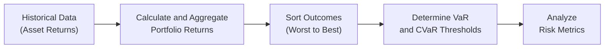

## Historical Simulation: An Introduction

Historical simulation has always felt a bit like digging through old photo albums—sifting through snapshots of past market actions to get a sense of how things might unfold again. Instead of imposing a rigid, theoretical distribution (like the normal distribution), historical simulation leans on the idea that the past can be a guiding (though imperfect) map of the future. For practitioners managing portfolios, especially those of us who’ve gone through unexpected market drawdowns, it can be a breath of fresh air to see our risk numbers reflect real-world surprises like the 2008 crisis or other sudden market flashpoints.

Historical simulation typically involves pulling a large dataset of realized returns, ranking them from best to worst, and then inferring what’s likely or unlikely to happen to your current portfolio if historical patterns were to repeat. This approach excels at capturing “fat tail” or extreme events—those nasty surprises that normal distributions often underestimate. The technique is well-suited for calculating Value at Risk (VaR), Conditional VaR (sometimes called Expected Shortfall), and diagnosing potential drawdowns.

But let’s not get too starry-eyed. Historical simulation won’t necessarily prepare you for events that have never shown up in your sample window. In other words, if you haven’t “seen” an event in the data, you can’t simulate it. That can be a bit nerve-racking in times of significant market regime shifts, like after groundbreaking regulatory changes or unprecedented shocks. Nonetheless, for many investment professionals, historical simulation nicely balances realism with practicality.

## Key Concepts in Historical Simulation

### Using Actual Past Return Data
The fundamental premise is almost deceptively simple: gather a sequence of historical return observations for each position in your portfolio, combine or aggregate them in a way resembling your current portfolio exposures, and see what the total outcome would have been each day (or month, etc.) in the historical window.

This approach:
• Avoids a rigid assumption like normality.  
• Reflects how each asset or factor performed historically.  
• Lets “fat-tail” events shine through.  

So if a company’s stock once had a catastrophic decline or an extraordinary rally, historical simulation captures that scenario just as it happened.

### Ranking Outcomes to Estimate Potential Losses
Historical simulation is often used as a direct method to assess risk. Let’s say you have several thousand daily returns for your portfolio. You’d simply rank all those hypothetical daily profit-and-loss (P&L) outcomes from worst to best. Then, if you want your 5% Value at Risk (VaR), you check the loss that corresponds to the 5th percentile. That’s your historical VaR estimate.

If you need Conditional VaR (CVaR), also called Expected Shortfall, you calculate the average of the losses that exceed that VaR threshold—in other words, the average of the worst 5% of outcomes. This average helps you see how “bad” the situation could be, beyond just a single percentile cut.

### Capturing Fat Tails
One of the big selling points for historical simulation is how it can capture the so-called “fat tails” in your distribution of returns. In real markets, extreme moves happen more often than a naive normal distribution might suggest. Historical simulation simply sees these extreme moves if they occurred in your data. As an example, if you’re using 15 years of daily data, events like the collapses during the 2008 financial crisis will appear in that dataset, giving you a sense that, hey, a meltdown can be part of the risk picture.

### Importance of the Rolling Window
Selecting an appropriate historical window is a challenge—kind of like choosing whether you want each day’s snapshot to go back all the way to your “photo album” from 30 years ago or just a more recent highlight reel. If your window is too short, you might capture plenty of near-term market dynamics (like that emerging technology mania from last year) but miss out on historical crises. If your window’s too long, though, the changing nature of markets might mean older data is less relevant: comparing your new crypto-laden portfolio to conditions from 25 years ago might distort your risk figures.

In practice, a rolling window is often used. For example, you might always keep a three-year window of daily data and recalculate risk metrics each day, dropping off the oldest day and adding the newest. This helps reflect recent market volatility. The trade-off, though, is whether three years (or five, or ten) is enough to capture rare tail events. Analysts often have to weigh the risk of ignoring older crises against the possibility that new market regimes are fundamentally different.

### Calculating Portfolio P&L Over the Window
To see how you might do this in a real setting:

• Gather historical data: daily or monthly returns on each asset in your portfolio.  
• For each date in your chosen window, compute the portfolio’s overall return by aggregating the individual holdings’ returns (weighted according to your current portfolio).  
• Once you have this series of historical portfolio returns, sort them from worst to best.  
• Extract your VaR and CVaR from certain percentile cutoffs.  

One thing I recall early in my career is that we forgot to adjust certain instruments (like derivatives) for rollover or changes in contract specifications. So the portfolio P&L was misrepresented in the extremes. Always confirm you’re measuring returns in a consistent manner, adjusting for splits, dividends, merges, or changes in underlying features.

### Demonstration with Python (Optional)
Below is a snippet (just a short conceptual example) to illustrate how this might look with Python. We’ll assume you already have a DataFrame of daily returns for multiple assets (“assetA,” “assetB,” etc.) and a vector of portfolio weights. This snippet merges them:

```python
import numpy as np
import pandas as pd

# And we have a numpy array 'weights' that aligns with these columns, summing to 1.

portfolio_returns = returns_df.dot(weights)

sorted_returns = np.sort(portfolio_returns.values)

confidence_level = 0.95
index_var = int((1 - confidence_level) * len(sorted_returns))
var_5pct = abs(sorted_returns[index_var])  # VaR is a positive number representing a loss

cvar_5pct = abs(np.mean(sorted_returns[:index_var]))

print("5% VaR:", var_5pct)
print("5% CVaR:", cvar_5pct)
```

The snippet is a simplified approach, but it shows how quickly you can implement a historical simulation with widely available data tools.

## Advantages and Disadvantages

### Advantages
• Reflects Real Events. By using actual past data, your risk metrics include real crises that might be missed by theoretical distributions.  
• No Normality Assumption. Many distributions underestimate the frequency of extreme losses. A historical approach can catch “fat-tailed” characteristics.  
• Conceptual Simplicity. You avoid complicated parametric modeling decisions (e.g., correlation estimates, distribution assumptions).  

### Disadvantages
• Completely Dependent on Past Data. If your data window doesn’t include certain tail events—like a currency peg collapse or an emergent technology meltdown—your simulation can’t imagine them.  
• Sensitive to Window Length. A short window might capture only calm periods and understate risk, while an extremely long window could weigh your results with out-of-date information.  
• Difficulty Capturing Shifts in Market Regimes. Markets evolve. New regulations, new instruments, changing investor preferences—it’s all fair game. Historical simulation is backward-looking, so if tomorrow’s environment is drastically different, we could be misled.  

## Uses in Risk Management Protocols

In practice, historical simulation is commonly employed to compute risk measures in large financial institutions. Value at Risk (VaR) thresholds are integral to setting capital reserves under certain regulatory frameworks. For instance, banks must often demonstrate compliance with regulatory capital requirements that hinge on the distribution of possible losses—though the regulators also employ stress testing strategies that sometimes go beyond just looking at historical data.

Conditional VaR (CVaR) is another big application. If VaR is considered the “worst-case loss under normal conditions,” CVaR tries to measure how bad that “worst case” could get. Regulators and risk teams often say, “Sure, the 5% tail is a problem, but how deep does it go?” Historical simulation can approximate that if there are enough real tail events in your sample.

## Visual Representation of Historical Simulation

Here is a simple Mermaid diagram outlining the broad steps:



This flow highlights how you start with raw return data, transform it into portfolio returns, and then use ranking to derive your risk metrics. 

## Practical Considerations for Window Selection

• Data Frequency: Are you using daily or monthly returns? Daily might catch abrupt intraday movements if you can measure them well, but monthly smooths out short-term volatility.  
• Crisis Inclusion: Specifically ensure your window includes at least one major drawdown. Excluding a meltdown might lead you to dangerously underestimate risk.  
• Survivorship Bias: If your dataset only has assets that are still around, you might be missing the full story. In historical simulation, it’s often critical to track the instruments that went bust or got delisted.

## Limitations and Pitfalls
• Stale or Insufficient Data. If you’re trading a new asset class, you may not have enough meaningful history to simulate with.  
• Data Quality and Persistence. Data errors (mispunched prices, missing dividend adjustments) can create misleading results.  
• Overreliance on Past Crises. Just because your data includes an extreme event doesn’t mean a future crisis will mimic the old one. Future crises might have a different shape, magnitude, or cause.  

## Real-World Anecdote: The “Always Missing the New Black Swan”
I recall once being at a risk management meeting right after a major currency devaluation in a market that we rarely traded in. Our historical data included only a handful of brief moves in that currency, so we ended up drastically underestimating its meltdown potential. The moral of the story was that historical simulation is only as good as the data you feed into it: if the data doesn’t embed extreme shocks (or if those shocks are in the distant past), you could be flying blind.

## Regulatory and Ethical Dimensions
From a regulatory standpoint, the Basel Accords for banking and the Solvency frameworks for insurance sometimes allow or encourage historical approaches to measure losses. However, regulators also require stress testing that includes hypothetical scenarios, precisely because historical simulation alone might not reveal new extremes. Ethically, professionals should remain vigilant about the limits of historical data when communicating risk to clients (Standard V(B) in the CFA Institute’s Code and Standards, for example, emphasizes full and fair disclosure of investment risks). If you know your historical dataset is missing certain catastrophic episodes, it’s important to be clear about those omissions.

## Best Practices for Implementation
• Supplement with Stress Tests: Because historical simulation can miss new or hypothetical crises, subject your portfolio to stylized shocks (like interest rates jumping 300 bps or equity markets losing 20% overnight).  
• Regularly Review the Data Window: Keep an eye on how short or long a horizon you’re using. A rolling approach is common but requires frequent reevaluation—especially to ensure inclusion of major crises.  
• Combine with Other Methods: Historical simulation is rarely the only approach. Parametric VaR, Monte Carlo simulation (Chapter 6), and scenario analysis (Sections 13.2 and 13.3) can complement your perspective.  
• Document Assumptions Clearly: No approach is perfect. But if you know where the data might be unrepresentative, you can keep that in mind when you interpret results.  

## Exam Tips for CFA Candidates
1. Understand the Core Steps: For exam questions, recall that you first collect historical return data, compute portfolio returns for each day, rank outcomes, and then read off your VaR or CVaR thresholds.  
2. Know the Strengths and Weaknesses: The exam might ask you to compare historical simulation with parametric or Monte Carlo methods. Be ready to articulate how historical simulation captures fat tails but relies solely on past data.  
3. Think About Market Regime Shifts: A prompt might mention a major structural change in an asset class. If so, you should immediately note that historical simulation might mislead if the newly changed regime is not reflected in the sample.  
4. Clarify Rolling Windows: Understand how different window sizes can over- or understate risk.  
5. Illustrate Using Clear Examples: The exam loves when you show an understanding of real numbers. A concise numerical example of calculating VaR from sorted returns might pop up in an item set question.  

## References for Further Study
• Hull, J. C. (2018). Risk Management and Financial Institutions. 5th ed., John Wiley & Sons.  
• Pritsker, M. (2006). “The Hidden Dangers of Historical Simulation.” FEDS Working Paper No. 2006‑07, Federal Reserve.  
• Dowd, K. (2005). Measuring Market Risk. 2nd ed., John Wiley & Sons.  

These references dive deeper into the topics of market risk, model risk, and the nitty-gritty details of historical simulation approaches.

---

## Test Your Knowledge: Historical Simulation Approaches Quiz



### Which of the following best describes a fundamental characteristic of historical simulation?

- [ ] It relies on a theoretical probability distribution of returns.  
- [ ] It requires the future to mirror past volatility exactly, or it becomes invalid.  
- [x] It uses actual past return data to assess potential future outcomes.  
- [ ] It estimates outcomes based purely on hypothetical stress scenarios.  

> **Explanation:** Historical simulation uses the actual body of past return data, rather than imposing a distribution such as a normal distribution or employing purely hypothetical shocks.

### A key advantage of historical simulation for risk assessment is:

- [ ] It excludes fat-tail events.  
- [ ] It never requires large datasets.  
- [x] It can incorporate real-world extreme events that occurred in the past.  
- [ ] It directly accounts for all future tail events in new market regimes.  

> **Explanation:** Because historical simulation is based on realized returns, it includes any extreme returns (“fat tails”) that actually occurred, making it valuable for tail risk estimation.

### Why might a rolling window be used when conducting a historical simulation?

- [ ] To capture only the largest historical losses, excluding normal daily moves.  
- [x] To gradually update the sample with recent data while discarding older observations.  
- [ ] To inflate the total sample size and reduce standard error indefinitely.  
- [ ] To ensure all crises throughout history have equal weight in the current calculation.  

> **Explanation:** A rolling window approach updates the data as time passes, incorporating new market information and dropping older data to reflect current conditions.

### What is a potential limitation of historical simulation for stress testing?

- [ ] It automatically includes all hypothetical events.  
- [ ] It frequently underestimates the frequency of tail events.  
- [ ] It always produces a more conservative estimate than parametric VaR.  
- [x] It cannot account for new types of crisis that haven’t occurred in the sample data.  

> **Explanation:** Historical simulation only measures scenarios that appear in the historical dataset; it cannot capture crises that are qualitatively different from past events.

### If you are evaluating a portfolio that includes a newly launched cryptocurrency with only one year of data, a major shortcoming of historical simulation is:

- [x] Insufficient historical data on the asset.  
- [ ] Excessive reliance on a normal distribution.  
- [ ] Overstating volatility due to too many data points.  
- [ ] Including unrealistic drawdowns in the sample.  

> **Explanation:** For a new asset, there simply isn’t much history to draw from, making historical simulation less reliable.

### Which of the following properly describes Conditional Value at Risk (CVaR) in the context of historical simulation?

- [ ] CVaR is calculated as the difference between the highest and lowest returns in the sample window.  
- [x] CVaR is the average of the losses beyond the chosen VaR threshold.  
- [ ] CVaR is the absolute worst daily loss in the sample.  
- [ ] CVaR is used only when data are symmetrically distributed.  

> **Explanation:** CVaR (or Expected Shortfall) is the mean loss of all outcomes worse than the VaR cutoff.

### Historical simulation is often conducted daily with a multi-year rolling window. One major advantage of this approach is:

- [ ] It doesn’t require any data cleaning or adjustments.  
- [x] It helps keep the risk assessment aligned with recent market conditions.  
- [ ] It automatically detects regime shifts and adjusts forecasts accordingly.  
- [ ] It provides perfect forecasts of future market shocks.  

> **Explanation:** By updating the dataset over time, a rolling window approach tracks recent data more closely, though it does not guarantee perfect alignment with future market changes.

### A firm’s VaR estimate under historical simulation has decreased significantly after removing data from the 2008 crisis period. This illustrates:

- [x] The impact of window selection on VaR estimates.  
- [ ] The assumption of normality in historical simulation.  
- [ ] The advantage of never removing old crisis data.  
- [ ] The minimal effect of historical events on risk metrics.  

> **Explanation:** Historical simulation results can vary widely based on which historical data points are included or excluded, emphasizing the importance of window selection.

### In an exam setting, how might the CFA Institute expect you to address the problem of regime changes when using historical simulation?

- [ ] Assume that regime changes won’t occur if they haven’t appeared in the historical data.  
- [x] Recognize that historical simulation may not incorporate new conditions and combine it with other stress testing or scenario methods.  
- [ ] Discard any data outside the current regime.  
- [ ] Increase the VaR threshold to 99% confidence automatically.  

> **Explanation:** Historical simulation won’t naturally account for new regimes. Best practice often involves stress testing or scenario analysis to capture those potential changes.

### Historical simulation is considered “non-parametric” because:

- [x] It does not assume a specific distribution for returns.  
- [ ] It requires knowledge of a distribution’s parameters.  
- [ ] It fits a lognormal distribution to each asset return.  
- [ ] It imposes a functional form for the tails.  

> **Explanation:** Historical simulation plots and ranks actual past data without specifying a theoretical distribution; thus, it’s non-parametric.


