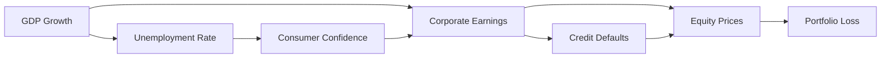

## Introduction
In many ways, scenario analysis is like imagining your portfolio sailing through calm waters one moment and then braving huge storms the next. But if we constrain ourselves only to the waves of market prices—without looking at the deeper tides made up of unemployment rates, government policy swings, or global growth data—well, we’re missing a big part of the story. Macroeconomic stress testing fills that gap, broadening our arsenal to include the swirling forces that move entire economies.

This section extends your scenario analysis tool kit beyond the usual asset-level risks, helping you incorporate system-wide factors such as GDP contractions, interest-rate policy shifts, and even central bank interventions like quantitative easing (QE). Institutions, from smaller investment firms to global banks, increasingly rely on macro-level scenario analyses to gauge how well they’d hold up if the broader economy took a turn for the worse.

## Macroeconomic Stress Testing
Traditional scenario analysis often looks at an asset or portfolio in isolation: “What if the equity market drops by 10%?” or “What if credit spreads widen by 50 basis points?” Macroeconomic stress testing, meanwhile, focuses on “big picture” economic variables—think inflation, industrial production, unemployment, and government policy changes—and how they might interact. 

Why does this matter? Because real-world events don’t happen in a vacuum. A surge in unemployment can reduce consumer spending, which might hurt corporate earnings (and thus equity prices), and maybe force governments to respond with fiscal stimulus. All these knock-on (a.k.a. second-round) effects shape the ultimate trajectory of asset returns.

### Key Elements of a Macroeconomic Method
• Consistency with Economic Theory: Linking variables in a way consistent with known economic models (e.g., demand/supply relationships, equilibrium in labor markets).  
• Interdependence of Variables: Stressful scenarios typically involve multiple negative shifts (e.g., lowered GDP growth, higher default rates) that reinforce each other.  
• Data Availability and Quality: A robust macro stress test requires historical data on how variables like GDP, rates, and unemployment move together.  
• Forward-Looking Orientation: Historical data is a starting point, but we must also factor in potential policy changes and structural shifts (e.g., new regulations, technology changes).  

## State-Dependent Modeling
State-dependent modeling means analyzing scenarios by recognizing that economic variables don’t always correlate in a fixed manner. Instead, their relationships change depending on whether the economy is operating in a “normal” state or in a “crisis” state. For instance, during severe recessions, unemployment might skyrocket, while consumer confidence plunges faster than conventional regression models might predict.

Many practitioners build structural models to capture these shifting relationships. A structural model of credit risk might link GDP growth directly to default probabilities, layering in the effect of interest rate changes and investor risk aversion. In normal times, default rates might be modestly correlated with GDP. But if GDP drops below a threshold, default rates might shoot up nonlinearly.

Here’s a simplified diagram to illustrate how different macro variables could feed into a portfolio loss function:

As shown, one variable (like GDP growth) can change multiple downstream factors—sometimes reinforcing negative outcomes through feedback loops.

## Multi-Round Effects
One thing about macroeconomic stress events is that they can get worse before they get better. Picture a severe market downturn accompanied by a slump in GDP. Banks might suffer losses, tighten their lending standards, and possibly reduce credit availability. That credit tightening further slows business investment and household spending, causing an additional decline in corporate profitability—and on it goes. 

In macro-lingo, these are often called second-round effects (or feedback effects). And, yes, they can be a real challenge to model. We can’t just multiply every stress number by a fixed coefficient. Instead, we need a dynamic approach or iterative modeling process to estimate how one shock cascades into another.

## Policy Changes and Intervention
When major macroeconomic shocks hit, governments and central banks often step in. Think about large-scale asset purchases (quantitative easing, QE) that inject liquidity into financial markets to stabilize them. Or fiscal stimulus packages that boost public spending and provide corporate tax relief. 

For scenario analysis, layering in policy shifts can get tricky because you have to guess, “Will the central bank cut interest rates aggressively?” or “Will they announce a government-backed loan program?” If historically the government didn’t intervene to the same extent, your historical data might not reflect how a new package of policy measures would affect markets. Hence, you need to incorporate a conceptual understanding of how these policy transmissions might influence credit demand, equity risk premiums, and investor sentiment. 

## Brief Glossary
Macroeconomic Stress Testing: A broader analysis of possible adverse economic environments, including multiple interacting stresses like unemployment shocks, price instability, or unexpected policy interventions.

Structural Model: An approach grounded in fundamental economic relationships (for example, an equilibrium model of supply and demand). Structural models often use theoretical frameworks for linking macro variables to portfolio outcomes.

Second-Round Effects: Post-shock developments that arise from dynamic interlinkages among economic agents: higher unemployment might reduce demand, leading to lower income, which spurs further layoffs, and so forth.

Quantitative Easing (QE): A monetary policy tool involving large-scale central bank asset purchases to inject liquidity into the financial system, typically used to encourage lending or stimulate economic growth.

Policy Transmission Mechanism: The channels through which government or central bank actions impact key economic variables (e.g., interest rates, corporate profitability, consumer credit availability).

## Practical Example
Let’s walk through a hypothetical scenario to illustrate the process:

• Initial Shock: Global GDP declines by 5% due to a severe pandemic and supply chain disruptions.  
• Primary Effects: Unemployment rises from 4% to 9%, equity markets drop 20%, and credit spreads widen substantially.  
• Second-Round Effects:  
  1. Banks reduce lending and tighten credit conditions.  
  2. Companies defer investments, leading to layoffs and wage freezes.  
  3. Households pull back on discretionary spending.  
• Policy Response: Seeing economic distress, the central bank announces a large QE program, buying long-term government bonds and certain corporate bonds. Plus, the government sets up a small-business loan guarantee plan.  
• Resulting Dynamics:  
  1. Long-term interest rates remain low (thanks to QE), softening the blow on mortgage rates and corporate debt issuance.  
  2. Banks partially reverse their credit tightening, as the loan guarantee reduces their risk.  
  3. Equity prices may rebound more quickly than in a historical no-policy scenario.  

This example underscores that macro shocks are messy and rarely follow a simple pattern. But with more robust scenario modeling (including second-round effects and potential policy help), you get a truer sense of how your portfolios might fare.

## Potential Pitfalls & Best Practices
• Overreliance on Historical Data: Past relationships might not hold in future crises, especially if government responses or global conditions change drastically.  
• Underestimating Nonlinearities: Many macro variables can jump more than proportionally to a small shock—like default rates ballooning after GDP crosses a specific threshold.  
• Missing Transmission Mechanisms: If you don’t factor in policy changes, you might overestimate or underestimate how severe outcomes get.  
• Failing to Model Feedback Loops: Each stress effect might trigger another, leading to vicious cycles (or virtuous ones, if policy is supportive).  

A best practice is to combine data-driven historical approaches (to ground your analysis in observed patterns) with forward-looking, hypothetical scenarios that capture novel policy or structural shifts. Sometimes a combination of top-down macro models (for broad economic projections) and bottom-up credit or market models (for individual exposures) offers the best of both worlds.

## Final Exam Tips
Of course, in the context of the CFA® exam, you can expect scenario-based questions that require you to explain or perform steps in a macroeconomic scenario analysis. Be prepared to:

• Demonstrate how a shock in one macro variable (e.g., GDP) flows through to others (interest rates, labor markets).  
• Outline the difference between policy intervention scenarios versus historical “no-intervention” episodes.  
• Show how second-round effects might magnify losses and how these feedback loops can be built into a risk model.  
• Discuss the strengths and shortcomings of different stress-testing approaches.  

When it comes to multi-part item sets, you might need to interpret a set of macroeconomic assumptions—like a 3% decline in GDP, 2% inflation, or a 100 bps drop in short-term interest rates—and compute the resulting portfolio impact. In essay-type questions, you may even be asked to critique the shock assumptions or suggest improvements.

## References
- IMF (2012). “Macrofinancial Stress Testing—Principles and Practices.” International Monetary Fund.  
- Drehmann, M. (2008). “Stress Tests: Objectives, Challenges and Modeling Choices.” BIS Quarterly Review.  
- Blanchard, O. (2017). Macroeconomics, 7th ed. Pearson.  

## Test Your Knowledge: Macroeconomic Stress Analysis



### Which of the following highlights a key benefit of macroeconomic stress testing over purely asset-level scenario analysis?

- [ ] It focuses solely on the historical volatility of single asset classes.
- [ ] It eliminates the need for correlation assumptions among assets.
- [x] It incorporates broader economic variables and potential feedback loops.
- [ ] It fails to account for policy interventions.

> **Explanation:** Macroeconomic stress testing expands beyond individual assets to include broad economic variables (like GDP and unemployment), capturing potential feedback loops and policy actions often overlooked in isolated asset-level scenarios.

### When implementing state-dependent modeling, which scenario best reflects a “crisis” state?

- [ ] When minor changes in GDP have either no effect or a small effect on default rates.  
- [x] When a slight GDP contraction triggers a disproportionate spike in credit defaults.  
- [ ] When inflation remains at low stable levels.  
- [ ] When unemployment remains at its natural rate.

> **Explanation:** A crisis state implies nonlinear or disproportionate responses, such as a small drop in GDP quickly leading to higher default rates and other cascading effects.

### Which of the following describes a second-round effect?

- [ ] A direct decline in consumer spending due to job losses.  
- [x] Additional layoffs in multiple industries after banks reduce credit, thereby further weakening consumer demand.  
- [ ] A cut in the central bank’s policy rate immediately after a recession begins.  
- [ ] The immediate drop in equity prices upon the release of poor GDP figures.

> **Explanation:** Second-round effects (or feedback effects) involve one consequence (credit tightening) triggering further disruptions (additional layoffs), which weren’t part of the initial shock.

### Suppose a government implements quantitative easing in response to a severe recession. Which of the following is a likely effect?

- [x] Lower long-term interest rates and a potential boost to risk asset prices.  
- [ ] Higher levels of unemployment and stagnant wages.  
- [ ] Contraction in the nation’s money supply.  
- [ ] A forced deleveraging of the private banking sector.

> **Explanation:** QE typically involves the central bank purchasing longer-term assets, thus lowering yields and potentially stimulating investment and consumer spending.

### A stress test model that incorporates how GDP shocks influence both credit risk and equity valuations illustrates what principle?

- [ ] Fully independent risk factors.  
- [ ] Static correlation assumptions across all economic states.  
- [x] The interconnectedness of macroeconomic variables.  
- [ ] The benign nature of feedback loops.

> **Explanation:** By linking GDP shocks to credit and equities, the model highlights interconnections among macro variables and asset prices, which is critical in macro stress testing.

### Which best characterizes a pitfall of relying solely on historical correlations in macro stress tests?

- [ ] Historical correlations typically incorporate policy changes automatically.  
- [x] Future crises may unfold differently if structural economic conditions or policy responses diverge from past patterns.  
- [ ] Historical correlations are always overstated.  
- [ ] It is impossible to estimate time-varying relationships from historical data.

> **Explanation:** Past crises do not guarantee identical policy responses or market reactions in the future, making reliance on static historical correlations dangerous.

### When a central bank’s policy intervention reduces banks’ losses on risky loans through guaranteed lending programs, this primarily showcases:

- [ ] A strict application of free-market principles.  
- [ ] A second-round effect intensifying a recession.  
- [x] A smoothing mechanism that can partially offset external shocks.  
- [ ] Inability to influence credit markets.

> **Explanation:** Providing loan guarantees encourages lending even in adverse conditions, thereby smoothing out shocks to the financial system and preventing a potential credit crunch.

### In state-dependent modeling, correlations between equity and credit markets tend to:

- [ ] Remain constant across all market regimes.  
- [ ] Decrease significantly during crises.  
- [x] Increase during stressed market conditions, reflecting stronger co-movement in downturns.  
- [ ] Become negligible when GDP grows.

> **Explanation:** During stressed environments, markets tend to move more in tandem (a phenomenon often called “correlation breakdown”), leading to larger combined losses.

### How do multi-round effects typically manifest in a banking system?

- [x] A shock leads to losses, causing banks to tighten credit, which further exacerbates the economic downturn.  
- [ ] Banks expand lending eagerly in a recession.  
- [ ] No direct link exists between bank lending and economic activity.  
- [ ] They reduce the overall default cycle, making recessions less severe.

> **Explanation:** Multi-round effects depict negative feedback loops where banks’ reaction to losses (tighter lending) can worsen the initial downturn, prompting further losses.

### True or False: Macroeconomic stress analysis should assume that government and central bank policies remain static throughout a crisis.

- [ ] True  
- [x] False

> **Explanation:** One of the central points in macroeconomic stress testing is that policy shifts—such as interest rate cuts, QE, or fiscal measures—can drastically affect outcomes, so assuming no policy change would be unrealistic.


