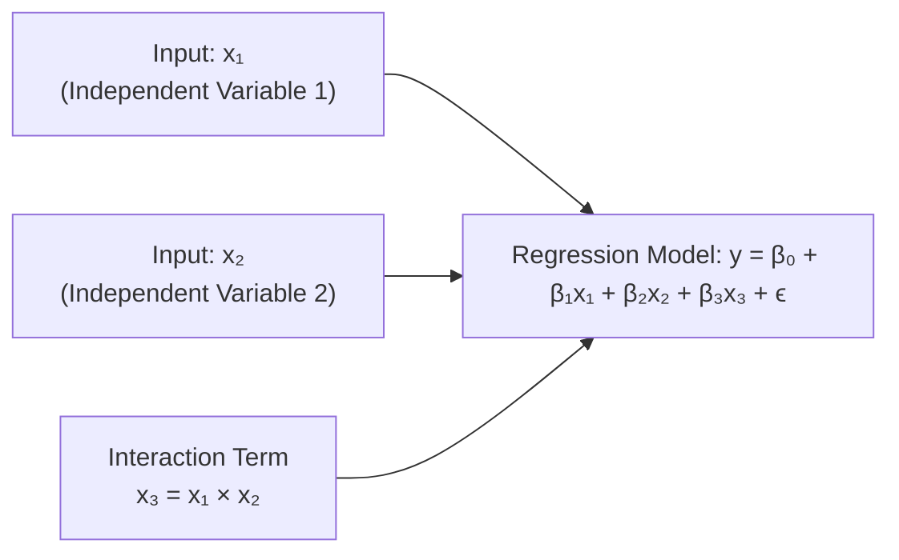

## Introduction

It’s funny how some of us first came across multiple regression and thought: “Oh, this is just a bunch of lines smushed into one equation.” But then, we soon discovered that each coefficient has its own little story to tell about how an independent variable nudges the dependent variable. And—spoiler alert—things get even more interesting when we start playing around with interaction terms. In a sense, adding interaction terms transforms our nice, linear relationships into more nuanced statements like, “I effect y more when x₂ is large.”

This section dives into those deeper layers: how to interpret coefficients in a multiple regression, how to test and confirm their significance, and how to handle interaction terms. While we aim for practicality with references to real-world finance examples, we’ll also get slightly formal (but not too stiff) to ensure you’re fully empowered to tackle these topics. Let’s explore.

## The Partial Effect of Each Coefficient

In a multiple regression model, each slope coefficient (βᵢ) tells you the partial effect of that specific independent variable xᵢ on the dependent variable y. “Partial” means that you assume the other predictors are held constant while you look at the influence of xᵢ alone. Formally, if we have:


y = \beta_0 + \beta_1 x_1 + \beta_2 x_2 + \cdots + \beta_k x_k + \varepsilon,


then β₁ is the change in y for a one-unit change in x₁, holding x₂, x₃, …, xₖ constant. This idea of “holding other variables constant” is crucial because in real life, you don’t always get to hold everything else constant, but inside the multiple regression framework, that’s exactly what we do mathematically.

I remember a case where I tried to see how marketing spend (x₁) impacted sales (y), controlling for competitor activity (x₂). The coefficient on marketing spend was significantly smaller when I added competitor activity to the model, compared to when I omitted it. That’s a classic sign that competitor activity had some correlation with marketing spend, and only by including x₂ could I measure the “true” partial effect of my company’s marketing. In plain terms, it’s like trying to isolate “your own effort” effect from “everyone else’s moves” in the marketplace.

## Significance of Coefficients

Now, how do we know if a particular coefficient is actually meaningful (i.e., different from zero in a statistical sense)? That’s where t‑tests and p‑values come into play. If we denote the coefficient estimate as \\(\hat{\beta}_i\\) and its standard error as SE(\\(\hat{\beta}_i\\)), then:


t_i = \frac{\hat{\beta}_i}{\text{SE}(\hat{\beta}_i)}.


We compare this t-value against a critical value from the t-distribution (or rely on a p-value). If |tᵢ| is large enough (or p-value is small enough), we typically conclude that \\(\beta_i\\) is significantly different from zero.

In practical CFA exam or real-world usage, you’d check something like:

• |tᵢ| > critical t-value  
• or p-value < chosen significance level (e.g., 5%)

A significantly nonzero coefficient often signals that the corresponding predictor xᵢ truly has explanatory power over y. In portfolio analysis, for instance, you might find that changes in interest rates (x₁) have a highly significant negative effect on fixed-income prices (y). The small p-value would confirm that, yes, those changes in interest rates matter a lot. 

## Confidence Intervals

A t-test provides a yes/no style answer about significance. But confidence intervals add richer detail on how large or small the coefficient might be in a broader range. A 95% confidence interval for \\(\beta_i\\) has the usual form:


\hat{\beta}_i \pm t_{\alpha/2, \, df} \times \text{SE}(\hat{\beta}_i),


where \\( t_{\alpha/2, \, df} \\) is the critical t-value with a 1 − α confidence level and df degrees of freedom. If this interval does not include zero, we again say \\(\beta_i\\) is significantly different from zero. Even if it is significant, a wide interval might signal substantial uncertainty about the size of the effect. So a variable could be significantly positive, but that positivity might range from “slightly positive” to “really huge positive,” which matters a lot for risk assessments or scenario testing.

## Interaction Terms: A Conceptual Overview

Interaction terms appear when we suspect that the effect of one independent variable depends on the level of another variable. Let’s say we suspect that an advertising campaign (x₁) has a stronger effect on sales (y) if the store is located in a large market region (x₂). We can create an additional variable:


x_3 = x_1 \times x_2.


The model then becomes:


y = \beta_0 + \beta_1 x_1 + \beta_2 x_2 + \beta_3 (x_1 \times x_2) + \varepsilon.


When \\(\beta_3\\) is significant, it indicates that x₁’s effect on y isn’t just \\(\beta_1\\); it’s \\(\beta_1 + \beta_3 \times x_2\\). So if x₂ is large, the slope for x₁ might be higher or lower, depending on the sign of \\(\beta_3\\). 

In some ways, an interaction term is a “condition-based extra slope.” If \\(\beta_3\\) is positive, the slope for x₁ grows as x₂ increases. Conversely, if \\(\beta_3\\) is negative, then x₁’s effect diminishes as x₂ grows. This is critical in finance when analyzing how interest rate changes might interact with economic growth, or how price interacts with promotional deals in retail. If those phenomena truly shift each other’s effects, the model must include that shift explicitly.

## Visualizing Interactions

Sometimes, a diagram can clarify how interaction terms shape the regression surface in a three-dimensional sense. Let’s do a simple flow chart showing how x₁, x₂, and their interaction x₃ feed into y.

In a typical 2D graph, you might see how the slope for x₁ changes as x₂ shifts from a low to a high value. That slope difference is precisely what \\(\beta_3\\) is capturing.

## Marginal Effects in the Presence of Interactions

If we want to figure out the effect of changing x₁ by one unit, we check the partial derivative of y with respect to x₁:


\frac{\partial y}{\partial x_1} = \beta_1 + \beta_3 x_2.


So, the slope for x₁ is no longer constant—it depends on x₂. If x₂ is large, your slope might be quite different than when x₂ is small. This also leads to further complexity when constructing confidence intervals around the slope, because the slope at a given x₂ depends on the estimated \\(\beta_3\\).

A standard approach in practice is to compute the slope at certain levels of x₂, say the mean value of x₂, one standard deviation below the mean, and one standard deviation above the mean. This breaks down how that partial effect changes as x₂ changes, giving you a better sense of the real dynamics in your data.

## Real-World Financial Examples

1. Interest Rates and GDP Growth:  
   In macroeconomic models, the effect of short-term interest rates (x₁) on equity returns (y) might depend heavily on whether GDP growth (x₂) is strong or weak. If \\(\beta_3\\) is negative, higher interest rates might have a stronger negative impact on equity returns in a high-growth environment (since markets may be more sensitive to monetary policy tightening).

2. Price and Promotion in Consumer Goods:  
   Analysts often find that the effect of price (x₁) on sales (y) depends on whether promotions (x₂) are running. If \\(\beta_3\\) is positive, the negative effect of raising prices might be softened if the item is also promoted.

3. Risk Assessment in Portfolio Management:  
   The effect of adding a volatile asset class (x₁) to a portfolio might depend on the existing diversification level (x₂). If the portfolio is already heavily concentrated, the incremental risk from x₁ might be higher (a positive \\(\beta_3\\)), whereas if the portfolio is highly diversified, the additional risk from x₁ could be more muted.

In all these scenarios, ignoring interaction terms risks oversimplifying your model. You could end up with misguided conclusions like “Price always affects sales in the same way,” missing the bigger picture that promotional strategies can magnify or dampen that price effect.

## Practical Steps and Common Pitfalls

When including interaction terms, here are a few considerations from personal experience and cautionary tales:

• Centering Variables: Sometimes, we “mean-center” the variables before creating the product term x₁ × x₂. This can help with interpretation and reduce multicollinearity in the presence of interactions.

• High Correlation With Lower-Order Terms: The interaction term can correlate with x₁ and x₂, which can inflate standard errors if those variables share strong relationships. This can make it tricky to find significant results. Watch out for variance inflation factors (VIFs) to diagnose potential multicollinearity issues.

• Overfitting: Each interaction term you add is another model parameter. If you don’t have enough observations or if you add too many interactions, you may end up with a model that fits the noise rather than the genuine underlying relationship.

• Graphical Analysis: Sometimes, it helps to plot predicted y-values at varying levels of x₂ to see how the slope for x₁ changes visually. That can give you and your colleagues more intuitive buy-in to the idea of an interaction.

• Interpretation Isn’t Always Intuitive: If you’re new to interaction terms, it can be confusing that the coefficient β₁ is no longer “the effect of x₁ on y.” Instead, it’s the effect of x₁ when x₂ = 0 (assuming no centering). Make sure you’re quite clear about the baseline condition under which β₁ or β₂ applies.

## Model Diagnostics and Inference

Once you include interaction terms, always revisit your residual plots and model fit metrics (e.g., \\( R^2, \\) adjusted \\( R^2 \\), AIC, BIC) to ensure that you’re truly improving the model. As discussed in earlier sections (see Chapter 10 on Simple Linear Regression and Chapter 14.1 on multiple regression foundations), diagnosing mis-specification or violation of assumptions is critical. Be mindful of the following:

• Heteroskedasticity: Interaction terms can sometimes amplify or weaken heteroskedastic patterns in the residuals. Use robust standard errors or other diagnostic approaches if needed.  
• Normality of Residuals: A serious departure from normality could distort t-tests. But for large samples, the Central Limit Theorem might help you out a bit.  
• Autocorrelation: If your data is time series oriented, interactions might not fix issues of serial correlation.

## Applications in the CFA Program Context

For the CFA Level I exam, the basics remain crucial: how to interpret each β, how to test significance, and what an interaction term does. As you move into the higher levels of the CFA Program, especially with portfolio performance and risk modeling, you’ll often see more advanced or specialized uses of interaction terms, such as modeling regime shifts (e.g., the effect of factor exposures changes in bull vs. bear markets).  

That said, even as a Level I candidate, being comfortable with the interpretation of interaction terms is increasingly important. The interplay of market factors can rarely be captured by pure linear suspicion alone—markets are dynamic and variables often move together in complex ways.

## Best Practices and Strategies

• Always articulate the logic (or theory) behind your interactions. Including them for the sake of complexity alone rarely helps.  
• Manually plot or tabulate predicted values at meaningful levels of each variable; this helps in explaining results to stakeholders.  
• Keep an eye on potential overfitting. Use model selection criteria or consistent cross-validation to see if interactions truly help.  
• Document your process. Mention why you introduced certain interactions and how you’re interpreting them.  

## Exam Tips

• Mind the partial derivative: If the exam question includes an interaction, you must adjust the slope accordingly.  
• Watch the p-values: If the interaction term \\(\beta_3\\) is not significant, you might question whether the effect truly depends on the other variable.  
• If you run into a question that shows an interaction term in the regression output, carefully read the question’s instructions about “all else constant.” The partial effect of x₁ might be \\(\beta_1 + \beta_3 x_2\\)!  
• Understand the baseline level: If x₂=0 is not intuitive (e.g., region size = 0 might not make sense), consider the possibility that the analysis used mean-centered variables.  

## References

1. Montgomery, D.C., Peck, E.A., & Vining, G.G. (2012). Introduction to Linear Regression Analysis. Wiley.  
2. Aiken, L.S., & West, S.G. (1991). Multiple Regression: Testing and Interpreting Interactions. Sage Publications.  
3. CFA Institute. (2020). “Quantitative Methods,” CFA Program Curriculum, Level I.  

## Test Your Knowledge: Interpreting Coefficients and Interaction Terms



### Which of the following best describes the partial effect of an independent variable xᵢ in a multiple regression model?

- [ ] The change in y given that xᵢ changes by one unit and other x’s also change.  
- [x] The change in y given that xᵢ changes by one unit while holding the other x’s constant.  
- [ ] The absolute difference between βᵢ and zero.  
- [ ] The ratio of βᵢ to its p-value.  

> **Explanation:** The partial effect isolates how xᵢ influences y when all other independent variables remain unchanged.

### In the multiple regression model y = β₀ + β₁ x₁ + β₂ x₂ + β₃ (x₁×x₂) + ε, which formula gives the marginal effect of x₁ on y?

- [ ] β₁ only.  
- [x] β₁ + β₃ x₂.  
- [ ] β₂ + β₃ x₂.  
- [ ] β₁ + 2β₃ x₂.  

> **Explanation:** The coefficient on x₃ indicates how the slope of x₁ depends on x₂, so you add β₃ x₂ to β₁.

### Suppose you estimated a coefficient β₂ to be 2.0 in a two-variable regression model, and its p-value is 0.90. What’s the practical implication?

- [ ] β₂ is definitely close to zero.  
- [ ] β₂ is highly significant and positive.  
- [x] You do not have sufficient evidence to conclude that β₂ is different from zero.  
- [ ] You must remove the variable from the model.  

> **Explanation:** A high p-value indicates that β₂ is not statistically different from zero, even if the estimate is numerically large.

### Why might researchers include an interaction term between two independent variables?

- [x] To capture situations where the effect of one variable depends on the level of another variable.  
- [ ] To simplify the model.  
- [ ] To eliminate multicollinearity.  
- [ ] To reduce computing time.  

> **Explanation:** Interaction terms model how one predictor’s impact on y changes at different levels of another predictor.

### When x₂ is centered at its mean (i.e., x₂ - mean(x₂)), how should you interpret the coefficient β₁ in y = β₀ + β₁ x₁ + β₂ x₂ + β₃ (x₁×x₂)?

- [ ] β₁ becomes the slope of x₁ at x₂=0.  
- [x] β₁ becomes the slope of x₁ at the average level of x₂.  
- [ ] β₁ is an average of the slopes at all x₂ values.  
- [ ] β₁ has no meaning unless x₁ is also centered.  

> **Explanation:** If x₂ is centered at its mean, then x₂=0 corresponds to the average level. Hence, β₁ is the effect of x₁ at the mean of x₂.

### In a regression with an interaction term, which of the following must you always keep in mind when interpreting the main effects (β₁ and β₂)?

- [x] They represent the effect of each variable when the other variable is zero (assuming no centering).  
- [ ] They remain unaffected by the presence of the interaction term.  
- [ ] They are less important than the t-statistic.  
- [ ] They are automatically the same as partial correlation coefficients.  

> **Explanation:** In the presence of an interaction, the main effect coefficients must be interpreted at baseline levels (often zero), unless you’ve centered or otherwise transformed variables.

### You find that an interaction term in your model is not statistically significant. What is the most appropriate conclusion?

- [x] You cannot conclude that the effect of x₁ on y depends on x₂.  
- [ ] You must remove both variables x₁ and x₂.  
- [x] The model may not need that interaction term.  
- [ ] It proves that the model is incorrect.  

> **Explanation:** A nonsignificant interaction suggests no evidence that the effect of x₁ varies with x₂. It does not necessarily invalidate the entire model, nor does it require removing the main effects.

### What might be a red flag when including multiple interaction terms in a small dataset?

- [ ] Increased normality of residuals.  
- [x] Overfitting and inflated standard errors.  
- [ ] Guaranteed improvement in model accuracy.  
- [ ] The elimination of all collinearity issues.  

> **Explanation:** Additional interaction terms increase the complexity of the model and can lead to overfitting or large standard errors, especially with limited data.

### Which best describes the difference between a t-test and a confidence interval for βᵢ?

- [ ] A t-test shows the magnitude of βᵢ, while a confidence interval shows the sign of βᵢ.  
- [ ] They are effectively the same tool.  
- [x] A t-test gives a binary significance decision, while a confidence interval outlines a range of likely values for βᵢ.  
- [ ] Only a confidence interval deals with standard error.  

> **Explanation:** The t-test is a hypothesis test about whether βᵢ is zero; the confidence interval shows plausible ranges of βᵢ around the point estimate.

### For a multiple regression with an interaction term, is it possible for both β₁ and β₂ to be insignificant, but the interaction term β₃ to be significant?

- [x] True  
- [ ] False  

> **Explanation:** Yes, in some datasets, x₁ and x₂ individually show little direct effect on y, but the combined term (x₁×x₂) can have a significant impact.


