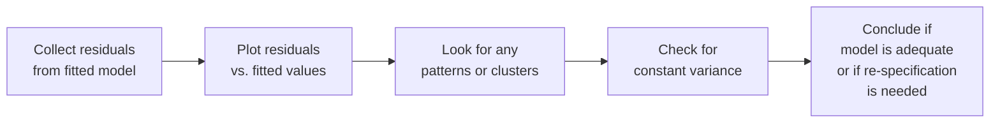
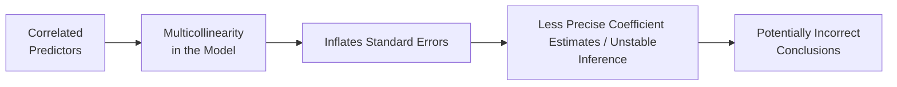

## Overview

When we dive into multiple regression analysis (introduced in Section 14.1 of this volume), we often focus on producing the best-fitting model we can find. But once that model is in place, it’s not always sunshine and rainbows—residuals can misbehave, and predictor variables can interact in tricky (and sometimes sneaky) ways. Two key issues that demand our attention are (1) the behavior of residuals (do they look random, or are they quietly revealing a problem with our model’s assumptions?) and (2) the phenomenon of multicollinearity (when two or more explanatory variables move together so tightly that interpreting individual coefficients becomes a headache).

In this section, we’ll walk through the fundamentals of residual diagnostics, then explore multicollinearity in detail. I remember the first time I realized I’d been ignoring weird patterns in my own regression residuals. Let’s just say: the model sure looked great on paper, but the underlying error structure was basically screaming that something was wrong. Hopefully, by the end of this reading, you’ll be equipped to avoid (or at least address) such pitfalls.

## Residual Diagnostics

Every regression analysis relies on certain assumptions, which we typically label as “classical OLS assumptions.” When we talk about residual diagnostics, we’re basically checking whether these assumptions appear to hold in practice—especially assumptions like linearity, constant variance (homoskedasticity), independence of errors, and normality of errors. 

### Visual Residual Analysis

One of the easiest yet most powerful ways to check for violations is to just look at your residuals. Plot the residuals against fitted values or against each independent variable in your model. If the model is doing its job properly in a standard linear regression setting, you’d ideally see a random cloud of points scattered around zero.

- If you see a pattern such as a curve, that might hint that your linear model is missing a relevant nonlinear term.  
- If the variance of the residual cloud grows or shrinks as you move along the x-axis, you might be dealing with heteroskedasticity (violating the constant variance assumption).  
- If the points appear to be systematically positive or negative in specific ranges, you may have omitted variables or a structural break.

Here’s a simple conceptual diagram (in Mermaid) that shows the steps we typically take when performing a residual check:



### Normality of Residuals

Under classical OLS assumptions, the error term ε is normally distributed with mean zero and constant variance. In many real-world scenarios, especially if the sample size is large, the Central Limit Theorem helps approximate normality of errors. However, it’s good practice to formally test this assumption.

• Shapiro–Wilk test: A popular choice for checking normality. A significant p-value from this test suggests the distribution of residuals is likely not normal.  
• Q–Q (quantile–quantile) plots: A visual display comparing the quantiles of your residuals to the quantiles of a theoretical normal distribution. If the points mostly lie on a straight diagonal line, that’s good news. If they depart sharply, there may be non-normality.

Practically speaking, mild departures from normality usually do not devastate the reliability of your coefficient estimates (particularly with large samples). However, if your distribution is heavily skewed or exhibits a lot of kurtosis, your standard errors and test statistics can be off, which hinders valid inference.

### Implications for CFA Candidates

Residual diagnostics speak directly to the credibility of your regression analysis. If your residual plots show patterns, or if your normality tests strongly reject the presence of normal errors, the inferences you draw from your model might be suspect—this could impact (for example) how you perform fundamental analysis or how you forecast asset returns. As covered in Chapter 10 (Simple Linear Regression), residual analysis is also relevant there, but it becomes more critical as we deal with multiple explanatory variables in advanced models.

## Multicollinearity

Now, let’s talk about a phenomenon that can be simultaneously subtle and glaring: multicollinearity. This is when explanatory variables are highly correlated with each other, making it tough to tease apart their individual impacts on the dependent variable. Maybe you have total market capitalization and total assets as separate explanatory variables in the same model—they might highly overlap and hamper your ability to interpret their respective coefficient estimates.

### Effects of Multicollinearity

Multicollinearity doesn’t necessarily ruin your overall model fit. Indeed, the regression might have a fine R². Where it causes trouble is in:

- Inflated standard errors: The standard errors of individual coefficients increase, making it harder to detect a statistically significant effect for each predictor.  
- Unstable coefficients: Small changes in the data can result in large shifts in coefficient estimates. You might notice that a variable’s coefficient is significantly positive in one sample but flips negative in another.  
- Difficulty in interpretation: When two variables basically contain overlapping information, it’s challenging to figure out which is truly driving changes in the outcome.

Sometimes, especially for financial models, it’s nearly impossible to avoid some degree of collinearity. Variables like GDP growth, industrial production, and sentiment indicators might be correlated, and that’s just the nature of economic fundamentals. The goal is to detect when the correlation is so strong that it breaks the ability to interpret the coefficients reliably.

### Detecting Multicollinearity

#### Pairwise Correlations

A quick first check is simply to look at the correlation matrix of your predictors:

- If you notice that two variables are correlated at, say, 0.90 or above, well, that’s a bright red flag.  
- Even a correlation in the 0.70–0.80 range might prompt you to examine whether both variables are needed.

#### Variance Inflation Factors (VIFs)

A more formal test is the Variance Inflation Factor (VIF). For each explanatory variable \\( X_j \\), the VIF is computed as:


\text{VIF}_j = \frac{1}{1 - R_j^2},


where \\( R_j^2 \\) is the coefficient of determination when \\( X_j \\) is regressed on the other explanatory variables. A common rule of thumb is:

- A VIF above 5 is often seen as a sign of problematic collinearity.  
- Some analysts use a stricter cutoff of 10.  

Values much less than 5 typically do not indicate serious collinearity concerns.

Here’s a short Python code snippet that demonstrates how one might compute VIFs:

```python
import pandas as pd
import statsmodels.api as sm
from statsmodels.stats.outliers_influence import variance_inflation_factor

# Add a column of ones for the intercept if not already present
X = sm.add_constant(X, has_constant='add')

vif_data = pd.DataFrame()
vif_data["feature"] = X.columns
vif_data["VIF"] = [variance_inflation_factor(X.values, i) 
                   for i in range(X.shape[1])]

print(vif_data)
```

### Remedies for Multicollinearity

1. Drop Redundant Variables: If you can theoretically justify leaving out a variable that is highly correlated with another, consider dropping it.  
2. Combine Predictors: Sometimes, two correlated variables measure the same underlying construct. Combining them into an index or factor can reduce duplication.  
3. Increase Sample Size: In some (though not all) cases, adding more observations can help the model distinguish among correlated variables.  
4. Dimensionality Reduction: Principal Component Analysis (PCA) or other factor analysis methods can transform your correlated predictors into a smaller set of uncorrelated components.  

I once worked on a macroeconomic forecasting project where unemployment rate, inflation rate, and consumer sentiment were all heavily correlated, so we rolled them into a single principal component. It was a bit of a juggling act to interpret the resulting factor, but it definitely stabilized the regression coefficients.

## Putting It All Together: Why It Matters

Residual diagnostics and multicollinearity analysis share a common goal: ensuring your regression model is valid, stable, and interpretable. In the context of equity valuation, mis-specified error structures might cause you to overstate or understate future earnings. In risk management, failing to detect collinearity among volatility measures and yield spreads could lead you to either over-hedge or under-hedge certain positions.

If you’re studying for the CFA exam, keep in mind that exam questions often revolve around interpreting regression output. They might ask how you would spot a problem in a residual plot or what a half-dozen VIF values mean for your analysis. They may also ask you to identify the best course of action when faced with, say, a perfect correlation (1.0) between two predictor variables. Knowing the best practice—perhaps to remove one variable—could be the difference between picking the correct choice and losing points.

## Best Practices and Common Pitfalls

• Don’t ignore your diagnostic plots. They can often be more revealing than a table of regression coefficient estimates alone.  
• Remember that even if your residuals pass normality tests, a large sample might mask moderate non-normalities. Keep an eye on outliers and leverage points.  
• With multicollinearity, be mindful that high correlation among predictors can happen even when it doesn’t seem obvious from the raw data.  
• Resist the temptation to keep throwing more correlated variables into your model unless you have a clear theoretical reason to do so.  

## Example: Stock Return Prediction

Imagine you’re building a model to predict monthly returns of a particular stock. You use these predictors:  
- A popular valuation metric (P/E ratio)  
- Market sentiment index  
- Dividend payout ratio  
- The broad market index returns from the last month  

Suppose you find the correlation between your valuation metric and dividend payout ratio is 0.88. You also discover that the VIF for the dividend payout ratio is 6.2, well above the rule-of-thumb threshold of 5. This suggests a strong correlation that’s causing inflation in the standard error for the payout ratio coefficient. If, in your theory, P/E ratio is the more direct measure for how the market values the stock, you might decide to drop or at least transform the dividend payout ratio measure.

On the residual front, you notice that your residual plot against fitted values shows an expanding funnel shape, indicating possible heteroskedasticity—another sign to revisit your model’s assumptions and perhaps consider a robust standard error approach or a log transformation of the dependent variable.

## Additional Mermaid Diagram: Impact of Multicollinearity

Here’s a second diagram that highlights how high correlation among variables ultimately leads to inflated standard errors:



## Final Exam Tips

• Practice diagnosing regressions quickly. Expect to see at least one question that provides a residual plot and asks you to interpret whether the model is misspecified.  
• Know your threshold for VIF. The exam might list VIF values for each independent variable and ask whether there’s a multicollinearity problem.  
• Understand how to re-specify the model when issues arise—dropping variables, combining them, or using different transformations could all be tested.  
• Emphasize conceptual clarity. Be prepared to explain not just how you diagnose these problems but also why it matters for financial analysis (for instance, in portfolio performance evaluation or equity valuation).  

## References

- Hair, J.F., Jr., Black, W.C., Babin, B.J., & Anderson, R.E. (2019). Multivariate Data Analysis. Cengage.  
- Greene, W.H. (2018). Econometric Analysis. Pearson.  
- CFA Institute. (2022). “Quantitative Methods in Investment Management,” CFA Program Curriculum.  

Below are some additional noteworthy references:
- Kennedy, P. (2008). A Guide to Econometrics, 6th edition. Blackwell Publishing.  
- Verbeek, M. (2017). A Guide to Modern Econometrics. Wiley.

---

## Test Your Knowledge: Residual Diagnostics and Multicollinearity



### When examining a residual plot versus fitted values, which pattern most strongly suggests a violation of the linearity assumption?

- [ ] A random scattering of points around zero
- [ ] A slight upward slope with few points
- [x] A pronounced curve or “U-shaped” pattern
- [ ] A small cluster of points near the origin

> **Explanation:** A distinct curve in the residuals typically indicates a nonlinear relationship, implying the current linear model may be misspecified.

### If a Shapiro–Wilk test for your regression residuals yields a very small p-value (e.g., 0.001), which action is most warranted?

- [ ] Assume your residuals are normally distributed  
- [ ] Immediately discard the entire regression model  
- [ ] Conclude there is no heteroskedasticity  
- [x] Suspect non-normality in the residuals and investigate further

> **Explanation:** A small p-value in the Shapiro–Wilk test suggests rejecting the null hypothesis of normality. This means your residuals are likely not normally distributed.

### Which of the following best summarizes the main impact of multicollinearity on regression estimates?

- [ ] It directly biases coefficients, making the slope estimates incorrect
- [x] It inflates standard errors, causing instability in coefficient estimates
- [ ] It reduces the overall fit (R²) of the model
- [ ] It forces nonlinearity into the regression specification

> **Explanation:** While multicollinearity does not necessarily bias coefficients, it typically inflates their standard errors, making it more difficult to reliably identify the individual significance of correlated predictors.

### A Variance Inflation Factor (VIF) for a given variable is 7.2. This value most likely indicates:

- [ ] No correlation between predictors
- [x] Alarming signs of multicollinearity that may require attention
- [ ] Perfect collinearity
- [ ] The model’s residuals are definitely heteroskedastic

> **Explanation:** A VIF above 5 (or 10, depending on the guideline) is often seen as problematic. A value of 7.2 is high enough to warrant further checks.

### Which of the following is a recommended remedy if two predictors exhibit extremely high correlation?

- [ ] Force both variables to stay in the model  
- [x] Consider dropping or combining one of the variables  
- [ ] Add more correlated predictors  
- [ ] Use the same sample size and proceed with caution  

> **Explanation:** When two variables carry largely overlapping information, dropping or combining them often alleviates the severe multicollinearity issue, provided it does not compromise theoretical soundness.

### If the residual plot shows an expanding funnel shape as fitted values increase, which problem might you suspect?

- [x] Heteroskedasticity  
- [ ] Multicollinearity  
- [ ] Autocorrelation  
- [ ] Perfect specification  

> **Explanation:** An expanding funnel shape typically indicates the variance of the residuals increases with higher fitted values, a hallmark of heteroskedasticity.

### To assess normality of residuals visually, which of the following is most appropriate?

- [ ] Residuals vs. fitted values plot  
- [ ] Residuals vs. time plot  
- [x] Q–Q (quantile–quantile) plot  
- [ ] Scatter plot of any independent variable vs. dependent variable  

> **Explanation:** A Q–Q plot is specifically designed to show whether data (in this case, residuals) follow a theoretical distribution—in many OLS cases, normal distribution.

### Which statement is true about the relationship between R² and multicollinearity?

- [ ] A low R² rules out multicollinearity  
- [x] A high R² can occur even with severe multicollinearity  
- [ ] R² cannot be computed in the presence of multicollinearity  
- [ ] R² must always be at least 0.90 for significant multicollinearity to exist  

> **Explanation:** Multicollinearity does not necessarily affect the model’s overall goodness-of-fit measure (R²). You can have a high R² alongside severe multicollinearity issues.

### In practice, how can adding more observations alleviate multicollinearity?

- [ ] By altering the underlying data-generating process  
- [ ] By introducing artificial variability among existing predictors  
- [x] By providing more degrees of freedom, making estimates more precise  
- [ ] It cannot possibly help in any scenario  

> **Explanation:** With more data points, the model typically has additional degrees of freedom to differentiate correlated variables, which can sometimes reduce the severity of multicollinearity.

### True or False: Under standard OLS assumptions, minor departures from normally distributed errors rarely invalidate regression inference if the sample size is large.

- [x] True
- [ ] False

> **Explanation:** The Central Limit Theorem often helps ensure that coefficient estimates remain approximately normally distributed in large samples, even if the error terms are not perfectly normal.  


