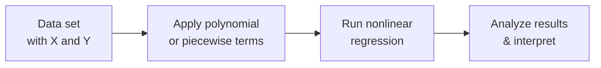

## Introduction and Motivation

Let’s admit it: simple linear regression is a great starting point, but real-world financial data rarely conform to just a straight line. In many portfolio management or asset-pricing studies, we spot patterns that bend, shift, or alter direction at certain thresholds. Maybe you’ve personally tried to fit a straight line to data, got weird residuals, and quietly uttered, “Hmm, something’s not right here.” This is exactly where nonlinear and log-linear transformations come into play.

Nonlinear models allow us to capture these curveballs—well, actual curves in a dataset—and glean richer insights into underlying relationships. Sometimes it’s about polynomial regression (you know, quadratic or cubic functions). Other times, it’s a piecewise or spline approach, effectively letting you draw multiple lines for distinct segments of your independent variable. Then we have log-linear forms, so crucial in finance for analyzing variables that often grow or decay exponentially, like asset prices or economic indicators.

This section explores the “whys” and “hows” of these advanced regression methods. We’ll delve into polynomial regressions, piecewise and spline models, and the big three log-linear forms: log-level, level-log, and log-log. Trust me, these forms are not rocket science once you see how they can apply to real-world returns, risk analyses, or fundamental equity valuations. Think of it like discovering new roads on your map—suddenly, the journey in explaining and forecasting data can be smoother.

## Nonlinear Regression Models

### Polynomial Regression

Polynomial regression extends our linear model to include variables raised to powers higher than one. Instead of a simple linear structure:

y = β₀ + β₁x + ε,

we have:

y = β₀ + β₁x + β₂x² + … + βₖxᵏ + ε.

This approach is handy when your dependent variable (y) and the main independent variable (x) follow a curved trajectory. For instance, in finance, the effect of interest rates on economic growth might increase up to a point, but then it could decrease if rates get out of control. A polynomial term like x² or x³ can capture that turn.

• Interpretation. Each additional polynomial term modifies the slope within the data range. However, the interpretation of coefficients becomes trickier. A coefficient on x² no longer reflects a simple marginal effect; the effect of x depends on x itself (sounds a bit meta, right?). That’s where partial derivatives help:

∂y/∂x = β₁ + 2β₂x + 3β₃x² + … + kβₖx^(k-1).

In more advanced finance settings, we might interpret that partial derivative at specified values of x (e.g., “What happens to returns if the market index is at 4000 vs. 4500?”).

• Practical Uses. Polynomial regression is popular when analyzing asset volatilities that rise sharply in certain thresholds or analyzing non-linear yield curve shapes. If your residual plots from a simple OLS (ordinary least squares) show a clear pattern—like a U shape—polynomial terms might drastically improve your model’s fit.

### Piecewise or Spline Models

Sometimes the relationship between x and y changes at certain “knots” or breakpoints in x. Maybe a stock’s returns behave one way when volatility is under 20%, but drastically differently when volatility goes above 20%. Spline or piecewise regressions let you define segments of x and fit a separate line to each segment.

• How It Works. You choose one or more “knot points” in x. In each interval, you allow a different slope or even a different intercept. This can look something like:

y = 
- (β₀ + β₁x + ε) for x ≤ c  
- (β₂ + β₃x + ε) for x > c

for a single breakpoint c. More sophisticated spline approaches ensure continuity at the breakpoints—so you don’t get weird jumps at c.

• Interpretation. Interpretation is a bit more straightforward than polynomials in some ways because each segment has its own slope. However, you do need to keep track of where x transitions from one linear piece to another. This approach can reveal turning points or regime shifts (common in financial markets).

• Practical Example. Suppose high inflation levels cause a fundamentally different interest rate sensitivity in bond prices. You might define one spline for inflation in [0%, 5%] and another for inflation in (5%, 15%]. Each region might show a distinct relationship between inflation and bond returns.

### Graphical Overview

Here’s a quick visual diagram showing how raw data might flow into a transformation step and then into a regression approach:

In Chapter 10 (“Simple Linear Regression”), we covered the basic least squares framework. Now, you can see how polynomial or piecewise logic fits naturally into that framework by simply adding terms or recoding x based on threshold points.

## Log-Linear Models

Log-linear transformations are a staple in finance. Often, bond and equity prices, real GDP, or other economic indicators exhibit exponential-type relationships. A log transformation can linearize these patterns and simplify interpretation. Let’s examine the top three log-linear forms.

### Log-Level Model

The log-level model takes the natural log of the dependent variable:

ln(y) = β₀ + β₁x + ε.

Here, x remains on its original scale. Interpretation is often summarized by saying “β₁ is approximately the percent change in y for a one-unit change in x.” More precisely, a one-unit increase in x multiplies y by exp(β₁). If β₁ is small, exp(β₁) ≈ 1 + β₁, hence the “percent change in y” interpretation.

• Example. If ln(Stock Price) is regressed on the unemployment rate, a coefficient of −0.02 on the unemployment rate suggests that for every one percentage point rise in unemployment, the stock price drops by about 2% (holding everything else constant).

### Level-Log Model

Next is the level-log model:

y = β₀ + β₁ ln(x) + ε.

Now the dependent variable is in its original scale, and we’ve logged the independent variable. β₁ indicates the change in y for a percentage change in x. If x changes by 1%, ln(x) changes by approximately 0.01, so y changes by about 0.01β₁. So, you can see how this is quite handy for analyzing relationships where x can expand or contract by percentages, leading to additive changes in y.

• Example. Suppose y is the daily number of trades in a particular stock, and x is market capitalization. By logging market cap, we measure how the number of trades changes with a 1% shift in market cap, which can help us see how liquidity scales with firm size.

### Log-Log Model

The log-log model logs both y and x:

ln(y) = β₀ + β₁ ln(x) + ε.

Here, β₁ is the elasticity of y with respect to x—that is, the percent change in y for a 1% change in x. This is extremely popular in finance and economics, especially for analyzing returns, cost functions, or demand equations.

• Example. Let’s say ln(Sales) is the dependent variable and ln(Price) is the independent variable in a demand study. If β₁ is −1.2, we interpret it as a 1% increase in Price leading to a 1.2% decrease in Sales on average.

### Why Use Log-Linear?

- It can linearize nonlinear growth relationships.  
- It stabilizes variance if your data show heteroskedasticity.  
- Coefficients have intuitive percent or elasticity interpretations, especially useful in macroeconomic or corporate finance contexts.  

## Model Diagnostics for Nonlinear and Log-Linear Regressions

Regardless of the transformation or added polynomial terms, the usual model diagnostic steps from simple regression still apply:

• Residual Plots: You might see curved patterns vanish when you correctly include polynomial terms or piecewise segments. For log models, check if taking logs has stabilized the variance of residuals.  
• Normality and Homoskedasticity: As in Chapter 10 and 14.3, verifying that residuals do not show expanding spread is vital. If heteroskedasticity remains persistent, consider robust standard errors.  
• Multicollinearity: Higher-order polynomials (like x², x³) can be correlated with x. This can inflate standard errors. So keep an eye on variance inflation factors (VIFs).  
• Goodness-of-Fit: R² improves if the shape is accounted for properly, but also look to other fit metrics (AIC, BIC, adjusted R²) for a more robust measure, especially if you’re adding multiple polynomial terms.

## Practical Examples and Case Study

Let’s illustrate a polynomial regression example in a bond context. Imagine you’re analyzing the relationship between bond prices (y) and interest rates (x). A simple linear regression might leave some unexplained curvature—bond prices often respond in a convex manner to changes in yield. So you introduce x² (the square of yield):

y = β₀ + β₁ x + β₂ x² + ε.

• Hypothetical Results. You find β₁ is negative while β₂ is positive, indicating that bond prices decrease as rates initially rise, but the relationship softens (or even reverts) at higher rates, capturing that convexity. This can align with your theoretical expectation about how bond durations and convexities behave.

For a log-linear case, consider an equity example: you want to see how firm value changes with revenue. Suppose you use the log-log:

ln(Firm Value) = β₀ + β₁ ln(Revenues) + ε.

• Hypothetical Results. β₁ emerges as 0.9—meaning a 1% increase in Revenues is associated with about a 0.9% increase in Firm Value. This is a typical elasticity-based interpretation. If the coefficient is less than 1, it might suggest economies of scale or diminishing returns to revenue growth. Or if it’s bigger than 1, it might indicate that markets reward revenue growth with more-than-proportional jumps in market capitalization.

## Some Personal Observations

Early in my career, I (the author) tried to model portfolio returns with a purely linear specification. No matter how many variables I stuffed in, the residual plots looked like a mountain range. Adding polynomial terms for certain risk factors, especially squared or cubic terms to represent volatility extremes, drastically improved my adjusted R². It was an “aha!” moment that taught me how critical it is to recognize nonlinearity in financial data.

## Best Practices and Common Pitfalls

• Choose Terms Wisely: Don’t just pile on x², x³, x⁴ in a blind hunt for higher R². Overfitting is real, and polynomial terms can cause wild parameter swings outside the observed range.  
• Be Aware of Knot Selection: With piecewise or spline models, you need to justify your breakpoints. Do they reflect a known threshold? A policy boundary like a central bank’s declared inflation target?  
• Interpret Carefully: Distinguish between “the coefficient” in a log model vs. a polynomial model. Clarify precisely whether you’re talking about marginal changes, percentage changes, or elasticities.  
• Check Residual Diagnostics: Nonlinear transformations can solve some problems (like non-constant variance) but might introduce others (like correlated errors).  
• Keep The Economics/Finance Theory in Mind: Let theory guide you on whether a quadratic relationship or a log transformation is plausible. This avoids “throwing everything into the regression and hoping something fits.”

## Final Exam Tips

1. Know the Formula: Familiarize yourself with the shape of polynomial expressions and how partial derivatives reflect the slope at any point.  
2. Master Interpretation: The biggest exam pitfalls often involve interpreting the coefficient in a log-level or log-log model. Precisely articulate how you convert a coefficient into a percentage change or elasticity.  
3. Compare Models: Be ready to compare linear vs. log-linear vs. polynomial fits on a question that shows actual data plots or residual patterns. Mention residual sum of squares, adjusted R², or other relevant criteria.  
4. Watch Out for Multicollinearity: The exam might set a trap if you include both x and x², introducing correlation. Be ready to address VIF or tolerance.  
5. Don’t Overfit: If the question includes out-of-sample forecasts or cross-validation, highlight how too many polynomial terms can degrade predictive performance.  

Ultimately, exam item sets may give you a scenario with a weird R² in a simple regression or a shaped residual pattern, hinting at the need for a nonlinear transformation. Show your ability to spot the problem, propose a polynomial or log-linear approach, interpret it carefully, and evaluate fit improvements.

## References

- Kennedy, P. (2008). A Guide to Econometrics. Wiley-Blackwell.  
- Stock, J.H., & Watson, M.W. (2020). Introduction to Econometrics. Pearson.  
- CFA Institute. (2022). “Statistical Concepts and Market Returns,” CFA Program Curriculum.

## Nonlinear and Log-Linear Models Knowledge Check



### 1. Which statement best describes the interpretation of β₁ in a log-level model ln(y) = β₀ + β₁x + ε?

- [x] β₁ represents the approximate percent change in y for a one-unit change in x.
- [ ] β₁ represents the exact percent change in x for a one-unit change in y.
- [ ] β₁ represents the elasticity of y with respect to x.
- [ ] β₁ represents the change in y for a one-unit change in x.

> **Explanation:** In a log-level model, a one-unit increase in x produces an exponential change in y. For small β₁, exp(β₁ − 1) is roughly the percentage change in y.

### 2. In a piecewise linear (spline) model, what is the primary purpose of choosing knot points?

- [x] They mark where the slope of the relationship between x and y may change.
- [ ] They reduce the degrees of freedom in the regression.
- [ ] They ensure residuals are normally distributed.
- [ ] They eliminate all forms of heteroskedasticity in the residuals.

> **Explanation:** Knot points define intervals in which the slope can differ. Selecting these points often reflects known changes or regimes in the data.

### 3. When adding x² to a regression model along with x, what potential concern commonly arises?

- [ ] Perfect normality of residuals.
- [x] Multicollinearity between x and x².
- [ ] Polynomial terms eliminate all autocorrelation.
- [ ] Heteroskedasticity of residuals due to the squared term.

> **Explanation:** Higher-order polynomials can introduce strong correlation among x, x², (and possibly x³, etc.), inflating variance inflation factors (VIFs).

### 4. Suppose you run the model y = β₀ + β₁ln(x) + ε. If β₁ is 5, how should it be interpreted?

- [x] A 1% increase in x is associated with a 0.05 unit increase in y.
- [ ] A 1% increase in x is associated with a 5% increase in y.
- [ ] A 1-unit increase in ln(x) leads to a 5% decrease in y.
- [ ] A 1-unit increase in x leads to a 5% decrease in ln(y).

> **Explanation:** In a level-log model, a 1% change in x changes ln(x) by 0.01. Multiplying by β₁ = 5 gives a 0.05 change in y.

### 5. Which is the most accurate definition of elasticity in a log-log model?

- [ ] The slope in a linear model.
- [ ] The intercept of a polynomial regression.
- [ ] The absolute change in y for a unit change in x.
- [x] The percent change in y for a 1% change in x.

> **Explanation:** In a log-log model ln(y) = β₀ + β₁ln(x), β₁ is the elasticity, meaning how y changes in percentage terms when x changes by 1%—a bedrock concept in economics and finance.

### 6. If you see a “U-shaped” pattern in your residuals vs. fitted values plot for a simple linear regression, which approach is most likely a good next step?

- [ ] Remove outliers until the pattern disappears.
- [ ] Add more irrelevant independent variables.
- [ ] Assume data are stationary and continue as is.
- [x] Introduce polynomial terms (like x²) to capture curvature.

> **Explanation:** A U-shaped pattern signals curvature in the relationship. Polynomial terms are commonly used to model such nonlinearities.

### 7. In a spline regression with multiple knots, what is one potential drawback compared to a single-knot piecewise linear approach?

- [x] The model can become overly segmented, leading to overfitting.
- [ ] The resulting slopes have simpler interpretation.
- [ ] The model always has a linear relationship across each data interval.
- [ ] It eliminates the need to check for normality of residuals.

> **Explanation:** Although multiple knots improve flexibility in modeling, the risk of overfitting increases because the model becomes quite segmented.

### 8. If an analyst wants to see how equity returns might respond differently in “normal” market volatility vs. “high” market volatility, which method is most intuitive to try?

- [x] A piecewise linear model with a breakpoint at the threshold of high volatility.
- [ ] A pure log-log model with no breakpoints.
- [ ] Polynomial regression of order five (x⁵).
- [ ] A restricted linear model with no transformations.

> **Explanation:** Splitting the range at the point where volatility transitions from normal to high is a classic scenario for a piecewise approach.

### 9. When selecting a log-transform approach, which of the following is a potential advantage?

- [x] It can help stabilize the variance and address heteroskedasticity.
- [ ] It always improves model fit beyond polynomial regression.
- [ ] It eliminates the need for data cleaning.
- [ ] It ensures all residuals become zero-mean.

> **Explanation:** A log transformation often helps to reduce heteroskedasticity if the original variable grows exponentially or has variance that scales with the mean.

### 10. Under a log-log model ln(y) = β₀ + β₁ ln(x) + ε, if β₁ is positive and less than 1, which statement is most accurate?

- [x] A 1% increase in x leads to a smaller than 1% increase in y, indicating diminishing returns.
- [ ] y changes by 1% when x changes by 1 unit.
- [ ] The relationship is linear with a slope of β₁.
- [ ] The intercept becomes irrelevant to the model.

> **Explanation:** A log-log coefficient under 1 implies a less-than-proportional change, suggesting diminishing returns to scale. The model is still important even if the intercept is not zero.


