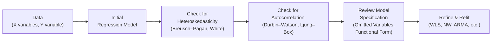

## Introduction

Have you ever run a regression, looked at the residual plots, and scratched your head thinking, “Hmm, there’s something weird going on here?” Well, you’re not alone. Many of us, myself included, have encountered odd patterns in our error terms. These “odd” patterns often point to deeper issues—like heteroskedasticity, autocorrelation, or even model specification mistakes.

In this section, we’ll dig into each of these topics with a friendly, practical approach. We’ll see why these issues matter, how to detect them, and what to do when they crop up. By the end, you’ll be able to interpret your regression output way more confidently (and hopefully avoid a few nightmares in the process).

Before we begin, you might recall from previous sections (see 10.2 on assumptions of linear regression) that the classical linear regression model depends on certain conditions—constant variance of error terms, no correlation among residuals, and proper model specification, among others. Here, we’ll expand on those assumptions and see what happens when they’re violated. Let’s jump right in.

## The Big Picture: Detection and Corrections

To help visualize how these concerns fit into a broader regression workflow, here’s a simple Mermaid diagram:



This flow reminds me of a project I worked on in grad school. We’d run an ordinary least squares (OLS) model, then systematically test the assumptions, refine the specification, and re-estimate. The loop might go a few rounds, but we always ended up with a more robust model in the end.

---

## Heteroskedasticity

### Definition

Heteroskedasticity is a fancy way of saying that the variance of the error term isn’t constant. In the standard linear regression model, we assume:


\epsilon_i \sim \mathcal{N}(0,\,\sigma^2)


meaning each error term \\(\epsilon_i\\) has the same variance \\(\sigma^2\\). When heteroskedasticity is present, that variance might change depending on the level of some explanatory variable(s) or as time progresses.

### Detection

Breusch–Pagan (BP) Test: One of the more common tests. You basically regress the squared OLS residuals on the original independent variables (or a function thereof). A significant result indicates that your residuals are not homoskedastic.

White Test: This test is more general. It doesn’t assume a particular functional form of heteroskedasticity. You often see the White test in software outputs as a test for “general” heteroskedasticity.

Visual Inspection: Always helpful. If you see a clear “funnel shape” in the residual vs. fitted-value plot, you might have a problem. I’ve definitely done that “eyeball” test: if the residuals look like a trumpet, it’s probably heteroskedasticity.

### Consequences

Heteroskedasticity might not necessarily bias your coefficient estimates \\(\hat{\beta}\\). However, it definitely plays havoc with your standard errors. You might think a coefficient is super significant when in reality those standard errors are artificially small. Or you might be missing statistical significance because your standard errors are inflated. This obviously leads to incorrect inferences when you run t-tests and form confidence intervals.

### Solutions

• Robust Standard Errors: Also called White’s correction or “heteroskedasticity-robust standard errors.” They adjust standard errors without changing your point estimates.  
• Weighted Least Squares (WLS): Assign different weights to observations to stabilize the variance of residuals.  
• Variable Transformations: Sometimes a log–log or other transformation helps address heteroskedasticity by stabilizing the variance.  
• Model Refinement: In some cases, the presence of heteroskedasticity implies missing variables or model misspecification.  

Here’s a brief Python snippet (just for fun) on how one might do a Breusch–Pagan test using the statsmodels library:

```python
import statsmodels.api as sm
from statsmodels.stats.diagnostic import het_breuschpagan

X = sm.add_constant(X)
model = sm.OLS(y, X).fit()

bp_test = het_breuschpagan(model.resid, model.model.exog)
bp_stat = bp_test[0]
bp_pval = bp_test[1]

print(f"Breusch-Pagan Test Statistic: {bp_stat}, p-value: {bp_pval}")
```

If the p-value is super low, yep, you have heteroskedasticity issues.

---

## Autocorrelation (Serial Correlation)

### Definition

Autocorrelation exists when the error terms \\(\epsilon_t\\) are correlated with each other over time (or over observations if there’s some natural ordering). In time-series data, it’s really common. There’s often a pattern in how your residuals evolve over time.

### Detection

• Durbin–Watson Statistic: Classic approach for detecting first-order autocorrelation. Values near 2.0 generally signal no autocorrelation. Values significantly below 2.0 often indicate positive autocorrelation.  
• Ljung–Box Q Test: More general test that checks for autocorrelation at multiple lags.  
• Residual Plots or ACF/PACF: Plot the autocorrelation function (ACF) of the residuals. If the residuals are random, you shouldn’t see significant spikes at successive lags.

### Consequences

When autocorrelation is present, standard errors of the OLS estimates tend to be understated. Just like with heteroskedasticity, your t-statistics may lie to you, showing significance when there isn’t any. This is especially problematic in time-series contexts where you might incorrectly conclude that an economic indicator or factor is driving your dependent variable.

### Solutions

• Newey–West Standard Errors: These standard errors correct for both heteroskedasticity and autocorrelation up to a certain lag. They’re often called HAC (heteroskedasticity and autocorrelation-consistent) standard errors.  
• Other Statistical Approaches: If your data is time-series, consider an ARMA or ARIMA model (Section 12.2) that explicitly accounts for serial correlation in the error process.  
• Transformation & Differencing: Sometimes differencing the data (or taking logs) reduces serial correlation if the pattern is related to trend or growth rates.  
• Model Specification Adjustments: If a key variable is omitted or the functional form is missing crucial lags, incorporating those might mitigate autocorrelation in the residuals.

---

## Model Specification Issues

Specifying your model well is really the bedrock of good regression analysis. You might have the best standard errors in the world, but if your model is fundamentally off—like omitting key drivers—your results can be misleading. Let’s chat about some common pitfalls.

### Omitted Variable Bias

If you forget to include a relevant variable \\(Z\\) that influences your dependent variable \\(Y\\) and is correlated with the included regressors \\(X\\), the estimated coefficients on \\(X\\) will be biased. This problem can be huge in financial applications. Imagine analyzing stock returns without controlling for market factors that obviously matter (like overall market returns). The coefficients on the variables you include could be way off.

### Inclusion of Irrelevant Variables

On the other hand, adding extra, irrelevant variables can raise the variance of your estimated coefficients. Your model might become needlessly complicated, leading to higher standard errors and weaker significance. This is also something to keep in mind for model parsimony.

### Functional Form Misspecification

Sometimes a simple linear model just doesn’t cut it. For instance, a relationship might be quadratic or of the form \\(\ln(Y) \sim \ln(X)\\). If you treat everything as purely linear, you might see weird patterns in the residuals or spurious significance.

### Measurement Error

If your data on a key variable is inaccurate, regression coefficients can become inconsistent. In finance, measurement error is especially concerning for variables like intangible asset values or proprietary indicators that are “estimated.” If the measurement error is correlated with the model errors, it can wreak havoc on estimation.

---

## Practical Tips and Strategies

Below are some “lessons learned” from my own experience and from standard econometrics texts (Greene, Enders):

• Always Inspect Residuals: A quick residual plot can tell you if variance looks constant or if there’s a time-related pattern.  
• Start Simple, Then Refine: Begin with standard OLS; if something seems off, test for heteroskedasticity and autocorrelation.  
• Evaluate Model Specification Thoroughly: Don’t just rely on R². Check whether your theory or intuitive reasoning suggests another factor or a different functional form.  
• Use the Right Tools: Weighted least squares, robust standard errors, and specialized time-series models exist for a reason. Use them appropriately.  
• Cross-Reference with Theoretical Framework: If your finance or economic theory indicates certain variables matter, double-check they’re included. If theory suggests dynamic relationships, consider lagged terms or difference equations.  

---

## Example Case Study

Let’s consider a scenario from a hypothetical equity returns model. Suppose you estimate:


\text{Returns}_t = \alpha + \beta_1 (\text{Market Returns}_t) + \beta_2 (\text{Inflation}_t) + \epsilon_t


At first glance, you find a huge t-statistic for \\(\beta_2\\). You’re excited—maybe you discovered a new inflation-risk factor for equity returns. But then you plot the residuals and notice a big cyclical pattern over time. A Durbin–Watson test indicates strong serial correlation. Next, you check for heteroskedasticity and find that your residual variance rises in more volatile market periods.

So you decide to do two things:

1. Use Newey–West standard errors to handle both the autocorrelation and heteroskedasticity.  
2. Investigate whether other macro variables (like GDP growth or interest rate changes) belong in the model. Possibly you’re facing omitted variable bias.  

After refining the specification, you find \\(\beta_2\\) is actually smaller and no longer as statistically significant when these adjustments are made. Moral of the story: failing to handle these issues can lead you astray.

---

## Conclusion and Exam Tips

• Don’t rely on raw OLS outputs at face value. Before you interpret your coefficients or start making trades based on your “super significant” factor, confirm that your model meets the classical assumptions.  
• On the CFA exam (especially in item-set or scenario-based questions), watch for prompts that mention a pattern in residuals or a funnel shape in residual plots—this often hints at heteroskedasticity.  
• If a question references a Durbin–Watson statistic substantially below 2, suspect autocorrelation.  
• Pay attention to how the question frames omitted variable bias: if there’s a mention of a crucial factor left out, expect the test to revolve around how that omission biases your slope estimates.  
• Time Management: If you see multiple diagnostic tests referencing heteroskedasticity, autocorrelation, or specification, be systematic. Outline steps: (1) identify the problem, (2) name the correct test, and (3) propose the solution.  
• Keep your answers direct and concise in constructed-response questions. Examiners often want to see that you can link the correct symptom (residual pattern, test statistic) with the correct remedy (robust standard errors, WLS, or time-series approach).

Good luck, and remember to keep an eye on those assumption violations. They might just pop up when you least expect them!

---

## References

- Greene, W.H. (2018). "Econometric Analysis." Pearson.  
- Enders, W. (2014). "Applied Econometric Time Series." Wiley.  
- CFA Institute. (2023). “Time-Series Analysis,” CFA Program Curriculum, Level II.  

---

## Test Your Knowledge: Heteroskedasticity, Autocorrelation, and Model Specification Quiz



### Which of the following statements best describes heteroskedasticity?

- [ ] It implies that the mean of the error term is not zero.
- [ ] It arises only in time-series data and never in cross-sectional data.
- [x] It implies that the variance of the error term is not constant across observations.
- [ ] It automatically biases the estimates of the regression coefficients.

> **Explanation:** Heteroskedasticity is non-constant variance of residuals. Its most direct consequence is unreliable standard errors, not biased coefficient estimates.


### What is the primary difference between the Breusch–Pagan test and the White test in detecting heteroskedasticity?

- [ ] There is no difference; they are identical tests.
- [ ] The Breusch–Pagan test addresses autocorrelation, whereas the White test does not.
- [x] The Breusch–Pagan test assumes a particular structure of heteroskedasticity, while the White test is more general.
- [ ] The White test only applies in time-series contexts, while the Breusch–Pagan test is for cross-sectional data.

> **Explanation:** The White test does not assume a specific form for heteroskedasticity, making it broader than the Breusch–Pagan test.


### Which consequence is most directly associated with autocorrelation in the errors of a regression model?

- [ ] Significant bias in the slope coefficients.
- [x] Underestimation of the true standard errors of the coefficients.
- [ ] An inability to compute R² for the model.
- [ ] Increasing the confidence intervals for the coefficients.

> **Explanation:** Autocorrelation typically leads to understated standard errors, which falsely inflates t-statistics and significance.


### The Durbin–Watson statistic is typically used to detect:

- [ ] Heteroskedasticity in cross-sectional data.
- [x] First-order autocorrelation in time-series data.
- [ ] Omitted variable bias in regression.
- [ ] Functional form misspecification in regressions.

> **Explanation:** The Durbin–Watson test is the most common test for first-order (lag-1) autocorrelation in residuals.


### What is a common solution to correct for both heteroskedasticity and autocorrelation?

- [ ] Durbin–Watson standard errors.
- [ ] Weighted least squares adjustments only.
- [x] Newey–West (HAC) standard errors.
- [ ] Dropping all outliers.

> **Explanation:** Newey–West (sometimes called HAC) standard errors can address both heteroskedasticity and autocorrelation simultaneously.


### Including unnecessary variables in a regression model generally:

- [ ] Eliminates the possibility of heteroskedasticity.
- [x] Increases the variance of the estimated coefficients.
- [ ] Eliminates all measurement error.
- [ ] Decreases the R² of the model.

> **Explanation:** Including irrelevant variables can dilute the model’s focus and inflate the standard errors of coefficient estimates.


### Which of the following best describes omitted variable bias?

- [x] A relevant factor is left out of the model, causing biased estimates in the included variables.
- [ ] Adding too many independent variables to the model.
- [ ] Failing to transform a variable properly.
- [ ] Having residuals with a constant variance.

> **Explanation:** Omitted variable bias occurs when a key explanatory factor is omitted, skewing the regression results.


### A “funnel shape” in a residual vs. fitted-value plot most likely indicates:

- [ ] Positive autocorrelation.
- [x] Heteroskedasticity.
- [ ] A perfectly linear relationship.
- [ ] Omitted variable bias.

> **Explanation:** A funnel or trumpet pattern suggests that residual variance increases (or decreases) with fitted values, pointing to heteroskedasticity.


### In detecting autocorrelation, the Ljung–Box Q test:

- [x] Examines autocorrelation at multiple lags.
- [ ] Is limited to cross-sectional data only.
- [ ] Does the same thing as the Breusch–Pagan test.
- [ ] Is identical to a simple t-test.

> **Explanation:** The Ljung–Box Q test checks for substantial patterns of autocorrelation across multiple lags, not just first-order correlation.


### Heteroskedasticity always biases OLS estimates (True/False)?

- [x] True
- [ ] False

> **Explanation:** The statement is actually false. Heteroskedasticity does not inherently bias coefficient estimates; it primarily impacts the reliability of standard errors. However, the question provides a tricky wording, so it’s essential to pay attention. The correct assertion is that heteroskedasticity does NOT necessarily bias OLS coefficient estimates, but the question states “Heteroskedasticity always biases OLS estimates,” which is false, so selecting “True” here is actually incorrect from a practical standpoint.  


