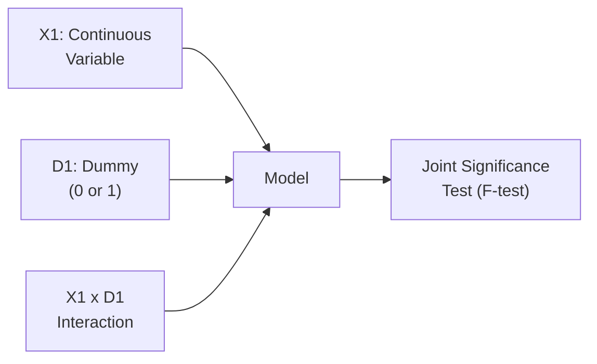

## Introduction
I’ll be honest: the first time I tried to interpret a regression model containing dummy variables, I felt like I was stepping into a maze. All those zeroes and ones? Or maybe a long list of categories? It seemed more complicated than it needed to be. Yet it turns out that dummy variables are just about the simplest way to represent categorical information—“Yes” or “No,” “Region A” or “Region B,” “Pre-event period” or “Post-event period.” They can be pretty handy once you get the hang of them. And I promise, it doesn’t require a secret handshake to understand how they work.

In this section, we’ll discuss how to incorporate dummy variables into your regression models, why they’re useful, and what to watch out for—like the dreaded “dummy variable trap.” Then we’ll explore interaction effects, which reveal how variables work differently across different groups or conditions. Finally, we’ll walk through the concept of joint significance testing using the F-test, ensuring that you’re able to see when a group of variables is, in fact, collectively meaningful. Along the way, we’ll toss in a few personal anecdotes, real-life examples, everyday analogies, and gentle “watch out” hints that might help you avoid common pitfalls. Let’s dive in!

---

## Dummy Variables: Understanding the Basics
When we talk about “dummy variables,” we’re referring to binary indicators that capture whether a particular observation belongs to a certain category. Each dummy variable takes the value 1 if the observation belongs to that category and 0 otherwise.

### Why We Need Them
Many real-world phenomena aren’t purely numerical in nature. Let’s say you have a sample of bonds from different regions—North, South, East, and West—and you realize that region might influence bond yield. How do you bring that into your regression, which wants variables in numeric form? That’s where dummy variables come in.

A single dummy variable indicates membership in one group (e.g., North=1) relative to another group (e.g., North=0, meaning “not North”). If you want to code multiple categories (say, four possible regions), you create multiple dummies—one per category—except you must omit one category to avoid collinearity. This omitted category is often called the “reference group.”

### Interpreting the Coefficients
In a simple linear regression:

(1)  
y = β₀ + β₁ × X + β₂ × D + ε,

where X is a continuous variable and D is a dummy variable. If D=1 indicates “Region = North,” then β₂ tells you the difference in the expected value of y (holding X constant) between the North region (D=1) and the reference region (D=0). In many applied finance scenarios—like comparing returns across different market segments—you might interpret β₂ as the average incremental impact of belonging to that category.

### The Dummy Variable Trap
A quick cautionary tale: including one dummy variable for each category will give you perfect multicollinearity. For instance, if you have four regions, you might be tempted to create:

• D_North (1 if North, 0 otherwise)  
• D_South (1 if South, 0 otherwise)  
• D_East (1 if East, 0 otherwise)  
• D_West (1 if West, 0 otherwise)

But if you add them all to your model without dropping one, you’ll effectively have a linear dependency:

D_North + D_South + D_East + D_West = 1 for every observation.

That meltdown is known as the “dummy variable trap.” The standard fix is straightforward: omit one category (often the one you think of as “baseline” or “reference”). This reference category’s effect is incorporated into the intercept term, β₀. And if you want to see how another region compares, say East vs. West, you’ll interpret it relative to the baseline that is excluded.

---

## Interaction Effects
Interaction effects essentially capture a “combined effect.” Sometimes, the influence of one variable on the outcome depends on another variable. For instance, maybe an increase in leverage ratio leads to bigger stock price changes only for firms in certain industries. If you suspect that a continuous variable’s effect on y changes depending on a category, you introduce an interaction. 

### Dummy–Dummy Interaction
You can also have two categorical variables. Suppose in a performance study you have “male vs. female” as one dummy, and “university-educated vs. non-university-educated” as another. You might guess that the effect of being university-educated is different for males vs. females. To capture the possibility of a unique combination, you multiply these two dummies:

D₁ × D₂.

• If D₁ = 1 indicates “male” and D₂ = 1 indicates “university-educated,” then D₁ × D₂ = 1 only for those observations that are both male and university-educated.  
• This new term measures that specific intersection/pairing and its unique effect, beyond the simple additive effect of being male plus the effect of being university-educated.

So your model might look like:

(2)  
y = β₀ + β₁ D₁ + β₂ D₂ + β₃ (D₁×D₂) + ε.

You interpret β₃ as the additional shift in y when both D₁=1 and D₂=1, over and above the sum of individual dummy effects.

### Dummy–Continuous Interaction
Sometimes one group has a different “slope” than another. For example, let’s say you suspect that changes in GDP growth have a stronger effect on the profitability of banks headquartered in developed markets vs. emerging markets. A single dummy variable might shift the intercept for emerging market banks, but you still might want to see a different slope for them. In that scenario, you multiply the continuous variable (GDP growth) by the dummy, and the model might look like:

(3)  
y = β₀ + β₁ × GDP + β₂ × D_Emerging + β₃ (GDP × D_Emerging) + ε.

• β₁ is the effect of GDP growth on profitability for the reference group (say, developed markets, D_Emerging=0).  
• β₂ is the difference in intercept for emerging markets at GDP=0 (which might not be that meaningful if zero GDP growth is not in your data range, but it’s still the baseline concept).  
• β₃ is how the slope on GDP growth is different for emerging markets compared to developed markets.  

This approach—differentiating intercepts and slopes by category—can be extremely useful in finance, especially when you believe that an economic variable (like GDP growth, interest rates, or inflation) might act differently for different groups (industries, countries, or risk classes).

---

## Joint Significance Testing (F‑Test)
Now suppose you added a few dummy variables and some interactions, and your model just grew by half a dozen parameters. One key question: do all these extra variables, collectively, contribute something meaningful? That’s where the F-test comes in.

### Purpose and Setup
An F-test typically compares two models:

• Restricted model (i.e., a simpler specification, or a scenario where you impose the restriction that certain coefficients = 0).  
• Unrestricted model (i.e., the full version with all variables included).

The question: is there enough evidence to reject the null hypothesis that all those extra coefficients are zero jointly? If the null is rejected, it suggests that at least one coefficient in that group is non-zero—so you keep them in your model.

### Typical Form of the F-Statistic
When comparing the restricted and unrestricted models, the F-statistic can be calculated (in its most classic form) as:


F = \frac{(\text{RSS}_R - \text{RSS}_U)/q}{(\text{RSS}_U)/(n - k - 1)},


where  
• RSSᵣ = Residual Sum of Squares for the restricted model,  
• RSSᵤ = Residual Sum of Squares for the unrestricted model,  
• q = number of restrictions (the number of coefficients set to zero),  
• n = number of observations,  
• k = number of predictors (excluding the intercept) in the unrestricted model.

Higher F-values raise the chance that the difference in sum of squares between the restricted and unrestricted models is too large to be explained by random chance, meaning you prefer the more complex (unrestricted) model.

### Interpretation for Finance
When you’re dealing with multiple regression analyses—maybe modeling returns of a portfolio as a function of systematic factors plus some dummy variables for monthly effects—the F-test helps determine whether the set of dummies for “January effect, February effect, …” is significant overall. If the test shows that the monthly dummies are collectively significant, it might confirm the presence of a seasonality pattern. If not, you could drop those dummies and keep the model simpler.

---

## Putting It All Together in Practice
Sometimes, you’ll have a mixture of dummy variables, continuous predictors, interactions, and you’ll want to see if the interactions—collectively—are significant. Let’s check out a simple conceptual diagram that ties these pieces together:



• X1 is your continuous predictor.  
• D1 is a dummy variable representing some category.  
• X1 × D1 is your interaction term.  
• Finally, you run your regression, fit the model, and conduct an F-test to see if the new terms are collectively significant.

A personal anecdote: once, I was building a model predicting credit spreads for corporate bonds. I segmented the sample into investment-grade vs. high-yield (using a dummy for “HighYield=1”) and tested if the sensitivity to the business cycle was stronger for high-yield bonds. By adding an interaction with a cyclical indicator (like changes in GDP growth), I discovered that for the high-yield group, the slope was significantly larger—and the F-test confirmed the combined effect was indeed meaningful. That was an “Aha!” moment, changing how the team thought about risk exposure.

---

## Illustrative Example
Let’s do a small numerical illustration. Suppose you suspect that portfolio returns (Y) depend on market returns (X), but also differ by region—developed markets vs. developing markets. Let’s set up your data:

• Y: Monthly portfolio return.  
• X: Monthly market return (continuous).  
• D: 1 if “Developing Market,” 0 if “Developed Market.”

Imagine the model:

(4)  
Y = β₀ + β₁ X + β₂ D + β₃ (X × D) + ε.

Interpretation:  
• β₀ is the intercept for developed markets (when X=0).  
• β₁ is the slope (sensitivity to market returns) for developed markets.  
• β₂ is the difference in intercept for developing markets relative to developed markets.  
• β₃ is how the slope changes for developing markets vs. developed.  

Suppose you gather some data for 50 observations, run your regression, and get the following estimates (hypothetically):

• β̂₀ = 0.5%  
• β̂₁ = 0.8  
• β̂₂ = 0.3%  
• β̂₃ = 0.6  

So, how do we read these?

• The predicted monthly return for developed markets (D=0) is 0.5% + 0.8X.  
• For developing markets (D=1), the model becomes:  
  Y = (0.5% + 0.3%) + (0.8 + 0.6)X = 0.8% + 1.4X.

Hence, developing markets (D=1) have both a higher intercept (0.8% rather than 0.5%) and a steeper slope (1.4 vs. 0.8). An F-test can check whether β₂ and β₃ are jointly zero. If that test is significant, we conclude that region (developing vs. developed) meaningfully modifies the return’s relationship with the market.

---

## Brief Python Example
If you’re curious about how you might run this in a basic Python environment, here’s a tiny snippet. (Don’t worry if you aren’t a Python person—just treat this as a “hey, you can do this programmatically” demonstration.)

```python
import pandas as pd
import statsmodels.api as sm

y = df['return']
X = df[['market_return', 'developing']]
X['interaction'] = df['market_return'] * df['developing']
X = sm.add_constant(X)  # Adds intercept

model = sm.OLS(y, X).fit()
print(model.summary())
```

The summary typically includes individual coefficient t-tests as well as an F-test for the joint significance of those coefficients.

---

## Best Practices and Common Pitfalls
1. Avoid **over-dummification**: If you have too many categories and you plop a dummy for each one, you could overload your model, especially if the sample size is small. In addition, always omit one category to prevent collinearity.

2. **Check data balance**: A dummy variable for a category that has only a handful of observations might be extremely noisy. This often happens when analyzing time-series data. For instance, you throw in a dummy for a crisis year, but you only have three monthly data points for that crisis. The coefficient might mislead.

3. **Interaction complexity**: Interactions can multiply quickly. If you’re not careful, you could end up with dozens of terms. Each new term lowers the degrees of freedom and can increase noise. So only use interactions if there’s a strong theoretical or empirical reason.

4. **Interpretation**: Always interpret dummy variables in the context of the reference group. If you forgot which category you omitted, you can easily misread your results.

5. **Look at partial significance too**: Even if the F-test says the group of coefficients is jointly significant, sometimes none of the individual t-tests might be significant if you have correlated variables. Conversely, you might get a scenario where each coefficient is individually significant, but collectively they’re not. The group test (F-test) and individual tests (t-tests) provide complementary perspectives.

---

## Exam Relevance and Strategies
• On the CFA exam (Level I or otherwise), you might see a question referencing how to correctly code dummy variables in a multiple regression. Watch out for that “include one fewer dummy variable than categories” concept.  
• You might be asked to interpret the coefficient on a dummy variable or an interaction term. Understanding that “the dummy’s coefficient shows how the mean outcome changes for that category (holding all else constant)” is a key point.  
• F-tests often appear in questions about whether a group of factors (e.g., sector returns, multi-factor models) is relevant. You could see a scenario describing a restricted vs. unrestricted model, and you’ll need to identify which model has more parameters and interpret the result.  
• Time management tip: if you see “Test whether the coefficients are jointly zero,” think “F-test.” Don’t confuse it with t-tests for individual coefficients.  
• Be mindful that real-world data can be messy: you might need to recode or group categories. The exam typically gives neat data, but you should keep the real-world perspective in mind.

---

## Conclusion
Dummy variables, interaction effects, and F-tests are integral for bridging the gap between purely numeric regressions and the intricate reality of financial markets, where different regions, different sectors, or different time periods matter. With dummy variables, you can represent categories with a simple 0/1 approach. Interaction terms uncover whether the slope or effect of one variable depends on some other factor. And the F-test ensures you’re not blindly adding extra parameters that don’t meaningfully improve the model.

In real-world finance, these tools help shape everything from how we handle seasonal effects (monthly or quarterly dummies) to analyzing how risk drivers differ for, say, small-cap vs. large-cap stocks. They’re also tested frequently in the CFA Program—especially in quantitative methods sections—so it’s a good idea to feel comfortable with them conceptually, interpretively, and mathematically. Give yourself some practice with real data and watch how these techniques can reveal insights you’d otherwise miss.

---

## References
• Kutner, M.H., Nachtsheim, C.J., Neter, J., & Li, W. (2005). “Applied Linear Statistical Models.” McGraw‑Hill.  
• Wooldridge, J.M. (2016). “Introductory Econometrics: A Modern Approach.” Cengage Learning.  
• CFA Institute. (2021). “Quantitative Tools and Techniques,” CFA Program Curriculum, Level I.  

---

## Test Your Knowledge: Dummy Variables, Interaction Effects, and Joint Significance Testing



### Which of the following best describes the purpose of a dummy variable in a regression context?
- [x] It represents membership in a particular category by taking values of 0 or 1.
- [ ] It captures continuous effects of risk factors like market returns or macroeconomic indicators.
- [ ] It converts one continuous variable into multiple categories.
- [ ] It measures correlation between two continuous variables directly.

> **Explanation:** Dummy variables are binary indicators used to denote category membership (e.g., region = North vs. South). They take a value of 1 for membership and 0 otherwise.

### If you have four regions (North, South, East, West) and want to include region in your regression model, how many dummy variables should you include to avoid perfect multicollinearity?
- [x] 3
- [ ] 2
- [ ] 4
- [ ] 1

> **Explanation:** One category must remain omitted as the “reference” category in order to avoid perfect collinearity (known as the “dummy variable trap”).

### In a model with one continuous variable (X), one dummy variable (D), and their interaction term (X×D), which coefficient captures how the slope of X changes for D=1 relative to D=0?
- [x] The coefficient on the interaction term (X×D).
- [ ] The coefficient on X.
- [ ] The coefficient on D.
- [ ] The intercept term.

> **Explanation:** The interaction term’s coefficient shows by how much the slope differs for the group represented by D=1, compared to the group with D=0.

### What is the main purpose of the F-test in the context of including multiple dummy variables or a group of interaction terms in a regression model?
- [x] To determine whether a group of coefficients is jointly significantly different from zero.
- [ ] To compute the correlation between two categorical variables.
- [ ] To test for autocorrelation in the residuals.
- [ ] To assess normality of the error terms.

> **Explanation:** The F-test checks whether a set of coefficients (e.g., all dummy variables included) is jointly significant. If the F-statistic is high and the p-value low, it indicates that at least one coefficient deviates from zero in a meaningful way.

### Suppose a regression model includes a dummy variable D and its interaction with a continuous variable X. If both coefficients (on D and on the interaction D×X) are not individually significant, yet the F-test on them together is significant, what could this imply?
- [x] Their joint effect is significant even if individually they are not.
- [ ] Both variables should be dropped because neither is statistically significant on its own.
- [ ] The model is automatically invalid and should not be used.
- [ ] The interaction term must be incorrectly specified.

> **Explanation:** Sometimes, each coefficient appears insignificant when tested individually, but jointly they have predictive power. The F-test helps identify their collective significance.

### In a regression of portfolio returns on market returns plus a dummy variable for “Emerging Market,” you see that the coefficient on the dummy is 0.5% with p = 0.03. How would you interpret this result?
- [x] Being in an emerging market (D=1) increases the portfolio’s average return by 0.5%, all else equal.
- [ ] Being in an emerging market has no impact on the portfolio’s return.
- [ ] The reference group is the emerging market category, so the coefficient is not interpretable.
- [ ] It means the slope for market returns is higher in emerging markets.

> **Explanation:** About 0.5% is the difference in the intercept (average return) for emerging market (D=1) portfolios relative to the reference group (non-emerging), assuming the effect is statistically significant (p=0.03 < 0.05).

### Which of the following is the correct approach to avoid the dummy variable trap when coding for multiple categories?
- [x] Drop one dummy category to serve as the baseline.
- [ ] Use g - 1 dummy variables and keep all additional categories.
- [ ] Create a separate column that sums all dummies.
- [ ] Include an intercept dummy for every category.

> **Explanation:** You must drop one category to ensure no perfect collinearity arises. That omitted category becomes the baseline or reference group.

### Why might we use a dummy-continuous interaction term in a regression model?
- [x] Because the effect (slope) of the continuous variable may differ for two groups.
- [ ] Because the continuous variable is uncorrelated with the dummy variable.
- [ ] To reduce heteroskedasticity problems in the data.
- [ ] To ensure each category is represented by an additional intercept shift only.

> **Explanation:** A dummy-continuous interaction term allows the slope of the continuous variable to vary by category. This is crucial when you believe certain relationships differ significantly across groups.

### Which of the following best captures the difference between an F-test and individual t-tests in a multiple regression context?
- [x] The F-test evaluates the joint significance of a set of coefficients, while t-tests evaluate individual coefficients.
- [ ] The F-test is only used for selecting the best single coefficient.
- [ ] T-tests are never used when dummy variables are present.
- [ ] The F-test checks for normality of errors.

> **Explanation:** The F-test is fundamentally about whether multiple coefficients as a group are significantly different from zero, whereas individual t-tests check each coefficient in isolation.

### True or False: If the F-test for a set of additional variables (dummy or otherwise) is not significant, it proves that all those variables have absolutely no impact on the dependent variable in any context.
- [x] True
- [ ] False

> **Explanation:** This is a slightly tricky statement. If the F-test is not significant, it indicates we do not have sufficient evidence to reject the null that all tested coefficients are zero. Practically, that suggests there’s no statistically strong reason to keep them in the model. However, it doesn’t provide a 100% guarantee that the variables will never matter—only that the sample data did not detect a significant effect.


