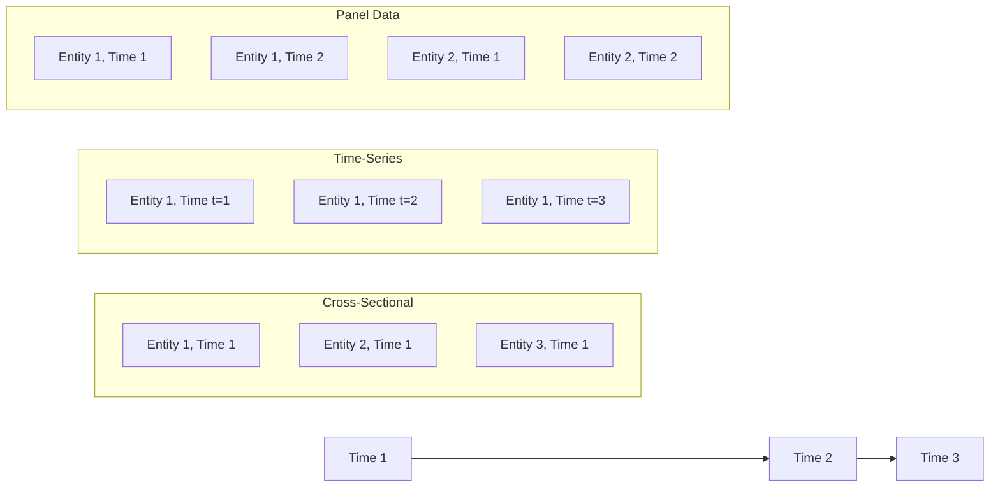
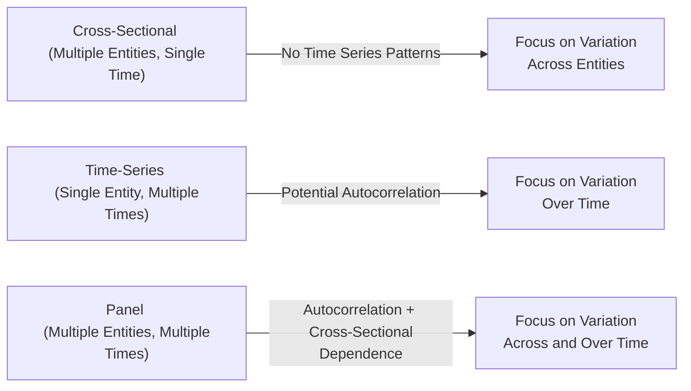

## Introduction

If you’ve ever found yourself juggling piles of data—maybe from multiple companies, or from multiple points in time—then you’ve probably come across the idea that “not all datasets are created equal.” In financial and economic analysis, we typically encounter three main kinds of data structures:

• Cross‑Sectional Data (multiple entities, one time point),  
• Time‑Series Data (one entity, multiple time points), and  
• Panel Data (multiple entities, multiple time points).

Let’s explore each of these datasets and emphasize how our choice of data structure influences everything from model design to the assumptions we make about error terms. We’ll talk about the relevant best practices, typical pitfalls, and ways to identify whether your data’s quirks call for a specific type of methodology.

Along the way, I’ll share a few experiences (and mild frustrations) from real-world attempts to wrangle data. Sometimes it felt like my Excel spreadsheets took on a life of their own—especially when working on large panel datasets—and I hope you can learn from where I stumbled. Let’s jump in.

---

## Conceptual Overview

The big question is: why do we care so much about whether our data is cross‑sectional, time‑series, or panel? Well, in each scenario, the structure of the data poses different challenges and invites different modeling techniques. For instance, if you’re measuring the performance of 100 different companies only for the year 2023, that’s cross‑sectional. If you’re tracking Apple’s stock returns from 2010 to 2023, that’s a time‑series. If you’re collecting data on the same 100 companies every year from 2010 to 2023, that’s panel (or longitudinal) data.

Before diving into specifics, let’s visualize these structures:



• Cross‑Sectional Data: Observations on different entities (e.g., firms, individuals, or countries) at one point in time.  
• Time‑Series Data: Observations on a single entity over multiple time periods.  
• Panel Data: A combination of both—data on multiple entities over multiple time periods.

---

## Cross‑Sectional Data

### Essence of Cross‑Sectional Data
Cross‑sectional data is basically a snapshot. You pick one moment in time and collect data on, say, 50 companies or 200 individuals. This can be extremely handy if you want to understand how variables differ across entities at a fixed point. For example, you might compare the P/E ratios of 100 firms as of December 31, 2023. Or maybe you’re analyzing the capital structure (debt/equity ratios) of different companies on a given date.

Cross‑sectional data is frequently used to answer, “What factors lead one firm to have a higher expected return than another?” or “Which industries show higher returns on equity in a particular year?” Because we’re not dealing with a time trend, we don’t worry about autocorrelation (at least, not in the dimension of time). 

### Common Cross‑Sectional Data Issues
1. Heteroskedasticity: It is very common that the variance of errors differs across subjects. Some companies show way more volatility in their performance data than others, for instance.  
2. Cross‑Sectional Dependence: This can be a sneaky issue. If all your firms are in the same industry or region, for example, they might be influenced by similar macro or sector-wide conditions, leading to correlation in their error terms.  

### Example in Finance
Imagine you’re interested in explaining cross‑sectional differences in dividend yields. You might run a regression:


\text{DividendYield}_i = \beta_0 
                           + \beta_1 (\text{ReturnOnEquity}_i) 
                           + \beta_2 (\text{DebtRatio}_i) 
                           + \epsilon_i,


where \\( \epsilon_i \\) is the error term for firm \\( i \\). Since these data points all come from the same moment in time, you worry less about time-based patterns, but you might suspect that a group of firms in the same sector share similar characteristics—leading to correlation across firms.

### Practical Anecdote
I once tried to compare the profitability of bank stocks based on cross‑sectional data at the end of a particular fiscal year. Everything looked fine until I realized that all the banks in my sample were regulated by the same central authority, so they essentially followed the same new regulations that year. The result? They exhibited correlated shocks that muddled the cross-sectional regressions. That’s a real-life example of cross‑sectional dependence.

---

## Time‑Series Data

### Nature of Time‑Series Data
Time‑series data focuses on one entity over a sequence of time periods. For instance, you might have monthly unemployment rates for the United States from January 1990 to December 2024, or daily stock prices for Tesla from 2010 to 2025. Because finance often deals with price movements, returns, interest rates, and macro variables over time, time‑series data is a staple of financial analysis.

### Key Concerns with Time‑Series
1. Autocorrelation: Observations close in time tend to be correlated—e.g., last month’s stock return often influences this month’s. This correlation can violate the classical linear regression model’s assumption of independent errors.  
2. Stationarity: The data’s mean, variance, and correlation structure should remain constant over time for conventional statistical tests to hold. Non-stationary series, such as many macroeconomic indicators or trending stock prices, can create false regression relationships (the “spurious regression” problem).  
3. Seasonality: Finance is rife with seasonal patterns—think of holiday effects in retail sales or recurring cyclical patterns in consumer spending. If you don’t handle seasonality, your model can produce misleading results.

### Example in Finance
When you run a time‑series regression to forecast, say, the monthly return on the S&P 500, you might propose a model:


r_{t} = \alpha + \beta_1 r_{t-1} + \beta_2 (\text{DividendYield}_{t-1}) + \epsilon_{t}.


In this scenario, you’d definitely check for autocorrelation in \\(\epsilon_{t}\\). You might use a Durbin–Watson test or other specialized tests to ensure your model is appropriate.

### Practical Anecdote
I once built a time‑series model to forecast inflation using a decade of monthly data. In the first attempt, I ignored stationarity and quickly got an R-squared of something like 97%. I was excited, thinking I’d discovered a secret sauce. Then I realized the series had a persistent upward trend, so everything was correlated with that trend over time! After differencing the data and properly checking stationarity, my “amazing” model lost its artificially inflated R-squared. Lesson learned.

---

## Panel (Longitudinal) Data

### Defining Panel Data
Panel data merges the best (and occasionally worst) of both cross‑sectional and time‑series data. You collect data on multiple subjects—say, 50 companies—over a series of time periods—say, 10 years. As a result, each company is measured each year for a decade, giving you a much richer dataset.

Panel data is also called longitudinal data because you’re following the same entities over time. In finance, you might track multiple firms’ stock returns, dividend policy, risk measures, and so forth, each year for an extended period. The power is that you can model activity both across firms and over time.

### Why Panel Data?
1. More Data Points, Greater Statistical Power: Because we have multiple observations for each unit over time, the sample size is effectively increased without simply repeating the same cross-section.  
2. Ability to Model Both Cross‑Section and Time Effects: You can identify how a firm’s inherent characteristics (e.g., corporate culture) and external factors (e.g., macroeconomic conditions) jointly affect outcomes.  
3. Complexities: With great power comes great responsibility. Panel data can be complicated to handle because you must account for both cross‑sectional dependence and autocorrelation over time.

### Fixed Effects vs. Random Effects
Panel regressions commonly appear as:


y_{it} = \beta_0 + \beta_1 x_{it} + \alpha_i + \epsilon_{it},


where \\( y_{it} \\) is the dependent variable for entity \\( i \\) at time \\( t \\), \\( x_{it} \\) is one or more explanatory variables, and \\( \alpha_i \\) is an unobserved term capturing time-invariant differences across entities (for instance, a firm’s unique corporate culture).

• Fixed Effects Model: Assumes \\(\alpha_i\\) is a fixed parameter that can be estimated for each cross-sectional unit. Great if you suspect unobserved differences across entities are correlated with your regressors.  
• Random Effects Model: Assumes \\(\alpha_i\\) is random and uncorrelated with explanatory variables. Useful if the unobserved heterogeneity is more like a random draw from a larger population.

### Example in Finance
Suppose you’re studying how a firm’s research and development (R&D) spending influences its stock returns across 30 companies over 8 years. A possible panel model might look like:


\text{Return}_{it} = \beta_0 
                   + \beta_1 (\text{RDSpending}_{it}) 
                   + \alpha_i + \epsilon_{it}.


The \\(\alpha_i\\) would pick up the firm-specific, time-invariant effect—such as an industry niche or a managerial style that doesn’t change from year to year. You also need to worry about whether the error term \\(\epsilon_{it}\\) suffers from autocorrelation over time or cross‑sectional correlation across different firms.

### Practical Anecdote
Years ago, I worked on a project that tracked the operational efficiency (cost-to-income ratio) of 40 banks across 5 years, connecting it to profitability measures, capital ratios, and macroeconomic conditions. We used a fixed effects panel model because we suspected each bank’s inherent operational strategy never drastically changed. But we also discovered that, in certain years, a looming regulatory shift affected all banks simultaneously—hinting at cross‑sectional dependence. You live and learn, right?

---

## Modeling Considerations

### Choosing the Right Data Structure
It might sound corny, but “abc—always be checking”—the nature of your data. If you have multiple observations and time points, hey, that might be panel data. If you only have one time point but a bunch of entities, that’s cross‑sectional. And if you’re focusing on a single entity across multiple time points, that’s time‑series. While each structure has some overlap in usage (e.g., you can pool time-series from many entities, though that becomes panel data), you want to pick the right statistical approach from the start.

### Diagnostic Tests and Corrections
• Cross‑Sectional: Check for heteroskedasticity, cross‑sectional dependence. Techniques might include robust standard errors or cluster corrections.  
• Time‑Series: Check for stationarity (unit root tests like the Augmented Dickey–Fuller test), autocorrelation (Durbin–Watson, Breusch–Godfrey), and potential seasonality (seasonal dummies or transformations).  
• Panel: Combine the above checks. You might use panel-specific methods like the Hausman test to decide between fixed vs. random effects. Additionally, specialized tests for cross-section dependence (like the Pesaran CD test) help ensure your standard errors are valid.

### Real-World Finance Example
Let’s say an analyst wants to investigate the relationship between a firm’s ESG (Environmental, Social, and Governance) score and its annual stock return. The analyst obtains data for 500 public companies over five years. Because the data is structured by firm (cross‑section) and year (time), it’s panel data. The analyst might run:


\text{Return}_{it} = \beta_0 + \beta_1 (\text{ESGScore}_{it}) + \alpha_i + \gamma_t + \epsilon_{it},


where \\(\alpha_i\\) is the firm fixed effect and \\(\gamma_t\\) is a time fixed effect (capturing macro conditions in each year). Before finalizing the model, the analyst should test if \\(\text{Return}_{it}\\) is stable over time (stationary, or at least not trending wildly) and whether there’s cross-sectional dependence among firms in the same industry. 

---

## Short Python Example for Panel Data

Below is a brief snippet illustrating how one might estimate a panel data model using Python. In practice, specialized libraries like “linearmodels” handle panel regressions:

```python

import pandas as pd
import statsmodels.api as sm
from linearmodels.panel import PanelOLS

# ['firm_id', 'year', 'y_var', 'x_var']
df = df.set_index(['firm_id', 'year'])

y = df['y_var']
x = df[['x_var']]  # You can add more variables if needed

x = sm.add_constant(x)

model = PanelOLS(y, x, entity_effects=True)
results = model.fit(cov_type='clustered', clusters='firm_id')

print(results)
```

In this short example, `entity_effects=True` instructs the model to account for firm-specific fixed effects. Clustering standard errors by `firm_id` can mitigate cross-sectional dependence at the firm level.

---

## Additional Diagrams

### Comparing the Three Data Types



This quick view highlights the unique issues you face in each data structure.

---

## Best Practices, Pitfalls, and Strategies

• Always “know thy data.” Determine if it’s cross‑sectional, time‑series, or panel.  
• For cross‑sectional data, watch for heteroskedasticity and cross‑sectional dependence.  
• For time‑series data, test for autocorrelation, stationarity, and seasonality.  
• For panel data, be prepared to handle both cross‑sectional and time-series issues simultaneously.  
• When in doubt, run diagnostic tests—like the Hausman test for fixed vs. random effects, unit-root tests (time-series or panel versions), or cross-sectional dependence tests.  
• Use robust standard errors or clustering to properly address correlation within your data.  
• Don’t ignore the “big picture”: if your dataset spans a global economic crisis year or a major regulatory change, guess what? You might see structural breaks in your time-series or correlations across your cross section.  
• In exam settings, identify which data type is relevant to the question. If the question references “data from 100 firms in 2025,” that’s cross‑sectional. If it’s “monthly data on 1 firm from 2015 to 2025,” that’s time‑series. If you see “quarterly data from 50 firms from 2010 to 2025,” that’s panel.

---

## Final Exam Tips

1. Know the Terminology: Be prepared to define cross-sectional, time-series, and panel data clearly.  
2. Identify Key Violations: Understand how to check for heteroskedasticity, autocorrelation, and cross-sectional dependence.  
3. Master Stationarity: If you see time-series data, always think about whether it’s stationary. A quick check might involve mention of unit-root tests (Augmented Dickey–Fuller, Phillips–Perron, etc.).  
4. Distinguish Fixed vs. Random Effects: The exam might ask you to explain which approach is appropriate and why. The Hausman test is often the deciding factor.  
5. Use Real-World Context: The exam loves scenario-based prompts. Expect something like, “An analyst collects monthly data on 15 mutual funds for 5 years...” to see if you properly identify the data as panel.  
6. Don’t Overlook Standard Errors: The correct standard error correction (robust, clustered, etc.) can be critical to accurate inference.

---

## References

• Hsiao, C. (2014). Analysis of Panel Data. Cambridge University Press.  
• Baltagi, B.H. (2021). Econometric Analysis of Panel Data. Wiley.  
• CFA Institute. (2023). “Econometrics for Financial Analysis,” CFA Program Curriculum, Level II.

These references offer deeper insights into the sophisticated techniques for each type of dataset, especially panel data analysis, which can become mathematically and computationally intense.

---

## Test Your Knowledge: Cross-Sectional, Time-Series, and Panel Data



### Which type of data involves observing multiple units or individuals at a single point in time?

- [ ] Time-series data
- [ ] Panel data
- [x] Cross-sectional data
- [ ] Mixed longitudinal data

> **Explanation:** Cross-sectional data is collected from many entities at one fixed time point.


### Which phenomenon is more common in time-series data compared to cross-sectional data?

- [ ] Multicollinearity
- [ ] Heteroskedasticity
- [x] Autocorrelation
- [ ] Cross-sectional dependence

> **Explanation:** Time-series often faces autocorrelation, where consecutive observations over time are correlated.


### In the context of analyzing multiple companies over several years, the data structure is typically described as:

- [ ] Cross-sectional data
- [ ] Latent data
- [ ] Time-series data
- [x] Panel data

> **Explanation:** Panel data combines a cross-section of entities (companies) over multiple time periods.


### A “fixed effects” model in panel data:

- [x] Controls for time-invariant characteristics by estimating an intercept for each entity.
- [ ] Assumes no correlation between unobserved factors and the regressors.
- [ ] Is identical to a random effects model.
- [ ] Automatically corrects for autocorrelation.

> **Explanation:** Fixed effects models capture unobserved, time-invariant differences across entities (e.g., firms) by giving each entity its own intercept term.


### In time-series analysis, which step is key before building a predictive model?

- [x] Testing for stationarity
- [ ] Testing for multicollinearity across entities
- [ ] Running a Hausman test
- [ ] Dropping half of the observations

> **Explanation:** Stationarity is crucial in time-series; non-stationary data can lead to spurious results. The Augmented Dickey–Fuller test is a standard approach.


### A regression using only 10 individuals at different points in time for each individual is best classified as:

- [ ] Cross-sectional data
- [x] Panel data
- [ ] Time-series data
- [ ] Cohort data

> **Explanation:** Observing multiple individuals (entities) over time is a hallmark of panel data.


### A random effects model in panel data is characterized by:

- [x] Treating unobserved heterogeneity as uncorrelated with the regressors.
- [ ] Allowing a separate slope coefficient for each entity.
- [x] Being more efficient if assumptions hold true.
- [ ] Requiring no checks for cross-sectional dependence.

> **Explanation:** Random effects models assume the unobserved individual effect is a random variable uncorrelated with the regressors. If valid, it can be more efficient than fixed effects.


### An analyst suspects that all companies in her cross-sectional sample are influenced by the same sudden regulatory event. This is an example of:

- [ ] Perfect heteroskedasticity
- [x] Cross-sectional dependence
- [ ] Dynamic correlation
- [ ] Unit-root dependence

> **Explanation:** If an external event affects all firms similarly, that can induce correlation across entities (i.e., cross-sectional dependence).


### When analyzing daily returns of a single stock for 10 years, which issue is most critical to check?

- [ ] Cross-sectional dependence
- [ ] Panel-level fixed effects
- [x] Autocorrelation
- [ ] Poisson distribution

> **Explanation:** For a single stock’s returns in a time-series format, autocorrelation is often the prime concern.


### True or False: Panel data sets always eliminate the need for autocorrelation or heteroskedasticity checks.

- [ ] True
- [x] False

> **Explanation:** Panel data introduces the possibility of autocorrelation across time for each entity and heteroskedasticity across entities, so you still need thorough checks.


