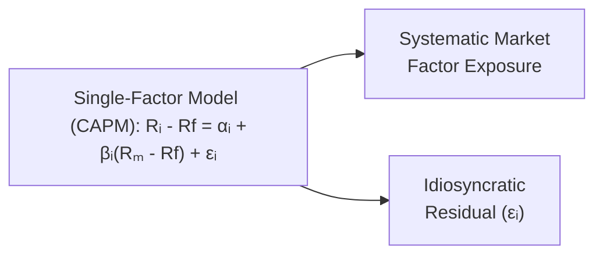
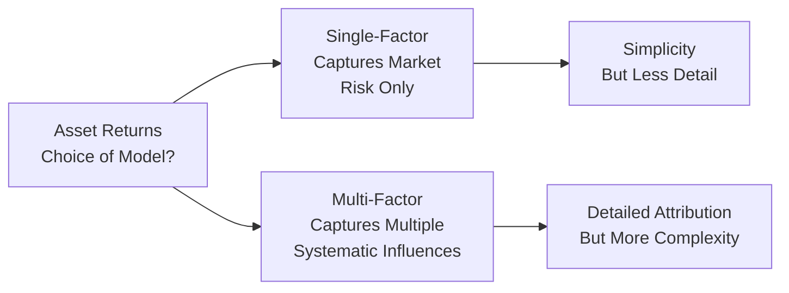

## Introduction
It’s funny—I clearly remember the first time I tried to explain the idea of factor models to a friend who’d never looked at financial data. I started talking about “market risk factors,” “size premiums,” and “value spreads.” Their eyes glazed over. Maybe you’ve had that experience or at least felt that way. Don’t worry. Once you break these models down into their main components, they’re not so scary. Factor models are simply frameworks to figure out how much of an asset’s return comes from big, systematic influences—like the overall market—and how much comes from more specific quirks of that asset, like being a small-cap stock or a value stock.

Return-generating models are super important in portfolio management, performance attribution, and risk analysis. If you’ve gone through earlier sections in this textbook, you’ve seen how multiple linear regression works, how we interpret coefficients, and how to address issues like heteroskedasticity or autocorrelation. Now, we’re shifting the perspective a bit to see how these regression techniques help us break down stock (or portfolio) returns into different pieces. Let’s jump in.

## Single-Factor Model (Market Model)
The single-factor model is often referred to as the market model. You might also see it closely tied to the Capital Asset Pricing Model (CAPM)—one of the most influential ideas in modern finance. The idea is that an asset’s return can be explained primarily by its relationship to the broad market. Formally:

(1)  
Rᵢ − Rf = αᵢ + βᵢ (Rₘ − Rf) + εᵢ  

Where:  
• Rᵢ is the return of asset i.  
• Rf is the risk‑free rate (often a Treasury bill yield).  
• (Rₘ − Rf) is the market’s excess return over the risk-free rate.  
• βᵢ is that asset’s sensitivity to the market’s excess return (often called the beta).  
• αᵢ (alpha) is the asset’s average return unexplained by moves in the market.  
• εᵢ is a random error term capturing firm-specific or idiosyncratic events.

### Why Beta Matters
Beta is your measure of market risk exposure. If an asset has βᵢ = 2, it tends to respond with twice the volatility of the market’s moves (on average). If the market goes up 1%, you might expect your asset to go up roughly 2%, ignoring alpha and idiosyncratic noise. A low beta (like 0.8) indicates a less volatile, or at least less market-sensitive, asset.

### Alpha in the Single-Factor Model
Alpha, αᵢ, represents how much extra return you get that’s not explained by the market’s ups and downs. In an efficient market under CAPM assumptions, you wouldn’t expect a statistically significant alpha after transaction costs. But in real life, sometimes a stock or a portfolio consistently has positive alpha (or negative alpha, if it’s underperforming). Even though many believe markets are fairly efficient, alpha is the Holy Grail that portfolio managers chase.

### Diagram: Single-Factor vs. Multi-Factor Approach

Below is a simple Mermaid diagram illustrating the flow of returns from systematic (market) vs. other factors. Notice how the single-factor model lumps everything—except firm-specific noise—into one broad market factor.

The single-factor model is straightforward. Let’s see what happens when we add more factors.

## Multi-Factor Models
You may have already spotted one drawback to the single-factor model—it explicitly accounts for only one systematic influence (the market). But in reality, other systematic influences might drive returns as well. Size factors (small vs. big companies), value factors (value stocks vs. growth stocks), momentum factors, and many others have been proposed and tested by academic researchers and practitioners.

### The Fama–French Three-Factor Model
A famous extension is the Fama–French three-factor model. It says: sure, market returns matter, but being a small-cap stock tends to yield different (usually higher) returns than large-cap. Likewise, “value” stocks (those with high book-to-market ratios) behave differently from “growth” stocks (low book-to-market). So, we add two more factors:

(2)  
Rᵢ − Rf = αᵢ + βₘ (Rₘ − Rf) + βₛ SMB + βₕ HML + εᵢ  

Where:  
• βₘ is the exposure (beta) to the overall market factor.  
• βₛ is the sensitivity to the size premium factor, SMB (Small Minus Big).  
• βₕ is the sensitivity to the value premium factor, HML (High Minus Low).  
• SMB is the return difference between small‑cap and large‑cap portfolios.  
• HML is the return difference between high book-to-market (value) and low book-to-market (growth) portfolios.

### Carhart Four-Factor Model and Beyond
The Carhart model extends Fama–French by adding a momentum factor—often constructed by taking the return difference between stocks that performed best in the previous period and those that performed worst. You might see additional factors like liquidity or quality, but it’s the exact same principle: each factor tries to capture a systematic risk (or anomaly) that influences a broad set of assets.

### Interpreting Factor Loadings
Each factor loading (β) tells you how sensitive the asset’s excess return is to that factor. A large βₛ means the asset strongly co-moves with small-cap stocks. A big βₕ means it strongly co-moves with value stocks. If your portfolio is overweight in high-βₛ stocks, it probably stands to benefit if small-cap stocks outpace large-cap. But you’ll also be more exposed if small-caps underperform.

## Estimating and Testing Factor Models
Estimation of factor models looks a lot like standard multiple regression. And from earlier chapters, we know some key steps:

• Collect return data for your asset and your factor returns (market excess return, SMB, HML, etc.).  
• Run a regression of (Rᵢ − Rf) on those factor returns.  
• Obtain estimates for αᵢ, β values for each factor, and the residual variance.  

### Diagnosing Significance
We’d typically look at t‑statistics or p‑values for each β to see if it’s statistically different from zero. If the data says your βₛ is significantly positive, that implies your asset return has a meaningful tilt toward small-cap stocks. We might also do an F-test to see if the entire regression is meaningful.

### Residual Analysis
Residuals (εᵢ) should ideally have no pattern left if the factor model is well specified. If you see autocorrelation or patterns, it can hint that more systematically relevant factors are missing or the model has specification issues.

## Applications in Portfolio Management

### Performance Attribution
One of the coolest uses of these models is performance attribution. You can say, “Let’s see how much of this portfolio’s returns is explained by the market, size, or value factors.” Whatever is left over after accounting for all factor exposures might be labeled as α—often the manager’s skill (or luck). Institutions love these breakdowns because it helps them figure out if their manager is beating a passive factor-based strategy or not.

### Risk Management
Factor models are also big in advanced risk analytics. If your portfolio has big loadings on, say, the SMB factor, you know you might suffer if small-caps tank. Similarly, if you have a big negative βₕ (value factor), you’re essentially a “growth-y” portfolio, and that has ramifications if value stocks suddenly dominate. Breaking down the portfolio’s exposures helps risk managers identify vulnerabilities and plan hedges.

### Asset Allocation
Multi-factor thinking is part of many strategic and tactical allocation processes. Suppose you believe small-cap stocks will outperform in the next economic cycle. You tilt the portfolio to small caps, raising your βₛ exposure. Tools like factor models help you systematically measure and monitor such tilts.

## Practical Example: Estimating a Fama–French Three-Factor Model
Imagine you have monthly returns on asset i, the market index, small-cap minus large-cap (SMB), and high book-to-market minus low book-to-market (HML). Let’s say your asset i is a mid-cap tech stock. Over the last five years (60 observations):

• You regress (Rᵢ − Rf) on (Rₘ − Rf), SMB, and HML.  
• The regression output might show something like:  
  – Intercept (αᵢ) = 0.2% per month (p = 0.10), not super significant.  
  – βₘ = 1.1 (p = 0.01), strongly significant.  
  – βₛ = 0.2 (p = 0.05).  
  – βₕ = −0.15 (p = 0.30), not that significant.  

Interpretation? Your stock has slightly higher market sensitivity (1.1) than average. It leans somewhat toward small-cap (0.2). The negative βₕ suggests a tilt away from value, i.e., more of a growth tilt, but it’s not statistically significant. The alpha isn’t large or super significant, so you can’t convincingly claim it’s beating the model.

## Best Practices, Common Pitfalls, and Strategies
• Beware Overfitting: If you throw in too many factors, your model can “explain” historical returns quite well, but it might fail horribly in the future.  
• Data Mining: Factor-based approaches risk data mining. Make sure the factors you use are logically grounded (like size, value, momentum) and widely accepted.  
• Multicollinearity: In multi-factor models, factors can be correlated. For example, small-cap and value sometimes overlap. Keep an eye on correlation among factor returns, as it can mess with your coefficient estimates and interpretations.  
• Regime Changes: Market dynamics change over time. A factor that worked for 30 years might become obsolete or even reverse. Periodic re-estimation and monitoring are important.  
• Consistency in Factor Definitions: If your “value” factor is different from a standard index or from an academic paper’s definition, your results might vary widely. Consistent definitions matter for comparability.

## Deeper Insights: Single-Factor vs. Multi-Factor
A single-factor model is incredibly simple but can be too narrow if multiple systematic forces matter to returns. In practice, multi-factor models give you better insight into the drivers of performance and risk. However, single-factor models like CAPM remain a cornerstone of finance, especially in theoretical contexts like deriving the Security Market Line (SML) or for quick back-of-the-napkin cost-of-capital estimates.

## Final Exam Tips
• Prepare to evaluate a manager’s performance using multi-factor regression output. You might get a question with regression coefficients for α, βₘ, βₛ, and so on. You’ll need to check their significance and interpret them.  
• Watch for potential “trap” questions where the provided data shows a factor loading that is not significant, yet the manager claims it’s valid.  
• Practice stating whether alpha is statistically different from zero and explaining the practical significance (like manager skill or zero-sum luck).  
• Don’t ignore the risk implications of factor exposures. Even if the question is about performance, the exam might reference how changes in factor exposures affect risk.  
• Understand how single-factor and multi-factor models relate to equilibrium theories (CAPM, Arbitrage Pricing Theory) and to real-world applications (performance attribution, risk management).

## References for Further Study
• Fama, E.F., & French, K.R. (1993). “Common Risk Factors in the Returns on Stocks and Bonds,” Journal of Financial Economics.  
• Carhart, M.M. (1997). “On Persistence in Mutual Fund Performance,” The Journal of Finance.  
• CFA Institute. (2023). “Portfolio Risk and Return,” CFA Program Curriculum, Level II.  
• Pesaran, M.H., & Yamagata, T. (2018). “Testing CAPM Models: A Multi-Factor Perspective,” Annals of Economics and Finance.  
• For more on regression fundamentals: Chapters 10 and 14 in this volume.

---

## Test Your Knowledge: Single-Factor and Multi-Factor Return Models



### Which statement best describes the main difference between a single-factor model and a multi-factor model for equity returns?

- [ ] Single-factor models capture multiple sources of systematic risk through one market factor. 
- [x] Multi-factor models decompose returns into more than one systematic driver of risk (like size, value, and momentum). 
- [ ] Single-factor models rely solely on idiosyncratic risk removal. 
- [ ] Multi-factor models cannot isolate market risk from idiosyncratic risk.

> **Explanation:** Single-factor models (e.g., CAPM) include only market risk as the main systematic factor. Multi-factor models add more systematic factors (size, value, etc.), offering a richer decomposition of returns.

### In the Fama–French three-factor model, which factor is intended to capture the effect of firm size on returns?

- [ ] HML (High Minus Low) 
- [x] SMB (Small Minus Big) 
- [ ] Market excess return 
- [ ] Momentum factor

> **Explanation:** The SMB factor is explicitly designed to capture the size premium by measuring the return difference between small-cap and large-cap stock portfolios.

### What does the intercept (α) represent in a single-factor or multi-factor model?

- [x] The component of return not explained by the model’s systematic factors 
- [ ] The factor loading on the market portfolio 
- [ ] The main source of systematic risk in the model 
- [ ] An estimate of the asset’s idiosyncratic volatility

> **Explanation:** Alpha (α) is generally seen as the average abnormal return left unexplained by the factors included in the model. It is the constant term in the regression equation.

### If an asset has a β estimate of 1.5 for the market factor, how should we interpret that?

- [ ] The asset has below-average sensitivity to market swings. 
- [ ] The asset likely moves less than the market in both up and down markets. 
- [x] The asset’s return moves about 1.5 times more than the market’s excess return. 
- [ ] The asset is uncorrelated with the overall market.

> **Explanation:** A β of 1.5 indicates higher-than-market sensitivity. When the market’s excess return changes by 1%, the asset’s excess return changes by about 1.5%, all else equal.

### Which of the following is an example of a potential “extra” factor that extends beyond the traditional Fama–French three-factor model?

- [x] Momentum 
- [ ] Market risk premium 
- [ ] Size premium 
- [ ] Value premium

> **Explanation:** The Carhart four-factor model adds a momentum factor to market, size (SMB), and value (HML), which Fama–French originally highlighted.

### Suppose you regress a portfolio’s excess returns against a three-factor model and find that the R² is 95%. Which is the most likely conclusion?

- [ ] The portfolio is primarily driven by idiosyncratic risk. 
- [x] The portfolio’s returns are largely explained by the three systematic factors in the model. 
- [ ] The portfolio has high unsystematic risk exposure. 
- [ ] The regression model is likely meaningless.

> **Explanation:** A high R² means that most of the portfolio’s return variation is explained by the included factors—here, the market, SMB, and HML.

### Why might multicollinearity be a problem in multi-factor models?

- [ ] It helps the regression produce more stable estimates. 
- [x] It can inflate variances of the coefficient estimates, making them less reliable. 
- [ ] It reduces the number of significant factors in the model. 
- [ ] It has no impact on multi-factor models.

> **Explanation:** When factors are correlated with each other (multicollinearity), estimates of their individual betas become less reliable, and standard errors inflate.

### An asset manager finds a statistically significant negative β with the HML factor. What does this generally imply?

- [ ] The asset systematically performs better when value stocks outperform growth stocks. 
- [ ] The portfolio is neutral regarding value/growth orientation. 
- [x] The portfolio has a tilt toward growth stocks relative to value stocks. 
- [ ] The portfolio invests mostly in physical commodities.

> **Explanation:** A negative loading on HML implies underexposure to value stocks (or equivalently, exposure to growth stocks). The manager is effectively “short” that factor.

### In the single-factor model, the term εᵢ represents:

- [x] The idiosyncratic (firm-specific) return component not explained by the market factor 
- [ ] The market premium 
- [ ] The manager’s skill 
- [ ] The risk-free rate

> **Explanation:** εᵢ is the residual term that captures the random, unique influences on the asset’s returns apart from the market factor.

### True or False: When running a multi-factor model, if α is not significantly different from zero, it means the strategy has no value to investors.

- [x] True
- [ ] False

> **Explanation:** In many academic and practical interpretations, a statistically insignificant α suggests the model fully explains the returns through its systematic factors. There's no consistent “excess” performance. Whether that implies “no value” to every investor depends on costs, client preferences, and other practical factors, but in pure alpha terms, it suggests little or no skill beyond factor exposures.


