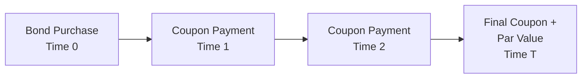

## Introduction

Have you ever purchased a bond and wondered exactly how the price you pay translates into the rate of return you’ll earn? That’s what we call the implied return—sometimes referred to as the yield embedded in the bond’s current market price. Basically, if you see a bond trading at a specific price, that price already reflects a certain “bang for your buck” in terms of the bond’s future cash flows. What we try to do is solve for that rate mathematically so that we can compare different bonds or other fixed-income instruments in a consistent way.

Below, let’s break down the concept of implied return for fixed-income instruments and show you how it connects to the powerful time value of money ideas we introduced in earlier sections. In the end, you’ll not only learn the core formulas but also see how to handle some real-world twists: different compounding frequencies, yield to call, yield to put, spot-rate discounting, and more.

## Understanding Implied Return

The implied return is the rate of return you can expect to earn from a bond if you buy the bond at its current market price and hold it to a specific date—most commonly until maturity. The bond’s price is essentially the present value (PV) of all its future cash flows, discounted at some rate. When you solve for that discount rate given the price, you’re solving for the so-called yield.

In finance, we often compute the internal rate of return (IRR) of a series of cash flows—the IRR is just the discount rate that makes the present value of your cash inflows equal to your cash outflow. Similarly, for a bond, the outflow is the bond’s price (what you pay today), and the inflows are the future coupon payments and redemption amount (i.e., the par or face value distribution at maturity).

## The Bond Pricing Equation and IRR

If you’re holding a plain-vanilla bond (meaning no special features like calls or puts) until its maturity date, the implied return is commonly referred to as the yield to maturity (YTM). Mathematically, we write the bond’s price as:

(1)  
P = ∑ (Coupon / (1 + i)^(t)) + (Par / (1 + i)^(T))

• P  = Price of the bond (current market price).  
• i  = Discount rate per coupon period (related to YTM).  
• t  = Each coupon period, t = 1, 2, … up to T.  
• T  = Total number of coupon periods until maturity.  

However, real-world bond markets standardize “i” to reflect an annual yield, often broken into m compounding periods per year (semi-annual, quarterly, monthly, etc.). In that case, if there are m periods each year, T would be (number of years to maturity × m), and the coupon has to be adjusted accordingly (established as Coupon / m if the coupon is quoted on an annual percentage basis). The formula then looks like this:

(2)  
P = ∑ (Coupon / m) / (1 + (YTM/m))^(n)  +  (Par / (1 + (YTM/m))^(m×Y))  

where:
• YTM = yield to maturity quoted on an annual percentage basis.  
• n   = coupon periods from 1 to m×Y (Y is the number of years).  
• Coupon = annual coupon in currency terms (e.g., $ interest per year).  
• Par = face value (returned at maturity).  

To find YTM from price, you essentially solve this equation (which can’t always be done in closed form) for YTM. In practice, financial calculators, spreadsheets, or iterative algorithms take care of the solution.

## Annualizing Yields and Compounding Conventions

I remember the first time I computed a bond yield, I forgot to properly account for semi-annual coupon payments. So the rate I got was off—it was a bit of a headache to figure out where I made the mistake. Well, that’s normal because yield annualization can be tricky. Here are the main points:

• Nominal Annual Yield (with semi-annual compounding):  
  If you have a per-period rate i (paid every six months), the nominal annual yield is simply 2i.  

• Effective Annual Yield (EAY):  
  EAY = (1 + i)^m – 1  
  where m is the number of compounding periods per year.  

So if you see an annual yield of (say) 6% for a bond that pays semi-annually, that 6% is typically 2 × 3% (where 3% is the rate each six months). But the effective annual yield would be (1 + 0.03)^2 – 1 = 6.09%. It’s no big deal but be mindful about which yield measure is being reported.

## Yield to Call (YTC) and Yield to Put (YTP)

If the bond you’re analyzing can be called or put by its issuer or holder, you might prefer to compute something other than yield to maturity—namely, yield to call (YTC) or yield to put (YTP). The idea is very similar. You just have to assume that the final cash flow occurs on the call date (or put date) and at the call price (or put price). Then you solve for the discount rate that equates the present value of that truncated set of cash flows to the bond’s price.

Here’s a quick conceptual formula for yield to call:

(3)  
Price = ∑ (Coupon / (1 + r)^(t)) + (Call Price / (1 + r)^(tc))

• tc = number of periods until the call date.  
• r   = yield per period (not necessarily the same as YTM).  
• Call Price = the amount the issuer pays if they choose to call the bond.  

Same concept for yield to put, but from the perspective of the put date and put price.

## Spot-Rate Discounting (Bond Spot Pricing)

In a more precise world, each future cash flow of a bond is discounted at a slightly different rate derived from the spot-rate curve. A spot rate is the yield on a zero-coupon bond of a specific maturity. If you’re working with a complete spot-rate curve, you could do:

(4)  
Price = ∑ [ C / (1 + S(t))^(t) ] + [Par / (1 + S(T))^(T)]

• S(t) = spot rate for the t-th coupon’s maturity.  
• S(T) = spot rate for the final redemption.  

Discounting each cash flow with its own maturity’s spot rate provides a theoretically more accurate price. By extension, if you solve for the single yield that reproduces that price, you get a yield that aligns with the spot rates. In practice, we often do simpler yield calculations because a full set of spot rates isn’t always available or is more complicated to parse.

## Visualizing Bond Cash Flows

Often it helps to draw a quick timeline of your bond’s future cash flows—just to get a handle on how the coupons are spread over time. Here’s a simple Mermaid diagram that shows the timeline for a typical coupon bond:



Each arrow points to a point in time where you receive either coupon payments or both the final coupon and par value. You pay the price (the bond cost) at Time 0. Your implied yield is the rate i that equates the present value of these future cash flows to that initial outflow.

## A Python Example for Yield to Maturity

Below is a small Python snippet that uses numbers as placeholders. We define a function that calculates the bond price given a guessed yield, and then we try to find the yield that solves for a specific market price. Yes, you could do the same on any standard financial calculator—but sometimes code is more flexible.

```python
import numpy as np

# - Face Value = 1000
# - Current Market Price = 1050

face_value = 1000
coupon_rate_annual = 0.10
coupon_payment_semiannual = face_value * (coupon_rate_annual / 2)  # 50
periods = 4  # 2 years, semi-annually
market_price = 1050

def bond_price(yield_guess):
    # yield_guess is a semi-annual rate
    pv = 0
    for t in range(1, periods+1):
        pv += coupon_payment_semiannual / ((1 + yield_guess)**t)
    pv += face_value / ((1 + yield_guess)**periods)
    return pv

def ytm_search():
    lower_bound = 0.0
    upper_bound = 0.20  # 20% semi-annual, quite high, just for search
    for _ in range(1000):
        mid = (lower_bound + upper_bound) / 2
        price = bond_price(mid)
        if price > market_price:
            # If the price from mid-yield is too high, yield is too low
            lower_bound = mid
        else:
            upper_bound = mid
    return ( (lower_bound + upper_bound) / 2 ) * 2  # Convert to nominal annual yield

found_ytm = ytm_search()
print("Approximate YTM (nominal annual):", round(found_ytm*100, 2), "%")
```

If you run this code, it will iterate to find a yield that prices the bond near 1050. We multiply the semi-annual yield by 2 at the end to get a nominal annual yield.

## Best Practices and Common Pitfalls

• Mixing up compounding frequencies: Always confirm if yields are given on a semi-annual, quarterly, or annual basis.  
• Ignoring day count conventions: In practice, bond markets use specific rules (30/360, Actual/365, etc.) which can slightly affect the yield.  
• Forgetting reinvestment assumptions: YTM calculations implicitly assume reinvesting coupons at the same yield—real-world deviations can lead to differences in realized yield.  
• Overlooking embedded options: If the bond has a call or put feature, the maturity date might not be what you think.  

## Real-World Applications

• Comparing Bonds: You want to see which bond offers the highest yield given your risk tolerance.  
• Calculating Break-Even Rates: Some investors compare yields across different segments of the yield curve to see which maturities are more attractive.  
• Scenario Analysis: If you suspect rates will fall, the yield might not fully reflect potential call risk. Alternatively, if you think inflation will rise, real yields matter more.  

## References and Suggested Readings

• Fabozzi, F.J. “The Handbook of Fixed Income Securities.” McGraw-Hill.  
• CFA Institute Level I Curriculum, “Quantitative Methods: Time Value of Money” & “Fixed Income.”  
• “Bond Yield to Maturity: Calculation and Interpretation,” Investopedia:  
  https://www.investopedia.com/terms/y/yieldtomaturity.asp  

---

## Test Your Knowledge: Implied Return for Fixed-Income Instruments



### Which term best describes the discount rate that equates the present value of a bond’s cash flows to its current market price?

- [ ] Holding period yield (HPY)
- [ ] Nominal rate of return
- [x] Internal rate of return (IRR)
- [ ] Inflation-adjusted rate

> **Explanation:** The bond’s yield to maturity is essentially the IRR for the bond’s expected cash flows.

### A bond pays a 9% annual coupon, but it pays coupons semi-annually. Which of the following yields should be the largest?

- [ ] Nominal semi-annual yield
- [ ] Nominal annual yield
- [x] Effective annual yield
- [ ] Real yield

> **Explanation:** More frequent compounding leads to a higher effective annual yield than the nominal annual or semi-annual yield.

### When computing yield to call (YTC), which of the following must be assumed about the bond?

- [ ] It will be converted to equity at maturity.
- [ ] All coupon payments will be reinvested at the bond’s coupon rate.
- [x] It will be redeemed at the call date for the call price.
- [ ] Future market prices remain constant.

> **Explanation:** The YTC calculation presumes the bond will be called at the call date. The call price replaces par in the final cash flow.

### If a bond is priced above par, holding all else equal, its YTM should be:

- [x] Below its coupon rate.
- [ ] Equal to its coupon rate.
- [ ] Above its coupon rate.
- [ ] Indeterminate.

> **Explanation:** If a bond sells at a premium (price > par), the yield that equates future cash flows to the higher price is lower than the coupon rate.

### Which yield measure discounts each cash flow at a different interest rate based on the zero-coupon yield curve?

- [ ] Yield to maturity
- [ ] Effective annual yield
- [ ] Simple yield
- [x] Spot-rate discounting approach

> **Explanation:** Spot-rate discounting uses distinct zero-coupon (spot) rates for each coupon date and maturity.

### A 10-year bond has a computed YTM of 5%, assuming it makes annual coupon payments. How would its yield change if it had semi-annual coupon payments instead (with other features the same)?

- [ ] The YTM would remain the same.
- [x] The nominal annual yield quoted might differ, but the true effective yield would change slightly.
- [ ] The YTM would be 10%.
- [ ] The YTM would definitely decrease by 1%.

> **Explanation:** The compounding frequency affects both nominal and effective yield measures, so you can’t simply say it’s 5% with semi-annual compounding.

### In a yield to maturity calculation, which assumption typically does NOT hold in real life?

- [x] All coupon payments will be reinvested at the same yield.
- [ ] Bonds pay their coupons on time.
- [ ] Par value is returned at maturity.
- [ ] The yield remains constant over time.

> **Explanation:** YTM assumes reinvesting each coupon at the same yield, which often doesn’t happen in reality.

### You estimate a bond’s price by discounting each coupon and par value at a uniform annual yield. Which concept is missing from this simplified approach?

- [ ] The coupon rate
- [ ] Reinvestment risk
- [x] The spot rate curve
- [ ] The face value

> **Explanation:** A uniform yield approach ignores the fact that each future payment could hypothetically be discounted at a different spot rate.

### A callable bond is trading at 110 and has a call price of 105. If the market expects it to be called in 2 years, which of the following yields should be emphasized?

- [ ] Yield to maturity
- [x] Yield to call
- [ ] Spot yield
- [ ] Holding period yield

> **Explanation:** If the bond is likely to be called, the yield to call is more relevant than yield to maturity.

### When a bond’s coupon payments are reinvested at a rate different from its yield to maturity, the investor’s actual return will:

- [x] Differ from the yield to maturity.
- [ ] Be equal to the stated YTM.
- [ ] Never exceed the stated YTM.
- [ ] Always exceed the stated YTM.

> **Explanation:** The YTM presumes reinvestment at the same yield, so if the reinvestment rate is different, the actual return will deviate.


