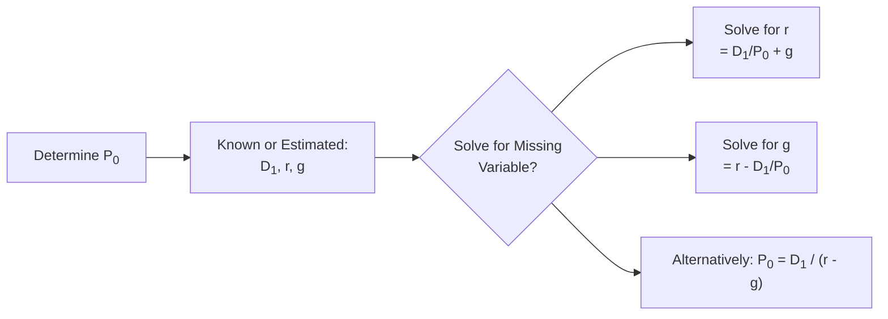

## Introduction

I remember the very first time I tried to value a company’s stock—let’s just say I had more questions than answers. I kept asking stuff like, “How do I figure out the right rate of return to discount these cash flows?” and “What if I guess the wrong growth rate—am I basically sunk?” Well, yes, if your assumptions about return and growth are wildly off, your valuation will be way out of line.

This section tackles the core ideas behind the required return on equity—essentially the price investors demand for taking on equity risk—and the implied growth rate, which is the growth that’s “baked in” to a company’s current market valuation. We’ll examine both of these concepts in detail, connect them to widely used valuation models, and explore real-world scenarios.

## Required Return on Equity: Core Concept

The notion of a required return on equity (let’s call it r for simplicity) is grounded in the undeniable fact that investors expect to earn something in exchange for the uncertainty they face when they buy shares in a company. If they wanted something relatively risk-free, they might go for short-term government bonds (at least in the idealized view), so the return on equities has to exceed that baseline.

### Why It Matters

• Discounting Future Cash Flows: As discussed in earlier sections like “Interest Rates as Required Returns, Discount Rates, and Opportunity Costs” (Chapter 1.1), the required return directly affects how we discount a stock’s future cash flows.  
• Opportunity Cost: The required return also represents the opportunity cost—what an investor could earn elsewhere for a comparable level of risk.  
• Stock Pricing: If the required return is higher, the stock’s fair value (based on discounted cash flows) is lower, all else being equal.

### Linking Required Return to CAPM

A very common method to estimate the required return on equity is the Capital Asset Pricing Model (CAPM). While CAPM has its critics, it often serves as a handy baseline. Under CAPM:


r = r_f + \beta (E[R_m] - r_f),


where:  
• \\( r_f \\) is the risk-free rate, often proxied by a short-term sovereign bond yield.  
• \\( \beta \\) is a measure of how sensitive the stock is to market movements.  
• \\( E[R_m] \\) is the expected market return.

So, if you spot a stock with a higher beta, it suggests that the stock moves more dramatically with market ups and downs, making it riskier. Hence, the required return would be higher.

I once got into a debate with a friend about whether beta always captures real-world risk. My friend’s argument was that a well-diversified investor might rely on beta, while a smaller investor (maybe with fewer holdings) might look at total volatility. It’s a valid point: CAPM is built on the assumption that investors hold diversified portfolios. Still, it remains one of the go-to methods for approximating r.

## Implied Growth: The Mystery Rate Hidden in the Stock Price

Implied growth is basically the growth rate of dividends (or free cash flows) that, when plugged into a valuation model, matches the current market price. Suppose you see a stock trading at $50. If you assume an 8% required return and you can guess the next dividend or next year’s free cash flow, you might solve for the growth rate that justifies that $50 price.

### Why Implied Growth Is Important

• Market Expectations: Implied growth reveals the market’s consensus (right or wrong) about the company’s future potential.  
• Identifying Discrepancies: You can compare your own forecasts with the implied growth to see if the market is too optimistic or pessimistic.  
• Scenario Analysis: By testing different growth scenarios (e.g., 2%, 5%, 10%), analysts can figure out whether a stock’s price is justified under various assumptions.

It’s worth noting that growth assumptions can carry a big punch. A small change in the growth rate can shift valuation dramatically. I once built a basic dividend discount model for a big tech company that everyone was bullish about. When I dialed growth estimates up by a single percentage point, the valuation soared. When I dialed it back down, the firm looked overvalued. That’s the sensitivity you’re dealing with.

## The Gordon Growth Model (Constant Growth)

One of the cleanest ways to see how required return and implied growth emerge is the Gordon Growth Model (aka the constant growth dividend discount model). Formally:


P_0 = \frac{D_1}{r - g},


where:

• \\( P_0 \\) is the current stock price.  
• \\( D_1 \\) is the dividend expected next period.  
• \\( r \\) is the required return on equity.  
• \\( g \\) is the constant growth rate of the dividend.

### Solving for r

If \\( P_0 \\), \\( D_1 \\), and \\( g \\) are known, you can rearrange:


r = \frac{D_1}{P_0} + g.


Let’s do a quick numeric example. Suppose a stock trades at \$100, next year’s dividend is forecast to be \$3, and you believe dividends will grow at 5% per year forever. Then:


r = \frac{3}{100} + 0.05 = 0.03 + 0.05 = 8\%.

So the market is implicitly telling you: “An 8% required return is consistent with a \$100 stock price, a \$3 dividend, and 5% growth.”

### Solving for g

Conversely, if \\( P_0 \\), \\( D_1 \\), and \\( r \\) are known, you can solve:


g = r - \frac{D_1}{P_0}.


So if the same \$100 stock has next year’s dividend at \$3, and you figure the required return is 8%, the implied growth is:


g = 0.08 - \frac{3}{100} = 0.08 - 0.03 = 5\%.


We’ve basically arrived at the same number. But in practice, you might guess at two of these variables and solve for the third, depending on what’s known and what the market price is telling you.

### Diagram: Relationships in the Gordon Growth Model

Below is a simple Mermaid diagram to show how these elements connect:

## Non-Constant (Multistage) Growth Models

But life isn’t always that tidy, right? Some companies grow quickly at first and then slow down. Others might have cyclical patterns. So we expand the dividend discount model to a multistage approach:

1. **High Growth Phase:** Forecast dividends (or cash flows) for each year in this rapid-growth period.  
2. **Transition Phase:** Growth slows gradually.  
3. **Terminal Value:** Eventually, the firm settles into a stable, constant growth that can be applied indefinitely.

### Example of a Two-Stage Model

• **Stage 1:** Project dividends for years 1 through 5 with explicit growth rates, discount them back to present.  
• **Stage 2:** Assume from year 6 onward, dividends grow at a stable rate (g). So at the end of year 5, the value is \\( D_6 / (r - g) \\), discounted back to present.  
• **Add:** Present values of stage 1 + the present value of the terminal value from stage 2.

In such a model, you could also back-solve for the implied “steady” growth rate after you specify the earlier period’s growth rates and the current price. Analysts often do this to see if the final growth assumption is realistic. If you find your terminal growth is 12% in perpetuity, you might want to re-check that logic—very few firms sustain extremely high growth forever.

## Free Cash Flow to Equity (FCFE) Approaches

Investors sometimes prefer to examine free cash flow to equity instead of dividends. After all, not every firm pays a dividend, but all (hopefully) generate some free cash flow. The concept is analogous:


\text{Equity Value} = \sum_{t=1}^{\infty} \frac{\text{FCFE}_t}{(1 + r)^t}.


If it’s constant growth FCFE, we can do:


P_0 = \frac{\text{FCFE}_1}{r - g}.


And from there, you can solve for \\( g \\) or \\( r \\) just like with dividends. For multi-stage FCFE models, you partition growth into multiple phases, discount each FCFE, and add the terminal value. I recall analyzing a small growth-oriented company that didn’t pay a dividend at all. I used a multi-stage FCFE model and discovered that my implied growth was basically in double digits for a decade. That was a huge assumption, so I ran scenario analyses (like “What if it only grows for five years?”), and the valuation changed drastically.

## Sensitivity Analysis of Growth

One big watch-out: equity valuations are often extremely sensitive to changes in growth assumptions, especially when looking far into the future. Here are a few best practices:

- **Multiple Scenarios:** Always test a range of growth rates.  
- **Realistic Ranges:** If you’re analyzing a mature industry, do you really expect 15% perpetual growth? Probably not.  
- **Close the Loop with Real-World Data:** Check external references—analyst reports, industry projections, or historical growth data. If your implied growth is outside the ballpark of reality, reconsider your assumptions.

I’ve seen novices plug in a slightly higher growth rate for year 20 onward—yikes! The result can exponentially inflate valuations, giving a false sense of a “fair” price. Don’t fall for that trap. Keep growth within reason.

## Practical Examples and Case Studies

### Case Study: High-Tech Firm with Rapid Growth

Imagine a tech company that’s expected to grow at 20% for the first 3 years, then revert to 6%. If the market price is $120, the next dividend is $2, and you use a 10% required return, you can build a timeline of expected dividends:

- Year 1 Dividend: 2 × (1 + 0.20) = \$2.40  
- Year 2 Dividend: 2.40 × (1 + 0.20) = \$2.88  
- Year 3 Dividend: 2.88 × (1 + 0.20) = \$3.46  
- Year 4+ Dividend: 3.46 × (1 + 0.06) = \$3.67, and so on at 6% growth  

Then discount everything back using 10%. Suppose you do that math and find that the fair value equals \$120 precisely. Then you know the required return of 10% is consistent with a growth path that transitions from 20% to 6%. If you forced the model to match the \$120 price but changed the final stage to, say, 7% growth, you’d see a new implied required return or a new implied g. This is how you “back-solve” for whichever variable you’re uncertain about.

### Case Study: Established Utility Company

Utility stocks often grow at a rate near the economy’s inflation rate—let’s guess 2%. Suppose the stock is at \$50, next dividend is \$2.50, and you figure the required return is 7%. The implied growth from Gordon Growth would be:


g = 0.07 - \frac{2.50}{50} = 0.07 - 0.05 = 0.02 = 2\%.


The model lines up well with your expectation for a slow-growing utility. Everything looks consistent. That’s the essence: let your assumptions remain tethered to real-world conditions.

## Best Practices, Pitfalls, and Challenges

### Best Practices

• **Use Multiple Valuation Methods:** Don’t rely on one approach alone. Combine dividend discount models, FCFE models, and relative valuation metrics.  
• **Cross-Check With Industry Data:** Growth rates that are too far from the norm deserve a second look.  
• **Perform Stress Tests:** Test the valuation with a range of required returns (like 8%, 9%, 10%) to see if the investment still looks viable.

### Pitfalls

• **Ignoring Capital Structure:** If a firm’s debt level is changing dramatically, be mindful when you switch between FCFF (free cash flow to the firm) and FCFE.  
• **Overconfidence in Growth Forecasts:** Overly optimistic growth assumptions can lead to major valuation errors.  
• **Misapplication of CAPM:** Beta might not always reflect the actual risk of a stock, especially in small or illiquid markets.

### Challenges

• **Diverse Valuation Horizons:** Some analysts use 3- to 5-year horizons, while others look 10 years out or more, creating big differences in implied growth.  
• **Transition Phases:** Precisely pinning down when a high-growth company will “normalize” is tricky; mistakes in these transitions can produce large valuation swings.

## Regulatory and Ethical Considerations

Though discussions of IFRS or US GAAP rarely revolve around “growth rates” explicitly, it’s essential to ensure the data you use—earnings, dividends, or cash flow figures—complies with recognized accounting standards. The CFA Institute Code of Ethics also emphasizes prudent, fair dealing with clients and realistic, transparent assumptions. Overstating or understating growth for marketing or personal bias can violate professional standards.

## Final Thoughts and Exam Tips

• **Remember the Formulas:** For quick exam-based questions, recall \\( r = \frac{D_1}{P_0} + g \\) or \\( g = r - \frac{D_1}{P_0} \\). They often appear in item sets.  
• **Practice with Sensitivity Tables:** On exam day, you might face a scenario question where changing r or g leads to drastically different valuations. Practice building quick tables that show how small changes can move the needle.  
• **Link Concepts to Other Chapters:** Connect this to “Time Value of Money” (Chapter 2.1), “Implied Return for Fixed-Income Instruments” (Chapter 2.2), and so on. A broad perspective helps you see how the required return for equities fits into the bigger picture of discount rates and overall portfolio choices.  
• **Write Clearly in Constructed-Response Questions:** If the exam question is a short-answer or essay, show your steps clearly. The graders want to see your logic.

Focus on clarity of your assumptions—especially with growth. If you’re claiming that a company will perpetually grow at 12%, be sure to justify it. And keep your eyes on the clock, because you can spend a lot of time on these calculations if you’re not methodical.

## References and Suggested Readings

- Pinto, J. E., Henry, E., Robinson, T. R., & Stowe, J. D. (2020). “Equity Asset Valuation.” 4th Edition. Wiley.  
- CFA Institute Level I Curriculum, “Equity Investments: Valuation of Individual Equity Securities.”  
- Damodaran, A. (2012). “Investment Valuation.” 3rd Edition. Wiley.  

## Test Your Knowledge: Required Return and Implied Growth for Equity Instruments



### Which of the following statements best describes the function of the required return on equity in valuation?

- [ ] It is always equal to the risk-free rate.  
- [x] It is the discount rate investors apply to future cash flows to reflect the risk of equity.  
- [ ] It measures the total future growth of a company’s dividends.  
- [ ] It is used only in non-constant growth models.  

> **Explanation:** The required return on equity reflects the return demanded by investors for the stock’s risk profile. It is used to discount future cash flows.

### When using the Gordon Growth Model, which of the following variables can be solved for, if the other three are known?

- [x] Required return (r), implied growth (g), or current price (P₀)  
- [ ] Required return only  
- [ ] Implied growth only  
- [ ] None of them can be solved analytically  

> **Explanation:** By rearranging the formula P₀ = D₁ / (r – g), you can solve for any one of the variables if you know the other three.

### A stock is priced at $80, with a next period dividend of $4 and a required return of 9%. Using the Gordon Growth Model, what is the implied growth rate?

- [ ] 4%  
- [x] 4% + (some decimal rounding discrepancy)  
- [ ] 1%  
- [ ] Cannot be determined  

> **Explanation:** g = r – (D₁ / P₀) = 0.09 – (4 / 80) = 0.09 – 0.05 = 0.04, or 4%.

### Which of the following is a primary limitation of using a single-stage Gordon Growth Model for high-growth companies?

- [ ] It underestimates the importance of dividends.  
- [x] It assumes a constant growth rate that may not apply to periods of high or shifting growth.  
- [ ] It fails to account for risk premiums.  
- [ ] It always yields an enterprise value instead of an equity value.  

> **Explanation:** A single-stage model can be too simplistic for companies experiencing rapid or fluctuating growth, as it presumes constant growth indefinitely.

### In a multi-stage valuation model, the terminal value typically:

- [ ] Is ignored due to uncertainty.  
- [ ] Must equal zero if growth is non-constant.  
- [x] Reflects the value of future cash flows beyond the initial forecast horizon under stable growth.  
- [ ] Should be discounted back using the risk-free rate.  

> **Explanation:** In multi-stage models, the terminal value captures the value of all future cash flows after a certain forecast period, often under an assumption of constant or sustainable growth.

### In CAPM, the market risk premium is:

- [ ] r – g  
- [ ] rᶠ – β  
- [ ] r / β  
- [x] E[Rₘ] – rᶠ  

> **Explanation:** The market risk premium is the expected market return minus the risk-free rate, appearing in the CAPM formula as β(E[Rₘ] – rᶠ).

### When back-solving for implied growth using free cash flow to equity rather than dividends:

- [ ] The approach is radically different from the dividend discount model.  
- [ ] Growth cannot be computed if dividends are zero.  
- [ ] It must assume no debt is on the company’s balance sheet.  
- [x] The principle is the same, but the cash flows reflect flows available to equity holders.  

> **Explanation:** FCFE-based models parallel dividend discount models in structure. They simply replace dividends with equity cash flows, which may be a more inclusive measure for some firms.

### One of the main reasons implied growth estimates can differ substantially among analysts is that:

- [x] Small changes in growth assumptions can greatly affect the stock’s valuation.  
- [ ] All analysts always assume the same growth rate.  
- [ ] No one ever uses CAPM to derive a required return.  
- [ ] Markets reject any growth assumptions above 5%.  

> **Explanation:** The high sensitivity of valuation models to growth makes even slight changes in assumptions yield varying implied growth rates.

### Which of the following best exemplifies sensitivity analysis?

- [ ] Using a single fixed growth rate over 10 years  
- [ ] Ignoring changes in the risk-free rate  
- [x] Testing how valuation changes when growth or required return assumptions fluctuate  
- [ ] Adopting a risk premium of exactly 6.00% in all cases  

> **Explanation:** Sensitivity analysis involves tweaking the input variables (like r or g) to see how that affects the outcome—here, stock valuation.

### True or False: A high implied growth rate found via a valuation model always means the stock is overvalued.

- [ ] True  
- [x] False  

> **Explanation:** A high implied growth rate might indicate that the market is optimistic about the firm’s future. Whether it is overvalued depends on the actual likelihood of achieving that growth, and different analysts may interpret it differently.


