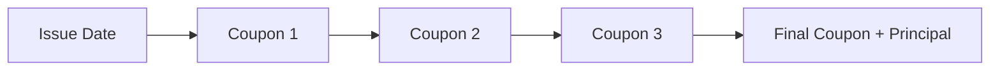

## Introduction

I still remember my first finance class where the professor drew a bond’s timeline on the board and kept emphasizing, “Value each coupon on its own, folks—then add them all up. That’s the heart of valuation.” It sounded almost too simple to be the key to so many seemingly complicated computations. But, as it turns out, it really is that simple: you can always compute the present value of future cash flows separately, so long as you discount them properly to the same point in time. This idea, known as the Cash Flow Additivity Principle, is fundamental across all valuation scenarios—bonds, stocks, derivatives, you name it.

And then there’s the notion that you can’t get a free lunch in a well-functioning market, or as we say in finance, “No Arbitrage.” You’d be amazed how many sophisticated pricing formulas—from forward contracts to complex options—are rooted in just that principle. If an asset’s price ever deviates from its “fair value,” folks will swoop in to exploit that price discrepancy. In doing so, they force the price back in line. Some might call it magic, but it’s just good old-fashioned supply and demand ensuring consistent market prices.

Below, we’ll dig into these two essential concepts. We’ll talk about how to apply them in practice, how to connect them to the rest of the financial universe, and even how you might see them in exam or job-related scenarios.

## The Cash Flow Additivity Principle

The Cash Flow Additivity Principle states, in a nutshell, that each cash flow is valued independently and then summed at a common point in time—usually the present. Let’s put it more formally:

If you have a series of future cash flows CF₁, CF₂, CF₃, …, CFₜ, then the present value (PV) of the entire stream is:


V_0 = \sum_{t=1}^{T} \frac{CF_t}{(1 + r)^t}


where r is the appropriate discount rate (which might be the risk-free rate plus some risk premium).

This principle underpins how we value bonds, stocks paying discrete dividends, and any instrument with multiple future payments. It’s an intuitive idea. If at time 3 you expect a $100 payment, and at time 4 you expect $150, you treat each flow individually, discount each to the present, and then add them together. In well-functioning markets, a dollar received at time 3 has a specific present value (let’s call it PV₃), and a dollar received at time 4 has a specific present value (PV₄). Summing those present values is how we obtain the total worth of receiving $1 at time 3 plus $1 at time 4. 

Does that sound obvious? Maybe—but it’s also unbelievably powerful. Let’s see why.

### Real-World Application: Bond Pricing

No discussion of additivity would be complete without talking about bonds. A plain vanilla bond typically makes periodic coupon payments at fixed intervals plus a final principal (face value) repayment at maturity. According to the Cash Flow Additivity Principle:

• The price (or value) of the bond is the sum of the present values of each coupon payment.  
• At maturity, the bond repays the face value, and that likewise is discounted back to the present.

In a timeline view, you might see something like this:



Each coupon payment is valued as:


\text{PV}(\text{Coupon}_t) = \frac{\text{Coupon Amount}}{(1 + r)^t},


and the principal at maturity is:


\text{PV}(\text{Principal}) = \frac{\text{Face Value}}{(1 + r)^T}.


Add these components up, and you have the bond’s current fair price. If bond traders somehow misprice one of these future flows (say, a coupon), you can bet the market will find a way to exploit that error. But hang tight—this is precisely where the no-arbitrage condition comes in.

### Real-World Application: Equity Valuation

The same logic applies to equity valuations when we can pin down discrete expected future dividends. Let’s say a stock pays expected dividends of \$2 in one year and \$3 in two years, and you have an expectation that you’ll be able to sell the stock for \$50 at the end of the second year. If your discount rate is, for example, 8%, then you value each expected cash flow separately:


V_0 = \frac{2}{1.08^1} + \frac{3}{1.08^2} + \frac{50}{1.08^2}.


This breakdown is precisely the Cash Flow Additivity Principle at work. In practice, you might add a risk premium to capture the stock’s risk relative to the market, but the logic remains the same. Each future payment is discounted back to today, then summed.

## The No-Arbitrage Condition

Ever had a friend who bragged about finding a “guaranteed profit” in the market with zero downside? If they’re for real, that’s an arbitrage—an opportunity to make money without taking any risk or using any net investment. In well-functioning markets, such opportunities aren’t supposed to last very long.

### Key Idea

The No-Arbitrage Condition simply states that you shouldn’t be able to generate an immediate risk-free profit without making any net investment. If you could, everyone would jump in, forcing prices to adjust until the profit disappears.

### The Law of One Price

One direct consequence of the No-Arbitrage Condition is the Law of One Price. It states that if two assets have identical payoffs in every possible future scenario (i.e., they are perfect substitutes), they must trade at the same price. If not, you could buy the cheaper one and simultaneously sell (short) the more expensive one, locking in a riskless spread.

Below is a simple example: Suppose there are two bonds, both with the same coupon structure, credit risk, and maturity. If one trades for \$980 and the other trades for \$990, you could buy the one at \$980 and short the one at \$990. Collect the \$10 difference now, and because they have the same future cash flows, you’ll pay out exactly the same coupons and reclaims in the short position as you receive in the long position. By the time we reach maturity, net payoff is zero. But you made \$10 right now, with zero net outlay. That’s an arbitrage. Traders will immediately exploit this, and the two bonds’ prices will converge.

## The Concept of Replication

Replication is almost like capturing the best of both worlds: the additivity principle combined with no-arbitrage. You try to replicate (or construct) the same payoff as a target asset by using a combination of simpler or more fundamental assets.

• If you discover a cheaper way to replicate the same payoff, you can buy the replicating portfolio and short the “original” asset.  
• If the original asset happens to be cheaper than your replication, you do the opposite.  

Either way, you exploit a price discrepancy until it closes. This process gives rise to risk-neutral pricing, because once you can replicate all payoffs, you can discount them at a risk-free rate under certain assumptions (like continuous rebalancing and frictionless markets).

### Putting It All Together: Risk-Neutral Valuation

Risk-neutral valuation is a direct descendant of the no-arbitrage principle. If you can replicate an asset’s future payoffs by combining the risk-free asset (like T-bills) and the underlying or other traded instruments, it follows that the replicated payoff’s current price must be equal to the cost of setting up that replication. Otherwise, there’s an arbitrage.

In formal terms, let’s say we want to value an asset with a future payoff \\(\Pi\\). If you can create a portfolio from risk-free bonds and another underlying asset to achieve exactly \\(\Pi\\), you discount the expected payoff under a risk-neutral measure:


\Pi_0 = e^{-rT} \, \mathbb{E}^{\mathbb{Q}}[\Pi_T],


where:  
• \\(\mathbb{E}^{\mathbb{Q}}[\cdot]\\) is the expectation under the risk-neutral (or pricing) measure Q (a special probability measure constructed so that all assets grow at the risk-free rate).  
• \\(r\\) is the risk-free rate.  
• \\(T\\) is the time horizon for the payoff.

In practice, yes, “risk-neutral” might sound a little weird. But it’s just a fancy way of saying we’re leveraging the no-arbitrage condition to price assets. We eliminate risk preferences by assuming that everything grows at the risk-free rate in our “neutral” world. Whether you’re analyzing forward contracts, interest-rate swaps, or equity options, these ideas underlie most standard pricing models.

## A Quick Python Example: Bond Valuation with Additivity

Let’s illustrate how the Cash Flow Additivity Principle can be coded succinctly. Suppose you have a bond with semiannual coupons, a 5% annual coupon rate, a face value of \$1,000, and 3 years to maturity. Let’s say the required yield to maturity (YTM) is 6% per year, compounded semiannually (that is 3% per six-month period).

Below is a quick Python snippet to calculate price by summing the present values of the coupon payments and the face value at maturity:

```python
import math

def bond_price(face_value, annual_coupon_rate, ytm, periods, compounding_per_year=2):
    coupon_payment = face_value * annual_coupon_rate / compounding_per_year
    period_rate = ytm / compounding_per_year
    price = 0.0
    
    for t in range(1, periods + 1):
        price += coupon_payment / ((1 + period_rate)**t)
    
    # Add the face value redemption
    price += face_value / ((1 + period_rate)**periods)
    return price

face_value = 1000
annual_coupon_rate = 0.05
ytm = 0.06
periods = 3 * 2  # 3 years * 2 periods per year
calculated_price = bond_price(face_value, annual_coupon_rate, ytm, periods)
print("Bond Price:", round(calculated_price, 2))
```

This code follows the principle exactly: discount each coupon to the present, then discount the face value, then add them up. If, by chance, the bond’s market price differs from this calculated price for no plausible reason, some savvy trader will sniff out an arbitrage.

## Common Pitfalls and Challenges

• Double-Counting Cash Flows: Sometimes, in more complicated instruments (like convertible bonds or mortgage-backed securities), you need to be sure not to “accidentally” count the same cash flow more than once.  
• Incorrect Discount Rates: Each cash flow must be discounted at a rate that reflects its specific risk and timing. Some advanced valuations might use different spot rates for each future payment.  
• Market Frictions: Real-world markets have costs like transaction fees, taxes, and liquidity constraints. These frictions can weaken the pure no-arbitrage argument. In actual practice, the gap for an apparent arbitrage can vanish once you factor in these frictions.  
• Correlated Payoffs and Model Risk: When you try to replicate a payoff using underlying assets, you often assume you can dynamically rebalance without friction. Any mismatch in correlation or rebalancing costs can be a spoiler.  
• Behavioral Factors: Sometimes, noise traders or large institutional mandates create temporary mispricings. But these instances tend to be fleeting or overshadowed once bigger players see a way to lock in profit.

## Conclusion

All told, the Cash Flow Additivity Principle and the No-Arbitrage Condition are like two sides of the same valuation coin. One helps you see how future payments add up in present-value terms, and the other reminds you that if a value is “off,” you can do a bit of financial engineering to patch together a strategy that exploits that mispricing. Neither concept is particularly complicated on its face, but both are incredibly powerful. In fact, advanced derivatives pricing is just an extension of these two fundamental ideas, combined with some fancy math.

In your exams, especially if you pursue the more advanced levels of CFA Program, you’ll see these two ideas returning again and again. My advice: internalize them early. Because once you get these, a lot of the rest of finance snaps into focus.

## Final Exam Tips and Best Practices

• Practice Thoroughly: When you’re calculating present values under different discount rates (spot rates, forward rates, etc.), keep track of the timeline for each cash flow.  
• Show Clear Work: Many exam questions will want to see each step—especially for partial credit.  
• Memorize Core Formulas: Master the basic discounting formula. Also be ready to use the Law of One Price to deduce fair values for derivatives and forward prices.  
• Nothing’s Free: Always keep in mind that no-arbitrage means there’s no easy money. If a problem hints at a “free lunch,” it’s probably testing whether you can identify a flawed assumption or incomplete cost.  
• Manage Your Time: It’s easy to get bogged down in the details of a bond valuation with 10 coupon payments and a final redemption. Remain methodical: list out each flow and discount properly for clarity and speed.  

Below, you can test your understanding with some exam-style questions. Aim to interpret each question carefully, focusing on how you’d apply the additivity principle and no-arbitrage logic.

---

## Test Your Knowledge: Cash Flow Additivity & No-Arbitrage Quiz



### Which of the following best describes the Cash Flow Additivity Principle?

- [ ] It states that each cash flow must be valued at different points in time.
- [x] It states that each cash flow can be discounted to a common point in time and summed.
- [ ] It states that the sum of all discounted cash flows is always greater than zero.
- [ ] It states that the present value of a bond must always be its face value.

> **Explanation:** Cash Flow Additivity means valuing each cash flow at the same point in time (usually the present) and then summing them to get the total value.

### A 10-year bond pays annual coupons and returns the face value at maturity. According to the Cash Flow Additivity Principle, the bond’s fair market value is:

- [x] The sum of the discounted coupon payments plus the discounted face value.
- [ ] The current yield times the face value.
- [ ] The coupon rate divided by the yield to maturity.
- [ ] The coupon payment multiplied by the number of periods.

> **Explanation:** We discount each coupon payment and the face value, then sum them. That’s the direct application of the additivity principle.

### The No-Arbitrage Condition implies:

- [x] There can be no risk-free profits with zero net investment in an efficient market.
- [ ] Investors can always generate profits by short-selling overvalued securities.
- [ ] All assets must generate the same return over time.
- [ ] Bonds and stocks must never trade at the same price.

> **Explanation:** The essence of no-arbitrage is that one cannot make a guaranteed, riskless profit with no initial investment in well-functioning markets.

### Under the Law of One Price:

- [ ] Two securities with identical payoffs can trade at different prices without consequence.
- [x] Two securities with identical payoffs must trade at the same price in the absence of market frictions.
- [ ] The price of a security is always higher in forward markets than in spot markets.
- [ ] The yield to maturity of all bonds must be the same.

> **Explanation:** The Law of One Price asserts that identical payoffs in all future scenarios must have the same price, or else an arbitrage opportunity arises.

### In equity valuation using additivity, which of the following is NOT correct?

- [ ] Each expected dividend is independently discounted to the present.
- [x] An infinite dividend stream can be valued by arbitrarily summing numerators without discounting.
- [ ] The selling price at a future date can be treated as a final cash flow.
- [x] The discount rate generally includes a risk premium over the risk-free rate.

> **Explanation:** You cannot merely sum future values; they must be discounted. Also, the discount rate typically includes a risk premium (so that’s a correct statement). The incorrect statement is the idea that you can “arbitrarily sum numerators” without discounting.

### If a synthetic portfolio replicates the payoff of an option but trades at a lower cost, what should an investor do?

- [x] Buy the replicating portfolio and short the option.
- [ ] Buy the option and short the replicating portfolio.
- [ ] Do nothing until maturity.
- [ ] Buy both the replicating portfolio and the option.

> **Explanation:** If the replicating portfolio is cheaper but delivers the same payoff, buy it (the cheaper alternative) and short the higher-priced one to capture arbitrage profit.

### A forward contract on a commodity is mispriced relative to the spot commodity plus storage costs. According to no-arbitrage:

- [x] Traders can buy (or sell) the commodity today, store it, and short (or long) the forward to lock in a profit.
- [ ] The forward price must be higher than the expected commodity price in all cases.
- [x] The forward price can never be zero.
- [ ] The forward contract is always more expensive than the spot asset.

> **Explanation:** If the forward price is out of line with the spot plus cost-of-carry, investors buy or sell the spot commodity and enter into opposing forward positions to pocket a riskless profit until prices realign.

### Which of the following best reflects the concept of replication?

- [x] Constructing a portfolio of underlying assets whose combined payoffs match another asset’s payoff.
- [ ] Restricting one’s investments only to government bonds.
- [ ] Purchasing futures solely for speculation.
- [ ] Holding two different stocks with correlated returns.

> **Explanation:** Replication is the technique of combining positions to match an asset’s payoff precisely.

### If two assets generate the exact same future cash flows in every state of the world but trade at different prices, what is this situation called?

- [x] An arbitrage opportunity.
- [ ] Market equilibrium.
- [ ] A fair-market premium.
- [ ] A leveraged portfolio.

> **Explanation:** Identical payoffs with different prices represent a clear arbitrage per the no-arbitrage principle.

### The principle of Cash Flow Additivity states that the value of multiple distinct cash flows:

- [x] Must be calculated individually and then summed.
- [ ] Must be determined collectively at the same discount rate.
- [ ] Is irrelevant in stock valuation.
- [ ] Is a concept only used in derivatives pricing.

> **Explanation:** The Cash Flow Additivity Principle is about separating each cash flow, discounting it appropriately, and then adding them together to determine total value.



---

### References, Suggested Readings, and Resources

- Chance, D. M., & Brooks, R. (2015). “An Introduction to Derivatives and Risk Management.” Cengage.  
- CFA Institute Level I Curriculum, “Derivative Investments: Basics of Derivative Pricing and Valuation.”  
- Hull, J. (2017). “Options, Futures and Other Derivatives.” 10th Edition. Pearson.  

These works offer deeper insights into cash flow valuation, arbitrage strategies, and how derivatives are priced in a risk-neutral framework. Feel free to explore them if you want more practice and theory.
