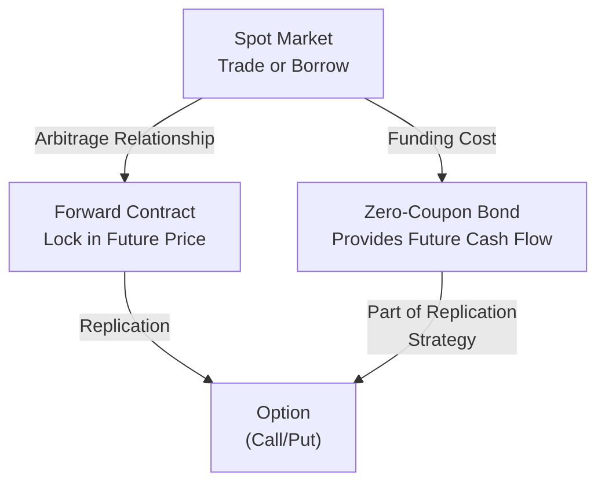

## Introduction

So, let’s talk about something that sometimes feels like magic in finance: forward rates. It’s easy to think, “What does the future interest rate have to do with my everyday life?” But from a capital markets perspective, these rates help us lock in borrowing or lending conditions now even though the actual loan or deposit might occur in the future. It’s like reserving a dinner table at that fancy restaurant—if the table is guaranteed for next month’s date night, you feel secure (though hopefully you won’t be paying interest on that).

In this section, we’ll explore three core ideas: forward rates, forward exchange rates, and how these concepts inform option values as part of a broader no-arbitrage framework. We’ll also take a look at some practical market examples, show how these instruments fit into an investor’s toolbox, and highlight where they can go astray if misunderstood.

## Understanding Forward Rates

### Definition and Intuition
A forward rate is the interest rate agreed upon today for a loan (or deposit) taking place in the future. If you see something like F(1,2) in a textbook or research report, it often means the annualized rate locked in today for borrowing or lending between time 1 and time 2 (both measured in years, for instance).

When I first encountered forward rates, I remember thinking, “Wait, how can I know the interest rate next year unless I have a crystal ball?” Well, you don’t necessarily “know” it, but the market uses supply, demand, and the principle of no-arbitrage to figure out what the cost of money should be between those future dates. If forward rates were misaligned, someone could generate riskless profit by borrowing at one rate and lending at another, which would quickly push markets back into equilibrium.

### The No-Arbitrage Essence
Forward rates emerge naturally from the idea that you shouldn’t be able to make—at least in theory—a guaranteed profit with zero risk. For instance, consider you have two ways to earn interest:

• Buy a zero-coupon bond that matures at time 3.  
• Buy a zero-coupon bond that matures at time 1, then invest that proceeds again from time 1 to time 3 at whatever forward rate is available.

Under no-arbitrage conditions, these two overall strategies must yield the same result; otherwise, investors would pounce on the mispricing. That mechanical balancing is effectively what sets forward rates in the market.

### Spot Rates vs. Forward Rates
Spot rates (think of them as the yield on a zero-coupon bond from now until a certain date in the future) are the building blocks of forward rates. By linking spot rates through no-arbitrage, we can solve for the forward rates. Conversely, once you know all the relevant forward rates, you can back into the spot rate for any given maturity.

Mathematically, if r(0,T) is the spot rate from time 0 to T, and r(0,t) is the spot rate from time 0 to t, we often find a forward rate F(t,T) via:


(1 + r(0,T))^T = (1 + r(0,t))^t \times (1 + F(t,T))^{(T - t)}.


This equation ties the spot rate for the entire horizon [0, T] to the combination of the shorter spot rate [0, t] and the forward rate [t, T]. If you rearrange it, you can solve for F(t,T).

### Practical Example
Let’s suppose we have:
• A 1-year zero-coupon bond trading at a yield (spot) of 5% per year.  
• A 2-year zero-coupon bond trading at a yield (spot) of 6% per year.

If you buy the 2-year bond, your annualized return is 6% over two years. Alternatively, if you buy the 1-year bond at 5% and then want to invest for the second year, the forward rate must be structured so there’s no free “extra” yield from one approach versus the other. Roughly, the forward rate F(1,2) might turn out to be slightly above 7%, making the final two-year returns from both paths match exactly.

## Forward Exchange Rates

### Spot-FX to Forward-FX
Similar logic applies in the world of currencies. If you have a spot exchange rate S (say, USD/EUR), you can combine it with interest rates in each currency (i_domestic and i_foreign) to figure out a fair forward exchange rate. Otherwise, savvy traders could borrow in the lower-rate currency, exchange to the higher-rate currency, invest, and then exchange back again, racking up an easy profit. The markets don’t like free lunches for too long, so interest rate differentials drive the forward exchange rate.

The covered interest rate parity (CIP) formula is typically expressed as:


F = S \times \frac{1 + i_{\mathrm{domestic}}}{1 + i_{\mathrm{foreign}}}.


Where:  
• F is the forward exchange rate (in domestic currency per unit of foreign currency).  
• S is the current spot exchange rate (also in domestic currency per unit of foreign currency).  
• i_domestic is the domestic risk-free interest rate for the relevant maturity.  
• i_foreign is the foreign risk-free interest rate for the same maturity.

### Covered Interest Rate Parity in Action
If the forward rate was too low relative to this formula, an investor could do the following:  
1. Borrow the domestic currency at i_domestic.  
2. Convert the proceeds to the foreign currency at the spot rate S.  
3. Invest at i_foreign.  
4. Simultaneously sell the foreign currency investment forward at the incorrectly low forward rate F.  
5. Repay the domestic loan at maturity and pocket the difference.

With real-world transaction costs, capital controls, and credit constraints, it might not be so simple to execute. But theoretically, that’s how covered interest parity ensures no free money. If it gets out of line, big-time traders will exploit the opportunity until the parity realigns.

### Small Example
Let’s say:  
• Spot rate (USD/EUR) = 1.10  
• US interest rate (i_domestic) = 4% annually  
• Euro interest rate (i_foreign) = 2% annually  

Then the forward price F for a one-year USD/EUR forward would be about:


F \approx 1.10 \times \frac{1 + 0.04}{1 + 0.02} = 1.10 \times \frac{1.04}{1.02} \approx 1.10 \times 1.0196 = 1.1216.


That means one euro should cost around $1.1216 in one year’s time if the market is in equilibrium.

## Option Values and Forward Rates

### Building Up an Option Price
Now, you might be wondering, “How do forward rates help us price an option?” Well, if you know the forward price for an asset, it’s easier to see how you might replicate a call or a put with a portfolio that includes a forward contract plus some zero-coupon bonds. (If you recall from earlier chapters, a zero-coupon bond can be a handy way to lock in or pay out future cash flows.)

For a European call option on some underlying with maturity T, the no-arbitrage price can be related to the forward:

• If the forward price F(0,T) is significantly higher than the strike K, the call might have a valuable payoff.  
• If F(0,T) is well below K, maybe the call has less immediate value.  

We combine these relationships with risk-neutral valuation—another concept we’ve touched on in probability measures (see Section 4.5 for more background)—to get a fair theoretical price.

### Replication Strategy
An option payoff can be replicated by setting up positions in:  
• The underlying asset (or a forward contract on it).  
• Risk-free bonds.  
• Possibly additional derivatives if we want partial coverage.

Because you can replicate the option payoff, the cost to build that replicating portfolio must match the market price of the option (again, no-arbitrage in action). If it’s mispriced, arbitrageurs would build or tear down the replicating portfolio to pocket the difference until the mispricing disappears.

### Volatility & Time Value
Though forward rates and covered interest parity help bound the possible option value, you also need volatility to get the full picture. If an underlying asset is more volatile, an option’s time value can be greater because there’s more chance that big price moves will push the option into deeper in-the-money territory. That’s why advanced option pricing models, like Black–Scholes–Merton or binomial lattices, incorporate both interest rates (or forward prices) and volatility measures.

## Relationship with No-Arbitrage

Here’s the main thread: no-arbitrage unifies everything. If forward prices (whether interest rates, exchange rates, or forward prices for equities) looked suspiciously cheap or expensive, an investor could do a spot trade (buy or sell the underlying), offset that with a forward contract in the opposite direction, and lock in a sure profit. Markets generally fix these mismatches fast.

For currency forwards, as we saw, covered interest rate parity ensures we can’t just borrow in a cheap currency, lend in a more expensive currency, and convert back at a forward exchange rate that’s out of line.

For options, the forward-based replication strategy ensures that the option’s fair value can’t deviate too much from what you’d pay to lock in a forward price plus an insurance kicker. If it did, you’d exploit that difference by building or dismantling the synthetic option.

## Key Glossary

• Forward Rate Agreement (FRA): An over-the-counter contract allowing you to borrow or lend a notional principal at a specified future date with a pre-agreed interest rate. FRAs are typically used to hedge or speculate on future short-term interest rates.

• Forward Price (F): The agreed-upon price in a forward contract for future delivery of an asset (e.g., a stock, commodity, or bond).

• Forward Exchange Rate: The currency exchange rate agreed upon today for a settlement at a specified future date. This is directly influenced by interest rate differentials.

• Covered Interest Rate Parity (CIP): A relationship that ties spot FX rates, forward FX rates, and the respective interest rates for two currencies so that there is no arbitrage opportunity by borrowing in one currency and lending in another.

• Option Replication: The process of constructing an option-like payoff by combining simpler building blocks such as bonds, forwards, or the underlying.

## Visualizing the Connections

Let’s illustrate the interplay of spot markets, forward markets, and no-arbitrage. The following Mermaid diagram provides a simplified view:

In this diagram:  
• The spot market, the forward contract, and the zero-coupon bond all connect through no-arbitrage.  
• The option can be replicated by combining forward contracts with bonds (or with the underlying).  

## Practical Insights and Potential Pitfalls

• Interest Rate Differentials: It’s crucial to note that forward rates (especially forward exchange rates) are heavily driven by interest rate differentials. If you get the interest rate forecasts wrong, your forward pricing assumptions might be way off.  
• Transaction Costs: Real markets have bid–ask spreads, commissions, and credit constraints, which can reduce or even eliminate potential arbitrage gains.  
• Credit and Liquidity Risks: When setting up these contracts, especially in over-the-counter markets, the creditworthiness of your counterparty matters.  
• Model Risk: Pricing models like Black–Scholes–Merton rely on assumptions about constant volatility and risk-free rates. Deviations from these assumptions can lead to mispricings that might not vanish immediately in real markets.  
• Volatile Markets: Sudden spikes in volatility or interest rates can cause forward exchange rates to shift abruptly, catching unhedged positions off-guard.  

## Exam Tips and Best Practices

• Show Your Steps: In a typical CFA exam question about forward rates, they might give you a spot rate, a forward rate, and ask you to calculate the implied yield or vice versa. Lay out your no-arbitrage formula explicitly. Don’t just guess.  
• Use Common Sense Checks: If i_domestic > i_foreign, a forward in direct terms (domestic/foreign) is typically above the spot. Check if your final answer aligns with intuition.  
• Watch the Annualization: Sometimes, rates are quoted semiannually or quarterly. Make sure your compounding is consistent, or you risk losing easy points.  
• Incorporate Volatility for Option Pricing: Remember that if a question moves from forward rates to the pricing of calls or puts, you also need volatility to figure out option premiums.  
• Double-Check Time Conventions: If the exam or a practice question has time periods of 90 days, 180 days, or 1 year, ensure you’re applying fractional exponents and partial interest rates correctly.  

## References for Further Study

• Hull, J. (2017). “Options, Futures, and Other Derivatives.” 10th Edition. Pearson.  
• CFA Institute Level I Curriculum, “Quantitative Methods: Time Value of Money,” “Derivatives: Basics of Derivative Pricing and Valuation.”  
• Shreve, S. (2004). “Stochastic Calculus for Finance II: Continuous-Time Models.” Springer.  

---

## Sample Exam Questions on Forward Rates, Forward Exchange Rates, and Option Values



### A bank sells a 1-year forward contract on a zero-coupon bond maturing in 3 years. Which principle ensures that the forward price must be consistent with existing spot yields?

- [ ] Market efficiency
- [x] No-arbitrage
- [ ] Duration targeting
- [ ] Convexity

> **Explanation:** No-arbitrage ensures that if the forward price deviates too far from what’s implied by the spot yield, investors can make riskless profits by buying or selling the underlying bond and entering into an offsetting forward contract.

### Given spot rates r(0,1) = 3% and r(0,2) = 4%, which forward rate F(1,2) best fits a no-arbitrage framework if annual compounding is assumed?

- [ ] 5.5%
- [ ] 4%
- [x] 5%
- [ ] 2%

> **Explanation:** Using (1 + 0.04)^2 = (1 + 0.03) × (1 + F(1,2)), we get (1.04)^2 = 1.03 × (1 + F(1,2)) → 1.0816 = 1.03 × (1 + F(1,2)) → 1 + F(1,2) = 1.0816 / 1.03 ≈ 1.05 → F(1,2) = 5%.

### An investor observes a forward exchange rate that does not conform to covered interest parity (CIP). What is the primary reason this scenario typically does not persist in liquid markets?

- [x] Arbitrageurs will exploit the discrepancy
- [ ] Monetary authorities set forward rates
- [ ] Central banks do not allow forward FX trades
- [ ] Forward markets are illiquid

> **Explanation:** If CIP is violated, investors can quickly spot a riskless profit, which they’ll exploit. This trading pushes the forward rate back in line.

### Which of the following best describes how forward contracts on currencies are typically priced?

- [ ] Based on discretionary government mandates
- [ ] Based on projections of inflation alone
- [x] By using the spot rate adjusted for interest rate differentials
- [ ] By referencing the global commodity index

> **Explanation:** The CIP formula states that forward = spot × [(1 + i_domestic)/(1 + i_foreign)], which links interest rate differentials to forward FX pricing.

### If the forward price of a commodity is unexpectedly higher than what the no-arbitrage relationship would predict, a trader could:

- [x] Buy the commodity in the spot market and simultaneously sell the forward
- [ ] Do nothing because the market will correct itself without any action
- [x] Borrow at the risk-free rate to finance the purchase if needed
- [ ] Only hedge using an option

> **Explanation:** By buying low in the spot market and selling high in the forward, the trader locks in a profit. If the trader does not have the cash, they can borrow at the risk-free rate. This forces the forward and spot prices into alignment.

### In option pricing, a major reason to reference forward rates rather than just spot prices is:

- [x] Forward rates reflect the cost of carry, making replication strategies simpler
- [ ] They eliminate the need to account for volatility
- [ ] They completely remove time value
- [ ] They are mandated by regulators

> **Explanation:** Forward rates incorporate the financing costs and yield of the underlying asset, simplifying the replication of certain option payouts like calls and puts in a no-arbitrage framework.

### A European call option on a stock can be replicated by:

- [x] Buying a forward contract on the stock and investing in a zero-coupon bond
- [ ] Buying a put option and selling a forward
- [x] Buying the stock and borrowing at the risk-free rate
- [ ] Selling the stock short and investing in a zero-coupon bond

> **Explanation:** You can replicate a call in more than one way, but the gist is that using a forward contract plus a bond, or using the underlying stock plus borrowing, can reproduce a call’s payoff under certain conditions.

### Covered interest rate parity states that:

- [x] The forward exchange rate is determined so there is no arbitrage possibility between currencies
- [ ] The future spot rate must equal the forward rate
- [ ] Central banks dictate interest rates to fix forward prices
- [ ] The interest rate of one currency is always higher

> **Explanation:** CIP ensures that differences in interest rates between two currencies are offset by the forward exchange rate, preventing riskless profit from borrowing in one currency and lending in another.

### Which of the following instruments is used specifically to hedge or lock in a borrowing/lending rate for a future period?

- [x] Forward Rate Agreement (FRA)
- [ ] Currency Swap
- [ ] Equity Option
- [ ] Repo Agreement

> **Explanation:** An FRA is an over-the-counter contract that allows one to fix an interest rate for a future date on an agreed notional amount.

### Under covered interest rate parity, if the foreign interest rate is higher than the domestic interest rate, the forward domestic/foreign exchange rate will:

- [x] Show that the foreign currency trades at a forward discount
- [ ] Show the foreign currency at a forward premium
- [ ] Equal the spot rate
- [ ] Be completely unrelated to interest rates

> **Explanation:** When the foreign currency has a higher interest rate, it typically trades at a forward discount versus the domestic currency.  


