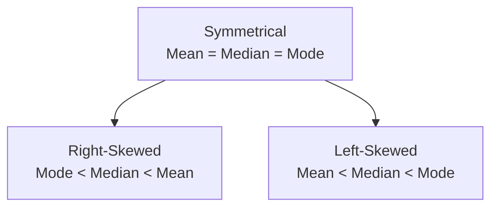

## Overview

So, you’re knee-deep in financial data—maybe it’s a list of stock returns, bond yields, or even coffee prices if you’re into commodities—and you want to figure out where that data kind of “centers.” That’s where measures of central tendency come into play. Essentially, these measures help us answer the ol’ question: “What’s the typical value?” 

In financial analysis, especially in portfolio management or risk modeling, it’s essential to know the average behavior of returns, because it sets a benchmark for understanding random fluctuations (variance), risk (standard deviation), and how your portfolio is performing relative to expectations. But no single measure is perfect for all scenarios. Each measure—mean, median, and mode—carries unique interpretations and pitfalls.

Below, we’ll explore the arithmetic mean, the median, and the mode in the context of investment analysis. We’ll highlight which measure is most appropriate under different circumstances (e.g., when outliers are present) and illustrate big-picture applications to your everyday finance tasks.

## The Arithmetic Mean

### Definition and Formula
The most common way to measure central tendency is the arithmetic mean (often simply referred to as “the mean” or “the average”). If you have n observations, X₁, X₂, …, Xₙ, then the arithmetic mean, μ, is calculated as:


\mu = \frac{X_1 + X_2 + \dots + X_n}{n}


In finance, if you observe monthly returns on a stock over the past year, the arithmetic mean would be the sum of all monthly returns divided by 12. 

### Why Do We Use It?
1. It’s conceptually straightforward. Sum the values, divide by the number of observations, and you’re done.  
2. It’s useful for predicting future returns if you believe each data point is equally likely to occur again and the distribution of returns is roughly symmetrical.  
3. It ties nicely into a number of fundamental statistical formulas, such as the variance and standard deviation.

### Vulnerability to Outliers
The arithmetic mean can get hijacked by extreme outliers (huge returns or catastrophic losses, for instance). If a single data point is drastically large or small, it can throw off the mean in ways that don’t reflect the “typical” performance of an asset.  

Here’s a quick example: Suppose your friend invests in five different stocks with annual returns: 5%, 7%, 5%, 6%, and 80%. The arithmetic mean is:
(5 + 7 + 5 + 6 + 80) ÷ 5 = 20.6%

But 80% is an outlier that heavily inflates the average. If you’re trying to get a sense of a “normal” return, 20.6% might be misleading. 

### Practical Example: Annual Returns
Let’s say you analyze the returns on a mutual fund over five years: 10%, –5%, 8%, 3%, and 4%. The arithmetic mean is:


\frac{10 + (-5) + 8 + 3 + 4}{5} = 4\%


In forecasting or as a first step in performance analysis, 4% is a decent summary. But you do need to check if one big outlier or negative return is biasing the average.

## The Median

### Definition and Formula
The median is the middle value when all data points are sorted in ascending or descending order. If you have an odd number of observations, the median is the (n+1)/2-th value. If you have an even number of observations, you typically average the two middle values.

For instance, in a sorted dataset [2, 5, 5, 7, 10, 12], there are six observations. The middle two (third and fourth observations) are 5 and 7, so the median is (5 + 7) / 2 = 6. When we have an odd number of observations, say [2, 5, 7, 10, 12], the median is the third observation in this list (that’s 7).

### Why Do We Use It?
1. It’s robust (resilient) to outliers. If you have extreme data—like those 80% returns from earlier—the median won’t get distorted as much as the mean.  
2. It’s a better “typical” measure for skewed distributions (or small sample sizes) where a few unusual values could disproportionately affect the arithmetic mean.

### Example: Skewed Data
Imagine that a particular hedge fund saw annual returns of –30%, –25%, 5%, 10%, and 12% over five years. Sorted, these returns are –30%, –25%, 5%, 10%, 12%. The median is the third value in the ordered list, 5%. The arithmetic mean would be:


\frac{(-30) + (-25) + 5 + 10 + 12}{5} = –5.6\%


The mean is influenced quite a bit by those two large negative returns, so if you’re looking for a “typical” figure, the median (5%) might be more representative.

## The Mode

### Definition and Usage
The mode is the most frequently occurring value(s) in a data set. If you have a dataset: [2, 4, 4, 4, 5, 5, 7], the mode is 4 because it appears more often than any other number. 

In investment analysis, the mode is generally less critical than the mean or median for returns, since returns are often continuous variables that don’t repeat exact values often. But it’s definitely used when dealing with discrete categories. For instance:
• The most common credit rating among a panel of bonds.  
• The most common stock price range that an asset trades in if prices are binned.  
• The most frequent horizon at which investors choose to rebalance (e.g., monthly, quarterly, or annually).

### Multiple Modes
An important twist: a dataset can have more than one mode. If you have [4, 4, 5, 5, 7], then 4 and 5 both appear twice, making them “co-modes.” This is not uncommon when you group returns by discrete intervals or categories.

## Comparing Mean, Median, and Mode

In a perfectly symmetrical distribution—often assumed in classical finance if underlying returns follow a normal distribution—the mean, median, and mode coincide exactly. That’s a nice theoretical scenario, but real-world data can be messy or skewed.

• If the data are right-skewed (a longer tail to the right, as might happen with certain equity returns), the mean is typically higher than the median, and the mode is typically the lowest of the three.  
• If the data are left-skewed (a longer tail to the left, which sometimes happens with bond or money market returns), the mean is generally lower than the median, and the mode is typically the highest of the three.

Here’s a quick diagram that summarizes these three relationships in different skew scenarios:

## Choosing the Appropriate Measure

Knowing which measure to use requires assessing:
1. **Outliers and Skewness**: If you suspect or observe large outliers (like in small-cap stocks or exotic options), you might rely more on the median.  
2. **Sample Size**: In tiny datasets, one or two extreme values can really distort the mean.  
3. **Nature of the Data**: If the investment returns are aggregated into bins or categories, mode might be relevant; if data are truly continuous, you’ll more likely lean on the mean or median.  
4. **Investment Horizon**: Geometric mean (which we cover further in the curriculum) might matter more when analyzing long-term compounding in a portfolio context.

In practice, you’re often going to look at both the mean and the median just to see if outliers are pulling your data in weird directions. If they’re far apart, it might be a sign that your distribution is skewed or you have data-quality issues (like a missing or mis-keyed data point).

## Illustrative Case Study

### Example 1: Equity Returns
Let’s say an analyst compiles monthly returns for a small-cap equity fund over a one-year period. The returns (in %) are:
5, 10, 6, 7, 12, –2, 9, 8, 50, 2, –5, 6

1. **Arithmetic Mean**:  
   (5 + 10 + 6 + 7 + 12 + (–2) + 9 + 8 + 50 + 2 + (–5) + 6) ÷ 12 = (108) ÷ 12 = 9%  
2. **Sorted Returns**:  
   –5, –2, 2, 5, 6, 6, 7, 8, 9, 10, 12, 50  
   – The median is the average of the 6th and 7th values: (6 + 7)/2 = 6.5%.  
3. **Mode**:  
   The only repeated value is 6, so mode = 6%.

Notice the mean is 9%, but the median is 6.5%. That big 50% month drives up the mean. So if you’re looking for a typical monthly return for that fund, you might argue 6.5% is more “average” than 9%. Having said that, if you’re just running a straightforward average return over the year, 9% is correct mathematically—they really did get that 50% in one month. It’s crucial to be aware of the difference and how outliers can shape your perspective.

### Example 2: Credit Ratings
Now consider you have a bunch of corporate bonds in your portfolio, each classified by a credit rating: AAA, AA, A, BBB, BB, etc. If you find that “BBB” occurs more often than any other rating, then BBB is the portfolio’s modal rating. This can be handy if you’re describing the “most common” credit quality in your bond holdings. But you wouldn’t typically compute a “mean” or “median” rating in this scenario—those concepts become less relevant when dealing with categorical scales.

## Pitfalls and Best Practices

• **Overlooking Outliers**: Don’t rely solely on the mean if you suspect high outliers or “fat-tailed” distributions, typical in hedge funds or emerging-market equities.  
• **Choosing the Wrong Type of Mean**: For performance over multiple periods, the arithmetic mean can overstate true growth. In that case, you might want the geometric mean.  
• **Relying on a Single Metric**: Combining the mean (or median) with a measure of dispersion (variance or standard deviation) gives a more complete picture.  
• **Small Samples**: With only a handful of data points, the median can be more informative, especially if the distribution looks skewed. 

## Exam Tips and Final Thoughts

When you’re facing a question on the CFA® exam (whether it’s Level I or you’re diving deeper in higher levels), it’s essential to:
- Check for outliers in the data.  
- Note whether the distribution appears skewed or symmetrical.  
- Consider using the median in skewed distributions or small samples.  
- Remember that the arithmetic mean is standard for summarizing data in many financial contexts, but if compounding is at play, remember to check out the geometric mean too.  

During exam scenario-based questions, you might be given a big table of asset returns or yields. Always consider the shape of the data and any possible anomalies. The test could ask you to decide which measure (mean, median, or mode) best represents a typical outcome. Or they might show you that outliers exist and love to see if you recognize that the median can mitigate the effect of these big or small extremes.

Finally, watch out for trick questions presenting multi-modal distributions in non-traditional contexts. And watch your time: if the data set is large, try to quickly order it (if needed) and pick out the middle or repeated values.

## References

• CFA Institute Level I Curriculum, Quantitative Methods: “Statistical Concepts and Market Returns”  
• Luenberger, D.G. (1998). “Investment Science.” Oxford University Press.  
• The Journal of Portfolio Management: Articles on mean vs. median in return analysis.

---

## Test Your Knowledge: Measures of Central Tendency



### 1. Which measure of central tendency is most impacted by outliers?

- [x] Arithmetic mean
- [ ] Median
- [ ] Mode
- [ ] Geometric mean

> **Explanation:** The arithmetic mean is highly sensitive to extreme values. If there are large or small outliers, it can shift the average more than the median or mode.

### 2. In a right-skewed (positively skewed) distribution, which relationship generally holds?

- [ ] Mean < Median < Mode
- [x] Mode < Median < Mean
- [ ] Median = Mean = Mode
- [ ] Mean > Mode > Median

> **Explanation:** In a right-skewed distribution, the tail is to the right, causing the mean to be the largest among the three, with the mode being the smallest.

### 3. If a dataset has an even number of observations, how is the median typically computed?

- [ ] By taking the lower of the two middle values
- [ ] By taking the upper of the two middle values
- [x] By averaging the two middle values
- [ ] By discarding both middle values

> **Explanation:** When the data set has an even number of observations, the median is the average of the two central numbers after sorting.

### 4. Why might an analyst prefer the median return over the arithmetic mean return when looking at hedge fund performance?

- [ ] The median is always higher than the mean.
- [ ] Hedge fund returns never have outliers.
- [x] Hedge fund returns often include significant outliers that might inflate or deflate the mean.
- [ ] The median is easier to calculate.

> **Explanation:** Hedge fund returns can be volatile or skewed. The median is less affected by extreme outliers and may better reflect a typical return.

### 5. Which statement about the mode in financial modeling is most accurate?

- [x] The mode is most useful for discrete or categorical data, such as credit ratings.
- [ ] The mode is always smaller than the mean and median.
- [x] The mode never appears in continuous return data.
- [ ] None of the above

> **Explanation:** Mode is particularly handy when your data is categorical or grouped, e.g., the most common credit rating. In continuous data sets, the probability of exact repeat values is generally lower, though it’s possible with grouped data intervals.

### 6. Consider an equity mutual fund with the following annual returns over five years: 2%, 9%, –12%, 30%, and 1%. Which measure is most affected by the –12% result?

- [x] Arithmetic mean
- [ ] Median
- [ ] Mode
- [ ] Variance

> **Explanation:** The outlier (–12%) will lower the arithmetic mean more significantly. The median would be more robust to this single extreme value.

### 7. Which of the following best describes why the mean, median, and mode coincide in a perfectly symmetrical distribution?

- [x] Symmetry ensures the center of mass, middle value, and most frequent value all line up.
- [ ] A symmetrical distribution has no central tendency.
- [x] Standard deviation is always zero for symmetrical data sets.
- [ ] They only coincide in sample sizes over 30.

> **Explanation:** In a symmetrical distribution, the highest point (mode) is in the center, which is also where half the data lies on each side (median) and where the average (mean) falls.

### 8. Which measure is typically recommended when you have a small sample size with a few extreme returns?

- [x] Median
- [ ] Arithmetic mean
- [ ] Mode
- [ ] Geometric mean

> **Explanation:** With a small sample, just a couple of extreme returns can skew the mean. The median is more robust and can provide a better reflection of the central tendency in such cases.

### 9. What is the standard approach for calculating the median if the dataset has three numbers: 4, 6, and 9?

- [ ] (4 + 6) / 2
- [x] 6
- [ ] (4 + 6 + 9) / 3
- [ ] (6 + 9) / 2

> **Explanation:** For an odd number of observations, the median is the middle one after sorting. Since 4 < 6 < 9, the median is the second value: 6.

### 10. True or False: In finance, the mode is commonly used to summarize historical return distributions because it gives the most typical return in a continuous dataset.

- [ ] True
- [x] False

> **Explanation:** In continuous return datasets, the exact same value appearing multiple times is often rare. Financial analysts typically focus on the mean or median rather than the mode for continuous return series.


