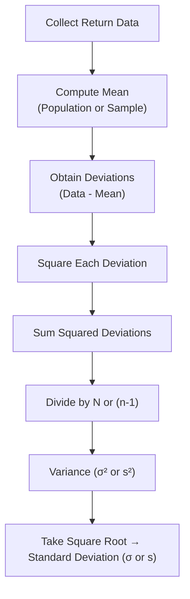

## Introduction and Conceptual Overview
When we talk about how to measure the “scatter” or “spread” of investment returns, we’re talking about measures of dispersion. You know, the more widely your returns vary, the riskier (and sometimes the more exciting) your investment might feel. If you recall from Section 3.1 on Measures of Central Tendency, we covered how to figure out the “center” of the data (e.g., mean or median). Well, that’s only part of the picture. Dispersion picks up where central tendency leaves off—it shows how far a data point might “wander” from that center on average.

In finance, we often equate dispersion with risk. A portfolio whose returns swing dramatically from month to month is typically viewed as riskier than one that plods along with stable results. This link is so ingrained in practice that standard deviation is frequently referred to as a measure of “volatility” and is used as a proxy for total risk. But standard deviation isn’t the only game in town. In this section, we’ll introduce the range, variance, and standard deviation as core tools to gauge how unpredictable your returns might be.

## Range—The Most Basic Measure of Dispersion
If you’re just starting out with the concept of dispersion, the range is the easiest measure to wrap your head around. Simply take the maximum value in your dataset (say, the highest monthly return in a given period) and subtract the minimum value (the lowest monthly return). That difference is your range.

• Formulaically, for a sample of returns R₁, R₂, …, Rₙ:  
  Range = (Max(Rᵢ) − Min(Rᵢ)), for i=1…n.

If you had monthly returns over a year like −5%, 2%, 7%, 10%, and 12%, you’d see the max is 12%, the min is −5%, and the range is 17 percentage points.

### Limitations of the Range
Despite being super intuitive, the range can cause a bit of trouble if you have outliers (extreme values). One very large or very small outlier might drastically increase your range, even if the rest of the data is tightly clustered. In equity markets, for instance, a single severe market crash in your dataset can blow up the range. So while it’s a quick go-to metric, the range by itself often fails to paint a thorough picture of overall dispersion in finance.

## Variance—Capturing the “Average Spread”
If you’re dealing with big data sets in finance, or you’re trying to be more precise about how far results deviate from the mean, variance is your friend. Variance is the average of the squared differences between each data point and the mean. Yes, we square the differences. That’s to ensure negative deviations count the same as positive deviations while also emphasizing larger deviations (since bigger differences get squared into even bigger numbers).

### Population Variance
When you have an entire population of returns—say, you’re analyzing all daily returns of a particular market index over a known, complete timeframe—you can use:

(1)  σ² = ( 1 / N ) ∑(Rᵢ − μ)²  
      
   where:  
   • Rᵢ is the ith return in the population,  
   • μ is the population mean,  
   • N is the total number of observations (the population size).

### Sample Variance
However, in practice we often only have a sample (for instance, you’re using 10 years of monthly equity returns to gauge the entire set of “possible” returns for an asset). In this situation, the sample variance adjusts the denominator to (n − 1) to make the estimate unbiased:

(2)  s² = ( 1 / (n − 1) ) ∑(Rᵢ − ȳ)²  

   where:  
   • Rᵢ is the ith return in the sample,  
   • ȳ is the sample mean,  
   • n is the sample size.

You might be wondering, “Why do we bother with n − 1, anyway?” Well, it ensures that on average, s² accurately represents the true population variance—n − 1 corrects for the fact that we used the sample mean ȳ (which itself is an estimate, not the true mean μ).

### Why Variance Matters in Financial Analysis
• Emphasizes Large Deviations: Squaring the differences from the mean magnifies extreme events (e.g., large losses or gains). That can be either good news or bad news in finance, depending on your perspective. It’s good because large outliers (like a sudden market collapse) get extra attention, but it might also exaggerate the perception of risk if the distribution has lots of big single-day price moves.  
• Foundation of Other Measures: If you’re reading ahead in the curriculum, variance is a building block for many other models (like portfolio variance in Chapter 5 on Portfolio Mathematics, or advanced time-series volatility calculations in Chapter 12).

## Standard Deviation—Varied Returns in the Same Units
Variance is mathematically beautiful, but it’s in squared units—if your returns are in percentages, the variance is in “percentage squared” (which, let’s be honest, isn’t super intuitive). The standard deviation (σ for a population or s for a sample) is just the square root of that variance, bringing you back to the original units.

• Population Standard Deviation:  σ = √σ².  
• Sample Standard Deviation:        s = √s².

It’s that simple. But the importance of standard deviation in finance can’t be overstated. We often label standard deviation of returns as “volatility,” a measure of how widely returns can fluctuate. A standard deviation of 2% monthly returns might be seen as mild or moderate for some equity portfolios, while 8% might be considered extremely volatile—it all depends on the context and the asset class you’re dealing with.

### Linking Standard Deviation to Risk
In many risk management frameworks, the assumption is that returns follow a (approximately) normal distribution, and thus about 68% of returns fall within ±1 standard deviation of the mean, about 95% within ±2 standard deviations, etc. But watch out—real-world returns can be skewed or exhibit fat tails (kurtosis), so standard deviation won’t always capture everything that’s happening with your distribution. Nevertheless, it remains a cornerstone of performance and risk analysis.

## Practical Example: Equity vs. Bond Volatility
Let’s try something a bit more tangible. Suppose:
• An equity fund has annual returns: 10%, −5%, 20%, −2%, and 15%.  
• A bond fund has annual returns: 5%, 3%, 4%, 6%, and 5%.

At first glance, the equity fund’s mean return might look better, but let’s see how their standard deviations differ.

1. Equity Fund  
   - Mean (ȳ): (10% − 5% + 20% − 2% + 15%) / 5 = 7.6%  
   - Deviations from mean: (10% − 7.6%), (−5% − 7.6%), (20% − 7.6%), (−2% − 7.6%), (15% − 7.6%) → 2.4%, −12.6%, 12.4%, −9.6%, 7.4%.  
   - Squared deviations: (0.024², 0.126², 0.124², 0.096², 0.074²).  
   - Sample variance s² (assuming these 5 data points are a sample): Summation of squared deviations / (5−1).  
   - Then standard deviation s is the square root of that variance.

2. Bond Fund  
   - Mean (ȳ): (5% + 3% + 4% + 6% + 5%) / 5 = 4.6%  
   - Deviations: (0.4%, −1.6%, −0.6%, 1.4%, 0.4%).  
   - Squared deviations: (0.004², 0.016², 0.006², 0.014², 0.004²).  
   - Sample variance s²: Summation of squared deviations / (5−1).  
   - Standard deviation s is again the square root.

From a quick glance, the bond fund’s returns are much more clustered around its mean than the equity fund’s returns are around theirs. So, we’ll likely see a lower standard deviation for the bond fund, indicating less volatility.

## Short Mermaid Diagram: The Process Flow of Calculating Variance and Standard Deviation



This flow applies whether you’re dealing with daily returns, monthly returns, or any other frequency. Just remember the difference between using N (for population) vs. (n−1) (for sample).

## Key Relationships in Finance
1. **Risk Interpretation**  
   Investors often talk about risk as “How badly might this thing blow up, and how likely is that to happen?” Standard deviation offers a neat starting point, though it’s not the whole story. If you’re using standard deviation to measure risk in a portfolio, you’ll likely combine it with other tools (e.g., correlation or Value at Risk).  

2. **Comparing Asset Classes**  
   Sometimes, in Chapters 3.4 and 3.5, you’ll see how correlation or covariance matter in combining assets. But the standalone measure of standard deviation (or variance) is often used to see if you’re dealing with high-volatility, high-risk assets (e.g., emerging market equities) versus lower-volatility, presumably lower-risk assets (e.g., certain types of government bonds).

3. **Portfolio Construction & Diversification**  
   By blending assets whose returns don’t move in perfect sync, you reduce overall variance. The math of how that works—using covariances—will be tackled in Chapter 5, but it’s all built on the fundamental notion of measuring variance and standard deviation in each asset class.

## Caveats: Non-Normal Distributions and Extreme Events
If returns were guaranteed to be normally distributed, standard deviation would be a perfect risk measure. Life doesn’t always give us normal distributions, though. You might see:
- Skewness (where negative returns may happen more often than positive ones, or vice versa),  
- Kurtosis (fat tails, meaning higher probabilities of extreme movements).

These phenomena can distort how well standard deviation captures the true “risk.” That’s why you’ll often see disclaimers like “Past performance is not necessarily indicative of future results” or warnings that “returns can exhibit significant deviations from normal assumptions.” In short, standard deviation is essential, but it’s only one of many lenses needed to assess risk thoroughly.

## Best Practices and Common Pitfalls
• **Don’t Overlook Sample Size**: If your sample is too small, your sample variance or standard deviation might not represent the true underlying distribution. And obviously, the smaller your sample, the bigger the potential for error.  
• **Watch Out for Outliers**: Large outliers can dramatically increase variance and standard deviation. Sometimes it makes sense to investigate them separately or use robust measures of dispersion (not covered here but worth noting).  
• **Population vs. Sample**: Using the wrong denominator (N instead of n−1) can bias your results. In exam contexts, watch for the question to specify “population” or “sample” data.  
• **Misinterpretation of Range**: The range is handy but can be misleading if you rely on it alone for risk assessment.  
• **Normal Distribution Assumptions**: Many financial models rely on normality. Always be aware that real-world returns can deviate significantly from symmetrical bell curves.

## A Personal Reflection on Standard Deviation
One of my professors—the person who first taught me about standard deviation—once joked, “If you’re only using standard deviation to measure risk, it’s like driving a car with one eye covered.” At the time, I thought, wow, that’s dramatic. But I’ve found it helpful to remember that standard deviation, while critical, can’t see everything. It’s a big piece of the puzzle, but it’s not the entire jigsaw when trying to measure the complexities of real-world markets. Maybe that’s a slight understatement—most of the time, standard deviation works great as a ballpark measure. But for advanced or more nuanced risk analyses, you’ll incorporate skewness, kurtosis, scenario analysis, or even advanced simulation techniques (which you’ll find in Chapters 6 and 13).

Anyway, take standard deviation seriously, but never forget there’s more to the story of risk.

## Small Python Example
To see how you might quickly compute variance and standard deviation in Python for a set of returns, you can do something like this:

```python
import numpy as np

returns = [0.07, -0.05, 0.10, 0.12, -0.02]  # 5 returns
mean_return = np.mean(returns)

sample_variance = np.var(returns, ddof=1)  # ddof=1 uses n-1 in the denominator
sample_std_dev = np.std(returns, ddof=1)

print(f"Mean Return: {mean_return:.2%}")
print(f"Sample Variance: {sample_variance:.4f}")
print(f"Sample Standard Deviation: {sample_std_dev:.4f}")
```

Here, “ddof=1” ensures you use the sample variance rather than the population variance. It’s an easy way to confirm the formulas covered in the text.

## Exam Tips and CFA® Relevance
For the CFA® Level I exam—especially in the Quantitative Methods sections—you’ll likely be tested on:
- The conceptual definition of variance and standard deviation,  
- How to calculate sample vs. population variance,  
- Interpreting standard deviation in the context of risk,  
- Using the range and understanding its limitations.

When you progress to Level II and Level III, these concepts form the bedrock of both portfolio variance calculations and advanced topics like factor models, Value at Risk (VaR), and parametric vs. non-parametric risk measures.

Time management is crucial in the exam. Often, you’ll see multiple questions about means, standard deviations, and variances in item sets. Don’t find yourself recalculating everything from scratch five times. Understand the formulas, organize your approach, and be systematic.

## References and Further Exploration
• CFA Institute Level I Curriculum, Quantitative Methods: “Statistical Concepts and Market Returns”  
• Quantitative Investment Analysis by DeFusco, McLeavey, Pinto, and Runkle  
• Statistics for Business and Economics by Newbold, Carlson, and Thorne  
• Chapter 5 (Portfolio Mathematics) for deeper insights on how variances combine to form portfolio risk.  
• Chapter 6 (Simulation Methods) for alternative ways to capture risk beyond standard deviation.  

---

## Test Your Knowledge: Measures of Dispersion in Finance



### Which of the following best describes the range in a set of returns?

- [ ] The average squared deviation of returns from the mean.  
- [ ] The square root of the variance.  
- [x] The difference between the maximum and minimum return.  
- [ ] The summation of absolute deviations from the average return.  

> **Explanation:** The range is simply Max value − Min value. It does not account for how other data points are distributed.

### When adjusting for the fact that a sample mean is an estimate of the true mean, the appropriate formula for variance uses which term in the denominator?

- [ ] (n)  
- [x] (n−1)  
- [ ] (n+1)  
- [ ] (n/2)  

> **Explanation:** For an unbiased estimate of the population variance from a sample, you use (n−1) in the denominator.

### Suppose you have a dataset of equity returns that contains major outliers. Which measure of dispersion is most likely to be disproportionately affected?

- [x] Range  
- [ ] Median  
- [ ] Covariance  
- [ ] interquartile range  

> **Explanation:** The range (Max − Min) is heavily influenced by extreme outliers. A single unusually high or low return can significantly widen the range.

### If a distribution is perfectly symmetrical and normal, approximately what percentage of outcomes lie within ±1 standard deviation of the mean?

- [ ] 50%  
- [ ] 68.3%  
- [x] Around 68%  
- [ ] Around 100%  

> **Explanation:** Under the empirical rule for a normal distribution, approximately 68% of the values lie within ±1σ of the mean.

### An asset manager calculates the variance of a small sample of monthly returns. If she mistakenly uses n rather than (n−1) in the denominator, what is the likely impact on her variance estimate?

- [ ] No effect; both denominators yield the same variance.  
- [x] It understates the variance estimate.  
- [ ] It overstates the variance estimate.  
- [ ] It leads to no consistent bias.  

> **Explanation:** Using n instead of (n−1) will generally yield a smaller number, thus underestimating the variance.

### When thinking about the variability of returns, which statement is most accurate about standard deviation?

- [x] It is expressed in the same units as the original data.  
- [ ] It is always larger than variance.  
- [ ] It eliminates the idea of “risk” from investment analysis.  
- [ ] It’s identical to the absolute deviations from the mean.  

> **Explanation:** Standard deviation is the square root of the variance, so its units match the original dataset (e.g., percentages for returns).

### Which of the following is a primary drawback of relying solely on standard deviation to assess investment risk?

- [x] It may not capture skewness and kurtosis accurately.  
- [ ] It is never used in portfolio analysis.  
- [x] It’s only applicable when returns are constant over time.  
- [ ] None of the above.  

> **Explanation:** Standard deviation, by itself, can underestimate risk in distributions that have significant skew or fat tails (kurtosis).  

### In a set of returns, which single extreme observation will most affect the range?

- [x] The largest outlier  
- [ ] The median value  
- [ ] Any value near the mean  
- [ ] None of the above  

> **Explanation:** Extreme outliers have a direct effect on the maximum or minimum value, thus widely expanding the range.

### Variance is the average of what?

- [x] The squared deviations of each data point from the mean.  
- [ ] The absolute deviations from the median.  
- [ ] The sum of deviations from the mean.  
- [ ] None of the above  

> **Explanation:** Variance is computed as the average of the squared differences from the mean.

### True or False: A larger sample size generally makes the sample variance a more reliable estimate of the population variance.

- [x] True  
- [ ] False  

> **Explanation:** The law of large numbers suggests that as sample size grows, sample estimates (including variance) converge to their true population values.


