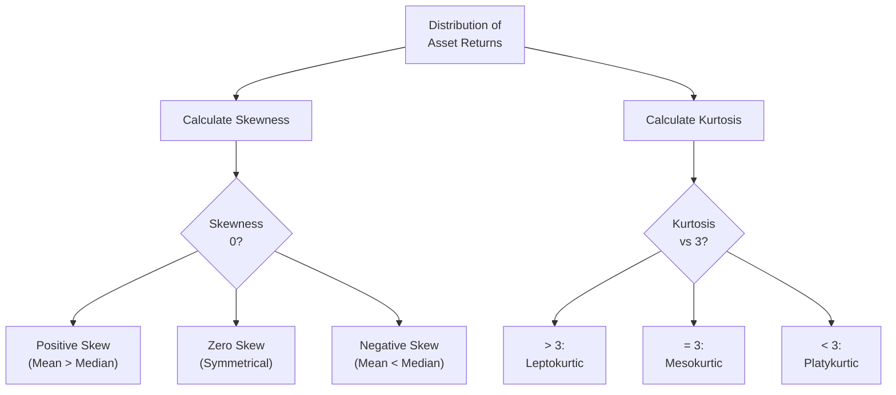

## Introduction and Overview

Skewness and kurtosis might sound a little intimidating at first—like terms only a mathematician would love. But, trust me, they are actually super-important in everyday portfolio management. You might be thinking, “Aren’t mean and standard deviation enough?” Well, not always. Standard deviation focuses on the average spread of returns, but it doesn’t do a great job of telling you about big, unexpected moves. That’s where skewness and kurtosis come in. They help you figure out whether the distribution of returns is lopsided (skewed) or prone to extreme ups or downs (kurtosis). As you’ll soon see, ignoring these can lead to serious misjudgments in risk management.

## Why Skewness and Kurtosis Matter in Finance

Picture a distribution of daily returns on your portfolio. If you only consider standard deviation, you might assume the returns are all nicely “clustered” around the mean, with symmetrical tails. But in reality, market returns can be lumpy, with more large negative (or positive) events than expected. Understanding skewness (asymmetry) and kurtosis (“tail thickness”) helps you see how your portfolio might handle stress during unexpected market events.

In other words:
• Skewness answers: “Are rare events more likely to be big gains or big losses?”  
• Kurtosis answers: “How extreme can those rare events get?”

I once worked with a small investment fund that was consistently enjoying moderate gains—until a single week saw enormous negative returns that nearly wiped out the entire year’s progress. When we examined the distribution of returns, it turned out that the returns were negatively skewed and leptokurtic; so large losses, though infrequent, were significantly more probable than a normal distribution would suggest. If we had taken skewness and kurtosis more seriously from day one, we might have hedged some of that tail risk a bit sooner.

## Skewness: Measuring the Tilt of Your Distribution

### Defining Skewness

Skewness tells us about the asymmetry of the distribution of returns around the mean. A distribution can be:
• Perfectly symmetrical (no skew)  
• Positively skewed (right-skewed): The right-hand tail is longer  
• Negatively skewed (left-skewed): The left-hand tail is longer  

In a perfectly symmetrical distribution (like an idealized normal distribution), the mean, median, and mode all coincide. That’s nice in theory, but financial returns often do not conform to that. Instead, you might see heavier tails on one side or the other.

### Positive Skew (Right Skew)

If returns are positively skewed, you have a longer tail on the right side of the distribution. This typically implies the possibility—though sometimes a small likelihood—of outsize positive gains. The mean is usually larger than the median. This scenario might sound ideal, but it’s not always free of complications, because if most returns cluster around a smaller positive range and the big outliers are extremely big winners, your main challenge is that your normal “average risk measures” might underestimate just how valuable these rare events could be. (And ironically, risk managers often don’t fear large positive returns as much as large negative ones.)

### Negative Skew (Left Skew)

Negative skew is the scarier one—at least for most investors—because it indicates that the left tail is longer. The mean is often less than the median. Practically, you might see frequent small gains or stable outcomes, with an occasional huge drop. That’s tricky because standard deviation alone doesn’t fully capture the potential meltdown in the left tail. Investors sometimes refer to assets with negative skew as “picking up pennies in front of a steamroller.”

It’s like a friend telling you, “Most of the time, this strategy churns out nice, modest returns.” But every once in a while? You might see a catastrophic loss. If you only look at average returns and standard deviation, that tail risk can be hidden, leading you to underestimate the chance of extreme negative returns.

### Mathematical Perspective on Skewness

You might recall the general formula for sample skewness (though there are multiple definitions often used in practice):


\text{Skewness} = \frac{\sum\limits_{i=1}^n (X_i - \overline{X})^3}{(n-1)\,s^3}


• \\( X_i \\) are the observed returns.  
• \\( \overline{X} \\) is the sample mean.  
• \\( s \\) is the sample standard deviation.  
• \\( n \\) is the number of observations.  

A negative skewness implies negative skew (longer left tail). A positive skewness implies positive skew (longer right tail). A skewness near zero suggests a more or less symmetrical distribution—although that doesn’t guarantee normality, of course.

## Kurtosis: Measuring the Tails of the Distribution

### Defining Kurtosis

Kurtosis measures the “peakedness” or “tailedness” of a distribution. If a distribution has very tall peaks and very fat tails, it has high kurtosis. In finance, high kurtosis is often interpreted as having ‘fat tails,’ meaning that extreme returns (positive or negative) are more likely than the standard normal distribution suggests.

### Types of Kurtosis

1. **Leptokurtic** (Kurtosis > 3):
   - Higher, sharper peak around the mean.  
   - Fatter tails—so more likelihood of extreme outcomes.  
   - In practical terms, you might see more large shocks, both positive and negative.  

2. **Mesokurtic** (Kurtosis ≈ 3):
   - Roughly the same shape and tails as a normal distribution (the normal distribution has kurtosis = 3 if we use the “Pearson’s definition”).  
   - This is often our baseline.  

3. **Platykurtic** (Kurtosis < 3):
   - Flatter overall distribution.  
   - Thinner tails relative to the normal distribution.  
   - You might see fewer extremes.  

Naturally, from a risk-management viewpoint, leptokurtic distributions are the ones that raise eyebrows. They remind us that catastrophic losses might show up more frequently than we’d expect under a normal model.

### Sample Kurtosis Formula

One common version of the sample excess kurtosis (commonly used in statistics software) is:


\text{Excess Kurtosis} = \frac{n(n+1)}{(n-1)(n-2)(n-3)} \sum_{i=1}^n \left(\frac{X_i - \overline{X}}{s}\right)^4 \;-\; \frac{3(n-1)^2}{(n-2)(n-3)}


When the excess kurtosis is positive, it suggests leptokurtic. When it’s negative, it suggests platykurtic. When it’s around zero, you’re near the “mesokurtic” (normal-like) baseline.

## Visualizing Skewness and Kurtosis

Below is a simple Mermaid diagram that conceptualizes a flow of how to classify skewness and kurtosis and interpret their implications:



This is obviously simplified, but it illustrates the key steps:  
1. Start from your distribution of returns.  
2. Estimate skewness and kurtosis from your sample data.  
3. Classify them according to established thresholds.  
4. Interpret potential risk implications for your investment strategy.

## Real-World Implications for Investors

### Risk Management

• A negatively skewed portfolio might generate consistent small profits but is vulnerable to large drawdowns. Think of some popular option-writing strategies (like writing out-of-the-money puts) that produce small gains most of the time but occasionally get hammered when markets plunge.  
• A positively skewed distribution might see more frequent small losses but occasionally big windfalls, e.g., holding long options or assets that benefit from volatility spikes.  
• Leptokurtic distributions have higher tail risk. You should consider robust tail hedging or other forms of risk mitigation (such as systematic put-buying strategies or dynamic hedging).

### Portfolio Construction and Tail Risk Strategies

• Options-based hedging: Buying puts (or put spreads) can help protect against the left-tail risk in negatively skewed assets. Though it comes at a premium cost, it’s often a crucial insurance.  
• Diversification: Allocating across asset classes or strategies with different skewness and kurtosis profiles can help offset extremes, though correlation dynamics also matter heavily.  
• Stress testing and scenario analysis: If your distribution is leptokurtic, standard risk metrics (like VaR based on a normal assumption) can be misleading. Scenario analysis or historical stress tests might reveal deeper vulnerabilities.  

### Practical Example: Tail Risk Hedging in a Negatively Skewed Market

Imagine you hold a high-yield bond fund that produces relatively stable monthly returns. It might have a negative skew, because in times of credit market stress, defaults spike, and the fund can suddenly drop in value sharply. If you’re worried about a credit event, you could:
• Allocate a bit toward Treasury bonds or other safe havens (lower correlation).  
• Buy put options on a high-yield bond ETF.  
• Purchase credit default swaps (CDS) to hedge corporate default risk.  

All of these strategies aim to flatten that left tail—i.e., reduce negative skewness—so that catastrophic losses become less likely or at least less severe. This may in turn reduce the overall portfolio’s leptokurtic tendencies as well.

## Pitfalls and Best Practices

1. **Ignoring Skew and Kurtosis**: It’s easy to look at your daily returns and see a decent Sharpe ratio, ignoring the possibility of a once-in-a-decade meltdown.  
2. **Over-Reliance on Normality**: Many textbook models assume normal distributions for simplicity. If your real returns are heavily skewed or fat-tailed, you can be caught off-guard by tail events.  
3. **Sample Size Issues**: Estimating skewness and kurtosis reliably requires enough relevant data. Especially for tail events, insufficient historical data might hide extreme risks.  
4. **Correlations in Extreme Periods**: Correlations among assets can surge in stress periods. If your portfolio is otherwise “diversified” but all your assets become correlated under panic, you may end up with a large left tail.  

## Simple Python Illustration

Below is a small Python snippet that illustrates how you might compute skewness and kurtosis from a simple return series:

```python
import numpy as np
from scipy.stats import skew, kurtosis

returns = [0.01, 0.02, -0.03, 0.01, 0.05, -0.10, 0.03, 0.02, 0.04, -0.02]

sample_skew = skew(returns)                    # default is sample skewness
sample_kurtosis = kurtosis(returns, fisher=False) 

print("Sample Skewness:", sample_skew)
print("Sample Kurtosis:", sample_kurtosis)
```

You might see, for instance, a negative skew if those occasional large losses (like -10%) overshadow smaller gains. And if big negative outliers are frequent, you might find a kurtosis well above 3.

## Integrating Skewness and Kurtosis into a Broader Strategy

### Link to Other Chapters

• Chapter 3.1–3.2 introduced basic measures of central tendency and dispersion. Skewness and kurtosis are more advanced descriptors that refine our view of distributions.  
• Chapters 4 and 5 dive into scenario analysis and portfolio mathematics. When constructing an optimal portfolio or performing a stress test, factoring in asymmetry and heavy tails can be critical to avoid nasty surprises.  
• In advanced risk modeling (see Chapter 6 on simulation methods), you can incorporate non-normal distributions or run Monte Carlo simulations that account for higher skewness and kurtosis.

### Industry and Professional Standards

When performing investment analysis, the CFA Institute’s Code and Standards emphasizes diligence and thoroughness. Overlooking tail risk or misrepresenting the risk profile of your portfolio could violate the ethical requirement to provide a fair, objective analysis. Especially in the context of preparing portfolios for clients, practitioners have a responsibility to represent the full range of potential outcomes, including those lurking in the tails.

## Conclusion and Exam Tips

Understanding skewness and kurtosis can save you from the common trap of relying too heavily on a “normal” viewpoint. Negative skew or leptokurtic distributions signal that extreme events are more likely or more severe than normal assumptions would suggest, and ignoring that is a recipe for being blindsided by deep drawdowns. Here are a few final pointers to keep in mind:

• For exam purposes, memorize the differences between types of skew (positive vs. negative) and the meaning of leptokurtic, platykurtic, and mesokurtic.  
• Be ready to interpret the sign of sample skewness, especially in short-answer or item-set questions that might present data on sample moments.  
• Know that “excess kurtosis” refers to kurtosis minus 3, so pay attention to whether the exam question uses that or the raw kurtosis measure.  
• For scenario-based questions, be prepared to discuss risk management strategies to mitigate negative skew or leptokurtic risk.

Remember: Markets often exhibit fatter tails than normal. If something looks “too good to be true” based on standard deviation alone, it might well be. When you see high kurtosis, be mindful of tail-risk hedging strategies, especially if the distribution is also negatively skewed and prone to large losses.

---

## References

• CFA Institute Level I Curriculum, Quantitative Methods: “Skewness, Kurtosis, and Descriptive Statistics.”  
• Mandelbrot, Benoit (2004). The (Mis)Behavior of Markets. Basic Books.  
• The Journal of Portfolio Management and The Journal of Risk (various papers discussing advanced measures of tail risk and hedging techniques).  

---

## Test Your Knowledge: Skewness and Kurtosis in Portfolio Management



### Which of the following best describes a negative skew in a return distribution?

- [ ] The distribution has a longer tail to the right, with more large positive outliers.  
- [ ] The mean is greater than the median, indicating possibility for frequent large positive returns.  
- [x] The distribution has a longer tail to the left, showing higher probability of extreme losses.  
- [ ] The returns are perfectly symmetrical around the mean, median, and mode.  

> **Explanation:** Negative (left) skew means the left tail is longer, implying larger negative outliers.

---

### A portfolio with a positive skew is most likely to exhibit which of the following characteristics?

- [ ] Frequent small negative returns and rare but extreme negative outliers.  
- [ ] Frequent flat returns and rare but extreme negative outliers.  
- [x] Frequent small negative returns and occasional large positive outliers.  
- [ ] Frequent small positive returns and occasional positive outliers.  

> **Explanation:** A positive (right) skew usually indicates more large positive extremes relative to negative extremes.

---

### Leptokurtic distributions imply which of the following?

- [ ] A distribution with thinner tails and low probability of extreme events.  
- [ ] A distribution with no tails, as all returns cluster around the mean.  
- [x] A distribution with heavier tails that increase the likelihood of extreme results.  
- [ ] A perfectly symmetrical distribution that aligns with standard normal.  

> **Explanation:** Leptokurtic distributions have fatter tails compared to the normal distribution, increasing the probability of extreme outcomes.

---

### What happens to the mean and median in a negatively skewed distribution?

- [x] The mean is typically less than the median.  
- [ ] The mean, median, and mode all coincide.  
- [ ] The mean is typically greater than the median.  
- [ ] The mean and median are both zero.  

> **Explanation:** In a negatively skewed (left-skewed) distribution, the mean is pulled toward the tail on the left side, resulting in a mean < median relationship.

---

### In risk management, ignoring kurtosis can lead to:

- [x] Underestimating the probability of extreme market events.  
- [ ] Overestimating the correlation between assets.  
- [ ] Overestimating total expected returns.  
- [x] Misrepresenting tail risk in risk models.  

> **Explanation:** High kurtosis (fat tails) implies that extreme events are more probable than normal models predict. Ignoring this can cause serious mispricing of tail risk.

---

### Which statement accurately describes the difference between “excess kurtosis” and “kurtosis”?

- [ ] They are the same measure, but “excess kurtosis” is only used when analyzing large data sets.  
- [x] Excess kurtosis is the sample kurtosis minus 3, reflecting deviation from a normal distribution.  
- [ ] Kurtosis is more commonly used in finance, while “excess kurtosis” is a purely academic term.  
- [ ] “Excess kurtosis” is measured in decimals, while kurtosis is measured in percentages.  

> **Explanation:** Excess kurtosis subtracts 3 from the raw kurtosis value to indicate how a distribution’s tails compare to a normal distribution’s tails.

---

### A distribution that is mesokurtic usually means:

- [x] It has approximately the same “tailedness” as the normal distribution.  
- [ ] It has extremely fat tails and a very peaked center.  
- [ ] It has extremely thin tails and a flat center.  
- [ ] It is not related to any known distribution.  

> **Explanation:** “Mesokurtic” denotes a kurtosis close to that of a normal distribution, which is commonly taken as the kurtosis baseline of 3.

---

### Which of the following best describes an investment strategy likely to produce negative skew?

- [ ] Buying long-dated calls in a low-volatility environment.  
- [x] Writing out-of-the-money put options on a stock index.  
- [ ] Diversifying across global equity and bond indices.  
- [ ] Investing in a balanced fund of equities and short-term treasuries.  

> **Explanation:** Writing puts can yield steady premium income but exposes the investor to large negative payouts if the market drops sharply, leading to negative skew.

---

### How does negative skew impact the potential for drawdowns?

- [ ] Negative skew reduces drawdown risk because left tails are thin.  
- [x] Negative skew increases susceptibility to large drawdowns in rare events.  
- [ ] Negative skew has no correlation with drawdown risk unless volatility is zero.  
- [ ] Negative skew is impossible to observe in real market returns.  

> **Explanation:** Negative skew amplifies the potential of large and sudden losses, increasing the likelihood of substantial drawdowns.

---

### True or False: A leptokurtic distribution always implies positive skewness.

- [x] False  
- [ ] True  

> **Explanation:** Kurtosis and skewness are separate properties. A distribution can be leptokurtic (fat tails) and still maintain negative, positive, or zero skew.


