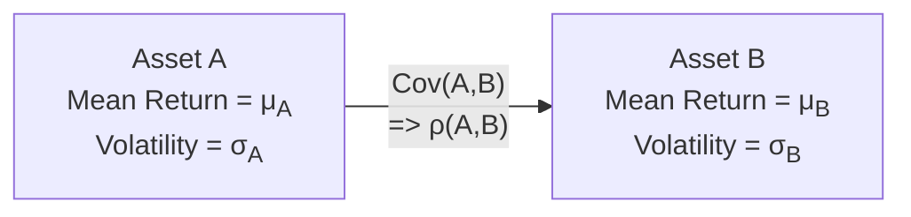

## Introduction and Motivation

Have you ever wondered why certain stocks always seem to move in the same direction? Or perhaps you’ve noticed that two investments sometimes behave like mirror reflections of each other—when one goes up, the other tends to go down. Well, these tendencies aren’t just random quirks; they reflect the mathematical relationships captured by covariance and correlation.

Covariance and correlation come up constantly in investment analysis, especially when you’re trying to put together a diversified portfolio. They tell you whether asset returns tend to move together (positively) or in opposite directions (negatively), signifying crucial risk and return implications. This insight can help you reduce overall portfolio risk or exploit patterns for hedging strategies, pairs trades, and so forth.

Anyway, let’s break down these two concepts, talk about how they’re measured, and then see where they pop up in real-world investment decisions. By the time you’re done reading, you’ll have a solid handle on the difference between covariance and correlation, and you’ll know why it matters so much for constructing well-rounded portfolios.

## Defining Covariance: Measuring How Two Variables Move Together

Covariance is a statistical measure that quantifies how two random variables move relative to each other. In finance, we use it to describe how the returns of two assets change in tandem. A positive covariance means that when Asset X does better than its average return, Asset Y also tends to be above its average return. A negative covariance means that when Asset X does better than usual, Asset Y tends to be below its own average, and vice versa. Here’s the formal definition:

$$
\text{Cov}(X, Y) = E\bigl[(X - \mu_X)(Y - \mu_Y)\bigr],
$$

where:

• \\( X \\) and \\( Y \\) are random variables (such as the returns on Asset X and Asset Y).  
• \\( \mu_X \\) and \\( \mu_Y \\) are the expected (mean) values of \\( X \\) and \\( Y \\).  
• \\( E[\cdot] \\) denotes the expectation operator.

### Interpreting Covariance Values

1. **Positive Covariance:**  
   When \\( \text{Cov}(X, Y) > 0 \\), \\( X \\) and \\( Y \\) generally move in the same direction relative to their means. This doesn’t necessarily mean they always rise and fall together perfectly, but they share an overall tendency to be aligned.

2. **Negative Covariance:**  
   When \\( \text{Cov}(X, Y) < 0 \\), \\( X \\) and \\( Y \\) tend to move in opposite directions relative to their means. This characteristic can be particularly attractive in hedging strategies, because when one asset suffers, the other might offset the loss.

3. **Zero or Near Zero Covariance:**  
   When \\( \text{Cov}(X, Y) \approx 0\\), the two variables exhibit no linear co-movement. This does not rule out non-linear relationships, but from a linear perspective, these assets seem to move independently of each other.

### Example: A Quick Covariance Calculation

Let’s say you have two stocks, A and B. Over a few months, each shows returns relative to their average as follows:

• Stock A returns above its mean: +2%, +3%, −1%, +4%  
• Stock B returns above its mean: +1%, +2%,  0%,  +5%

To get a rough covariance estimate, you’d multiply each pair of deviations and then take the average:

• Period 1 pair: \\( 2\%\times1\% = 0.02 \times 0.01 = 0.0002 \\)  
• Period 2 pair: \\( 3\%\times2\% = 0.03 \times 0.02 = 0.0006 \\)  
• Period 3 pair: \\( -1\%\times0\% = -0.01 \times 0.00 = 0.0000 \\)  
• Period 4 pair: \\( 4\%\times5\% = 0.04 \times 0.05 = 0.0020 \\)

Sum these products and divide by 4 in a simplistic approach (ignoring sample vs. population corrections for this illustration). You get a positive number, which indicates Stock A and Stock B are positively correlated in returns over this sample.

## Introducing Correlation: A Standardized Measure of Co-Movement

Correlation is the standardized version of covariance. It rescales covariance to a range between −1.0 and +1.0, making it easier to interpret and compare across different pairs of assets (or variables) that might have very different standard deviations. The correlation coefficient, usually denoted \\( \rho \\), is:

$$
\rho_{X,Y} = \frac{\text{Cov}(X, Y)}{\sigma_X \sigma_Y},
$$

where \\( \sigma_X \\) and \\( \sigma_Y \\) are the standard deviations of \\( X \\) and \\( Y \\), respectively.

### Understanding the Correlation Scale

1. **\\(\rho = +1.0\\):** Perfect positive linear relationship—whenever \\( X \\) goes up from its mean, \\( Y \\) goes up proportionally from its mean, and vice versa.  
2. **\\(\rho = -1.0\\):** Perfect negative linear relationship—whenever \\( X \\) goes up from its mean, \\( Y \\) goes down from its mean, and vice versa.  
3. **\\(\rho = 0.0\\):** No linear relationship at all—in principle, the two variables’ movements are uncorrelated, meaning knowledge about one doesn’t (linearly) improve your predictions for the other.  
4. **\\(\rho\\) in between**: A correlation of +0.6, for instance, shows a moderately strong positive relationship, whereas −0.7 indicates a moderately strong negative relationship.

### A Mermaid Diagram of Covariance and Correlation

Below is a small Mermaid diagram to visualize how covariance and correlation link two assets’ return distributions:

The arrow indicates that once we know the covariance, we can convert it into a correlation if we divide by the product of \\( \sigma_A \\) and \\( \sigma_B \\).

## The Power of Diversification

Perhaps the biggest reason correlation matters in portfolio construction is its impact on diversification. If you pick assets that are all positively correlated (especially highly correlated), your portfolio’s total risk might not be reduced by much because those assets tend to rise and fall together. In contrast, mixing assets with low or negative correlations can lessen overall portfolio volatility, helping you achieve the often-cited “free lunch” of diversification.

### An Intuitive Take

Imagine you have two stocks: one is sensitive to oil prices (an energy producer), and the other is a tech company that’s more sensitive to consumer electronics demand. In normal market conditions, these two might have fairly low correlation. Put them both in your portfolio, and there’s a decent chance that trouble in the energy sector won’t necessarily affect your tech stock, dampening your portfolio’s overall volatility.

But keep in mind that correlations can change, particularly during market stress. Sometimes, assets that seem uncorrelated in calm periods become more positively correlated during a crisis. That’s why professional portfolio managers frequently re-evaluate correlation estimates over time.

## Covariance and Correlation in Portfolio Calculations

When you combine multiple assets in a portfolio, their total variance (risk) depends on pairwise covariances. Specifically, for a two-asset portfolio with weights \\( w_X \\) and \\( w_Y \\), the variance is:

$$
\sigma_P^2 = (w_X \sigma_X)^2 + (w_Y \sigma_Y)^2 + 2 \, w_X \, w_Y \, \text{Cov}(X, Y).
$$

Sometimes you’ll see correlation used instead of covariance in the above because:

$$
\text{Cov}(X, Y) = \rho_{X,Y} \, \sigma_X \, \sigma_Y.
$$

This leads to:

$$
\sigma_P^2 = (w_X \sigma_X)^2 + (w_Y \sigma_Y)^2 + 2 \, w_X \, w_Y \, \rho_{X,Y} \, \sigma_X \, \sigma_Y.
$$

Hence, the correlation coefficient drastically influences the overall portfolio’s standard deviation. A lower (or negative) \\( \rho_{X,Y} \\) can produce a much flatter risk profile for the combined portfolio.

## Real-World Examples and Practical Tips

1. **Pairs Trading and Statistical Arbitrage**  
   If you detect that two stocks (say, from the same industry) have historically moved together with a correlation of +0.80, you can try a pairs trade: buy the underperforming stock and short the outperforming stock, assuming you expect them to converge. Naturally, you rely on the correlation continuing into the future, so keep an eye on changing market fundamentals.

2. **Hedging with Negative Correlation**  
   Futures or options on assets that are negatively correlated with your main position work as a hedge. For example, if your portfolio is heavy in equities, you might hold put options on a market index or invest in an inverse ETF. The negative correlation in down markets can cushion your losses.

3. **Factor-Based Investing**  
   Many times, two assets move in similar ways because they share exposure to the same systematic factor, like interest rates or inflation. By measuring correlations (and covariances) across multiple assets, you can identify which underlying factors are driving their returns.

4. **Beware of Time-Varying Correlations**  
   During major sell-offs (think financial crises, global events, etc.), correlations among equities often spike, limiting diversification benefits right when you need them most. So it’s critical to monitor how correlations behave specifically under stressed conditions rather than just in calm periods.

5. **Do Not Mistake Correlation for Causation**  
   Two assets might be correlated because of a shared macro driver, but that doesn’t tell you which one “causes” the other’s movements—or whether both are simply influenced by an outside factor (like interest rates, GDP growth, or even investor sentiment).

## Common Pitfalls and Challenges

• **Over-Reliance on Historical Estimates:** Using past data to estimate covariances and correlations might not adequately capture future shifts. Always consider structural changes in markets, company fundamentals, or global events.  
• **Zero Correlation Does Not Mean Zero Risk:** Even if two assets are uncorrelated, they can still both have high individual volatility, which can lead to significant overall portfolio risk.  
• **Non-Linear Relationships:** Correlation measures a linear relationship. Assets can have a strong non-linear relationship but still show a small linear correlation. Options strategies are a typical example of how returns get “bent” in ways correlation doesn’t fully capture.  
• **Ignoring Liquidity and Other Practical Aspects:** Real-world trading constraints can affect how you balance your portfolio, especially when you need to rebalance a hedge in a fast-moving market.

## An Informal Anecdote

I remember a time (this was during an especially chaotic market year) when I tried to rely on correlations I'd measured from benign market months. My portfolio had a bunch of cyclical stocks and a couple of utility names that historically showed strong negative correlations with the rest of my holdings. So I thought, “I’m safe, right?” Then came a broad market sell-off, and those utility stocks suddenly started moving in sympathy with the broader market. Correlation soared from near zero to something painfully close to +0.7. Ouch. That taught me the hard way to test correlations in multiple market environments—particularly stressed ones.

## Best Practices for Utilizing Covariance and Correlation

• **Use Rolling Windows:** A rolling approach can help track how correlations evolve as conditions change.  
• **Stress Test the Relationships:** Evaluate how correlations might behave under extreme scenarios.  
• **Diversify Across Multiple Factors:** Don’t rely on just one or two negatively correlated assets; a multi-asset approach often yields more robust diversification.  
• **Combine Quantitative and Qualitative Analysis:** Look at the data, but also pay attention to market narratives, industry reports, and fundamental company performance indicators that might signal correlation changes.

## Exam Relevance and Tips

From a CFA exam standpoint, you’ll likely see covariance and correlation show up in several ways:

• **Computational Problems:** Quickly compute or interpret correlation and covariance from sample data.  
• **Portfolio Construction Questions:** Use correlation to figure out the variance of a two-asset or multi-asset portfolio.  
• **Conceptual Scenarios:** Explain how mixing assets with certain correlation levels influences total risk and return.  
• **Pitfalls:** Discuss how correlation can be time-dependent or only reflect linear relationships.

In constructed-response scenarios, you might be asked to evaluate a proposed hedge or weigh the benefits of adding a particular asset to an existing portfolio. You’ll need to articulate the relevance of correlation (or covariance) to your recommendation. Be sure to note any disclaimers about it being an estimate or about correlation changing across market cycles.

## References and Further Exploration

• CFA Institute Level I Curriculum, Quantitative Methods: “Correlation and Regression”  
• Elton, E.J., Gruber, M.J., Brown, S.J., & Goetzmann, W.N. (Contemporary Editions). Modern Portfolio Theory and Investment Analysis  
• Reilly, F. & Brown, K. Investment Analysis and Portfolio Management  
• Basel III guidelines (for risk management approaches and diversification concepts in the banking sector)  

If you’re after more depth on the interplay among econometrics, factor-based investing, and correlation, you might also look up specialized courses on quantitative finance or advanced textbooks on asset pricing and risk management.  

## Correlation and Covariance Mastery Quiz



### 1. Which statement best describes the interpretation of a negative covariance between two assets’ returns?

- [ ] They both move in the same direction from their means.  
- [ ] Their overall volatility is zero when combined.  
- [x] When one is above its mean, the other tends to be below its mean.  
- [ ] They cannot be combined in a portfolio.  

> **Explanation:** A negative covariance generally means the two assets move in opposite directions from their respective averages.

### 2. How does correlation differ from covariance?

- [ ] Correlation is always positive, whereas covariance can be negative.  
- [ ] Covariance is measured in standard deviation units, whereas correlation is not.  
- [x] Correlation is a standardized form of covariance, ranging from −1.0 to +1.0.  
- [ ] They are exactly the same measure with different names.  

> **Explanation:** Correlation is covariance divided by the product of each variable’s standard deviation, making it a dimensionless measure between −1.0 and +1.0.

### 3. If two assets have zero correlation, which of the following statements is true?

- [ ] They have no volatility.  
- [ ] They have perfectly offsetting expected returns.  
- [x] There is no linear relationship between their returns.  
- [ ] They have the same mean return.  

> **Explanation:** Zero correlation implies no linear association. It does not rule out non-linear relationships.

### 4. Which of the following best characterizes the diversification benefit in a two-asset portfolio?

- [ ] It is always maximized by combining assets with correlations close to +1.0.  
- [ ] It is unaffected by correlation and only depends on the weights.  
- [x] It increases as the correlation between assets decreases.  
- [ ] It doesn’t exist if assets are not negatively correlated.  

> **Explanation:** The diversification effect is strongest when correlation is low (or negative), as that reduces overall portfolio volatility.

### 5. A portfolio manager calculates the correlation between two stocks as +0.9 using two years of weekly returns. Which of the following is a prudent next step?

- [ ] Assume the correlation will remain +0.9 indefinitely and allocate accordingly.  
- [ ] Use the correlation to guarantee a riskless hedge.  
- [x] Investigate whether the correlation is stable over different time horizons or market regimes.  
- [ ] Conclude that the two stocks can’t be used for diversification.  

> **Explanation:** Correlations can shift over time, particularly in stressed markets or if fundamentals change.

### 6. All else being equal, which of the following portfolio characteristics is most heavily influenced by pairwise asset correlations?

- [ ] The median return.  
- [x] The total variance (or standard deviation).  
- [ ] The risk-free rate.  
- [ ] The expected valuation multiple.  

> **Explanation:** Correlation directly affects the covariance term, which is integral to calculating overall portfolio variance.

### 7. Why can a zero correlation between two assets be misleading in some cases?

- [x] They might have a non-linear dependency that correlation does not capture.  
- [ ] Their means are always the same.  
- [ ] Their standard deviations must be equal.  
- [ ] They must also have zero covariance.  

> **Explanation:** Correlation is a measure of linear dependence. Non-linear patterns might exist even if linear correlation is zero.

### 8. In the context of factor-based investing, why might correlations between certain assets appear high?

- [ ] They are both illiquid.  
- [ ] They trade on the same exchange.  
- [ ] They are denominated in different currencies.  
- [x] They share common exposures to underlying systematic factors.  

> **Explanation:** Assets driven by the same underlying factor (e.g., interest rates, inflation) often show higher correlations.

### 9. A correlation of +1.0 between two assets’ returns means:

- [ ] Both assets’ returns are always equal.  
- [x] They have a perfect positive linear relationship.  
- [ ] One asset has no risk.  
- [ ] Both have the same standard deviation.  

> **Explanation:** A correlation of +1.0 indicates a perfect linear relationship but doesn’t necessarily mean the returns are identical in magnitude.

### 10. When market stress increases significantly, correlations among risk assets generally:

- [x] Tend to move higher.  
- [ ] Tend to decrease to zero.  
- [ ] Stay constant.  
- [ ] Can never change within the same calendar year.  

> **Explanation:** In stressed conditions, many assets become more positively correlated as investors engage in widespread deleveraging and flight-to-safety behaviors.




