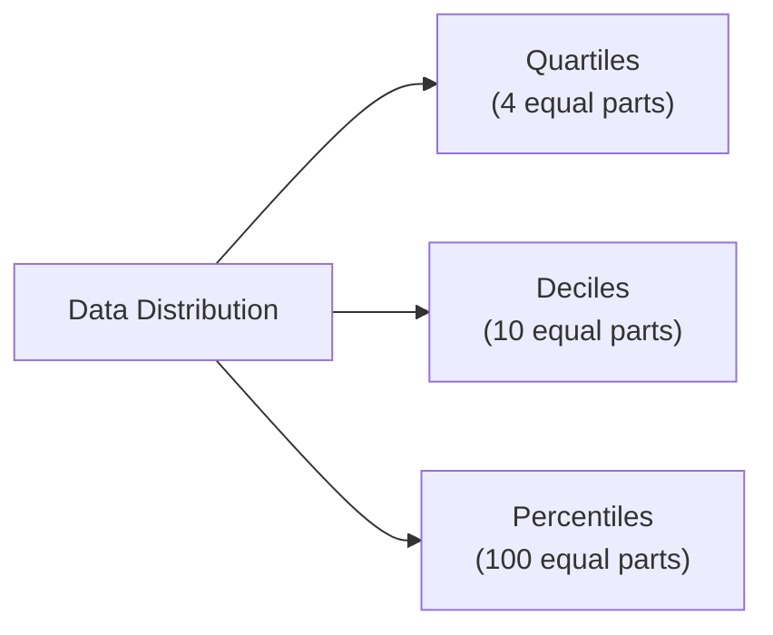

## Introduction

Ever notice how, in a big crowd, you might say something like, “I’m taller than 80% of the people here”? That’s sort of the same logic data analysts use when they talk about “percentiles.” And if you’re thinking about how to capture risk “per” unit of return, well, that’s where the coefficient of variation shines. This section delves into the critical concepts of quantiles, percentiles, deciles, quartiles, and the coefficient of variation (CV). Even if these terms sound a bit—um, let’s say “dusty”—the moment you realize how powerful they can be in investment analysis, you’ll never look at data sets the same way again.

In previous sections (see 3.1 on Measures of Central Tendency and 3.2 on Measures of Dispersion), we examined how to summarize typical values (mean, median) and overall variability (variance, standard deviation). Now, we build on that foundation and introduce measures of location and the CV, both of which highlight how an investment’s returns stack up relative to those of its peers and how much risk an investor might be taking for the returns they are (hopefully) earning.

## Measures of Location

Measures of location—like quartiles, deciles, and percentiles—provide a finer breakdown of a distribution than a single central value. Instead of just “mean” or “median,” these measures tell us what portion of the data is to the left or the right of certain breakpoints. That might sound theoretical, but it’s actually super practical. For instance, if an investment fund claims to be in the “top quartile,” it’s basically bragging that it beat at least 75% of the competition.

### Understanding the Concept of Quantiles

Before we jump into quartiles, deciles, and percentiles, let’s clarify the term “quantiles.” A quantile is a point in your data distribution where a certain fraction of the observations lie below it. You might hear about the 0.25 quantile (25th percentile), 0.50 quantile (median, or 50th percentile), 0.75 quantile (75th percentile), etc. Quantiles can be super handy if you want to locate thresholds in a distribution and say, “X% of my returns are below this threshold, and (1 – X)% are above it.”

### Quartiles

Quartiles split your data into four (roughly) equal parts. They’re often labeled Q1, Q2, Q3, and Q4:

• Q1 (25th percentile): The value below which 25% of observations lie.  
• Q2 (50th percentile): Also the median. Half of the observations lie below, half above.  
• Q3 (75th percentile): The value below which 75% of observations lie.  
• Q4 (100th percentile): The maximum value in the data set.

Case in point: Suppose you have a fund's monthly returns for two years (24 observations), and you want to check Q3. If the 75th percentile of monthly returns is 1.5%, that indicates that 18 out of 24 months had returns at or below 1.5%. This is extremely helpful when you want to see if your overall performance is mostly above average or if just a few exceptionally strong months are skewing the results.

### Percentiles

Percentiles are even more granular than quartiles; they divide the data into 100 segments:

• The 1st percentile is the point below which 1% of the observations lie.  
• The 50th percentile (again, the median) is the point below which 50% of the observations lie.  
• The 90th percentile is the point below which 90% of the observations lie, and so on.

Think about it in investment terms: If your hedge fund is at the 90th percentile in performance, that means you have outperformed 90% of all other hedge funds in the comparison group. That’s a nice bragging right—assuming you can maintain it!

### Deciles

Deciles slice the data into 10 equal parts, which is an intermediate step between quartiles and percentiles. The 1st decile is the point below which 10% of the observations lie, the 2nd decile is the point below which 20% lie, all the way up to the 10th decile, which is 100% of the data.

Deciles might be used to classify a big range of mutual funds, for instance, to see which funds are in the top 10%, 20%, 30%, etc. That can help an investor or manager quickly see how a fund’s returns rank within a large universe of peers.

### Visual Overview of Data Partitions

Below is a Mermaid.js diagram to illustrate how our data distribution can be split into quartiles, deciles, and percentiles:

Essentially, each approach divides the entire distribution into segments, from the lowest to the highest returns, providing granular insight into whether returns are skewed, stacked up in the middle, or heavily concentrated in certain ranges.

## Coefficient of Variation (CV)

Now let’s talk about a ratio that frequently pops up in investment analysis: the coefficient of variation (CV). In plain language, the CV is a measure of risk (standard deviation) per unit of return (mean). Formally:


\text{Coefficient of Variation (CV)} = \frac{\sigma}{\mu}


where  
• \\(\sigma\\) = standard deviation of returns,  
• \\(\mu\\) = mean (average) return.

### Why Is the CV So Important in Finance?

1. Risk-Adjusted Perspective: When you’re evaluating multiple investments, the standard deviation alone only tells you about overall volatility. But you might want to ask, “Okay, we have two assets: one with a monthly return of 2% and volatility of 3%, and another with a monthly return of 0.5% and volatility of 1%. Which is better?” The second might have lower volatility, but its return is also smaller. The CV factors in both return and volatility.  

2. Cross-Scale Comparisons: Because we’re taking a ratio of standard deviation to mean, it doesn’t matter if we’re looking at monthly returns, annual returns, or something else. The ratio normalizes across different means and standard deviations.  

3. Identifying Efficient Risk-Return Combos: A lower CV theoretically indicates more “bang for your buck.” If an asset has a CV of 0.5 while another stands at 0.8, the first asset is producing a higher return relative to the volatility exhibited.  

Real quick anecdote: I once tried to pick a top performer for my personal portfolio by looking just at the standard deviation—only to realize that the high volatility stock also had a significantly higher mean return. The CV approach saved me from tossing out a profitable (though somewhat turbulent) investment.

### Cautions

• Watch out for negative means: If the average return is negative (or zero), the CV can explode or become meaningless.  
• Consider distribution shape: Just because the CV is low doesn’t automatically mean you’re looking at a safer bet. Other distribution features (like skewness, as covered in 3.3, and correlation with the rest of your portfolio, from 3.4) matter too.  
• Complement with other metrics: Like Sharpe Ratio, Sortino Ratio, or measures of tail risk. CV is helpful, but it’s only part of the story.

## Using Measures of Location and CV in Investment Analysis

Think about a typical mutual fund screening process. You might line up all possible funds by their historical return distribution. Then you check how each fund ranks by percentile. If you find a fund consistently above the 80th percentile in returns, that’s intriguing. But you’ll also want to compare volatility. If the same fund has a CV that’s modest, it means “Great, they’re delivering a high return while keeping risk relatively low.”

Here’s another scenario: group your assets into deciles—a technique sometimes used in factor investing. For a big sample of stocks, you might see which decile has the highest returns, which has the lowest. Then, within each decile, you look at the average CV. If the top decile has an unreasonably high CV, it might mean those high returns come with lots of risk.

## Relationship to VaR (Value at Risk)

Value at Risk (VaR) is a widely used risk measure that leverages quantiles or percentiles to estimate possible losses. For example, a 5% VaR might read: “There is a 5% chance that losses will exceed X amount.” Essentially, this approach identifies the 5th percentile of a return distribution (if we’re focusing on negative returns or losses). If that 5th percentile is –2.3%, that indicates that on 5% of trading days (or time intervals) you’re likely to lose 2.3% or more.

Using these location measures helps investors or risk managers calibrate where “extreme” events begin in a distribution. Paired with something like the CV, you can see how far the negative tails might stretch relative to the typical returns you’re earning.

## Practical Example: Fund Comparison

Let’s say you’re investigating two funds, A and B, each with monthly returns over the past year:

• Fund A: Mean return = 1.0% per month, Standard deviation = 0.8%.  
• Fund B: Mean return = 1.5% per month, Standard deviation = 1.8%.

If you rank both funds monthly returns from smallest to largest:

• Fund A’s 25th percentile might be 0.5%, while its 75th percentile is 1.3%.  
• Fund B’s 25th percentile might be –0.2%, while its 75th percentile is 2.0%.  

So, looking at quartiles, Fund B has bigger swings, both negative and positive. Meanwhile, the CV for each:


\text{CV}_A = \frac{0.8\%}{1.0\%} = 0.80


\text{CV}_B = \frac{1.8\%}{1.5\%} = 1.20


Fund B does have a higher mean return, but a significantly higher standard deviation, leading to a bigger CV. Depending on your risk appetite, you might lean toward Fund A if you prefer steadier returns, or Fund B if you’re comfortable with a rockier ride in search of higher returns.

## Common Pitfalls and Best Practices

• Ignoring the Scale of Data: Don’t forget that percentile or quartile calculations depend on the range of data you have. If your sample is limited or has outliers, consider robust measures like the interquartile range.  
• Blindly Trusting Historical Data: Past performance is not always indicative of future performance. Watch for structural changes that might alter the distribution of returns.  
• Misinterpretation of Percentile Rankings: Being in the “90th percentile of returns” can mean something drastically different if your data set is small or if you’re not comparing funds with a similar investment strategy.  
• Overreliance on CV: The coefficient of variation is handy but can be misleading if the mean return is close to zero or negative. Combine it with other risk measures (e.g., standard deviation, Sharpe Ratio) for a clearer perspective.  
• Not Checking Distribution Shape: In Chapter 3.3, we discussed skewness and kurtosis. These distribution tail properties can affect how you interpret quartiles and VaR. A heavily skewed distribution might have quartiles that don’t reflect typical “even splits.”

## Conclusion

Measures of location—whether quartiles, percentiles, or deciles—answer the question, “Where do my returns stand relative to everyone else’s?” The coefficient of variation answers, “How much volatility am I taking on for each unit of return?” Both are crucial for building a complete picture of risk and return in portfolio management.

Ultimately, we want to move beyond mere average returns (covered in 3.1) and incorporate these additional metrics to pinpoint exactly where our assets rank in distribution, how wide the distribution might be, and how that risk/return trade-off looks. It’s kind of like knowing not just where we stand in a crowd, but how spread out that crowd is, and how much more (or less) comfortable we might be in the middle of it.

Anyway, that’s the gist. Combining these location measures with robust risk metrics, plus insights from correlation (3.4) and covariance, forms a powerful toolkit for consistent portfolio performance evaluation. After all, we all want to know not only that a fund is “good” but how it compares to everything else out there and how stable it might be in more turbulent markets.

## References

• CFA Institute Level I Curriculum, Quantitative Methods: “Descriptive Statistics and Return Distributions”  
• Levin, R. I., & Rubin, D. S. (2014). “Statistics for Management.” Pearson.  
• The Journal of Portfolio Management (various articles on using percentiles in performance benchmarking)  

## Test Your Knowledge: Measures of Location and CV Quiz



### Which best describes the 75th percentile of a dataset?

- [x] A value above which 25% of the observations lie and below which 75% lie.
- [ ] The maximum value in the dataset.
- [ ] A value that splits the dataset into two equal halves.
- [ ] A score corresponding to the first quartile.

> **Explanation:** By definition, the 75th percentile (sometimes Q3) is the point below which 75% of observations lie.  

### Consider two assets, X and Y. X has a mean return of 2% and standard deviation of 2%. Y has a mean return of 3% and standard deviation of 4%. If you compare their CV values, which is correct?

- [ ] Asset X has a CV of 4, which is higher than Y’s CV of 1.3.
- [x] Asset X has a CV of 1, which is lower than Y’s CV of 1.33.
- [ ] Asset X has a CV of 2, which is higher than Y’s CV of 1.33.
- [ ] Asset X has a CV of 0.67, which is lower than Y’s CV of 0.50.

> **Explanation:** CV = σ / μ. For X: 2% / 2% = 1. For Y: 4% / 3% ≈ 1.33.  

### If you wanted to break a set of returns into 10 equally sized segments, which measure of location would be most appropriate?

- [ ] Quartiles
- [ ] Percentiles
- [x] Deciles
- [ ] Interquartile range

> **Explanation:** Deciles divide the dataset into 10 equal parts.  

### An investment’s mean monthly return is –1%. Its standard deviation is 2%. What is the main issue in interpreting the coefficient of variation for this investment?

- [ ] It is greater than 1.
- [ ] It is zero.
- [ ] The CV equals 2, which is hard to interpret.
- [x] The mean is negative, making the CV less meaningful or even misleading.

> **Explanation:** The CV is σ / μ, and a negative or near-zero mean can distort the interpretation of the CV.  

### Which of the following is a common pitfall when relying solely on percentile rankings (like 90th percentile) in mutual fund performance?

- [x] They do not indicate the magnitude of returns, only relative positioning.
- [ ] They measure only volatility and not returns.
- [ ] They are unaffected by outliers.
- [ ] They can be used without any context of the dataset size.

> **Explanation:** Percentile rankings show relative standing but reveal little about absolute performance or risk.  

### In VaR (Value at Risk) calculation, a 5% VaR at –3% monthly return implies:

- [x] There is a 5% chance monthly losses will exceed 3%.
- [ ] The investment will lose 3% exactly in any given month.
- [ ] 95% of the time, the returns are zero or positive.
- [ ] The 5th percentile of returns is 3%.

> **Explanation:** A 5% VaR at –3% means that in 5% of cases, losses are equal to or greater than 3%.  

### Suppose you have a set of returns for a stock, and you want to divide it into four equal chunks. Which location measure would you use?

- [x] Quartiles
- [ ] Deciles
- [x] Quartiles again (i.e., Q1, Q2, Q3, Q4)
- [ ] Variance

> **Explanation:** Quartiles split data into four segments. This question intentionally offers two correct quartile options to emphasize Q1–Q4 coverage.  

### For a dataset with strong positive skew (e.g., many small returns but a few huge outliers on the high side), how might quartile analysis help?

- [x] It shows whether a large portion of data is bunched in lower ranges, with higher quartiles reflecting outliers.
- [ ] It only reveals that the data is symmetrical about the median.
- [ ] It replaces standard deviation as the primary measure of dispersion.
- [ ] It can’t be used for skewed distributions.

> **Explanation:** Quartiles can demonstrate how most data points cluster in lower ranges while a few big outliers push the upper quartiles.  

### Which statement about the coefficient of variation (CV) is correct?

- [x] It helps compare risk relative to return across different assets or different scales.
- [ ] It is only valid for annual data.
- [ ] It applies only to normal distributions.
- [ ] It is unaffected by the mean being zero.

> **Explanation:** CV is a ratio of standard deviation to mean, making it helpful for cross-asset comparisons, regardless of scale or frequency of data.  

### The coefficient of variation is calculated by standard deviation divided by the mean. True or False?

- [x] True
- [ ] False

> **Explanation:** By definition, CV = σ / μ.  


