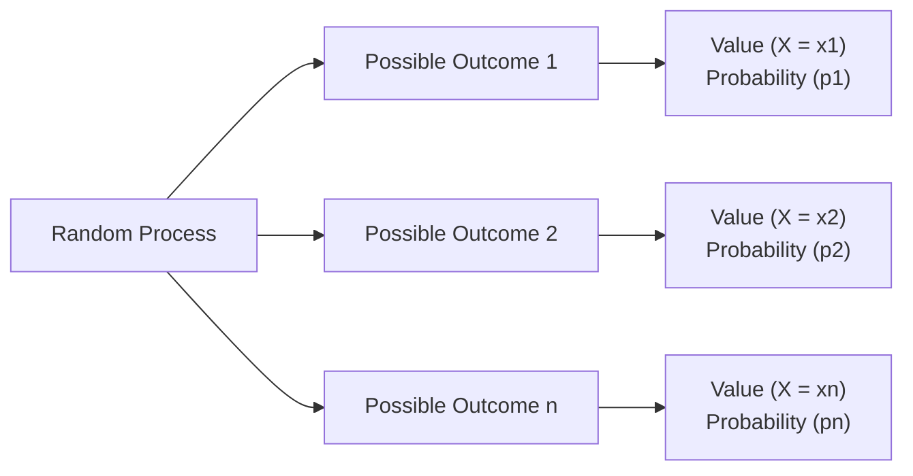

## Understanding Random Variables and Their Role in Finance
Have you ever made an investment decision and wondered: “What’s the likely payoff here?” We often talk about “expected returns,” but these are based on uncertainty. In finance, uncertainty stems from the fact that outcomes can vary. Whether we’re dealing with stock prices at the end of the month, bond yields in a fluctuating market, or the payoff from a new derivative product, the underlying concept is that each outcome is not guaranteed. Instead, it’s attached to a probability. That’s precisely where random variables come in, giving us a structured way to measure the possible outcomes and assign them numerical values.

If you’re new to these ideas, don’t worry—this section is designed to break down the idea of random variables, walk you through expected values (which is just a fancy way of saying “average outcome weighted by probability”), and help you grasp variance (a key risk measure).

This knowledge is foundational for the rest of your CFA journey, especially when analyzing portfolios, constructing probability trees, or performing scenario analysis. So let’s jump right in.

## The Concept of Random Variables
In straightforward terms, a random variable is simply a variable—like X—that can assume different values based on the outcome of some uncertain event or experiment. For example, if you flip a fair coin, you could define a random variable X to represent your winnings. If you say, “I earn $1 if it’s heads, and $0 if it’s tails,” then X depends on the random outcome of the coin toss.

In finance, think about an asset’s return. A stock’s return next quarter could be +5%, +2%, –3%, or some other figure. We don’t know the exact number in advance, but we can attach probabilities and treat that return as a random variable, R.

Here’s a conceptual diagram illustrating how a random variable might flow from a random process to different outcomes:

From a CFA perspective, random variables let us translate market uncertainty into quantifiable models that feed into price analysis, portfolio optimization, and risk assessment. You’ll apply these concepts repeatedly in fixed income, equity valuation, and risk management.

## Expected Value (Mean)
The expected value (or mean) of a random variable is the long-run average of the outcomes, weighted by their probability. It’s like asking, “If I repeated this experiment many, many times, what would I get on average?”

### Formula: Discrete Case
For a discrete random variable X with possible outcomes \\( x_1, x_2, \ldots, x_n \\) and corresponding probabilities \\( p_1, p_2, \ldots, p_n \\), the expected value is:


E(X) = \sum_{i=1}^{n} x_i \, p_i


In a stock market setting, imagine you have three possible scenarios for a stock’s return next year:

- 10% return, probability 0.2  
- 5% return, probability 0.5  
- –2% return, probability 0.3  

The expected return would be:


E(R) = 0.10 \times 0.2\; +\; 0.05 \times 0.5\; +\; (-0.02)\times 0.3 
      = 0.02 + 0.025 - 0.006
      = 0.039 = 3.9\%


### Formula: Continuous Case
For continuous random variables, we replace the summation with an integral. If \\( X \\) has a probability density function \\( f(x) \\), then:


E(X) = \int_{-\infty}^{\infty} x \, f(x) \, dx


You won’t always do these integrals by hand in practice, but it’s good to know they exist. Quants and risk managers often rely on software (like Python, R, or specialized programs) to handle these calculations.

## Variance and Standard Deviation
Once you have the expected value, you might ask: “How far away could outcomes be from that average?” That’s where variance steps in. 

Variance is essentially the average of squared deviations from the mean—it tells you the spread or dispersion of outcomes. The standard deviation is just the square root of the variance, and it’s one of the most widely used risk metrics in finance.

### Formula
For a discrete variable \\( X \\):


\text{Var}(X) = E\bigl[(X - E[X])^2\bigr] 
              = \sum_{i=1}^{n} (x_i - E[X])^2 \, p_i


Standard deviation is:


\sigma_X = \sqrt{\text{Var}(X)}


### Why This Matters in Finance
In portfolio management, an asset’s variance (and standard deviation) is a fundamental measure of risk. If you think about your expected return as how much you might make on average, the variance/standard deviation captures how volatile (or risky) the asset’s return stream could be. Essentially, it’s the difference between a nice, stable 5% return each year and a big roller coaster of returns shifting between +20% and –10%.

## Discrete vs. Continuous Random Variables
In practice, you’ll encounter both discrete and continuous random variables:

• Discrete Random Variable: Takes on distinct, countable values. Example: a dividend payout that can only be a finite set of amounts.  
• Continuous Random Variable: Takes on values over an interval. Examples include asset returns, interest rates, or any variable that can vary smoothly over a range.

From a modeling standpoint, the continuous case is often more typical in finance, because asset returns can (in theory) span an entire range of values. However, for many analytical or educational problems, discrete approximations can be easier to handle.

## Sample vs. Population
Another area that often causes confusion is the difference between population parameters (like the actual mean return of a stock over an infinite horizon) versus sample estimates (like the average return from a historical dataset). In real life, we typically only have samples: we look at the last 5, 10, or 20 years of returns to estimate a stock’s mean return and variance.

• Population Mean, \\( \mu \\): The true mean of the random variable (often unknown).  
• Sample Mean, \\( \bar{X} \\): An estimate derived from a finite set of historical data.  

Similarly for variance, there’s a difference between the population variance and the sample variance. The sample variance formula commonly includes an \\( n-1 \\) denominator (instead of \\( n \\)) to adjust for bias in the small-sample estimate.

## Practical Examples and Case Studies
Let’s take a mini-case to see how expected value and variance might be used:

1. You’re evaluating a bond that can perform differently based on future interest rates. You estimate three scenarios:  
   • Scenario A: Rate environment falls (Return = 6%, Probability = 40%)  
   • Scenario B: Rate environment is stable (Return = 4%, Probability = 50%)  
   • Scenario C: Rate environment rises drastically (Return = –2%, Probability = 10%)

   • Step 1: Calculate expected return:  
     
     E(R) = 6\%\times0.4 + 4\%\times0.5 + (-2\%)\times0.1 
          = 2.4\% + 2.0\% + (-0.2\%) = 4.2\%
     

   • Step 2: Calculate the variance:  
     First, note \\( E(R) = 4.2\% \\). Then,

     
     \text{Var}(R) 
      = (0.06 - 0.042)^2 \times 0.4 
      + (0.04 - 0.042)^2 \times 0.5 
      + (-0.02 - 0.042)^2 \times 0.1 
     

     Evaluate each term carefully, and then sum them for the variance. The square root of that sum is the standard deviation.

   • Step 3: Interpret: A 4.2% average return is decent, but it might come with a certain volatility. That insight—knowing how expected outcomes deviate from the mean—helps you weigh this bond’s risk against alternative investments.

2. In a multi-asset portfolio, you’d also look at covariances or correlations across random variables. This builds on your understanding of expected values and variances: once you can handle each random variable’s distribution individually, you can combine them into a more sophisticated risk and return analysis.

## Common Pitfalls and Best Practices
• Mixing up probabilities: Always ensure your probabilities sum to 1 for a discrete random variable, or that you use valid probability density functions in the continuous case.  
• Forgetting the difference between sample and population formulas: In practice, you’ll almost always use sample statistics and adjust for degrees of freedom.  
• Underestimating risk: In finance, a distribution’s variance alone might not fully capture risk if the distribution is not symmetrical (think skewness and kurtosis). But variance is a starting point.  
• Overreliance on point estimates: The expected value is an average—it doesn’t guarantee any particular single outcome. Always keep scenario analysis and stress testing at the forefront.

## Relationships to Broader CFA Topics
In the next sections, you’ll see how random variables and their expected values feed into probability trees (especially in 4.2 Probability Trees for Scenario Analysis) and conditional expectations (4.3 and 4.4). These concepts also underpin the entire notion of forward-looking risk-neutral pricing (4.5), portfolio variance (Chapter 5), and advanced simulation techniques (Chapter 6). Essentially, if you grasp expected value and variance, you’ll be more confident analyzing everything from a one-step random process (like a single coin flip) to a multi-period scenario for business cycles or interest rates.

## A Brief Personal Anecdote
I remember early in my career, I asked my mentor why on earth we stressed so much about expected returns if they’re not guaranteed. He just shrugged and said something like, “Well, if you play enough hands of poker, you’ll appreciate the difference.” In other words, the curriculum acknowledges that a single outcome might differ, but if you’re investing frequently or across numerous assets, the expected value and variance become your best friends for systematically evaluating risk and reward. It still makes me chuckle—like many lessons in finance, it took a few real-life experiences for it to fully sink in.

## Conclusion and Key Takeaways
• A random variable is the heartbeat of quantitative finance, letting us place numeric estimates on uncertain outcomes.  
• The expected value is your “probability-weighted average outcome.”  
• The variance (and standard deviation) is the go-to measure for scatter or volatility.  
• Mastering these basics paves the way for sophisticated tools like conditional probabilities, covariance, and portfolio optimization.

Be sure to practice computing these measures from real or simulated data. As you progress, you’ll build on these fundamentals for more advanced techniques—like analyzing large datasets (Chapter 11) or forecasting time series (Chapter 12).

## References
- Grinstead, C. M., & Snell, J. L. (1997). “Introduction to Probability.” American Mathematical Society.  
  (Free PDF available at: https://math.dartmouth.edu/~prob/prob/prob.pdf)  
- Ross, S. M. (2019). “A First Course in Probability” (10th ed.). Pearson.  
- Elton, E. J., Gruber, M. J., Brown, S. J., & Goetzmann, W. N. (2014). “Modern Portfolio Theory and Investment Analysis.” Wiley.  
- Khan Academy Videos on Expected Value and Variance:  
  https://www.khanacademy.org/math/statistics-probability  

## Final Exam Tips
• Carefully outline which formula you’re using—sample or population.  
• If a question provides probabilities that don’t sum to 1, stop and reevaluate.  
• When you see multi-stage problems, consider whether you must recalculate expected values after each stage.  
• Time management: Many exam questions will include partial credit. Clearly show each step in your calculations.

## Test Your Knowledge: Random Variables, Expected Values, and Variances



### An investor is analyzing a stock that can have three possible returns. Which best describes the idea of a random variable in this context?

- [x] A numerical measure of possible returns, each linked to certain probabilities.
- [ ] A guaranteed single outcome known in advance.
- [ ] A measure of past returns only.
- [ ] A hypothetical concept that cannot be used in actual finance.

> **Explanation:** A random variable is a numerical value corresponding to each possible outcome under uncertainty, each outcome associated with a probability.

### Which of the following expressions represents the expected value of a discrete random variable X with outcomes xᵢ and probabilities pᵢ?

- [ ] E(X) = Σ(xᵢ / pᵢ)
- [x] E(X) = Σ(xᵢ pᵢ)
- [ ] E(X) = Σ(xᵢ) / Σ(pᵢ)
- [ ] E(X) = Σ(pᵢ) / Σ(xᵢ)

> **Explanation:** By definition, the expected value is the sum of each outcome multiplied by its associated probability.

### If you want to capture the variability of a random variable around its mean, which measure should you choose?

- [ ] The expected value
- [x] The variance or standard deviation
- [ ] The median
- [ ] The covariate measure

> **Explanation:** Variance (and its square root, standard deviation) specifically measures dispersion around the mean. 

### A random variable R can yield returns of –2%, 4%, and 10% with probabilities 0.2, 0.5, and 0.3, respectively. Which statement about E(R) is correct?

- [ ] E(R) = –2% since that’s the worst case
- [ ] E(R) = 10% since that’s the best case
- [ ] E(R) = 4% since it’s the middle outcome
- [x] E(R) = (–2%*0.2) + (4%*0.5) + (10%*0.3)

> **Explanation:** The expected return is the probability-weighted sum of the outcomes.

### In the calculation of sample variance for a set of historical returns, why do we often use n–1 in the denominator instead of n?

- [ ] To simplify calculation
- [x] To correct for a bias in the estimator for the population variance
- [ ] Because the sample has more data points 
- [ ] It is a convention with no practical reasoning

> **Explanation:** Using n–1 in the denominator provides an unbiased estimator of the population variance.

### A continuous random variable differs from a discrete random variable in that:

- [x] A continuous variable can take any value within an interval, while a discrete variable takes countable distinct values.
- [ ] A continuous variable is only used for interest rates, while a discrete variable is only for stock returns.
- [ ] A continuous variable deals with unchanging outcomes, while a discrete variable deals with changing outcomes.
- [ ] A continuous variable must have a finite range of values.

> **Explanation:** Continuous variables have an infinite continuum within a range (or across the entire real line), whereas discrete variables have a countable set of outcomes.

### An investor is studying the next dividend payout of a company. She believes the dividend might be 1.50 USD with probability 0.3, 1.75 USD with probability 0.6, and 1.90 USD with probability 0.1. Which is the correct expected dividend payout?

- [x] 1.50 × 0.3 + 1.75 × 0.6 + 1.90 × 0.1
- [ ] 1.50 × 0.1 + 1.75 × 0.3 + 1.90 × 0.6
- [ ] (1.50 + 1.75 + 1.90) / 3
- [ ] 1.75, because that’s the most likely outcome

> **Explanation:** The expected value is each outcome multiplied by its probability, then summed.

### If a random variable has a variance of 0, what can we deduce?

- [x] The random variable is constant and takes the same value with probability 1.
- [ ] The random variable is not defined properly.
- [ ] The random variable has multiple outcomes that are equally likely.
- [ ] The expected value is also 0.

> **Explanation:** Zero variance means no variability—i.e., the same outcome in all scenarios.

### Which of the following best illustrates a population mean rather than a sample mean?

- [x] The mean return of all daily prices of a stock from its initial listing until delisting.
- [ ] The mean return of the past 30 days for that stock.
- [ ] The mean return of the past 10 years for that stock.
- [ ] A predicted mean return for the next year only.

> **Explanation:** A population mean includes all possible data points of interest. In practice, it’s rarely fully known, but theoretically can be defined over the entire life of an asset.

### Is it true that the variance of a random variable is always non-negative?

- [x] True
- [ ] False

> **Explanation:** Variance is defined as the expected squared deviation from the mean, so it cannot be negative.


