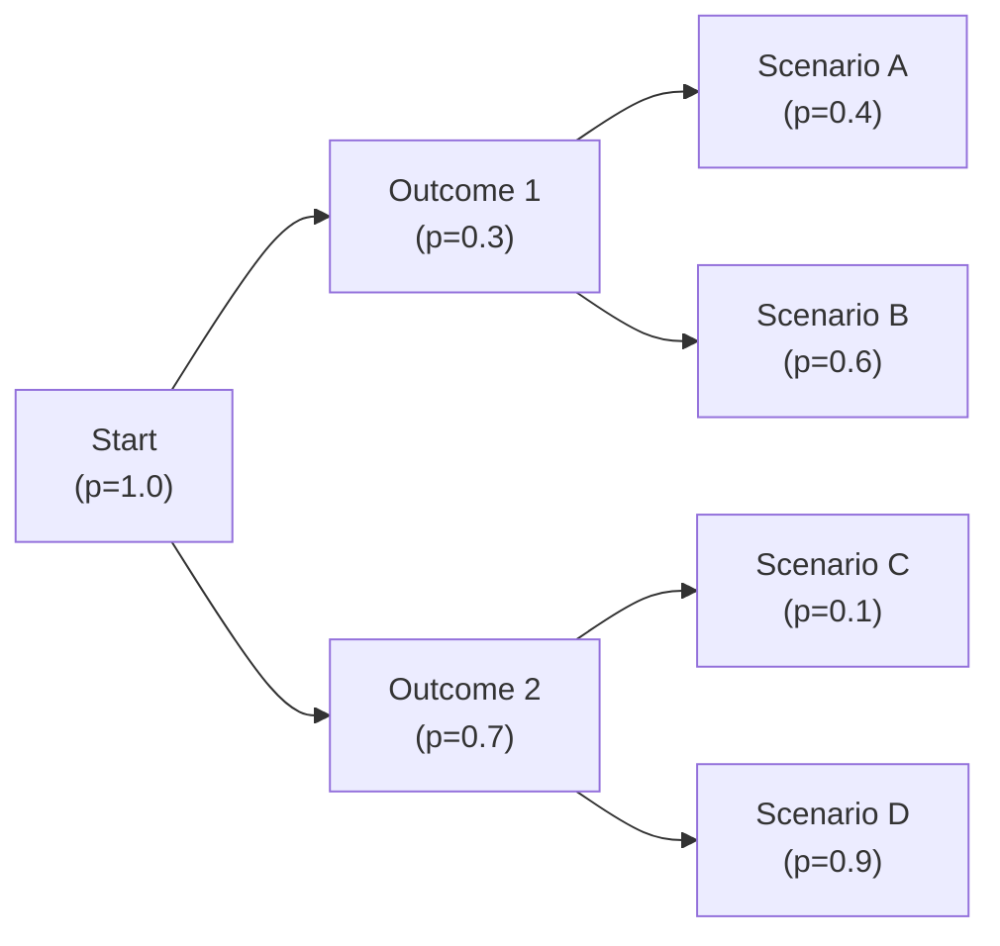

Probability trees are one of those concepts that can feel surprisingly intuitive once you see them in action. Honestly, the first time I encountered a probability tree, I remember scratching my head, thinking, “Wait, that’s all this is?” Let’s see why this tool can be so effective by mapping out possible outcomes, calculating probabilities at each branching event, and picturing how future uncertainties might pan out.

## A Tool for Visualizing Uncertainty

Imagine you’re analyzing a new product launch under different economic conditions. You’re unsure if the economy will expand, remain stable, or contract. Then, based on each of those outcomes, you consider possible sales figures. This layered uncertainty is where probability trees shine. With each branch representing a different outcome and set of probabilities, you can literally see how your scenario might evolve step by step.

• Probability Tree. A branching diagram showing possible outcomes and their probabilities.  
• Node. A point (or “decision point”) where a branch splits.  
• Branch. Each possible scenario from one node to the next, with an associated probability.  
• Terminal Node (Leaf). The final outcome after all branching.

By giving us a structure to break everything down, from the initial event to subsequent outcomes, we avoid the headache of mentally juggling an ever-expanding list of “what-ifs.”

## Branching Out: Constructing Probability Trees

Let’s say you’re working on a multi-year project. First-year performance might be “strong” (40% chance), “average” (50% chance), or “weak” (10% chance). Then, for each of these outcomes, there might be secondary events—like changes in interest rates or new competitors entering the market—that further branch your scenario. Each branch from a node must sum to 1.0:

• If you’re at a node representing “strong year,” the branches from “strong year” to its second-year outcomes (e.g., interest rates up vs. interest rates unchanged) should sum to 1.  
• It helps to label each branch with a probability (e.g., 0.40, 0.50) so you can keep track of the entire probability structure.

Even if the tree gets large and unwieldy, the process is straightforward. For instance, consider a simple two-step example:

- Step 1: Economic environment.  
  - High Growth (p = 0.25)  
  - Moderate Growth (p = 0.50)  
  - Low Growth (p = 0.25)

- Step 2: Based on the observed economic environment, your project might either Surpass Goals or Fall Short, each with its own conditional probabilities.

Because it’s easy to get lost in a bunch of branching events, a good practice is to keep your scenario sets mutually exclusive and collectively exhaustive—meaning they don’t overlap, and they cover all possible outcomes.

## Path Probabilities and Summation

A path probability is the product of each branch probability along a unique path. If you want to know the likelihood of “High Growth” followed by “Surpass Goals,” you multiply their probabilities:

p(High Growth → Surpass Goals) = p(High Growth) × p(Surpass Goals | High Growth)

And once you sum all path probabilities, the total must be 1.0. This structure makes it simple to calculate scenario-based metrics, such as expected values or expected payoffs.

If you’re projecting net present values (NPVs) under each end-of-branch scenario, you can compute an expected NPV:

Expected NPV = Σ [Probability of Path i × NPV(Path i)]

This sum runs over all possible end states. The same logic applies to portfolio returns—multiply each scenario’s outcome by its path probability, then add up all those products.

## Using Probability Trees in Scenario Analysis

Scenario analysis with probability trees can go beyond just forecasting a single outcome; it helps us see an entire landscape of possibilities. Let me share a short anecdote: A friend of mine was analyzing whether to expand her boutique during a pandemic recovery phase. She listed out possible macroeconomic environments (recovery vs. stagnation vs. renewed recession), the sales response under each environment, and then subsequent changes in consumer spending habits. With a probability tree, she could clearly see which chain of events dominated most of the expected value. That gave her confidence to go ahead with an expansion under certain flexible lease options.

### Integrating with Investment Decisions

In capital budgeting, you might break down multiple years of uncertain cash flows, each year branching based on sales volume or cost variations. In portfolio management, you could model how an asset’s returns might behave under different interest rate scenarios, which in turn depend on broad economic conditions. Probability trees also help:

• Identify “worst-case” or “tail events,” such as a 2% chance of everything going wrong.  
• Compare expected returns across multiple strategies by layering different growth or interest rate assumptions.

### Diagram Example

Below is a simple depiction of a two-stage probability tree (just to illustrate the format). Notice how each node branches out, and each path probability is the product of the branch probabilities:

In this example:  
• A → B → D has a path probability of 1.0 × 0.3 × 0.4 = 0.12.  
• A → C → G has a path probability of 1.0 × 0.7 × 0.9 = 0.63.  
• Summing all path probabilities equals 1.0.

## An Example in Practice

Let’s put some numbers to this. Suppose you’re examining a new product launch with three potential demand scenarios in the first phase:

1) Low Demand (probability 0.20)  
2) Medium Demand (probability 0.50)  
3) High Demand (probability 0.30)

Next, for each demand scenario, you might have a second phase that depends on a competitor’s reaction:

• Competitor reacts aggressively (A)  
• Competitor reacts mildly (M)

And you estimate probabilities like this:

- If Low Demand occurs: P(A) = 0.50, P(M) = 0.50  
- If Medium Demand occurs: P(A) = 0.30, P(M) = 0.70  
- If High Demand occurs: P(A) = 0.10, P(M) = 0.90

You then forecast net cash flows at each end branch:

1) Low & Aggressive (LA) → $100,000  
2) Low & Mild (LM) → $200,000  
3) Medium & Aggressive (MA) → $400,000  
4) Medium & Mild (MM) → $600,000  
5) High & Aggressive (HA) → $700,000  
6) High & Mild (HM) → $1,000,000  

The path probabilities multiply:

• Low & Aggressive: 0.20 × 0.50 = 0.10  
• Low & Mild: 0.20 × 0.50 = 0.10  
• Medium & Aggressive: 0.50 × 0.30 = 0.15  
• Medium & Mild: 0.50 × 0.70 = 0.35  
• High & Aggressive: 0.30 × 0.10 = 0.03  
• High & Mild: 0.30 × 0.90 = 0.27  

Expected payoff:

E(Cash Flow)  
= (0.10 × $100,000) + (0.10 × $200,000) + (0.15 × $400,000) + (0.35 × $600,000) + (0.03 × $700,000) + (0.27 × $1,000,000)  
= $10,000 + $20,000 + $60,000 + $210,000 + $21,000 + $270,000  
= $591,000

While each path is possible, you see the final “High & Mild” scenario has the largest payback but isn’t guaranteed (only a 27% chance). This clarifies expected value, best and worst outcomes, and helps in deciding whether to proceed with the launch.

## Probability Trees in Risk Management

For risk management, probability trees excel at highlighting tail events—outcomes that might be unlikely but catastrophic. Think of default risk on fixed-income securities, where an initial event (a firm experiencing liquidity stress) triggers subsequent events (covenant breach, rating downgrade).

By mapping out each branching step and associated probability, you can see how quickly minor issues escalate into major defaults. This helps in:

• Stress testing portfolios under different economic states.  
• Identifying the paths with high severity, even if they carry smaller probabilities.  
• Guarding against underestimating correlated outcomes (e.g., certain events that make others more likely).

Moreover, it’s easy to incorporate risk premiums or discount rates into each path if you’re deciding how to price potential contingencies or measure the present value of uncertain cash flows.

## Potential Pitfalls

Probability trees are terrific for clarity, but they come with pitfalls:

• Overconfidence in Probabilities. If your probabilities are wrong or too “optimistic,” the entire analysis can be misleading. Always cross-check with historical data or expert judgment.  
• Excessive Complexity. Ever see a chart so tangled it’s impossible to follow? Probability trees can get huge. Prune unnecessary detail or group similar outcomes.  
• Hidden Correlations. Sometimes event probabilities aren’t independent, and you might mistakenly multiply probabilities as if they were. Make sure you handle conditional probabilities correctly.  
• Time and Resource Intensive. Constructing accurate probability trees, especially for multiple stages, can be time-consuming.

That being said, the benefits often outweigh the costs, especially when analyzing big decisions with multiple, uncertain steps.

## Best Practices

Here are a few suggestions to streamline your probability tree usage:

• Start Simple: Outline major forks in the road first. Then break each branch into sub-scenarios.  
• Validate Probabilities: If you can, use empirical data to check assumptions. If data is lacking, ask subject-matter experts to refine estimates.  
• Label Branches Clearly: Put probabilities and scenario descriptions on each branch so you can keep track at a glance (e.g., “p = 0.25, High Demand”).  
• Evaluate Key Paths: After building the tree, identify which paths strongly influence your final expected value or risk profile.

## Final Thoughts for the Exam

Probability trees can show up in exam questions for scenario analysis, conditional probabilities, or multi-stage project evaluations. A strong approach includes:

• Carefully listing each branch’s probability.  
• Correctly multiplying and summing path probabilities.  
• Computing an expected payoff (such as an expected return).  
• Interpreting how tail outcomes might affect risk.  

If you find a question that describes a series of uncertain events (like fluctuations in interest rates, economic growth, or corporate earnings), consider whether a probability tree might clarify the scenario. Also remember the difference between real-world probabilities (reflecting observed or forecasted likelihoods) and risk-neutral probabilities (common in pricing derivatives). For your Level I (and, indeed, Level III down the road), the methodology is consistent: identify probabilities, track them down each branch, and combine outcomes to derive an aggregate measure.

## References

• Clemen, R. T., & Reilly, T. (2014). “Making Hard Decisions with DecisionTools.” Cengage Learning.  
• Broadie, M., & Detemple, J. (2004). “Option Pricing: Valuation Models and Applications.” Management Science, 50(9).  
• Gallo, Amy. “A Refresher on Decision Trees.” Harvard Business Review. https://hbr.org/2015/09/a-refresher-on-decision-trees  

--------------------------------------------------------------------------------

## Probability Trees for Scenario-Based Analysis – Practice Questions



### Suppose you have three scenarios (A, B, C) in a probability tree, each branching from the initial node. The probabilities for these scenarios must:  
- [ ] Be assigned arbitrarily as long as at least one is nonzero.  
- [x] Sum to 1.0.  
- [ ] Sum to 0.5 to allow for another node.  
- [ ] Each be greater than 50%.  

> **Explanation:** Probabilities at a single node in a decision tree must be mutually exclusive and collectively exhaustive, summing to 1.0.

### In a two-stage probability tree, the path probability of a particular end scenario is:  
- [ ] The arithmetic mean of each branch’s probability along that path.  
- [x] The product of each branch’s probability along that path.  
- [ ] A randomly selected portion of the total probability space.  
- [ ] The sum of each branch’s probability along that path.  

> **Explanation:** Path probabilities are found by multiplying the probabilities of each branch from the initial node to the terminal node.

### When conducting scenario analysis using probability trees, which of the following is NOT a common challenge?  
- [x] Elimination of tail events, as they never matter for risk management.  
- [ ] Overly optimistic probability assignments can bias expected value results.  
- [ ] Trees can become very complex with multiple stages and sub-branches.  
- [ ] Correlations or dependencies may not be handled properly.  

> **Explanation:** Tail events are typically extremely relevant for risk management, not something to be dismissed.

### In the context of constructing a probability tree, a “terminal node” (or leaf) refers to:  
- [ ] A node that loops back to the initial state.  
- [x] An end point that represents a final scenario or outcome.  
- [ ] A node with a 0% probability of transitioning further.  
- [ ] A node in the middle of the probability tree.  

> **Explanation:** Terminal nodes reflect final outcomes where no additional branching occurs.

### Which best describes the role of conditional probabilities in a probability tree?  
- [ ] They are used as placeholders to ensure the tree looks balanced.  
- [x] They specify the probabilities of subsequent outcomes given that a prior event has occurred.  
- [ ] They replace unconditional probabilities altogether.  
- [ ] They ensure that the sum of all paths is less than 1.  

> **Explanation:** Conditional probabilities represent what happens next after a preceding event, which is crucial in multi-stage trees.

### What is the key difference between real-world probabilities and risk-neutral probabilities in financial modeling?  
- [ ] Real-world probabilities always sum to zero.  
- [ ] Risk-neutral probabilities are typically more optimistic about outcomes.  
- [x] Risk-neutral probabilities adjust for the market’s pricing of risk, while real-world probabilities reflect empirical or forecasted likelihoods of events.  
- [ ] They are interchangeable in nearly all pricing contexts.  

> **Explanation:** Risk-neutral probabilities differ from real-world ones by integrating the market price of risk, a common concept in asset pricing and derivatives valuation.

### Which statement about “path probability” is accurate?  
- [ ] It can be negative if the outcome is unfavorable.  
- [ ] It must be divided by the number of branches to get a final probability.  
- [x] Each path probability is found by multiplying the probabilities along that path, and all path probabilities collectively sum to 1.  
- [ ] It must be at least 50% to have a substantial effect on the scenario.  

> **Explanation:** Each path from the initial node to a terminal node contributes part of the total probability mass. Those contributions sum to 1.0.

### In a multi-period scenario analysis, how might an analyst address the concern that the tree becomes overly complex?  
- [ ] By ignoring any branches with low probabilities.  
- [ ] By adding more branches to capture every possibility.  
- [ ] By arbitrarily reducing the probabilities for some branches.  
- [x] By pruning or combining branches that do not significantly affect the overall expected result.  

> **Explanation:** Probability tree “pruning” helps manage complexity while maintaining the integrity of the analysis.

### Which of the following is a recommended best practice when assigning probabilities to branches?  
- [x] Use historical data or expert judgment to avoid baseless assumptions.  
- [ ] Always assign higher probabilities to outcomes with greater payoffs.  
- [ ] Make each branch exactly 25% for simplicity.  
- [ ] Omit branches with uncertain outcomes.  

> **Explanation:** Valid probability assignments usually rely on data-driven or expert-based estimates rather than arbitrary assumptions.

### True or False: When the probabilities are known to be inaccurate, scenario analysis with a probability tree is worthless.  
- [x] True  
- [ ] False  

> **Explanation:** If your probabilities are significantly flawed, the resulting scenario analysis may be equally flawed. While scenario analysis can still offer insights into structure and risk path, probability estimates must be reasonably reliable to glean a meaningful expected outcome.


