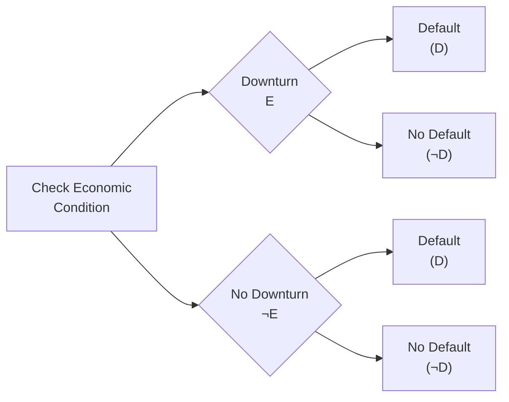

## Introduction

Have you ever felt like you had to tweak your viewpoint after stumbling upon a new piece of data? Maybe you were certain a company was going to beat earnings estimates this quarter—only to discover a negative analyst report the day before they announced results. If so, you’ve already dabbled in something called “Bayesian updating.” In finance, we use this concept all the time to refine our forecasts as new evidence arises, helping us form clearer expectations about future events. And all of it stems from something known as “conditional probability.”

Conditional probability is the foundation. Bayes’ Theorem is the roadmap. By understanding these cornerstones, you’ll be able to incorporate fresh information into your belief framework—be it analyzing a firm’s fundamentals, assessing the probability of loan defaults, or even deciding whether to adjust your portfolio’s exposure to certain sectors. Let’s explore why and how this works in real-world financial practice.

## Foundations of Conditional Probability

Conditional probability tells us how to update or refine the probability of one event, given that another event has already occurred. Symbolically, we write:

P(A | B) = Probability that A occurs given that B has already happened.

In many investment scenarios, you’ll see statements like: “Given that the central bank raised interest rates, what is the probability of a market correction?” or “If a firm just issued a profit warning, how does that change the probability that its bond will default?” These are straightforward examples of conditional probabilities.

### The Formula

Mathematically, conditional probability is expressed as:

(1)  
P(A | B) = (P(A ∩ B)) / P(B),  

where P(A ∩ B) is the probability that both events A and B happen. Just be careful with the denominator—P(B) must be nonzero; otherwise, the expression doesn’t make sense.

### Why This Matters in Finance

In prior sections on probability trees (see earlier discussion in this chapter), you may recall how scenario analysis branches out based on events that occur first. Understanding these conditional branches is vital. For instance, if you believe a company’s success in an emerging market is contingent on stable political conditions, you are effectively calculating P(Success | Stability). And if new information arrives—say an unexpected shift in the political regime—it changes the baseline assumption for that probability.

## Bayes’ Theorem

You might be thinking, “So how do we systematically incorporate new evidence into our probability estimates?” That’s where Bayes’ Theorem lights the way. Anytime we mention “Bayesian updating,” we’re talking about an application of Bayes’ formula, which is:


P(A \mid B) = \frac{P(B \mid A)\,P(A)}{P(B)}.


### Key Elements

• P(A): This is your prior probability—the belief you held before the new information (B) arrived.  
• P(B | A): The probability of observing the new information (B) under the assumption that event A indeed occurs. This is sometimes called the “likelihood.”  
• P(B): The overall probability of the new information (B).  
• P(A | B): The posterior probability—your updated belief about A after factoring in B.

### Interpreting Bayes’ Theorem

Bayes’ Theorem can feel abstract, so let’s put it plainly: you start with an initial viewpoint (the prior), and you see some new data (the likelihood). Bayesian updating uses that new data to shift your viewpoint, producing the posterior. The new data might confirm your prior belief (posterior remains close to the prior) or substantially challenge it (posterior diverges from the prior).

In finance, you might initially believe there’s, say, a 10% chance a corporation will default on its bonds over the next year. Then you learn the firm’s CFO resigned unexpectedly (the new evidence). This event may have a higher likelihood of occurring if the firm were on shaky financial ground. You combine your prior (10% chance of default) with the likelihood of a CFO departure if the company were actually in distress. The result is a revised, or posterior, probability of default—hopefully sharper and more aligned with reality.

## Bayesian Updating in Finance

Let’s talk about how Bayes’ Theorem shows up in real financial practice. After all, theory is lovely, but practical application is what transforms this into a go-to tool.

### Fundamental Analysis

Analysts often rely on prior research to form a baseline probability—for instance, the chance that a company’s earnings will exceed consensus estimates. If new information, such as a surprising competitor product launch, arrives, the analyst updates the original stance. Essentially, the earlier probability is replaced or adjusted by the posterior probability after weighing the impact of that new information.

### Credit Risk Assessment

Credit risk is full of conditional probabilities. The probability of default (PD) is rarely static. In a Bayesian approach, you might set an initial PD based on a borrower’s credit profile and industry metrics. Then you observe something new, like a downgrade from a rating agency. You feed that new info into your Bayes’ formula and come out with a revised PD. If your posterior probability of default crosses a certain threshold, you might need to book additional loan loss reserves or reconsider your holdings in that bond.

### Forecasting and Dynamic Adjustments

We also see Bayesian thinking in economic forecasting: you have a prior forecast for GDP growth, then quarterly data releases provide fresh evidence. With each new data point, you refine the forecast. This dynamic, iterative process can help you remain agile in your strategic asset allocations. 

Let’s say your macro model assigned a 30% chance that the economy would slip into recession by year’s end. Then a spate of weak payroll numbers emerges. Plugging these indicators into your likelihood function, you might update your recession probability to 40% or beyond, shifting your portfolio to a more defensive stance.

## Practical Examples

Sometimes it helps to walk through the math. Let’s do a quick, simplified scenario:

• Suppose you are considering the probability that a particular stock will outperform the market this quarter (event A). You open your analysis believing that P(A) = 0.30 (a 30% chance). That’s your prior.  
• New evidence (B) is a surprisingly strong earnings announcement. Historically, if the stock outperforms (A), the probability of a strong earnings announcement (B) is 0.90. So we have P(B | A) = 0.90.  
• Overall, from all companies in the market, the probability of seeing a “strong earnings announcement” is 0.50. So P(B) = 0.50.

Applying Bayes’ Theorem:


P(A \mid B) = \frac{P(B \mid A) \, P(A)}{P(B)}
           = \frac{0.90 \times 0.30}{0.50}
           = 0.54.


So, upon hearing about the strong earnings, the probability of the stock outperforming leaps from 30% (the prior) to 54% (the posterior). This is Bayesian updating in action: new evidence pushing your viewpoint into a new range.

## Diagramming Conditional Probability with Mermaid

Below is a simple probability tree diagram showing how events may branch under conditional probabilities. Assume we are analyzing the chance a bond defaults (D) or does not default (¬D) given an economic downturn (E).

• From the top node, we split into two possible states of the economy: downturn (E) or no downturn (¬E).  
• Each branch leads to a subsequent chance of default or no default. The probabilities along these branches reflect conditional relationships like P(D | E) or P(D | ¬E).

Such a tree provides a visual clue about how we move from a broader economic environment to specific outcomes (a default or no default). When new information arrives—say, fresh GDP data indicating a downturn—you shift the balance of probabilities along each branch.

## Pitfalls and Best Practices

Even though Bayesian updating shines in many finance applications, there are some issues you should watch out for:

• Misleading Priors: If your prior probability is too far off, even the best new information might not correct your trajectory adequately. A flawed prior can produce skewed posterior estimates. Think of it like a GPS: if your initial location is wildly wrong, the directions you end up following may not help you get where you really need to be.  
• Biased Likelihoods: It’s also tricky to estimate how strongly new evidence correlates with the underlying event. Overstating or understating P(B | A) can drastically alter your posterior probability.  
• Overconfidence: If you’re uncritically sure about your prior or your data, you might not be as open to changing your beliefs in light of new evidence—stagnating your forward-looking analyses.  
• Frequentist vs. Bayesian: Traditional (frequentist) approaches rely on long-run frequencies, ignoring prior beliefs. Bayesian methods explicitly incorporate priors. Neither is universally “better.” The key is choosing the approach consistent with your data and your investment objectives.

In practice, you’ll see Bayesian inference used in conjunction with robust data sets to refine priors and likelihoods. For instance, you might rely on historical datasets for calibrating the probability of default, then incorporate real-time news or rating downgrades in a Bayesian manner.

## Final Thoughts

Conditional probability and Bayesian updating aren’t just theoretical curiosities; they form the engine room of modern investment and risk analysis. Whether you’re analyzing a biotech stock’s success rate, modeling portfolio drawdowns under stressful conditions, or assessing the credit risk of a troubled borrower, these tools help you incorporate new information systematically. They ensure your decisions can evolve alongside the financial landscape, rather than remain stuck in outdated assumptions.

If you find these concepts a little overwhelming—don’t worry, we’ve all been there. The best approach is to practice them on real data. Even small hypothetical problems with real numbers can help you master the mechanics of Bayes’ Theorem. Then, when it comes time to navigate the complexities of live markets, you’ll have a decision-making framework that’s both rigorous and adaptable.

## References, Further Reading, and Resources

• DeGroot, M. H., & Schervish, M. J. (2012). “Probability and Statistics” (4th ed.). Pearson.  
• Gelman, A., Carlin, J., Stern, H., Dunson, D., Vehtari, A., & Rubin, D. B. (2013). “Bayesian Data Analysis.” CRC Press.  
• A good introductory walkthrough: <https://towardsdatascience.com/bayes-theorem-and-bayesian-inference-explained-2e470872732c>  

Also remember to revisit Chapter 4’s sections on scenario analysis (4.2) and the concept of risk-neutral vs. real-world measures (4.5) if you want a broader perspective on how probabilities are applied in both theoretical and practical finance. Keep practicing, keep refining your priors, and stay curious!

---

## Mastering Conditional Probability and Bayesian Updating: Test Your Knowledge



### In conditional probability, what does P(A | B) represent?

- [ ] The probability that events A and B both occur, divided by P(A).  
- [x] The probability that event A occurs, given that event B has occurred.  
- [ ] The posterior probability that event A has occurred.  
- [ ] The prior probability of event A.  

> **Explanation:** P(A | B) is the definition of conditional probability, meaning the probability of A happening once we know B has taken place.

### Which term in Bayes’ Theorem is associated with “the probability of seeing the new information, assuming event A is true”?

- [ ] Posterior probability  
- [ ] Prior probability of A  
- [x] Likelihood (P(B | A))  
- [ ] Marginal distribution of B  

> **Explanation:** In Bayes’ Theorem, P(B | A) is known as the “likelihood.” It captures how probable the evidence B is under the scenario that A actually occurred.

### In a Bayesian framework, if your prior probability is chosen poorly, what can happen?

- [x] Even correct likelihood data might not lead to accurate posterior estimates.  
- [ ] Bayes’ Theorem automatically corrects for poor priors.  
- [ ] The newly observed data becomes irrelevant.  
- [ ] The final outcome is guaranteed to remain the same anyway.  

> **Explanation:** If the prior is drastically off, the updated (posterior) probabilities may remain biased, especially if the new data doesn’t strongly contradict that prior.

### Suppose you have P(A) = 0.20 and P(B | A) = 0.70, and the overall probability of B is 0.10. Using Bayes’ Theorem, what is P(A | B)?

- [ ] 0.14  
- [ ] 0.02  
- [ ] 1.00  
- [x] 0.14 (i.e., (0.70×0.20)/0.10)  

> **Explanation:** P(A | B) = [0.70 × 0.20] / 0.10 = 0.14.

### An equity analyst revises the probability of a firm beating its earnings estimate after reading a positive earnings preview. In Bayesian terms, what is this updated probability called?

- [ ] Prior probability  
- [ ] Likelihood  
- [ ] Marginal probability  
- [x] Posterior probability  

> **Explanation:** After reading new material information, the analyst updates the original (prior) probability to the posterior, reflecting the new evidence.

### Which of the following is NOT a challenge faced when using Bayesian updating in finance?

- [ ] Estimating the prior accurately  
- [ ] Correctly determining the likelihood of new evidence  
- [x] Having to rely on laws of large numbers for inference  
- [ ] Overconfidence bias in updating beliefs  

> **Explanation:** Bayesian approaches do not necessarily rely on long-run frequencies or the law of large numbers in the same way frequentist approaches do. They integrate priors and new evidence explicitly.

### Bayesian updating is helpful in credit risk analysis because it:

- [ ] Disregards changes in a borrower’s condition.  
- [ ] Uses only historical frequencies for default rates.  
- [x] Allows analysts to incorporate new evidence (e.g., rating downgrades) to revise default probabilities.  
- [ ] Is unaffected by prior assumptions.  

> **Explanation:** Credit risk is inherently dynamic. As new information emerges about a borrower’s solvency (like a rating agency downgrade), Bayesian updating refines the default likelihood accordingly.

### In financial modeling, how does Bayes’ Theorem handle new information?

- [ ] It assigns new data a 50% weight by default.  
- [x] It systematically updates prior beliefs using the likelihood of new data.  
- [ ] It never revises the prior unless the new evidence is conclusive.  
- [ ] It always sets the posterior equal to the new data probabilities.  

> **Explanation:** Bayes’ Theorem blends your prior probability and the likelihood of seeing the new data to produce the posterior. This ensures a structured update mechanism.

### If an event is extremely rare (low prior probability) but the data has a high likelihood of being observed if the event is true, the posterior probability will:

- [ ] Decrease to zero.  
- [ ] Remain the same as the prior.  
- [ ] Be less than the prior.  
- [x] Increase from the prior but may still be moderate, depending on P(B).  

> **Explanation:** In Bayesian updating, a low prior can still be elevated if we see evidence that strongly correlates with the event. However, the overall posterior depends on how probable the evidence is also in other scenarios.

### True or False: In a Bayesian context, frequentist methods are always inferior for financial forecasting.

- [ ] True  
- [x] False  

> **Explanation:** While Bayesian methods are often very useful in dynamic situations, frequentist methods can still be valid. The choice depends on your assumptions, data availability, and the nature of the questions asked.


