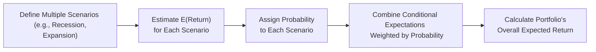

## Introduction

Have you ever tried to guess a friend’s reaction under different circumstances—maybe how they'd respond to a gift on a bad hair day versus a good one? That’s somewhat like dealing with conditional expectations in investments. We’re basically asking: “What do I expect to happen if a certain condition is true (or has become true)?” 

In a financial context, conditional expectations allow us to fine-tune our forecasts for returns, risk exposures, or even portfolio strategies based on the market or economic environment. For instance, we might predict a stock’s return differently in a recession than in an expansion. By factoring in conditions—like changes to interest rates, credit ratings, or new product announcements—investors gain a more nuanced perspective of risk and return.

This article will walk you through not just the definition of conditional expectations but also their practical applications, from risk-factor modeling to event studies and scenario analysis. We’ll keep the tone slightly informal, but don’t worry—we’ll still cover the advanced and rigorous analytics that you’d expect at the upper tiers of the CFA curriculum. Let’s dive in.

## Understanding Conditional Expectation

Conditional expectation is the expected (mean) value of a random variable given a specific event or condition. Formally, if X is a random variable and A is an event (or condition), the conditional expectation E[X|A] is the mean value of X assuming A has occurred. 

In financial contexts, you can think of X as an asset return or a cash flow, while A might be an event such as “the Federal Reserve raised interest rates by 50 basis points.” We want to estimate E[Return | Rate Hike], which can differ significantly from E[Return] if the rate hike does not happen.

Mathematically, for two random variables X and Y, conditional expectation can also be expressed as E[X | Y = y]. Practically, we specify the random variable Y (e.g., economic states), and we’re interested in the distribution of X once Y is known.

### Why Does Conditional Expectation Matter?

• It captures state-dependent behavior. Asset returns often behave differently, for instance, under “normal” versus “stress” market conditions.  
• It improves forecasts by letting you incorporate newly revealed information, such as changes in GDP outlook or a firm’s earnings revision.  
• It refines risk assessments. Real-world data often show that tail risks become amplified under certain conditions (e.g., recession triggers higher correlations).

## Key Applications in Investments

### Risk Factor Modeling

One of the most prominent uses of conditional expectations in investment analysis is risk factor modeling. Suppose you are modeling an equity’s returns based on macroeconomic variables like interest rates, inflation, or GDP growth. In a typical factor model, you might write:

E[Rᵢ] = α + β₁·(Interest Rate Factor) + β₂·(Inflation Factor) + …

But a simple linear expectation might overlook how magnitudes of factor movements differ in high-volatility regimes or recessions. Instead, we can say:

E[Rᵢ | Recession] vs. E[Rᵢ | Expansion]

This means we assess the stock’s expected return if we already know the economy is heading into a recession, which might come with higher defaults, tighter credit, and more risk aversion. Risk factor modeling with conditional expectations acknowledges that beta relationships can vary by state. For instance, a stock might be more sensitive to interest rate changes in a recession than in an expansion.

### Credit Risk Analysis

Credit risk analysts often rely on conditional expectations when estimating the probability of default (PD) and recovery rates given a particular credit rating or economic environment. For example:

• PD of a BBB-rated bond in a healthy economy  
• PD of that same BBB-rated bond in a severe downturn  

We know from historical data that default probabilities jump under adverse conditions. So conditional default probabilities become crucial to gauge potential losses. If, say, new data implies that a borrower’s industry is significantly affected by changing regulations, the updated conditional default probability can be much higher than the unconditional historical PD.

### Event Studies

Event studies examine how a specific event (like a merger announcement or an earnings call) impacts stock prices—often measured as abnormal returns. Conceptually, we’re asking:

E[Abnormal Return | Event Occurred]

compared to

E[Abnormal Return | No Event].

Or, equivalently, we look at how realized returns deviate from what we would have expected absent the event. By conditioning on the event having occurred, we isolate the incremental impact from the broader market noise.

### Scenario Analysis

Scenario analysis takes conditional expectations to a broader planning level. Instead of focusing on just one condition, scenario analysis posits multiple possible futures—e.g., “mild recession,” “deep recession,” “moderate expansion,” or “robust expansion”—and then attaches probabilities to each. Under each scenario, we estimate:

• E[Return | Scenario]  
• E[Volatility | Scenario]  
• E[Correlation | Scenario]  

And we combine these with scenario probabilities to get a more comprehensive picture of the distribution of potential portfolio returns. This helps portfolio managers anticipate not just central outcomes but also extremes, including tail losses. In practice, this is essential for stress testing and capital allocation decisions, often relevant for regulatory frameworks (Basel Accords for banks, Solvency II for insurance companies, etc.).

### Fundamental Bottom-Up Analysis

Even the old-fashioned, fundamental approach to valuing a single company uses conditional expectations. For instance, if a firm is about to launch a new product, or if new regulation is about to facilitate (or hamper) its business, analysts will frequently revise their discount cash flow (DCF) model accordingly:

E[Cash Flow | Product Launch] ≠ E[Cash Flow | No Product Launch]

As new information emerges (e.g., the product launch is delayed), the analyst updates the expected growth rates and free cash flows, factoring in the new baseline condition. This mirrors real-world practice where analysts must swiftly update assumptions.  

## Incorporating Conditional Expectations Into Portfolio Optimization

When building a portfolio, ignoring conditional relationships can lead to underestimating risk. For instance, asset correlations are known to “spike” during market crises. So a portfolio that appears well-diversified under normal conditions might not be well-diversified at all during a downturn. 

Portfolio managers might adopt state-dependent correlation assumptions:

Covᵣ(X, Y) = E[(X − μₓ)(Y − μᵧ) | Recession],  
Covₑ(X, Y) = E[(X − μₓ)(Y − μᵧ) | Expansion],

where Covᵣ(X, Y) could be substantially higher than Covₑ(X, Y). By building these conditional covariance estimates into portfolio optimization, you get a more robust solution that prepares you for market turbulence. 

## Practical Modeling Approaches

### Bayesian Updating and Conditional Probabilities

In many real-world scenarios, we have partial or imperfect information. So we use Bayesian updating:

P(A | B) = [P(B | A) × P(A)] / P(B),

where A might be “ Economy is in recession next quarter” and B might be “ Leading Economic Indicator suggests a downturn.” Once B is observed, we update our probability for A. This updated probability then transforms our expected returns and risk estimates under the new condition, effectively producing E[R | B].

### Conditional Regression Analysis

Sometimes, you’ll see empirical models that incorporate dummy variables or regime-switching to capture conditional behaviors (e.g., Markov switching models or threshold autoregressive models). For instance, a Markov switching model might define:

State 1: Normal Market → Rᵗ = α₁ + β₁Xᵗ + ε₁ᵗ  
State 2: Crisis Market → Rᵗ = α₂ + β₂Xᵗ + ε₂ᵗ  

The model transitions probabilistically between states. That means at any given time t, there’s a certain probability p₍t₎ of being in State 1 or in State 2, and the expected return E[Rᵗ] is a weighted average: p₍t₎·(α₁ + β₁Xᵗ) + (1 − p₍t₎)·(α₂ + β₂Xᵗ). A host of advanced time-series techniques (like ARIMA with exogenous variables, GARCH family volatility processes, or vector autoregression) rely heavily on conditional expectations to forecast future states of the world.

### Example: Conditioned on Economic Indicators

Let’s say you’re analyzing a biotech stock’s returns. You suspect it’s quite sensitive to consumer spending. You gather monthly returns (Rᵗ) for the stock, along with a consumer sentiment index (CSIᵗ). You hypothesize that if CSIᵗ < X (some threshold), the biotech’s systematic factors become more negative. Then:

E[Rᵗ | CSIᵗ < X] = α₁ + β₁(R_mᵗ)  
E[Rᵗ | CSIᵗ ≥ X] = α₂ + β₂(R_mᵗ)  

where R_mᵗ is the market return in month t. You can estimate these parameters with a regression that uses a dummy variable for CSIᵗ < X. This approach helps you see how the relationship between the biotech stock and the market changes when consumer sentiment dips below a certain level.

## Diagram: Conditional Expectation in Scenario Analysis

Below is a simple Mermaid diagram that illustrates how scenario analysis splits the world into different states, each with conditional returns and probabilities.



In scenario-based portfolio construction, you effectively produce weighted averages of these conditional expectations for each “branch,” capturing the possibility that the economy or certain events might push the portfolio into different return profiles.

## A Brief Python Example

Occasionally, you might see a quick-and-dirty approach to scenario-based returns in Python. Let’s assume we have two scenarios—Recession (R) and Expansion (E)—and we want to compute the portfolio’s expected return.

```python
import numpy as np

p_recession = 0.30
p_expansion = 0.70

E_return_recession = -0.05  # -5%
E_return_expansion = 0.12   # 12%

portfolio_expected_return = (p_recession * E_return_recession + 
                             p_expansion * E_return_expansion)

print(f"Portfolio's Overall Expected Return: {portfolio_expected_return:.2%}")
```

When working with more sophisticated models, you’d incorporate conditional volatilities and correlations, and you might even do Monte Carlo simulation with different states.

## Best Practices and Common Pitfalls

• Identify relevant conditioning events. Blindly choosing a condition (like “holiday season” for a biotech stock) might lead to spurious or meaningless analysis.  
• Use robust data. If you’re conditioning on “market downturns,” define them carefully and gather enough historical examples so that your estimates have statistical power.  
• Understand potential regime shifts. Historical data might not fully reflect new structural shifts in the economy or corporate sector.  
• Don’t ignore correlation spikes. The biggest pitfall is underestimating correlation in bad times—your portfolio might not be as diversified as you think.  

## Implications for Ethics and Professional Standards

In the spirit of the CFA Institute Code of Ethics and Standards of Professional Conduct, applying conditional expectations in portfolio management fosters a more diligent and objective approach to risk evaluation. By thoroughly analyzing different economic or market states—and not over-relying on a single static assumption—analysts are better positioned to:

• Act with integrity by presenting a fair and realistic assessment of potential risks to clients.  
• Exercise diligence and a reasonable basis for recommendations, an important part of the Code and Standards.  
• Manage conflicts of interest more transparently, especially when discussing worst-case or stress scenarios that might be unfavorable to a portfolio’s short-term performance.  

## Conclusion and Exam Tips

Conditional expectations let you move beyond one-size-fits-all forecasts. When you account for the possibility that returns may shift under different economic or market conditions, your analysis becomes richer and (hopefully) more accurate in capturing real-world complexities. Whether you’re modeling wide macroeconomic scenarios or analyzing the impact of a single corporate event, properly handled conditional expectations help you:

• Align your assumptions with emerging data (Bayesian-style updating).  
• Develop more realistic pictures of risk and correlation (particularly in tail events).  
• Communicate downside scenarios clearly, in keeping with best practices and ethical norms.

From an exam perspective, keep an eye out for question prompts that suggest conditional information. For example: “Given that interest rates have risen by 1%, what is the new expected return of the portfolio?” or “What is the portfolio’s systematic risk if the market transitions to a high-volatility regime?” Remember to:

• Identify the conditional event or scenario.  
• Use relevant data or assumptions to recast the distribution of returns.  
• Carefully articulate how you arrived at your revised expectation or probability.  
• Remain prepared to do these calculations relatively quickly in item set or constructed-response formats.

As always, watch for common pitfalls like ignoring the sample size for a particular scenario or failing to incorporate the interplay among multiple factors (e.g., interest rates and inflation simultaneously). Properly done, conditional analyses can be a real differentiator in your overall exam performance.

## References and Further Reading

- Copeland, T., Weston, J., & Shastri, K. (2013). Financial Theory and Corporate Policy. Pearson.  
- Campbell, J. Y., Lo, A. W., & MacKinlay, A. C. (1997). The Econometrics of Financial Markets. Princeton University Press.  
- Tsay, R. S. (2010). Analysis of Financial Time Series. Wiley.  
- CFA Institute. (2022). CFA Program Curriculum. CFA Institute.

## Test Your Knowledge of Conditional Expectations in Investments



### Conditional Expectations in Scenario Analysis

- [x] They allow us to incorporate specific economic or market states in estimating expected returns.
- [ ] They ignore new information and stick to historical average returns.
- [ ] They assume returns are independent of economic indicators.
- [ ] They simplify correlation structures by ignoring state dependencies.

> **Explanation:** Conditional expectations specifically let us tailor return estimates to particular scenarios, accommodating changes in risk or economic states.

### Boosting Forecast Accuracy

- [x] Conditional expectations improve forecast accuracy by incorporating additional information about underlying events.
- [ ] They reduce the complexity of the forecasting process by omitting scenario-based data.
- [x] They can be state-dependent, allowing different coefficient estimates when certain conditions are met.
- [ ] They assume unconditional market behavior regardless of new data.

> **Explanation:** Conditional expectations can enhance accuracy by factoring in new or state-specific data. However, they can make the model more complex, not less.

### Risk Factor Modeling

- [x] In risk factor modeling, analysts often estimate expected returns conditional on macroeconomic variables like interest rates.
- [ ] Conditional risk factor modeling is only relevant for short-term traders.
- [ ] It generally ignores variability in factor sensitivities across different economic states.
- [ ] Factor models typically avoid conditional approaches.

> **Explanation:** Analysts use conditional expectations in risk factor models to account for dynamic relationships between returns and economic variables.

### Credit Risk Applications

- [x] Conditional probabilities of default can rise significantly during economic recessions.
- [ ] Conditional default probabilities remain constant across different economic states.
- [ ] Recovery rates are typically unaffected by macroeconomic conditions.
- [ ] Conditional expectations don’t apply to credit risk analysis.

> **Explanation:** Economic conditions (like recessions) can increase default risk and lower recovery rates, making conditional PD assessments critical.

### Event Studies

- [x] Event studies quantify abnormal returns relative to a hypothesis of no event impact.
- [ ] Event studies ignore the timing of the event.
- [x] They measure stock response conditional on the event actually having occurred.
- [ ] They rely solely on unconditional stock return averages.

> **Explanation:** Event studies look at returns around the time of a key event relative to a normal-returns benchmark, explicitly conditioning on the occurrence of the event.

### Portfolio Correlation Pitfalls

- [x] Correlations often spike under stress conditions, which can be captured by conditional models.
- [ ] In a crisis, correlations always remain stable or go down.
- [ ] Correlation coefficients never change across economic states.
- [ ] Conditional expectations ignore correlation changes.

> **Explanation:** Conditional expectations can address the phenomenon of correlations increasing in market downturns—an important risk factor for portfolio managers.

### Bayesian Updating

- [x] It helps refine the probability of a future event based on newly observed signals.
- [ ] It discards prior knowledge when new data arrives.
- [x] It can be used to update conditional expectations based on partial information.
- [ ] It is unrelated to conditional probability.

> **Explanation:** Bayesian approaches incorporate both prior probabilities and new evidence to update our conditional understanding of future events.

### Scenario Analysis Mechanics

- [x] Scenario analysis calculates expected returns for multiple states and then weights them by their probabilities.
- [ ] Scenario analysis always focuses on a single macroeconomic condition.
- [ ] Scenario-based returns are averaged together without any weighting.
- [ ] Scenario analysis is identical to unconditional forecasting.

> **Explanation:** By building multiple scenarios, we create conditional expectations for each state and then combine them probabilistically.

### Fundamental Analysis

- [x] Bottom-up analysts often adjust expected cash flow models based on conditional events like product launches.
- [ ] Conditional expectations are irrelevant to bottom-up analysts.
- [ ] New product launches never affect cash flow estimates.
- [ ] Regulation changes are excluded from fundamental bottom-up modeling.

> **Explanation:** Conditional expectations are integral to fundamental analysts updating their DCF or earnings models with new information that affects future cash flows.

### True or False: Ethics in Conditional Modeling

- [x] True
- [ ] False

> **Explanation:** The CFA Institute Code and Standards advocate an accurate and thorough presentation of likely outcomes, including scenario or state-dependent analysis, to ensure fair dealing and integrity with clients.


