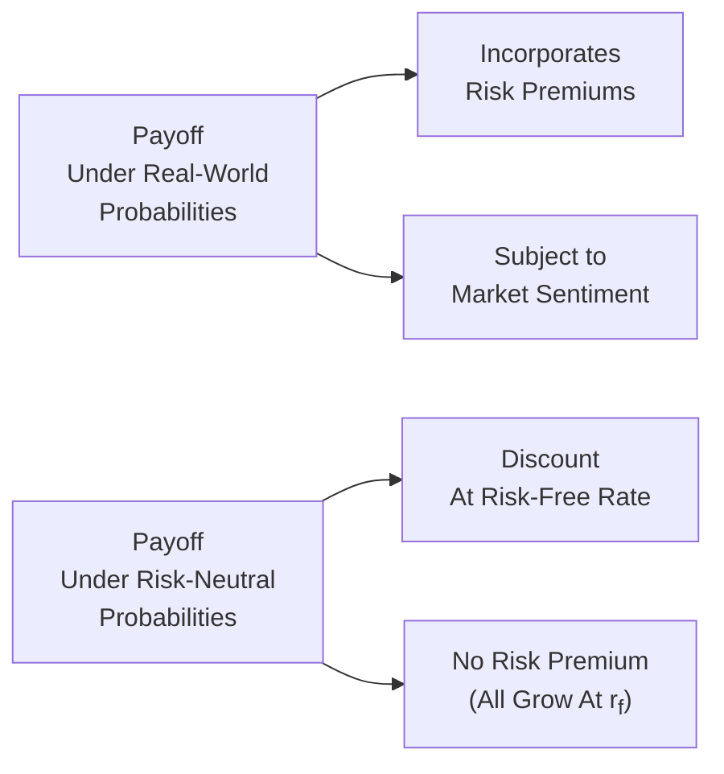

## Introduction and Intuitive Overview

If you’ve ever priced an option using a Black–Scholes calculator, you might have wondered, “Wait—how come everything is discounted at the risk-free rate? Don’t investors demand extra compensation for taking on risk?” I sure remember my first time grappling with that question—I was in a time crunch for an exam, all the while thinking, “This can’t be right. Everybody is risk-averse, we need to factor that in!” But it turns out, we switch to something called a risk-neutral universe when we do these calculations. It’s a neat trick that makes mathematical life easier, though it might feel artificial at first glance.

That little “trick” is exactly what we’ll explore here, along with how it contrasts with real-world probability measures—the probabilities that best capture how you, me, and the rest of the market participants might really expect the future to unfold. As a financial analyst, especially one diving into derivatives, risk management, or even stress testing, understanding these two sets of probability measures is absolutely game-changing. Let’s dig in.

## Understanding the Two Probability Worlds

Before we jump into the contrasts, let’s outline what these two measures are:

• Risk-neutral probability measure (often denoted Q):
  – An artificial or “transformed” set of probabilities where all assets are assumed to grow on average at the risk-free rate.  
  – Extremely convenient for pricing derivatives like options because it turns out that, in such a world, we can discount expected payoffs at the risk-free rate and still get correct market prices.

• Real-world probability measure (often denoted P):
  – The empirical or “actual” set of probabilities describing the real likelihood of events—some might call it the best guess about how the world really behaves.  
  – Captures the fact that investors are risk-averse, that there are risk premiums to be earned for holding risky assets, and that actual asset returns might differ significantly from the risk-free rate.

It might help to think of risk-neutral probabilities as something you’d use strictly inside a tidy spreadsheet, while real-world probabilities correspond to the complicated, messy ways market participants actually price risk in day-to-day trading and long-term investing.

## Basic Mathematical Foundations

In risk-neutral pricing, the theoretical value of a derivative or other contingent claim at time 0 is given by the discounted expectation of the payoff under the risk-neutral measure Q:


P_0 = e^{-rT}\,\mathbb{E}^{Q}\bigl[\text{Payoff}_T\bigr],


where:

• \\(P_0\\) is the current fair price of the derivative.  
• \\(r\\) is the risk-free interest rate.  
• \\(T\\) is the time to maturity.  
• \\(\mathbb{E}^{Q}[\cdot]\\) denotes the expectation under the risk-neutral measure Q.  

In a real-world setting (with measure P), you might discount by something greater than \\(r\\) if compensation for risk is involved. If we used the actual distribution of returns (i.e., the real-world probability measure) in a naive discounting scheme at the risk-free rate, we’d likely arrive at an incorrect price relative to how markets actually trade. The entire risk-neutral framework ensures internal consistency in the price of derivatives across the market.

## Why Do We Even Have Two Measures?

### Layering Out the Intuition

Imagine for a moment that you’re building an options pricing model, and you want it to reconcile with the market’s observed option prices. Those observed option prices reflect a certain discounting approach that’s consistent across all sorts of derivative instruments. To replicate that consistency, risk-neutral pricing says: “All that matters for derivative pricing is that if there were an arbitrage, it would get exploited—so assume a theoretical world where every risky asset grows at the risk-free rate. Now, figure out the expected payoff and discount it.”

Meanwhile, if you’re forecasting the expected return on an equity market portfolio over the next decade for strategic asset allocation, you certainly care about the equity risk premium, investor sentiment, and macroeconomic conditions. That is a real-world forecast—you’re trying to guess how the actual distribution of returns (and volatility, tail events, etc.) will unfold.

Hence:

• Risk-neutral measure Q → internal consistency for pricing and hedging derivatives.  
• Real-world measure P → actual probabilities useful for forward-looking portfolio decisions, risk management, and scenario analysis.

## A Visual Contrast

Below is a simple flowchart that highlights the differences between how payoffs might be handled under real-world probabilities vs. risk-neutral probabilities:



As you can see, in the real world, you’ll incorporate market information, risk premiums, and investor behavior, while in a risk-neutral world, your discount rate is purely the risk-free rate, and you assume away risk aversion.

## Real-World Probabilities in Practice

### Applications in Long-Term Investment Analysis

If you’re doing retirement planning or designing a capital investment project, you generally can’t just say, “Let’s assume everything grows at the risk-free rate.” That’s unrealistic. Real-world probabilities let you explicitly model risk premiums, macroeconomic expansions or recessions, changes in volatility regimes, and shifts in investor sentiment. 

That’s why real-world measures come into play in:

• Asset Allocation: If you anticipate that equities will return 7% with a standard deviation of 15% over the next 10 years, that’s a real-world viewpoint.  
• Regulatory Stress Testing: Think about the 2008 financial crisis. Regulators must use real probability assumptions for adverse scenarios to see if institutions have enough capital to survive truly bad events.  
• Scenario Analysis: For instance, you might say, “What if inflation unexpectedly spikes? What if GDP growth tanks?” You need real-world probabilities to figure out if these events are 5% likely or 0.1% likely.

### A Quick Python Snippet

Here’s a short example of simulating hypothetical asset returns using a real-world distribution. Let’s say we assume a normal distribution (although in reality, returns can be fat-tailed, etc.). We’ll do something simple with Python to generate returns under a real-world measure P:

```python
import numpy as np

np.random.seed(42)

mu = 0.07      # 7% annual expected return (real-world)
sigma = 0.15   # 15% annual volatility
n_sims = 5

returns = np.random.normal(mu, sigma, n_sims)

print("Simulated Real-World Returns:")
for i, r in enumerate(returns):
    print(f"Year {i+1}: {r:.2%}")
```

When you run something like this, you’re effectively modeling returns under your real-world assumptions of risk and reward, not the simplistic “everything grows at the risk-free rate” approach from the risk-neutral measure.

## Risk-Neutral Measures in Derivative Pricing

### Making Everyone “Indifferent to Risk”

It might seem strange—why do we even talk about a hypothetical world where nobody cares about risk? Well, from a purely mathematical perspective, setting everyone to be risk-neutral simplifies our discounting approach for derivative payoffs. As long as markets allow dynamic hedging and no arbitrage, the trick works. 

You can interpret it this way: in a fully hedged position (where each risk in a derivative can be offset by holdings in the underlying asset and other instruments), the expected growth rate of that hedged position is the risk-free rate. This is essentially the backbone of the classic Black–Scholes approach.

### The Past Doesn’t Always Match the Future

One common pitfall is to conflate historical frequencies (which reflect a real-world measure) with the risk parameters needed for pricing derivatives. If you feed your historical stress events into a typical risk-neutral valuation model without adjusting for the risk premium or implied volatility skews, the numbers might come out all wrong. That’s why calibrating your pricing model to current market prices (which encode implied volatilities and implied distributions) is so important in derivatives practice.

## Bridging the Gap: From Real-World to Risk-Neutral

In advanced quantitative modeling, there is a concept of market price of risk that connects these two perspectives. Roughly speaking, you can take real-world probabilities and shift them in a certain way (adding or removing a risk premium factor) to arrive at risk-neutral probabilities. In graduate-level asset pricing courses, you’ll often see transformations involving the Radon–Nikodym derivative or Girsanov’s theorem (in continuous-time modeling) that convert measures P to Q.

The result is:


\underbrace{\text{Real-World}}_{\text{P}} \xrightarrow[\text{}]{\text{Measure change}} \underbrace{\text{Risk-Neutral}}_{\text{Q}}


But from a practical standpoint, you don’t usually have to do these measure conversions manually. You choose which measure to use based on your task at hand—hedging or valuation (risk-neutral) vs. economic forecasting and stress testing (real-world).

## Why This Matters for Risk Management

### Hedging and Pricing

If you’re trying to hedge a portfolio of options, the probabilities used to price those options and figure out the hedge ratios come from the risk-neutral measure. For instance, your hedge ratio or “Greeks” in an option pricing model rely on the assumption that the underlying asset’s growth is r, the risk-free rate. 

### Stochastic Modeling of Future States

But if you want to stress test, “What if the market goes down by 30% next year?” or “How likely is it that market volatility will double in six months?” you’re switching back to real-world considerations because that’s about the actual potential outcomes. The capital you set aside for such worst-case events must reflect actual risk aversion and plausible tails, not some frictionless risk-neutral environment.

## Practical Example: Volatility Smiles and Skews

A neat real-world phenomenon is the volatility skew (or smile) observed in equity options markets. Under a pure Black–Scholes risk-neutral approach with constant volatility, you wouldn’t necessarily see implied volatilities differ so drastically across strike prices. However, in real markets, investor panic or fear of downside risk can push implied volatilities for out-of-the-money puts significantly higher, reflecting a higher “real-world” perception of tail risk. 

Yet when we plug these different implied volatilities into a risk-neutral model, we’re effectively adjusting the risk-neutral measure so that it matches the market’s actual pricing, including any skew or smile. This diverges from a naive constant volatility assumption—highlighting that the real-world fear translates into the shape of the risk-neutral distribution we use for pricing.

## Common Pitfalls and Best Practices

• Pitfall 1: Mixing up probability measures. Sometimes in academic or professional settings, people might talk about “the probability of default” in a derivative payoff scenario without specifying if it’s a risk-neutral default probability or a real-world default probability. They aren’t the same!  

• Pitfall 2: Using historical data unadjusted in option pricing models. Historical data can give you an idea of real-world distributions, but derivative pricing demands calibration to current market conditions.  

• Pitfall 3: Over-interpreting risk-neutral signals. If your risk-neutral model says, “The probability of a 20% drop next month is X%,” that number isn’t necessarily your real-world best guess of a drop. It’s just an artifact of a measure where everyone’s indifferent to risk.  

• Best Practice: Always label which measure you’re referencing. If you’re dealing with real-world forecasts, clarify that you’re thinking about actual expected returns. When you’re dealing with options or structured products, specify that you’re applying the risk-neutral approach.  

• Best Practice: Use scenario and sensitivity analysis under real-world assumptions for capital and risk planning, but use risk-neutral valuations when you’re marking derivatives to market or pricing advanced instruments.

## Regulatory and Capital Planning Implications

In some places—like bank stress testing—the regulators specify certain macroeconomic scenarios that might be expected once in every 20 years. That frequency is a real-world approach: the event has a 5% chance in any given year, or something along those lines. Banks must hold sufficient capital in case that scenario actually transpires.

Conversely, when a bank values its derivative positions on the balance sheet, it typically uses risk-neutral valuations for fair value. This dual approach can cause confusion if not communicated clearly: equity, derivative, and credit exposures might each be measured under different probability frameworks depending on the regulatory or accounting purpose.

## Summary Remarks

So, next time you open up an option pricing textbook or watch a quant wizard run a Monte Carlo simulation, just remember: are you dealing with the real-world measure or the risk-neutral measure? Each is “correct” for its own job. Risk-neutral probabilities shine in ensuring no-arbitrage and consistent derivative pricing. Real-world probabilities shine for reflecting actual, real-life outcomes—risk aversion, behavioral biases, credit events, and all.

In practice, you’ll often toggle between them. That’s perfectly normal. But keep an eye on what measure you—or your team—are referencing. Clarifying the difference can prevent big misunderstandings in pricing, hedging, and risk management.

## References and Further Reading

• Hull, J. (2017). “Options, Futures, and Other Derivatives” (9th ed.). Pearson.  
• Duffie, D. (2001). “Dynamic Asset Pricing Theory.” Princeton University Press.  
• Wilmott, P. (2006). “Paul Wilmott On Quantitative Finance.” John Wiley & Sons.  

## Test Your Knowledge: Risk-Neutral vs. Real-World Probability Measures



### Which statement best describes the nature of risk-neutral probabilities?

- [x] They are artificial probabilities used so that all assets grow on average at the risk-free rate.
- [ ] They measure the true likelihood of real-life market outcomes.
- [ ] They assume that investors receive no return at all.
- [ ] They require the equity premium to be explicitly included in pricing.

> **Explanation:** Risk-neutral probabilities are constructed so that all assets grow at the risk-free rate in expectation, simplifying the pricing of derivatives. They do NOT reflect the actual likelihood of outcomes.

---

### Under real-world probabilities, which of the following is usually true?

- [ ] All assets are assumed to earn the same rate of return.
- [x] Investors earn a risk premium to compensate for bearing risk.
- [ ] Investors are assumed to be indifferent to risk.
- [ ] Market volatility is always zero.

> **Explanation:** In real-world probabilities, investors demand compensation for bearing risk, which is why risk premiums exist.

---

### One key difference in application of risk-neutral vs. real-world measures is:

- [x] Risk-neutral measures are generally used for pricing derivatives consistently, while real-world measures are typically used for forecasting and risk management.
- [ ] Real-world measures are only useful for short-term hedging.
- [ ] Risk-neutral measures produce lower variance in stock returns.
- [ ] Real-world measures always produce lower asset prices.

> **Explanation:** Risk-neutral measures lend themselves to no-arbitrage pricing of derivatives, whereas real-world measures capture actual probabilities and are better for longer-term forecasts and risk decisions.

---

### In a risk-neutral world, the expected growth rate of a stock is:

- [ ] Its historical mean return.
- [x] The risk-free rate.
- [ ] The market risk premium.
- [ ] Zero.

> **Explanation:** By definition of the risk-neutral measure, assets grow at the risk-free rate in expectation, ignoring any real-world premium.

---

### When valuing a European call option using Black–Scholes:

- [x] The pricing model uses risk-neutral probabilities to discount expected payoffs at the risk-free rate.
- [ ] The pricing model strictly relies on real-world probabilities to estimate the payoffs.
- [ ] Market sentiment is always ignored entirely in Black–Scholes.
- [ ] The discount rate is always the equity risk premium.

> **Explanation:** Black–Scholes is anchored in the principle that under a risk-neutral measure, the expected payoff is discounted at the risk-free rate.

---

### Which of the following is an example of a real-world application?

- [ ] Calculating the fair value of a put option using a binomial model.
- [ ] Using implied volatilities from market quotes to price a structured note.
- [x] Running a stress test to determine a bank's capital requirements under an extreme recession scenario.
- [ ] Determining the arbitrage-free price of a forward contract.

> **Explanation:** Stress testing a bank’s capital is a forward-looking, real-world scenario analysis—very different from the no-arbitrage pricing that uses risk-neutral probabilities.

---

### Which statement is most accurate about implied volatility skew?

- [ ] It’s a direct result of all stocks having the same volatility under real-world measures.
- [x] It reflects market perceptions of asymmetric risks and is embedded in the risk-neutral distribution used by traders.
- [ ] It would not exist if all investors were risk-averse.
- [ ] It is only observable for bonds but not for stocks.

> **Explanation:** The implied volatility skew arises partly because of how the market (real-world) perceives downside risk, which then shows up in the implied volatilities used for risk-neutral pricing.

---

### What is a commonly cited benefit of using real-world probabilities for long-term investment analysis?

- [ ] You can ignore the risk premium and still get accurate asset return forecasts.
- [ ] You ensure that no arbitrage conditions hold in pricing.
- [x] You capture the actual risk premiums and behavioral factors that influence long-term returns.
- [ ] You always use the risk-free rate to discount future cash flows.

> **Explanation:** Real-world probabilities allow you to incorporate investor risk aversion, market sentiment, and risk premiums, leading to more realistic forecasts for long-term horizons.

---

### Suppose you are tasked with pricing a complex derivative. Why would risk-neutral probabilities provide a more appropriate framework than real-world probabilities?

- [ ] Because real-world probabilities do not exist without extensive historical data.
- [x] Because risk-neutral probabilities guarantee consistent and arbitrage-free pricing across the market.
- [ ] Because real-world probabilities are always inaccurate in practice.
- [ ] Because risk-neutral probabilities directly measure investor risk aversion.

> **Explanation:** One fundamental reason for using risk-neutral measures in pricing is to maintain internal consistency (no-arbitrage) across derivatives markets.

---

### True or False: When regulators conduct stress tests, they rely primarily on risk-neutral probabilities.

- [ ] False
- [x] True (in some contexts, but read carefully below)

> **Explanation:** This question is a bit tricky. Some regulators do use risk-neutral data to calibrate certain market shocks, but for broader macro stress testing (like severely adverse scenarios), real-world assumptions generally dominate. However, in certain valuations (like derivative exposures on the balance sheet), risk-neutral measures are used. Hence, while “true” might be selected in the sense that regulators do incorporate risk-neutral valuations for certain instruments, be cautious: the broad stress test environment often relies heavily on real-world scenarios.  


