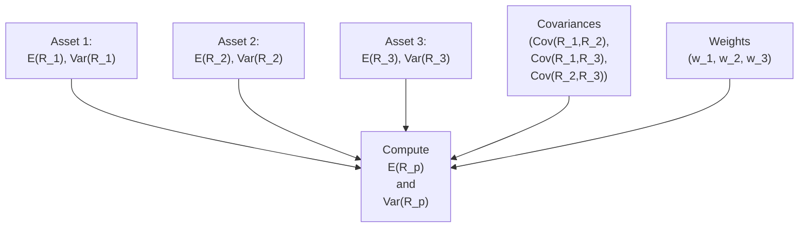

## Introduction

Sometimes, when we're assembling an investment portfolio (maybe just a couple of stocks or maybe a giant multi-asset mix), we get that “uh-oh” feeling: Is this going to work out the way I imagine? The core of that question boils down to understanding expected return and risk measurements like variance and standard deviation. These concepts are, frankly, the bread and butter of portfolio mathematics. They help us figure out not only how much we might gain, on average, but also how wildly our returns might fluctuate.

In this section, we’ll tackle the essence of how to calculate a portfolio’s expected return—the main reward we’re after—and how to measure its risk through variance and standard deviation. We’ll look at two-asset examples and then extend the same approach to multi-asset portfolios. And, yep, we’ll glance at the dreaded covariance, which sounds more complicated than it really is. Throughout, we’ll keep it slightly informal, share a story or two, and still get the job done with formulas, code snippets, and everything you need to know for exam day (and real-world investing).

## The Concept of Expected Return

Expected return is just like the average of your potential outcomes—except in finance, we weigh those outcomes by the probability of each one happening. For a portfolio, we’re basically combining the expected returns of each individual asset, proportionate to how much of the portfolio we have in each asset.

If you have assets A, B, and C in your portfolio, with weights wₐ, w_b, and w_c, and expected returns E(Rₐ), E(R_b), and E(R_c) respectively, then the expected return on your portfolio, E(Rₚ), is:


E(R_p) = w_a \, E(R_a) \;+\; w_b \, E(R_b) \;+\; w_c \, E(R_c) \;+\;\dots


It seems super straightforward. And it is, mostly—just make sure your weights add up to 1 (or 100%), meaning your entire investment is accounted for. If you accidentally let them sum to 1.1, you’re effectively investing 110% of your capital (which can happen in leveraged portfolios, but that’s a more advanced scenario). For a standard, unlevered portfolio, wₐ + w_b + w_c = 1.

### Example: Expected Return with Three Stocks

Let’s say you have a portfolio with:
• 40% in Asset A (E(Rₐ) = 8%),
• 30% in Asset B (E(R_b) = 10%),
• 30% in Asset C (E(R_c) = 12%).

Then your portfolio’s expected return is:


E(R_p) = 0.40 \times 0.08 + 0.30 \times 0.10 + 0.30 \times 0.12 = 0.032 + 0.03 + 0.036 = 0.098 = 9.8\%


So, you’d expect on average to earn 9.8% per year net of these allocations, assuming the assets deliver precisely their expected returns (big assumption, but it's a valuable baseline).

## Portfolio Variance

Variance is the measure of how much actual returns might fluctuate around the mean (i.e., the expected return). In portfolio-land, it’s not just about each individual asset’s variance—assets also affect each other. Specifically, how do they move together? That’s where covariance (or correlation) comes into play. Covariance is a measure of how two variables move relative to each other:
• If Cov(Rₐ, R_b) is positive, they move in the same direction more often than not.  
• If Cov(Rₐ, R_b) is negative, they tend to move in opposite directions.

### Two-Asset Portfolio Variance

For a two-asset portfolio, the variance formula is:


\mathrm{Var}(R_p) = \bigl(w_a^2 \times \sigma_a^2 \bigr) + \bigl(w_b^2 \times \sigma_b^2 \bigr) + 2\,w_a\,w_b\,\mathrm{Cov}(R_a, R_b).


Where:
• \\( w_a \\) and \\( w_b \\) are the portfolio weights for assets A and B.  
• \\( \sigma_a^2 \\) and \\( \sigma_b^2 \\) are the variances of each asset (i.e., \\(\mathrm{Var}(R_a)\\) and \\(\mathrm{Var}(R_b)\\)).  
• \\(\mathrm{Cov}(R_a, R_b)\\) is their covariance.

### Three (or More) Assets

Once you have three or more assets, you just keep adding the pairwise terms:


\mathrm{Var}(R_p) = \sum_{i=1}^{n} \sum_{j=1}^{n} w_i\,w_j \,\mathrm{Cov}(R_i, R_j).


In matrix form, you might see it as:


\mathrm{Var}(R_p) = \mathbf{w}^\top \,\Sigma \,\mathbf{w},


where:  
• \\( \mathbf{w} \\) is the column vector of portfolio weights.  
• \\( \Sigma \\) is the variance–covariance matrix of the asset returns.

Honestly, it’s not as daunting as it looks: you take your vector of weights, multiply it by the variance–covariance matrix, and then multiply again by the vector of weights transposed. That just systematically accounts for each \\( w_i \times w_j \times \mathrm{Cov}(R_i, R_j) \\) combination.

### Correlation: Another Way to Look at It

Covariance can be expressed in terms of correlation:  

\mathrm{Cov}(R_i, R_j) = \rho_{ij} \,\sigma_i \,\sigma_j,
  
where \\(\rho_{ij}\\) is the correlation. A correlation of +1 means the returns move perfectly in sync; -1 means they move perfectly in opposite directions; and 0 means they move independently of each other (at least in theory).

If you find even a single asset that’s not perfectly positively correlated with the rest, you can reduce your portfolio risk via diversification. This is one of the fundamental ideas behind portfolio construction.

## Standard Deviation: A Key Risk Measure

After you compute portfolio variance, standard deviation is simply its square root:


\sigma_p = \sqrt{\mathrm{Var}(R_p)}.


So it’s still capturing the same concept of dispersion around the expected return, but in the same units as the return itself (for instance, if returns are expressed in percentages, standard deviation is in percentage points too).

### Exam Tip

Exams often like to test your ability to go from standard deviation to variance or vice versa. More than once, I’ve seen folks inadvertently add or forget to square or take the square root at the wrong time. So, when you see “variance,” think “square,” and when you see “standard deviation,” think “square root.” It’s that simple check.

## Handling Multi-Asset Portfolios

When the portfolio has many assets—could be 10, 20, or 2,000—the principle stays the same:  
1. Weighted average the returns to get the expected return.  
2. Pairwise combine the assets’ variances and covariances for the portfolio variance.  

The math might look bigger, but it’s no different in concept. In fact, computers love the matrix version because it’s a straightforward linear algebra multiplication. If you’re doing it manually, watch out for silly mistakes: missing a pair or doubling one by accident is a classic error. 

Here’s a small conceptual diagram in Mermaid that depicts the flow from each asset’s risk inputs to the overall portfolio variance:



This diagram shows each asset’s expected return and variance, along with the covariances and the weight vector, all funneling into the final calculation of both expected portfolio return and portfolio variance.

### A Short Python Example

If you’re a bit of a coding enthusiast, here’s how you might do it in Python for a three-asset portfolio:

```python
import numpy as np

w = np.array([0.4, 0.3, 0.3])  # weights
Sigma = np.array([[0.04, 0.01, 0.00],
                  [0.01, 0.09, 0.02],
                  [0.00, 0.02, 0.16]])

port_variance = w.T @ Sigma @ w
port_std_dev = np.sqrt(port_variance)

print("Portfolio Variance:", round(port_variance, 4))
print("Portfolio Std Dev:", round(port_std_dev, 4))
```

In a real-world investment environment, you might estimate \\(\Sigma\\) by looking at historical data or modeling forward-looking returns. But the formula remains the same.

## Practical Examples and Real-World Application

Let’s do a small story: A friend of mine, who runs a boutique wealth advisory firm, once told me she’d meticulously built a client’s portfolio from 10 different funds—some equity, some bond, with a dash of REITs. She wanted a 7% expected return for the client, so she carefully assigned weights to each instrument. But the real question that popped up was, “What’s the risk?” She had to gather all the correlation data among those assets to compute the total portfolio variance and standard deviation. Only then could she say, “We expect around 7% annual return, and we might see about 6–8% volatility in a typical year.” 

It’s that second number that’s the difference between an anxious client and a comfortable client. Understanding that “this is normal volatility” can help keep investors from panicking at the first sign of a downturn. So, in practice, expected return and standard deviation form the basis of client discussions, investment policy statements, and ongoing portfolio rebalancing.

## Pitfalls and Best Practices

• Double-Check Weights: Always ensure your portfolio weights sum to 1 (or reflect any leverage accurately).  
• Keep a Consistent Time Frame: Make sure the returns, variances, and covariances you use are all annualized (or monthly, or weekly), but keep it consistent.  
• Watch Data Quality: Garbage in, garbage out. If your covariance data are stale or incorrectly estimated, your final portfolio risk number might be misleading.  
• Diversification ≠ Zero Correlation: Diversification helps reduce risk, but it doesn’t magically eliminate all risk. It just reduces nonsystematic risk.  
• Non-Stationary Data: Sometimes correlations between assets change over time (especially in crises). Relying solely on historical estimates might fail to capture future shifts.

## Conclusion and Exam Tips

When you’re sitting for a CFA exam (or any finance exam), expect that you may be asked to:
• Compute the expected return for a 2- or 3-asset portfolio.  
• Compute the standard deviation (or variance) of that portfolio using pairwise covariances or correlations.  
• Interpret your results in an investment context.  

Exam questions often arrive in these forms:
• “Given these weights, expected returns, and correlation matrix, find the portfolio’s standard deviation.”  
• “How would the portfolio variance change if correlation between two assets increases or decreases?”  
• “Which portfolio offers the greatest diversification benefit?”

A final thought: Don’t forget to label your steps. Too many times, I’ve seen candidates under stress skip an essential formula or incorrectly handle the square root. If the exam question says “Show your calculations,” do exactly that—line by line, writing each formula. And if time permits, do a quick sanity check: if you thought correlation was negative, you should see a smaller standard deviation than if correlation were positive. If your final standard deviation ended up larger, reevaluate your arithmetic.

## References

- Bodie, Z., Kane, A., & Marcus, A. (2019). “Investments.” McGraw-Hill Education.  
- CFA Institute Level I Curriculum, “Portfolio Concepts.”  
- Elton, E.J., Gruber, M.J., Brown, S.J., & Goetzmann, W.N. (2014). “Modern Portfolio Theory and Investment Analysis.”  
- Damodaran, A. (Online). “Investments and Risk Analysis” (lecture notes and online resources at http://pages.stern.nyu.edu/~adamodar/).

## Test Your Knowledge of Portfolio Risk and Return



### Which formula correctly represents the expected return of a three-asset portfolio with weights wₐ, w_b, w_c and expected returns E(Rₐ), E(R_b), E(R_c)?

- [ ] E(Rₚ) = (E(Rₐ) + E(R_b) + E(R_c)) / 3
- [ ] E(Rₚ) = wₐ × w_b × w_c × [E(Rₐ) + E(R_b) + E(R_c)]
- [x] E(Rₚ) = wₐE(Rₐ) + w_bE(R_b) + w_cE(R_c)
- [ ] E(Rₚ) = E(Rₐ) + E(R_b) + E(R_c)

> **Explanation:** The expected return of a portfolio is a weighted sum of the individual assets’ expected returns, based on their portfolio weights.

### How is the standard deviation of a two-asset portfolio derived from the portfolio variance?

- [ ] Divide by the portfolio’s expected return
- [x] Take the square root of the portfolio variance
- [ ] Subtract the correlation term between the two assets
- [ ] Subtract the mean from the variance

> **Explanation:** Standard deviation is the square root of variance. After calculating the variance using the weights, individual variances, and covariance, you simply apply the square root.

### If the correlation coefficient (ρ) between two assets moves from 0.5 to –0.2, what is the most likely impact on the portfolio’s variance?

- [x] The portfolio’s variance would generally decrease
- [ ] The portfolio’s variance would generally increase
- [ ] The portfolio’s variance is unchanged, as correlation is not used
- [ ] Not enough information is given

> **Explanation:** Correlation influences how assets move together. A lower (especially negative) correlation typically reduces portfolio variance, thanks to diversification benefits.

### When constructing a variance–covariance matrix for a 3-asset portfolio, how many pairwise covariance terms will you have?

- [ ] 1
- [ ] 2
- [x] 3
- [ ] 6

> **Explanation:** For a 3-asset portfolio (A, B, C), you have Cov(A, B), Cov(A, C), and Cov(B, C)—which is 3 pairwise covariances.

### Which of the following scenarios might cause the greatest error in computing historical covariances?

- [x] Using data from a period that is not representative of future market conditions
- [ ] Summing the portfolio weights to 1
- [ ] Converting decimal returns to percentages
- [ ] Ensuring that correlation ρ is never negative

> **Explanation:** If the historical window does not reflect future market conditions, your covariance estimates may be very inaccurate (“non-stationary” data risk).

### In a two-asset portfolio, why do we use 2wₐw_bCov(Rₐ, R_b) when computing the variance?

- [ ] It cancels out the correlation term
- [ ] We are averaging the returns
- [x] It accounts for both directions of the pairwise relationship (A with B and B with A)
- [ ] It reduces the portfolio weight errors

> **Explanation:** Cov(Rₐ, R_b) is symmetric, and combining them involves multiplication of weights from both sides, which appears as 2wₐw_bCov(Rₐ, R_b) in the expansion.

### If an asset’s variance is 0.04 (i.e., 4%) and its expected return is 6%, how would you express its standard deviation?

- [ ] 2%
- [ ] 4%
- [ ] 6%
- [x] √0.04 = 0.2 = 20%

> **Explanation:** Standard deviation is the square root of the variance. √0.04 = 0.2, which converts to 20%.

### Which description best defines covariance?

- [ ] The square of standard deviation
- [ ] The difference between two assets’ returns
- [x] A measure of how two assets’ returns move relative to each other
- [ ] A measure of portfolio weights

> **Explanation:** Covariance indicates the directional relationship of returns. If it’s positive, they move together on average; if it’s negative, they move counter to each other.

### What is the primary benefit of adding an asset with negative correlation to your portfolio?

- [ ] Increases the expected return without impacting variance
- [x] Reduces overall portfolio variance (diversification)
- [ ] Eliminates all systematic risk
- [ ] Guarantees higher returns

> **Explanation:** When correlation is negative, assets offset each other’s risk, lowering overall portfolio volatility.

### True or False: When working with variances and covariances, one must ensure that asset allocation weights sum to one in a standard, unlevered portfolio.

- [x] True
- [ ] False

> **Explanation:** The standard portfolio assumption (unlevered) is that the sum of your weights is 1.0. If leverage is introduced, weights may not sum to 1, but that’s a separate scenario.


