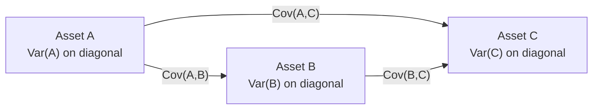

## Introduction and Key Ideas

Let’s chat about something that's crucial yet sometimes glossed over: how assets in a portfolio move relative to each other. We’re not just talking about whether they're up or down by themselves, but how they interact when grouped together. This is where the concepts of covariance and correlation take center stage.

In day-to-day language, we might say, “Hmm, these two stocks always seem to rise and fall together. That’s weird.” In statistical-financial terms, we’d respond, “Yes, that’s because the correlation is quite high.” Maybe that’s not how your next dinner party conversation will go, but if you’re building or managing a portfolio, understanding these measures matters, big time.

Below, we’ll explore covariance and correlation in a practical, multi-asset setting. By the end, you should have a solid handle on how they’re calculated, why they matter, and how to use them when making investment decisions.

## Covariance: Measuring Joint Variability

Covariance between two random variables (like returns on two different assets) essentially tracks how they move together around their means. If you’re comfortable with the idea of variance (the average of squared deviations from the mean for a single asset), you can think of covariance as the next step—only now, we’re looking at the interplay of two assets:


\mathrm{Cov}(R_i, R_j) = E\big[ (R_i - E[R_i]) (R_j - E[R_j]) \big].


• If \\(\mathrm{Cov}(R_i, R_j) \gt 0\\), then when \\(R_i\\) (the return of asset \\(i\\)) is above its average, \\(R_j\\) (the return of asset \\(j\\)) also tends to be above its average.  
• If \\(\mathrm{Cov}(R_i, R_j) \lt 0\\), they move in opposite directions; when \\(R_i\\) is above its average, \\(R_j\\) is typically below its average.

### A Quick Example from Real Life

I remember once working with a friend who was balancing two fairly different investments: a technology growth stock fund and a gold mining stock. We plugged in about a year’s worth of weekly returns into a spreadsheet and calculated the covariance. Sure enough, it came out negative, which indicated that these two asset returns often moved in opposite directions. It wasn’t a foolproof guarantee, but it was a clue that these two investments might provide some risk diversification when combined in a single portfolio.

## Correlation: Standardizing Covariance

While covariance is a useful concept, the values you get can be a bit messy—positive or negative, large or small, depending on the scale of returns. To tidy things up, we use correlation, a standardized measure of how returns move together:


\rho_{i,j} = \frac{\mathrm{Cov}(R_i, R_j)}{\sigma_i \, \sigma_j},


where \\(\sigma_i\\) is the standard deviation of \\(R_i\\), and \\(\sigma_j\\) is the standard deviation of \\(R_j\\).

• \\(\rho_{i,j} = +1\\) means perfect positive correlation: asset \\(i\\) and \\(j\\) move in lockstep.  
• \\(\rho_{i,j} = -1\\) means perfect negative correlation: they move in perfectly opposite directions.  
• \\(\rho_{i,j} = 0\\) means that, on average, there’s no linear relationship between the two assets.

### Why Does This Matter for a Portfolio?

Correlation is super handy for portfolio managers because it immediately signals the diversification potential of pairing assets together. For instance, if two assets are perfectly correlated (\\(\rho=+1\\)), diversifying among them won’t reduce risk (they move together). Conversely, if they’re negatively correlated (\\(\rho<0\\)), combining them might reduce the combined volatility, because when one zigs, the other zags.

## The Multivariate Context: Many Assets at Once

Most portfolios aren’t just two assets. Once you go beyond a pair, everything you’ve learned about correlation and covariance expands into what’s called a variance–covariance (var-cov) matrix or a correlation matrix. Imagine you’ve got four assets. Then you have six unique pairwise covariances (for each pair of assets) that you can arrange in a tabular form. That’s what we typically call the covariance matrix. The correlation matrix is the same idea, except every element is standardized to fall between –1 and +1.

### Building the Covariance Matrix

A covariance matrix for \\(n\\) assets is an \\(n \times n\\) table. The diagonal elements are just the variances of each asset. Off-diagonal elements are the pairwise covariances. A quick layout might look like this for three assets (\\(A\\), \\(B\\), \\(C\\)):


\begin{pmatrix}
\mathrm{Var}(A) & \mathrm{Cov}(A,B) & \mathrm{Cov}(A,C) \\
\mathrm{Cov}(B,A) & \mathrm{Var}(B) & \mathrm{Cov}(B,C) \\
\mathrm{Cov}(C,A) & \mathrm{Cov}(C,B) & \mathrm{Var}(C)
\end{pmatrix}.


Because \\(\mathrm{Cov}(A,B) = \mathrm{Cov}(B,A)\\), the covariance matrix is symmetric.

### Building the Correlation Matrix

A correlation matrix is very similar, except each off-diagonal entry is \\(\rho_{i,j}\\) rather than \\(\mathrm{Cov}(i,j)\\). The diagonal is all 1.0, since an asset is perfectly correlated with itself. That might look like:


\begin{pmatrix}
1 & \rho_{A,B} & \rho_{A,C} \\
\rho_{B,A} & 1 & \rho_{B,C} \\
\rho_{C,A} & \rho_{C,B} & 1
\end{pmatrix}.


### A Visual Snapshot

We can have a small diagram to illustrate how these pairwise relationships connect:



While a real matrix might contain dozens or even hundreds of assets, conceptually it’s the same: each pair of assets gets its own covariance (or correlation) entry.

## Interpreting Correlations for Portfolio Decisions

A correlation close to +1.0 signals that two assets’ returns move in a highly synchronized way. If you’re hooking them into a portfolio, that means they’ll amplify each other’s movements—good or bad!

Meanwhile, a correlation close to –1.0 represents a near–perfect hedge. While these pairs are rare in practice, especially through varied market conditions, it’s a portfolio manager’s dream scenario because the combined variance can be dramatically reduced.

Even if correlations aren’t extremely negative, any correlation below +1.0 offers some diversification benefit. For example, if large-cap US equities have a correlation of 0.55 with small-cap international equities, that 0.55 might still help reduce overall portfolio volatility compared to holding only one equity asset.

## Impact on Portfolio Variance

Let’s recall that the variance of a two-asset portfolio is:


\mathrm{Var}(w_1 R_1 + w_2 R_2) 
= w_1^2 \,\sigma_1^2 + w_2^2 \,\sigma_2^2 + 2 \, w_1 w_2 \,\mathrm{Cov}(R_1,R_2).


Replacing covariance with correlation:


= w_1^2 \,\sigma_1^2 + w_2^2 \,\sigma_2^2 + 2 \, w_1 w_2 \,\rho_{1,2} \,\sigma_1 \,\sigma_2.


In a multi-asset environment, you expand that formula to account for more terms. Essentially, you sum over all pairwise covariances, weighed by the proportion of each asset in the portfolio.

## Systematic vs. Idiosyncratic Risk

Covariance and correlation capture how assets move in tandem. But each asset also carries its own unique (idiosyncratic) risk. This is risk that’s not explained by broad market movements. A high correlation often hints a greater amount of shared or systematic risk, which might be driven by the overall market, macroeconomic factors, or sector influences.

• **Systematic risk**: Driven by broad factors (e.g., interest rates, inflation expectations, GDP trends).  
• **Idiosyncratic risk**: Specific to individual assets, such as a corporate scandal or a product recall.

When you build a diversified portfolio, you’re typically trying to reduce idiosyncratic risk by holding multiple assets that don’t move in tandem. Meanwhile, you can’t fully dodge systematic risk—though you can sometimes hedge or mitigate bits and pieces of it (for instance, by adding certain derivatives).

## Practical Tips for Using Correlation and Covariance

• **Use consistent data intervals**: If you’re measuring monthly returns for correlation, do that for every asset in your sample. Mixing daily for one asset and monthly for another can lead to misleading estimates.  
• **Pick a relevant timeframe**: Correlations can change over longer horizons, or in different market regimes. Watch out if you’re using data from the wrong historical period.  
• **Consider regime shifts**: Sometimes, correlations spike in a market crisis (often called “risk-on/risk-off” behavior), undermining what looked like a sweet diversification benefit in stable times.  
• **Monitor correlation drift**: Real-world correlations aren’t static. Keep checking them periodically.  
• **Don’t over-optimize**: Searching for “perfect” negative correlations might make your portfolio too reliant on a single historical pattern that won't hold in the future.

## A Friendly Anecdote

Once, I spent months building a multi-factor model that predicted future correlations among certain commodity and equity indexes. I was excited when back-tests showed that the correlations would remain low, offering a squeaky-clean diversification result. But then a sudden geopolitical event hit, and correlations among everything—equities, commodities, even certain bond sectors—skyrocketed practically overnight. The lesson: data analysis is great, but the market doesn’t read our spreadsheets. Always be prepared for new patterns to emerge.

## Best Practices and Common Pitfalls

• **Watch Out for Leptokurtic Distributions**: If returns are not normally distributed (for instance, if they have fat tails and frequent outliers), correlation might not tell the whole story.  
• **Spurious Correlation**: Some assets might show correlation for random reasons. Always see if there’s a fundamental or market-based rationale.  
• **Overfitting**: In advanced modeling (e.g., building large-scale covariance matrices using factor models), you can introduce noise or rely too heavily on short data samples.  
• **Arch/GARCH**: For advanced analysis of volatility clustering, more nuanced approaches (like Arch/GARCH) can be used to capture changes in correlation over time.

## Small Python Code Snippet (Optional)

If you’re curious how calculations might look in Python:

```python
import numpy as np
import pandas as pd

# Each column in df_returns is the return series for an asset

cov_matrix = df_returns.cov()         # Covariance matrix
corr_matrix = df_returns.corr()       # Correlation matrix

print("Covariance Matrix:")
print(cov_matrix)

print("\nCorrelation Matrix:")
print(corr_matrix)
```

Just keep in mind that real-world data cleaning and time alignment can be more involved.

## Exam Tips: Strengthening Your Understanding

• **Formulas**: Memorize the correlation formula inside-out so you can apply it quickly under exam conditions.  
• **Interpretation**: Be ready to interpret correlation and covariance in words: “A positive covariance means these assets tend to move in the same direction, which can limit diversification.”  
• **Application**: In multi-asset portfolio questions, pay special attention to how each correlation or covariance factor influences overall portfolio risk.  
• **Pitfalls**: Remember that correlation doesn’t imply causation. The exam might require you to identify spurious relationships or watch out for different time horizons.  
• **Market Regimes**: The CFA Program increasingly emphasizes scenario analysis and market stress. Correlations often rise in turbulent markets, so mention that if you see scenario-based questions.  

## References

• Bodie, Z., Kane, A., & Marcus, A. (2019). “Investments.” McGraw-Hill Education.  
• CFA Institute Level I Curriculum, “Quantitative Methods: Correlation and Covariance.”  
• Tsay, R.S. (2010). “Analysis of Financial Time Series.” Wiley.

----------

## Test Your Knowledge: Covariance and Correlation Insights



### Which statement best describes covariance between two assets?

- [ ] It is a measure of how each asset's standard deviation changes over time.
- [x] It is a measure of how two assets’ returns move relative to their means.
- [ ] It indicates only the volatility of a single asset's returns.
- [ ] It is the square of the correlation coefficient.

> **Explanation:** Covariance tracks how two asset returns vary around their respective means together. It doesn’t measure standard deviation over time, and it isn’t simply the square of correlation.

### If Cov(R₁, R₂) > 0, what does this imply?

- [x] R₁ and R₂ tend to move in the same direction.
- [ ] R₁ and R₂ have no systematic relationship.
- [ ] R₁ and R₂ are perfectly negatively correlated.
- [ ] R₁ and R₂ are perfectly positively correlated.

> **Explanation:** A positive covariance indicates that whenever one asset’s return is above its mean, the other’s return tends to be above its mean as well, but perfect correlation (ρ=+1) is not guaranteed.

### In a correlation matrix, which value would you expect to see on the main diagonal?

- [ ] 0 for each correlation on the main diagonal.
- [ ] The variances of each asset’s returns.
- [x] 1 for each asset’s correlation with itself.
- [ ] Negative correlation with other assets.

> **Explanation:** By definition, the correlation of any asset with itself is +1. The main diagonal of a covariance matrix, in contrast, would be the variances.

### Why might correlations among assets increase during market stress?

- [ ] Because returns lose all volatility, making the correlation measure meaningless.
- [x] Because in turbulent times, many investors behave similarly and drive assets to move more in unison.
- [ ] Because correlation is constant regardless of market conditions.
- [ ] Because the standard deviation always drops to zero in a crisis.

> **Explanation:** In a crisis, investors might adopt similar “flight to safety” strategies, causing historically uncorrelated assets to move together (i.e., correlation goes up).

### Jointly measuring multiple assets leads us to create a covariance (or correlation) matrix rather than simple pairwise metrics. What does this help capture?

- [ ] Only the variances of individual assets.
- [x] The comprehensive relationships among all possible pairs of assets.
- [ ] The time-series patterns of a single asset’s autocorrelation.
- [ ] Only a small subset of diversified securities.

> **Explanation:** A matrix format allows for recording covariances or correlations among all the assets in the portfolio, not just a two-asset pair.

### Which of the following most accurately explains negative correlation?

- [ ] One asset has zero idiosyncratic risk while the other has a high idiosyncratic risk.
- [ ] One risk factor explains both assets’ returns equally.
- [ ] They are completely uncorrelated.
- [x] They tend to move in opposite directions relative to their means.

> **Explanation:** Negative correlation means that when one asset’s return is above its average, the other is likely below its average—and vice versa.

### In portfolio construction, a correlation of exactly −1.0 between two assets typically implies what?

- [ ] A moderate, but not necessarily reliable, diversification benefit.
- [x] Theoretically perfect inverse movement in returns for these two assets.
- [ ] Both assets have higher volatility when combined.
- [ ] The assets exhibit zero covariance.

> **Explanation:** A correlation of −1.0 indicates a “perfect” negative correlation—one asset’s gain exactly offsets the other’s loss, in theory.

### A correlation of ρ=0 between three assets in a portfolio means:

- [ ] All three assets are uncorrelated with each other in every period.
- [x] Each pair of assets is uncorrelated, providing some diversification benefit.
- [ ] The assets move in opposite directions consistently.
- [ ] The assets exhibit perfect linear dependence.

> **Explanation:** A correlation of zero implies no linear relationship. In a multi-asset portfolio, if each pair has ρ=0, they offer diversification benefits since their returns do not consistently move together (though note that real markets can exhibit nonlinear relationships).

### When can a correlation matrix be considered valid for portfolio variance calculations?

- [ ] Whenever its diagonal entries exceed 1.
- [ ] Only when the matrix is non-symmetric.
- [ ] If the matrix has negative variances on the diagonal.
- [x] If it is positive semidefinite and the diagonal entries are all 1.

> **Explanation:** A correlation matrix must be positive semidefinite (so that variance calculations remain nonnegative), symmetric, and must have 1 as the correlation of each asset with itself.

### True or False: A zero correlation between two assets guarantees zero covariance.

- [x] True
- [ ] False

> **Explanation:** By definition, zero correlation implies that the covariance must be zero, as long as the standard deviations of each asset aren’t zero (i.e., the correlation formula keeps the covariance in the numerator).


