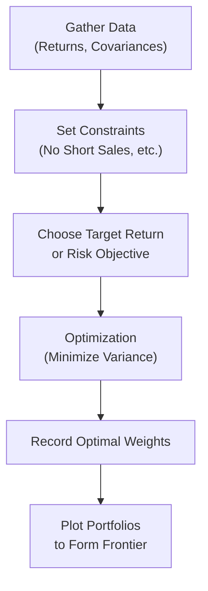
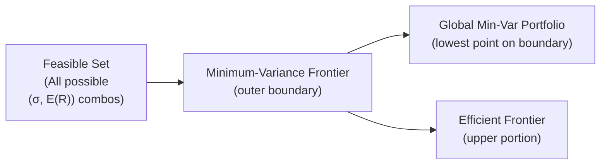

## Introduction

I remember the first time I tried piecing together a portfolio without a systematic strategy—talk about trial and error! I'd pick a few assets I thought were "good deals," cross my fingers, and hope for the best. Well, it didn’t take long to learn that, um, a bit more structure was needed. Enter the concept of the minimum-variance frontier and efficient frontier. These ideas, grounded in Modern Portfolio Theory (MPT), give us a roadmap for constructing portfolios with an optimal balance of risk and return. 

Below, we’ll talk through how portfolio managers identify the portfolios that minimize risk for every level of return, hone in on that single portfolio with the lowest possible risk, and then map out which portfolios are actually worth investing in (the “efficient” ones). Because, you know, we can’t just guess. Let’s dig in.

## Foundations of the Frontier

Before we jump into constructing minimum-variance frontiers, let’s recap a couple of the essential building blocks:

• Return estimates: We forecast the expected returns of each asset in our candidate set.  
• Risk measures: We typically use standard deviation (σ) or variance (σ²) as a numerical measure of risk.  
• Correlation or covariance: The degree to which assets move together (or inversely) plays a huge role in how combining them impacts overall portfolio risk.  

By combining assets in different weights, we can end up with a bunch of possible portfolios. Plot those portfolio points in (σ, E(R)) space, and you’ll shape a cloud—sometimes referred to as the feasible set. On the edge of that cloud: the minimum-variance frontier.

## The Minimum-Variance Frontier

When we talk about the minimum-variance frontier, we generally mean this outer boundary of the feasible set that shows the *lowest risk* you can achieve for each given level of return. 

If we consider a very simple scenario with just two assets, the formula for portfolio return is:


E(R_p) = w_1 E(R_1) + w_2 E(R_2),


where w₁ + w₂ = 1 (assuming no leverage, no short selling for now). The variance of this two-asset portfolio would be:


\sigma_p^2 = (w_1^2 \sigma_1^2) + (w_2^2 \sigma_2^2) + 2 w_1 w_2 \mathrm{Cov}(R_1, R_2).


To minimize \\(\sigma_p^2\\) for a given target \\(E(R_p)\\), we often apply optimization techniques that systematically vary w₁ and w₂. For more than two assets, the exact same idea extends but gets more mathematically intense. We might, for instance, solve this problem with Lagrange multipliers or other numerical optimization methods. 

### The Global Minimum-Variance Portfolio (GMVP)

On the minimum-variance frontier, there’s a special point where the overall risk (variance) is the absolute lowest it can be—this is the global minimum-variance portfolio (GMVP). Often, you’ll see it at the leftmost tip of the frontier curve when you draw risk (on the x-axis) against return (on the y-axis).

• If you’re super risk-averse and just want to minimize big fluctuations, you’d pick the GMVP.  
• However, if you’re comfortable taking on more risk for higher returns, you might move up along the frontier.  

Short anecdote: I once worked with a client who hated the thought of volatility; all she wanted was the “smoothest ride possible.” Turned out, the GMVP was her sweet spot—though, ironically, it still had moderate returns! Understanding your own or your client’s preferences is key.

## The Efficient Frontier

Above the GMVP, there’s a region on the minimum-variance frontier where each portfolio is considered “efficient.” These are the portfolios that rational, risk-averse investors find most appealing because they offer the highest expected return available for each level of risk. 

To put it differently: any portfolio *below* the GMVP on the same frontier has higher risk but no additional return, so it’s basically dominated by a portfolio on the upper side of the frontier. 

## Conceptual Flow: Constructing the Frontier

Here’s a concise visual of the main steps. We’ll show it in a flowchart. This doesn’t capture all the math but does highlight the key steps in constructing a minimum-variance frontier.



1. Gather your data: expected returns, variances, and covariances for each asset.  
2. Define any real-world constraints (like no short sales, maximum weights per sector, or total leverage limits).  
3. For a series of target returns (or risk levels), solve the optimization problem that minimizes risk.  
4. Each solution point is the portfolio weight combination that yields that specific (σ, E(R)).  
5. Plot them—you get the minimum-variance frontier.  
6. Identify the GMVP (the point with the lowest σ).  
7. The portion of this frontier above the GMVP is your efficient frontier.

## Constraints and Real-World Adjustments

In a perfect world, we might allow any possible weight, including negatives (short selling) and totals beyond 100% (leverage). But real investing is rarely so flexible. We impose constraints such as:

• Long-only: requiring all weights ≥ 0.  
• Sector concentration: no more than x% in any given industry.  
• Leverage constraints: total weights not exceeding 100%.  

Adding constraints typically makes the frontier shift or bend differently. For instance, if short selling isn’t allowed, you’re effectively saying, “Don’t pick any negative weights, because I can’t go short those securities.” That might push you to hold more of certain low-volatility assets, or maybe even require some compromise in overall risk-return. 

## Practical Example

Let’s illustrate how partial constraints might change your frontier. Suppose we have three major assets:

• Stock A: expected return = 8%, standard deviation = 15%.  
• Stock B: expected return = 10%, standard deviation = 20%.  
• Stock C: expected return = 6%, standard deviation = 8%.  

Between them, you compute their covariance matrix based on historical data. Then:

1. You define your optimization problem: “minimize portfolio variance for each target expected return from, say, 5% to 10%.”  
2. You solve for each target return subject to wᵢ ≥ 0 and ∑wᵢ = 1.  
3. You gather solutions and plot them, revealing your frontier’s characteristic shape.

If you compare that to an unconstrained scenario (allowing short sales), you might discover that shorting a high-volatility asset can sometimes reduce overall risk. But again, if your investment policy statement forbids it, you abide by the more constrained frontier.  

## Mermaid Diagram: Frontier Shape

Here’s an abstract, conceptual diagram using Mermaid (flowchart style) to illustrate the shape of the feasible set, the minimum-variance frontier, and highlight the GMVP. Note: This is a simplified representation rather than an actual plotted curve, but hopefully it conveys the idea.



Imagine a big blob (A) that includes all possible ways of mixing your assets. The boundary line (B) that forms the left edge of that blob is your minimum-variance frontier. The absolute lowest point on that boundary is (C), the GMVP. The region of B that sits above (C) becomes the efficient frontier (D).

## Use in Portfolio Decisions

Once you have this frontier mapped out, how do you pick a single “best” portfolio? Many investors overlay a utility function, where they measure how they *personally* trade off risk and return. Alternatively, they could choose based on their risk tolerance (e.g., they want a target volatility no higher than 10%). Then they pick the portfolio on the efficient frontier that hits that risk level. 

In more advanced contexts (like exploring multi-factor models), you’ll incorporate predicted relationships between economic factors and asset returns and feed that into a mean–variance optimizer. The ultimate aim, though, remains the same: find the portfolio(s) that offer the most return for the given level of risk.

## Common Pitfalls

• Overreliance on historical estimates: If your data is from an unrepresentative period, your frontier might be misleading.  
• Ignoring transaction costs: Real portfolios face rebalancing costs that can eat into returns.  
• Extreme concentration: MPT sometimes suggests heavily concentrated weights if certain assets appear superior in the data. Adding constraints can help mitigate this.  
• Overfitting: Complex optimization can lead to “chasing” idiosyncrasies in the data.  

## Exam Tips and Ethical Considerations

CFA Institute’s Code and Standards emphasize a duty to clients to act with prudence and loyalty. Constructing the efficient frontier falls under prudent research and analysis. However, always communicate limitations and assumptions to clients—especially regarding expected returns, volatility estimates, and correlation data. Disclose your methods and keep an eye on conflicts of interest. 

If you see a portfolio that looks too good to be true, investigate. Perhaps there’s an unaccounted correlation. Or maybe the data set is biased. For exam questions, watch out for:

• Traps that assume zero correlation or perfect correlation without stating it.  
• Rapid changes in correlation structures that can drastically alter the frontier.  
• Problems where you must identify the GMVP from a set of possible portfolios.  

On the CFA exam (especially in item-set formats), you may be asked to calculate or identify the global minimum-variance portfolio, or to identify which portfolio on a provided set of data is on the efficient frontier. They might even test your knowledge of the effect constraints have on the shape of that frontier.

## References and Further Study

• Markowitz, H. (1952). “Portfolio Selection.” Journal of Finance, 7(1), 77–91.  
• Grinold, R., & Kahn, R. (2000). “Active Portfolio Management.” McGraw-Hill.  
• CFA Institute. “Portfolio Management: An Overview,” “Portfolio Concepts.”  

## Test Your Knowledge: Minimum-Variance and Efficient Frontiers

```markdown


### In a mean–variance optimization, which portfolio on the minimum-variance frontier has the absolute lowest risk?
- [ ] The tangency portfolio
- [x] The global minimum-variance portfolio
- [ ] The maximum Sharpe ratio portfolio
- [ ] The portfolio with the highest expected return

> **Explanation:** The global minimum-variance portfolio is defined as the portfolio on the frontier with the lowest possible variance (or standard deviation).

### Which part of the minimum-variance frontier is considered “efficient” for a risk-averse investor?
- [ ] The segment below the GMVP
- [ ] The entire frontier
- [x] The portion above the GMVP
- [ ] None of it is efficient without factoring in the risk-free rate

> **Explanation:** The efficient frontier is the portion above the global minimum-variance portfolio, providing the highest return for each risk level.

### How does adding a short-selling constraint typically affect the minimum-variance frontier?
- [x] It often shifts or bends the frontier, typically increasing overall portfolio variance
- [ ] It has no effect on the shape of the frontier
- [ ] It guarantees a higher return
- [ ] It lowers the global minimum variance

> **Explanation:** Prohibiting short sales removes some feasible portfolios, often leading to a reshaped (and less optimal) frontier.

### If an investor cares only about minimizing risk, which portfolio would they most likely hold?
- [ ] Any portfolio on the efficient frontier
- [ ] The portfolio with the highest expected return on the frontier
- [x] The global minimum-variance portfolio
- [ ] A leveraged combination of risky assets

> **Explanation:** The GMVP is the single portfolio with the absolute lowest risk.

### Suppose you have a two-asset portfolio. Which formula represents portfolio variance?
- [ ] σ_p = w₁σ₁ + w₂σ₂
- [ ] E(R_p) = w₁E(R₁) + w₂E(R₂)
- [x] σ_p² = w₁²σ₁² + w₂²σ₂² + 2w₁w₂Cov(R₁, R₂)
- [ ] σ_p² = 2(w₁σ₁² + w₂σ₂²)

> **Explanation:** The correct formula includes the covariance term: 2w₁w₂Cov(R₁,R₂).

### When comparing portfolios below the GMVP on the minimum-variance frontier to those above it:
- [x] Portfolios below the GMVP have the same or higher risk for lower to similar return
- [ ] Portfolios below the GMVP always offer lower risk
- [ ] Portfolios above the GMVP are not investable
- [ ] They are indistinguishable in terms of efficiency

> **Explanation:** Portfolios below the GMVP are considered suboptimal because they do not offer adequate return for the risk taken.

### What does the feasible set represent?
- [x] All possible risk–return combinations from varying the weights in available assets
- [ ] Only the most efficient combinations
- [ ] All possible weights, including negative net worth
- [ ] Combinations that exclude correlation or covariance data

> **Explanation:** The feasible set consists of every portfolio you can create with the given assets (under the constraints).

### The efficient frontier is:
- [x] A subset of the minimum-variance frontier where returns are maximized for each risk level
- [ ] A line drawn from the risk-free rate to a risky portfolio
- [ ] An imaginary concept used only in theoretical finance
- [ ] Any set of portfolios with different expected returns

> **Explanation:** The efficient frontier is specifically the upper (optimal) boundary of the minimum-variance frontier, given risk aversion.

### Which of the following is NOT a limitation of classic mean–variance optimization?
- [ ] Reliance on historical estimates that might not hold in the future
- [x] Inability to account for correlations among assets
- [ ] Potential for extreme concentration in a single asset
- [ ] Sensitivity to small changes in input assumptions

> **Explanation:** In fact, mean–variance optimization explicitly accounts for correlations among assets (via the covariance matrix). That’s part of its core.

### True or False: The global minimum-variance portfolio is always the best choice for every investor.
- [x] True
- [ ] False

> **Explanation:** Wait, you might be thinking the GMVP is always best if you want minimal risk. But it’s not necessarily “best” for *every* investor, especially those who want larger returns and can tolerate more risk. This statement is tricky. Perhaps the more precise statement should be that it’s the lowest-risk point on the frontier. But if the investor is highly risk-averse, sure, it might be “best.” The real answer in typical exam phrasing is that the GMVP is the portfolio with the lowest variance, not automatically “best” for everyone.  


```

---

In practice, the minimum-variance and efficient frontiers help us figure out how to put our money to work in the most effective, risk-conscious way possible. Keep in mind that all of this is heavily dependent on the quality of your input data—without good estimates, your shiny frontier might not be so “efficient” after all. But, trust me, once you see how the theory translates to real returns, it’s totally worth the deep dive into these concepts. Good luck, and keep optimizing your portfolios wisely!
