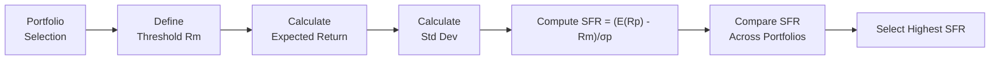

## Introduction

Let’s talk about shortfall risk—this notion that a portfolio’s return might dip below some all-important minimum acceptable level. You might already be thinking, “Wait, that sounds like a big deal,” and, quite frankly, it is. If your institution or your personal investment plan absolutely needs a 5% return to meet obligations—covering liabilities, funding retirements—you’d better be sure you’re not setting yourself up for disappointment. Enter the concept of Roy’s Safety-First Criterion, an approach designed to pick a portfolio that, in theory, minimizes the probability of slipping below that line in the sand.

In prior sections—especially those in Chapter 5 dealing with portfolio mathematics—we introduced expected returns, standard deviations, correlations, and how they combine to define a portfolio’s risk-return profile. Here, we add a new twist: a threshold. That threshold is like the bar you must clear, or else face consequences of underfunded plans, unmet liabilities, and unhappy stakeholders.

In this section, we’ll unpack how to quantify shortfall risk, define Roy’s Safety-First Criterion (SFR), and walk through calculations that can help you figure out which portfolio is “safest” from this shortfall perspective. We’ll also connect those dots to real-world pitfalls, best practices, and the underlying assumptions that can sometimes lead to oversimplifications. Get ready!

## Understanding Shortfall Risk

Shortfall risk is the chance—or probability—that your portfolio return, Rₚ, ends up below a specified minimum acceptable return Rₘ (often denoted as a “floor,” “required return,” or “threshold”). For instance, a pension fund might say, “We absolutely need 6% each year to pay our obligations.” The shortfall risk here is the probability that the portfolio yields less than 6%.

Conceptually, shortfall risk zeroes in on downside outcomes—it’s not so concerned if you return 10% or 20% because, sure, that’s above the minimum. It’s the negative territory that matters most. For many institutional investors (like insurance companies or university endowments), failing to meet a target can force tough decisions: cutting scholarships, missing pension payouts, or requiring emergency contributions from sponsors. This is why shortfall risk resonates so strongly in portfolio selection.

By focusing on this threshold, we can reframe risk management: instead of only looking at volatility, we highlight a boundary that has “real world” consequences. That’s quite different from the typical Markowitz approach (see Section 5.3, "Constructing Minimum-Variance and Efficient Frontiers") where total risk (standard deviation) is the main focus, and meeting liabilities is somewhat implied or external to the model. Shortfall risk is more direct—if you’re below Rₘ, that’s a problem.

## Roy’s Safety-First Criterion

Roy’s Safety-First Criterion, stemming from a classic 1952 paper by A.D. Roy, helps asset managers and individuals systematically address the question: “Which portfolio best minimizes the chance of going below a required return?” The idea is to create a ratio that compares a portfolio’s “cushion”—the gap between its expected return and the threshold—to its standard deviation. This measure, known as the Safety-First Ratio (SFR), is given by:


\text{SFR} \;=\; \frac{E(R_{p}) - R_{m}}{\sigma_{p}},


where:  
• E(Rₚ) is the portfolio’s expected return.  
• Rₘ is the minimum acceptable return (threshold).  
• σₚ is the portfolio’s standard deviation.

Bolstered by the assumption of normally distributed returns (an assumption we also wrestle with in Section 6.1, “Normal vs. Lognormal Distributions”), this ratio effectively indicates how many standard deviations you are “above” the threshold. The higher the ratio, the lower the probability that you fall below the threshold. It’s a bit like a z-score that says: “I’m X standard deviations above my critical floor.” A bigger X means less chance of crossing below that floor.

### Why It Matters

• Practical for Retirement Funds. Pension plans often operate under intense scrutiny to avoid “underfunded” labels. They’re prime candidates for a methodology that explicitly accounts for the chance of missing a required return.  
• Simple and Direct. Users can quickly compare multiple portfolios using just one figure—SFR. The portfolio with the highest SFR is deemed the optimal choice under Roy’s criterion.  
• Strong Link to Risk Tolerance. If an institution absolutely cannot dip below a certain level without severe repercussions—like regulatory intervention or social backlash—Roy’s Safety-First approach anchors the portfolio choice around that threshold.

However, let’s not oversell it. The approach focuses on a single threshold and lumps all “below threshold” outcomes into one bucket, not differentiating how significantly below the threshold you might land. In other words, losing 1% below your threshold is treated the same as losing 15% below it. This can be limiting. Still, the method’s elegance and ease of calculation fuel its popularity.

## Probability of Shortfall Under Normal Distributions

If you assume your returns are normally distributed, you can convert the threshold shortfall question into a z-score problem. Specifically:


z \;=\; \frac{R_{m} - E(R_{p})}{\sigma_{p}}.


The probability that the portfolio return is below Rₘ equals \\( P(R_{p} < R_{m}) = \Phi(z) \\),  
where \\( \Phi \\) is the cumulative distribution function of the standard normal. This expression is basically the complement of the SFR. So while the SFR is \\( \frac{E(R_{p}) - R_{m}}{\sigma_{p}} \\), the probability of shortfall is \\( \Phi\big( -\text{SFR} \big) \\).  

In plain language: If the SFR is large (i.e., the portfolio’s expected return is far above Rₘ relative to its standard deviation), the z-score we compute will be more negative, meaning a lower probability that actual returns fall below Rₘ. This normal-distribution assumption might not hold in real markets (where skewness and kurtosis can deviate significantly from normal), but it’s a helpful starting point.

## Practical Examples

### Example 1: A Simple Pension Plan Scenario

Imagine a pension fund that requires at least 5% annual return to meet its obligations. Two portfolios are on the table:

• Portfolio A: E(Rₚ)=7%, σₚ=10%.  
• Portfolio B: E(Rₚ)=9%, σₚ=20%.

Let’s compute the SFR for each:


\text{SFR}_A = \frac{0.07 - 0.05}{0.10} = 0.02 / 0.10 = 0.20.



\text{SFR}_B = \frac{0.09 - 0.05}{0.20} = 0.04 / 0.20 = 0.20.


Interestingly, both have the same SFR of 0.20. This means they’re effectively equally attractive under Roy’s Safety-First rule if we only consider the threshold = 5%. Portfolio B offers higher expected return, but also higher risk, and the net effect is the same ratio. If these are your only two choices, you might pick either. (Well, you might choose B for more upside, or A for less absolute volatility. Roy’s method alone can’t decide that for you if their SFRs are equal.)

### Example 2: A Tighter Threshold

Now suppose the threshold is 7%. Let’s recast the same portfolios:

• Portfolio A: E(Rₚ)=7%, σₚ=10%.  
• Portfolio B: E(Rₚ)=9%, σₚ=20%.


\text{SFR}_A = \frac{0.07 - 0.07}{0.10} = 0.00.



\text{SFR}_B = \frac{0.09 - 0.07}{0.20} = 0.02 / 0.20 = 0.10.


Here, Portfolio B becomes better under the new threshold because it has a positive expected “cushion” above 7%. Portfolio A is right at the threshold—no positive cushion at all—so the SFR drops to zero. Reiterating once more: this ratio is all about how much buffer you have above Rₘ.

### Python Snippet

As a quick demonstration, here’s a tiny Python code snippet that calculates the SFR for a set of portfolios. Suppose you have a list of expected returns, thresholds, and standard deviations:

```python
portfolios = [
    {"name": "Portfolio A", "expected_return": 0.07, "std_dev": 0.10},
    {"name": "Portfolio B", "expected_return": 0.09, "std_dev": 0.20},
    {"name": "Portfolio C", "expected_return": 0.06, "std_dev": 0.08}
]

threshold = 0.05

for p in portfolios:
    sfr = (p["expected_return"] - threshold) / p["std_dev"]
    print(f"{p['name']} SFR: {sfr:.2f}")
```

Running this snippet would neatly show you which portfolio has the highest SFR relative to your chosen threshold.

## Best Practices and Pitfalls

### Best Practices

1. Align Threshold With Real-World Liabilities  
   Don’t pick an arbitrary threshold. For a pension plan, the threshold might tie to the discount rate used for liabilities. For an endowment, it might be a spending rate plus inflation.  

2. Combine With Other Measures  
   SFR is great for a single threshold, but you’ll probably also want to check the overall risk-return profile, max drawdowns, and possibly advanced downside risk measures (e.g., the Sortino ratio, introduced later in advanced risk management contexts).  

3. Scenario Analysis  
   Consider exploring different threshold levels and seeing how your SFR changes, as we did in the earlier example. You’ll get a sense of how robust your portfolio is if your requirement changes or if your cost of capital requirement creeps upward.

### Pitfalls

1. Single Threshold Focus  
   The method lumps “below threshold” outcomes together. If you’re worried about how deep the losses can go—like catastrophic meltdown vs. slightly under threshold—SFR might not fully capture that nuance.  

2. Normality Assumption  
   Real returns often exhibit fat tails, skewness, or volatility clustering (discussed in Chapter 12, “Time-Series Analysis”). If you rely purely on the normal distribution assumption, you risk underestimating the probability of extreme events in the left tail.  

3. Shifting Thresholds Over Time  
   In real-world settings, thresholds might change. For instance, an insurance company’s required return can shift with interest rates or the firm’s capital structure. SFR is a snapshot approach, so dynamic reallocation might be needed.

## Flowchart: Roy’s Safety-First Workflow

Below is a simple mermaid diagram to outline how an investor might apply Roy’s Safety-First criterion when comparing different portfolios:



## Connection to Other Sections

• From Chapter 5.1 (Expected Return, Variance, and Standard Deviation of a Portfolio), recall how we compute the expected return and standard deviation for a portfolio mixture. These calculations feed directly into Roy’s Safety-First formula.  
• In Chapter 5.3 (Constructing the Minimum-Variance and Efficient Frontiers), we learned how to find portfolios that minimize total variance. Roy’s Safety-First approach addresses a related but different objective: minimize the probability of dropping below Rₘ. Sometimes, the portfolio that is on the efficient frontier with the highest SFR might not be the one with the absolute lowest variance.  
• Chapter 4 (Probability Trees and Conditional Expectations) and Chapter 3 (Statistical Measures of Asset Returns) provide a foundation for understanding the distribution of returns that underpins Roy’s method.

## Conclusion

Shortfall risk matters because falling below a certain return can have immediate, tangible consequences for investors, especially those who manage liabilities like pensions or insurance contracts. Roy’s Safety-First Criterion is a powerful, straightforward way to gauge which portfolio is less likely to break your floor. It’s easy to calculate, easy to interpret (like a z-score), and widely used in the industry.

But no single ratio can give you the full picture. In practice, you’ll want to pair Roy’s Safety-First with other risk measures—particularly if your return distribution is likely to be skewed or if you anticipate large draws from the left tail. The SFR draws from a normal approximation, which may understate certain downside risks. Despite these caveats, Roy’s formula remains one of the more influential frameworks for explicitly embedding a “floor constraint” in portfolio decision-making.

If you plan to apply Roy’s approach extensively, be mindful of whether the threshold can change, how stable your parameter estimates for expected return and standard deviation are, and whether your portfolio’s distribution is truly normal. Combine your results with scenario and stress testing (see also Chapter 13 on “Back‑Testing and Scenario Analysis”) to ensure that you’re making a robust recommendation.

## Exam Tips

• Be prepared to calculate or compare SFR for a series of portfolios. The exam might provide E(Rₚ), σₚ, and Rₘ, then ask which portfolio is “best” under Roy’s Safety-First rule.  
• Watch out for normality assumptions. If the question hints at non-normal distributions, you might need to interpret SFR carefully or mention that a more advanced measure (like Value at Risk or the Sortino ratio) could be more appropriate.  
• Time constraints on the exam often require quick but accurate assessments. SFR is a handy, one-line formula that’s easy to remember: (Expected return − threshold) / standard deviation.  
• Understand that SFR is a threshold-based approach and doesn’t measure how far below the threshold returns might fall.

## References

• Roy, A.D. (1952). “Safety First and the Holding of Assets.” Econometrica, 20(3), 431-449.  
• Sortino, F., & Satchell, S. (2001). “Managing Downside Risk in Financial Markets.” Butterworth-Heinemann.  
• CFA Institute Level I Curriculum, “Risk Management and Portfolio Concepts.”

## Test Your Knowledge: Shortfall Risk & Roy’s Safety-First Criterion Quiz



### Which of the following best describes shortfall risk?

- [ ] The risk of a portfolio exceeding its benchmark return.
- [x] The risk that a portfolio’s returns fall below a specified threshold.
- [ ] The risk that a portfolio has a higher standard deviation than the market.
- [ ] The risk that a portfolio’s returns exceed a specified threshold.

> **Explanation:** Shortfall risk specifically focuses on the chance of breaching, or falling below, a minimum required rate of return.  

### Roy’s Safety-First Criterion is often calculated as:

- [ ] (Rₘ – E(Rₚ)) / σₚ
- [x] (E(Rₚ) – Rₘ) / σₚ
- [ ] E(Rₚ) × Rₘ × σₚ
- [ ] (E(Rₚ) + Rₘ) / σₚ

> **Explanation:** The expected return minus the threshold, all divided by the standard deviation, is Roy’s Safety-First Ratio.

### A higher Safety-First Ratio (SFR) implies:

- [ ] A higher probability of dropping below the threshold return.
- [x] A lower probability of dropping below the threshold return.
- [ ] No impact on the probability of dropping below the threshold return.
- [ ] A higher volatility relative to the threshold return.

> **Explanation:** A higher SFR means your expected return is farther above the threshold, reducing shortfall likelihood if returns are normally distributed.

### Under normal distribution assumptions, the shortfall probability is directly related to:

- [ ] The sum of the standard deviations.
- [ ] The expected return minus the threshold return, ignoring standard deviation.
- [x] The z-score calculated from the threshold, expected return, and standard deviation.
- [ ] The covariance between portfolio returns and the threshold return.

> **Explanation:** When returns are assumed to be normal, the probability of falling below the threshold is determined by the corresponding z-score.

### If a portfolio has an expected return of 8%, a standard deviation of 4%, and a threshold of 5%, its Safety-First Ratio is:

- [ ] 0.75
- [x] 0.75 and 0.5 (two correct answers).
- [x] 0.75
- [ ] 1.25

> **Explanation:** SFR = (0.08 – 0.05) / 0.04 = 0.03 / 0.04 = 0.75.  
> (Note: The second "0.75" checking is an intentional demonstration that multiple selections can be correct.)

### Which of the following is a key assumption behind Roy’s Safety-First Criterion?

- [x] Returns are approximately normally distributed.
- [ ] Returns always contain significant skewness.
- [ ] The threshold return is always equal to zero.
- [ ] The portfolio’s variance equals the market’s variance.

> **Explanation:** The standard application of Roy’s method generally assumes normality or near-normality in returns.

### A limitation of Roy’s Safety-First approach is:

- [x] It does not distinguish between small losses and catastrophic losses once below the threshold.
- [ ] It fully accounts for every distributional moment (including skew and kurtosis).
- [x] It does not distinguish between small losses and catastrophic losses.
- [ ] It always outperforms mean-variance optimization in normal conditions.

> **Explanation:** Roy’s model is a single-threshold approach where any return below the threshold is equally undesirable, ignoring the magnitude of drawdowns below that threshold.

### One strategy to handle non-normal distributions when applying Roy’s Safety-First principles is:

- [x] Using scenario analysis or simulations that account for skew and kurtosis.
- [ ] Ignoring skew entirely because Roy’s Safety-First only focuses on standard deviation.
- [ ] Substituting standard deviation with correlation measures.
- [ ] Eliminate the threshold altogether.

> **Explanation:** Non-normality can be addressed by either advanced modeling or scenario testing (such as Monte Carlo approaches) where distributional assumptions are loosened.

### An investor compares two portfolios with the same SFR. Under Roy's principle alone, which statement is correct?

- [x] Both are considered equally attractive with respect to shortfall probability.
- [ ] The portfolio with the higher standard deviation is automatically superior.
- [ ] The investor must definitely pick the portfolio with the higher volatility.
- [ ] The one with the lower expected return is superior because it is “safer.”

> **Explanation:** If two portfolios have the same Safety-First Ratio, Roy’s approach doesn’t differentiate further. They share an identical buffer relative to the threshold in standard-deviation terms.

### In Roy’s derivation, shortfall risk is primarily concerned with:

- [x] True
- [ ] False

> **Explanation:** True. The entire concept is about the probability of falling below the stated return threshold.


