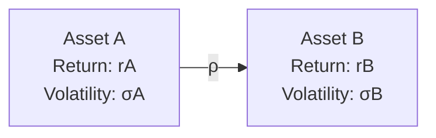

## Introduction and Intuitive Overview

Correlation plays a starring role in the world of portfolio construction. You might have two assets, each with a risky return profile, but when combined in just the right proportions—especially if they’re not moving perfectly in step—the portfolio’s risk can decrease, sometimes dramatically. To me, that’s always felt a bit like magic. Well, mathematical magic, at least.

In this section, we’ll explore not just how correlation works in theory, but why it matters so much when we’re blending assets to form an “optimal” portfolio. We’ll address everything from the very definition of correlation to the practical realities (and sometimes heartbreak!) of correlation breakdowns when the market goes haywire. Sound good? Then let’s dig in.

## Recap: Correlation Basics

Correlation (ρ) is a standardized measure of the relationship between two random variables (e.g., asset returns). It lies on a spectrum from −1 (perfect negative correlation) to +1 (perfect positive correlation). 

• ρ = +1 means the two assets move together in perfect sync.  
• ρ = 0 means the assets’ returns are unrelated in a linear sense.  
• ρ = −1 means the assets move in perfectly opposite directions.

There’s something quite satisfying about how that single number captures the interplay between two assets. Even so, keep in mind that correlation only measures linear relationships, so if the relationship is more complex, that might not show up in a simple correlation coefficient.

## The Mathematical Impact of Correlation on Portfolio Variance

Let’s say we have two assets, A and B, and we’re building a simple two-asset portfolio with weights wₐ and w_b, respectively (where wₐ + w_b = 1). The portfolio’s variance (σₚ²) can be expressed as:


\sigma_p^2 = w_A^2 \sigma_A^2 \;+\; w_B^2 \sigma_B^2 \;+\; 2\,w_A\, w_B\,\rho_{A,B}\,\sigma_A\,\sigma_B


Here:
• w_A, w_B = allocation weights to Asset A and Asset B.  
• σ_A, σ_B = standard deviations of returns for A and B.  
• ρ_{A,B} = correlation between A and B.

The final term, 2 w_A w_B ρ_{A,B} σ_A σ_B, is where the “magic” of correlation comes into play. If ρ_{A,B} is large (close to +1), the overall variance ends up higher for any given weighting scheme because you’re effectively combining two assets that move in tandem. On the flip side, if ρ_{A,B} is negative, that cross-term can lower the portfolio variance significantly. In the dream scenario of perfect negative correlation (ρ = −1), you can achieve a portfolio with extremely low risk for a given expected return—sometimes even zero variance if the weights are set just right. 

### A Quick Anecdote

I remember during my first internship, I tried to construct a simple “hedge” portfolio using a negatively correlated pair of assets—one equity index and one volatility product. At the time, it looked so perfect on paper—returns high, risk nearly zero. But guess what? Correlation changed over time, and so that near-perfect negative correlation soon began to drift, especially in moments of market stress. That was my first real lesson that correlation isn’t some static input; it’s more like a living, breathing entity that evolves with market conditions.

## Levels of Correlation and Diversification Benefits

### High Correlation (ρ close to +1)

When ρ is close to +1, the assets move almost in lockstep. Diversification benefits are minimal. This scenario most commonly arises when the assets belong to the same industry or region, or share similar economic sensitivities. If you hold two highly correlated technology stocks, you usually won’t see a big difference in overall risk by combining them. 

### Moderate or Low Positive Correlation (ρ between 0 and +0.5)

Even a mild to moderate positive correlation can provide noticeable risk reduction as long as the assets don’t move perfectly alike. For many real-world portfolios—say a mix of equities from different sectors plus some fixed income—this is frequently where we operate. The reason is that you’re typically not dealing with perfect alignment among diverse assets, and that difference in their return streams helps reduce overall volatility.

### Zero Correlation (ρ = 0)

With zero correlation, the two assets have no linear relationship. While that doesn’t guarantee risk-free returns, it can often mean that, combined in the right proportions, the portfolio experiences significantly less risk than either asset alone. True zero correlation is pretty rare in real markets, but a lot of multi-asset portfolios rely on the hope that certain correlations remain low.

### Negative Correlation (ρ < 0)

Negative correlations—even if not perfectly negative—are the sweetest words in the language of portfolio construction. Generally, whenever one asset zigzags upward the other might zag downward, and that interplay smooths out overall returns. In near-perfect negative correlation situations, the maximum diversification benefit emerges: risk can drastically drop while maintaining a decent return profile.

### Perfect Negative Correlation (ρ = −1)

This is the absolute best-case scenario for risk minimization. Theoretically, you can neutralize your portfolio’s variance by picking the right weights. However, be careful as perfect negative correlations rarely show up in the real world, and if they do, it might be fleeting. Derivative-based strategies or very specialized hedging approaches sometimes come close, but, again, correlations can shift.

## Visualizing the Relationship

Below is a simple Mermaid diagram to illustrate two assets (A and B), with an arrow denoting the correlation ρ. 

As ρ varies from −1 to +1, the shape of the efficient frontier formed by these two assets changes drastically, opening up different risk–return trade-offs.

## Efficient Frontier and Correlation

In an efficient frontier framework (where we plot expected return on the y-axis and risk—usually measured by standard deviation—on the x-axis), portfolios formed by combining two assets will trace out a curve. When correlation is less than +1, this curve “bends” leftwards, indicating a potential reduction in portfolio risk for a given level of expected return. The lower the correlation, the more that curve bows leftward, signifying greater diversification benefits.

A negative correlation suggests an even bigger bend, creating opportunities for lower-volatility portfolios. In the case of perfect negative correlation, the “curve” can become a straight line that extends all the way down to zero risk at some combination.

## Market Regime Shifts and Correlation Breakdown

Now, the tough part is that correlations are not static. One of the most frustrating phenomena is that, during times of economic upheaval, correlations among seemingly distinct assets often rise. Suddenly, your carefully assembled low-correlation portfolio might start moving more in lockstep. This effect is sometimes referred to as “correlation breakdown” or “flight to correlation,” where riskier assets all crater together in a crisis.

### Stress Correlation

Stress correlation is a term used to describe correlation during tough market conditions—often it’s uncomfortably high. Knowing this phenomenon helps you avoid overestimating your diversification. It’s wise to run scenario analyses with higher “stress” correlation assumptions to see how your “optimal” portfolio might behave under pressure.

## Practical Tips for Incorporating Correlation in Asset Allocation

• Regularly Update Correlation Estimates: Don’t rely solely on historical correlation matrices. Use rolling windows or other dynamic approaches that can catch shifts.  
• Consider Market Environments: In bull markets, correlations might behave differently than in downturns. Sometimes it's worth having different correlation estimates for different regimes.  
• Monitor Transaction Costs: Rebalancing too often to chase changes in correlation can eat into your gains. Optimize your rebalancing strategy so that transaction costs and taxes don’t overshadow your diversification benefits.  
• Look at Liquidity: In a crisis, some assets freeze up or become illiquid, and their correlations can spike. Keep an eye on how easily—and at what price—you can trade your holdings.

## Example Calculation: Two-Asset Portfolio

Let’s do a short example with made-up data. Suppose:

• Asset A: E(rₐ) = 8%, σₐ = 15%  
• Asset B: E(r_b) = 6%, σ_b = 10%  
• ρ_{A,B} = 0.2  

Let the weight in Asset A be wₐ = 0.70 and w_b = 0.30 in Asset B.

1. Portfolio Expected Return  
   E(rₚ) = wₐ × E(rₐ) + w_b × E(r_b)  
   = 0.70 × 8% + 0.30 × 6%  
   = 5.6% + 1.8% = 7.4%

2. Portfolio Variance  
   σₚ² = (0.70)² × (15%)² + (0.30)² × (10%)² + 2 × 0.70 × 0.30 × 0.2 × 15% × 10%  
   = 0.49 × 0.0225 + 0.09 × 0.01 + 2 × 0.70 × 0.30 × 0.2 × 0.15 × 0.10  
   = 0.011025 + 0.0009 + 0.70 × 0.30 × 0.2 × 0.03  
   = 0.011925 + 0.70 × 0.30 × 0.2 × 0.03  
   = 0.011925 + 0.70 × 0.30 × 0.006  
   = 0.011925 + 0.70 × 0.0018  
   = 0.011925 + 0.00126  
   = 0.013185 (1.3185% in variance terms)

   Portfolio standard deviation = √0.013185 ≈ 11.48%

3. Interpretation  
   By mixing these two assets, the portfolio ends up with an expected return of 7.4% and a volatility of about 11.48%. Notice how the volatility is below the weighted-average of each asset’s standard deviation (0.70 × 15% + 0.30 × 10% = 13.5%). The difference arises because of the beneficial correlation effect (0.2 < 1).

## Real-World Considerations

In real investment environments—especially multi-asset class portfolios—correlation estimates should be tested against both historical data and forward-looking scenarios. Changes in monetary policy, global crises, and market liquidity constraints can all shift correlation patterns, often in ways that complicate your best-laid asset allocation plans.

## Concluding Thoughts and ExamDay Guidance

Correlation lies at the heart of portfolio diversification, shaping risk–return profiles in ways that can be extremely beneficial. But it’s crucial to keep track of how correlation is calculated, how it can shift in different market regimes, and how it might break down during extreme events. For exam success and real-world application, remember these key points:

• Always incorporate correlation into your calculations when assessing portfolio risk.  
• Stress-test your allocations for changes in correlation.  
• Recognize that correlation is time-varying and sometimes poorly estimated.  

Above all, don’t blindly trust correlations from calm market periods to hold steady in a crisis.

## References

• Ang, A. (2014). Asset Management: A Systematic Approach to Factor Investing. Oxford University Press.  
• Fabozzi, F. J. (2002). Handbook of Portfolio Management. Wiley.  
• CFA Institute Level I Curriculum, “Portfolio Management: Correlation and Asset Allocation.”  

---

## Test Your Knowledge: Correlation and Optimal Asset Allocations



### Which correlation coefficient between two assets generally implies the greatest diversification benefit for a portfolio?

- [ ] ρ = +1
- [ ] ρ = 0
- [x] ρ = –1
- [ ] ρ = +0.5

> **Explanation:** A perfect negative correlation (ρ = –1) yields the greatest diversification potential, theoretically allowing for the largest reduction in overall portfolio risk.

### For a two-asset portfolio, if correlation between the assets increases, what happens to the portfolio’s overall variance (all else equal)?

- [ ] It decreases.
- [x] It increases.
- [ ] It remains unchanged.
- [ ] It becomes zero.

> **Explanation:** As the correlation term (ρ) rises, the cross-term in the portfolio variance formula (2 w_A w_B ρ σ_A σ_B) becomes larger, which increases overall variance.

### How does a “stress correlation” often differ from long-term historical correlation?

- [ ] Stress correlation tends to be much lower.
- [ ] Stress correlation is always negative.
- [x] Stress correlation tends to be significantly higher in market turmoil.
- [ ] Stress correlation is identical to the historical correlation but used in different scenarios.

> **Explanation:** During periods of financial distress, previously low or moderate correlations can jump as investors sell risk assets all at once, increasing correlations among risky assets.

### Why is correlation alone sometimes insufficient for capturing the relationship between two asset returns?

- [ ] It measures only non-linear relationships.
- [ ] It is unrelated to asset volatility.
- [ ] It is always a negative value.
- [x] It captures only the linear dependency and may miss more complex relationships.

> **Explanation:** Correlation is a linear measure. If two assets exhibit a non-linear relationship, the correlation might understate or misrepresent their co-movement.

### Which statement best describes the effect of perfect positive correlation on portfolio diversification?

- [ ] It provides maximum diversification benefits.
- [ ] It can lower overall portfolio variance to near zero.
- [ ] It indicates the most efficient frontier possible.
- [x] It offers no diversification benefit because assets move in lockstep.

> **Explanation:** Perfect positive correlation means the assets move together perfectly, hence no reduction in total risk.

### When combining two assets with zero correlation, how does the portfolio’s standard deviation compare to the weighted average of the individual standard deviations?

- [ ] It must be higher.
- [x] It is lower.
- [ ] It is always zero.
- [ ] It is the same as the weighted average.

> **Explanation:** If ρ = 0, the cross-term in the variance formula does not add significant risk, making the portfolio’s standard deviation lower than the weighted average of each asset’s standard deviation.

### If the correlation between two assets shifts from 0.4 to 0.9 over a short period, what might be a likely cause?

- [ ] Decreasing risk in the market.
- [ ] A stable economic climate with no major shocks.
- [x] A market stress event causing assets to move closer together.
- [ ] Large negative returns in one asset only.

> **Explanation:** During market turmoil or stress, correlations among risky assets often converge toward +1 as investors simultaneously exit multiple asset classes.

### Which approach would most likely help an investment manager account for changing correlations over time?

- [x] Using rolling correlation estimates based on moving windows of returns.
- [ ] Calculating correlation only once, using a 10-year data set.
- [ ] Ignoring correlation when constructing portfolios.
- [ ] Doubling the correlation to be conservative.

> **Explanation:** Rolling estimates let you capture evolving relationships between asset returns rather than relying on a static long-run correlation.

### Suppose you have two assets that historically exhibit near-perfect negative correlation. Which phenomenon could reduce the effectiveness of this diversification in a sudden market downturn?

- [x] Correlation breakdown under market stress.
- [ ] Larger expected returns.
- [ ] Permanent negative correlation.
- [ ] Lower Sharpe ratios for each asset.

> **Explanation:** Correlation breakdown often occurs in market crises, meaning assets that were previously negatively correlated can start moving together.

### In a two-asset portfolio, perfect negative correlation makes it possible (in theory) to achieve:

- [x] Zero overall variance.
- [ ] The highest Sharpe ratio in the market.
- [ ] A risk-free rate of return that is always higher than each asset alone.
- [ ] A portfolio standard deviation higher than each asset alone.

> **Explanation:** If two assets have perfect negative correlation (ρ = –1), you can, under certain allocations, completely offset their individual volatilities and achieve zero portfolio variance in theory.


