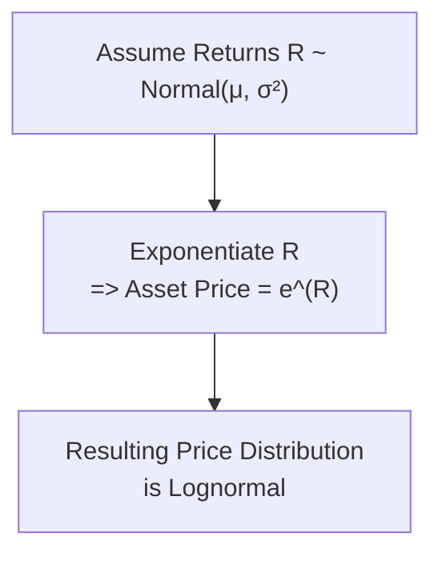

## Introduction and Motivation

Sometimes, when I think about asset prices, I picture them like a bunch of kids at recess—some wandering around aimlessly, some sprinting off to the far corners, and others clustering in the middle, not straying too far from a central zone. In quantitative finance, we often try to describe these movements using probability distributions. Two heavy hitters are the Normal (Gaussian) distribution and the Lognormal distribution. These distributions shape how we analyze returns or model asset prices. They’re sort of the fundamental “language” we use to talk about risk and reward. 

The normal distribution is a longtime favorite: symmetrical, mathematically elegant, and relatively easy to handle. But it can also imply that prices might become negative (which is bizarre in reality). The lognormal distribution, on the other hand, ensures the modeled price never drops below zero but tends to have that “right skew” which can capture big upward price movements.

Anyway, let’s spend some time exploring how these distributions show up in asset pricing, how we might simulate them, and what big-time pitfalls to watch out for. We’ll connect this discussion to portfolio risk, tail risk, and practical ways of forecasting or scenario-testing future prices.

## The Normal Distribution in Finance

The normal distribution, also referred to as the Gaussian distribution, is defined by two parameters:

• μ (mu), the mean or central tendency.  
• σ (sigma), the standard deviation (volatility in finance-speak).

Mathematically, for a random variable X:


f_X(x) = \frac{1}{\sqrt{2 \pi} \, \sigma} \exp \Bigl( -\frac{(x - \mu)^2}{2\sigma^2} \Bigr).


If X ~ N(μ, σ²), we know that around 68% of outcomes lie within μ ± σ, about 95% within μ ± 2σ, and so on, according to the empirical 68-95-99.7 rule.

• Why Normal?  
  – The normal distribution is *easy to work with*—the sum of two normal random variables is also normal, making many statistical tasks simpler.  
  – When analyzing historical returns (especially daily or weekly returns), many market participants approximate them with a normal distribution for short-term risk assessment.

• Limitations of Using Normal for Prices  
  – Negative Values: A normal distribution can produce negative values with nontrivial probability. For returns, negative outcomes are realistic (a stock can lose 5%, 15%, or more), but for the price level itself, going below zero is nonsense.  
  – Underestimation of Tail Risk: Real-life financial returns often exhibit “fat tails” (leptokurtosis). A purely normal assumption might fail to capture the actual frequency of extreme downward or upward moves.

Despite these shortcomings, normal assumptions remain widespread for short-horizon return modeling because they’re computationally friendly, *especially* in tasks like portfolio optimization (Chapter 5 in this series addresses portfolio variance, which depends on normal-based correlation assumptions).

## The Lognormal Distribution in Finance

Now, if you take a random variable X that’s normally distributed (X ~ N(μ, σ²)) and exponentiate it—i.e., Y = e^X—what you get is a lognormal distribution. So the log of Y is normal, but Y itself is strictly positive. This fits nicely with how we see real asset prices: they can’t go negative, right?

Mathematically, if Y is lognormal, its probability density function for y > 0 is:


f_Y(y) = \frac{1}{y \,\sigma \sqrt{2 \pi}} \exp \Bigl( -\frac{(\ln y - \mu)^2}{2\sigma^2} \Bigr).


In finance, suppose you model your continuously compounded return, R, as R ~ N(μ, σ²). Then the price S at time T might be:


S_T = S_0 \times e^R, \quad \text{where} \; R \sim N(\mu, \sigma^2).


Because R is normal, e^R—and hence S_T—becomes lognormal. Geometric Brownian Motion (GBM), which underlies the famous Black–Scholes option pricing framework, builds exactly on this idea.

• Why Lognormal?  
  – Price stays strictly above zero.  
  – Reflects that large upward movements in price might be more probable than equally large downward moves, in dollar terms. (A move from \$100 to \$200 is a 100% gain, while a \$100 drop to \$0 is… not even possible in the lognormal lens without hitting zero precisely, which is infinite negative returns. So the distribution handles this asymmetry better.)  
  – The product (or compound) of lognormal variables is still lognormal—convenient for compounding returns over multiple intervals.

• Practical Implications  
  – For a short time horizon, many modelers keep a “normal” approach for daily or weekly returns. Over the long run, if you exponentiate those returns, you end up approximating a lognormal price path.  
  – In derivatives pricing and scenario analysis, the lognormal approach is often the default assumption for underlying assets, especially in the context of equity prices.

## Key Distinctions and Why They Matter

1. Negative Values: Normal distributions can generate negative sample points, perfectly okay for returns but not for share price. Lognormal distributions are strictly positive.  
2. Skew and Tails: Normal distributions are symmetric, while lognormal distributions are skewed to the right. This means with lognormal, you have a heavier upper tail, reflecting occasional big price rallies.  
3. Summation vs. Multiplication: If you add two normal variables, the result is normal. But products of lognormals remain lognormal. This is crucial when compounding returns.  
4. Tail Risk Assessment: Purely normal distributions can underestimate the probability of extreme events (especially negative extremes). Lognormal might capture some asymmetry, though real markets often still exhibit “fatter tails” than the theoretical lognormal curve suggests.

## Illustrative Diagram of Normal vs. Lognormal Modeling

Below is a simple mermaid diagram that captures a conceptual flow. We start with an assumption about returns, then see how it translates to price. Notice the distinction between modeling returns as normal and modeling the end-of-period price as lognormal.



## Mathematical Note: Linking Normal Returns to Lognormal Prices

If X ~ N(μ, σ²), then Y = e^X is *lognormal*. This means:

• ln(Y) = X ~ N(μ, σ²).  
• The expected value of Y is e^(μ + σ²/2).  
• The variance of Y is e^(2μ + σ²)(e^(σ²) – 1).

In a financial context, if an asset’s continuously compounded return over one period is normal with drift μ and volatility σ, then:


\text{Price at time } T = S_0 \times e^{( \mu - \frac{1}{2} \sigma^2)T + \sigma \sqrt{T} \,Z},


where Z is a standard normal random variable. The “−(σ^2/2)T” term is the adjustment that ensures the geometric Brownian process remains consistent with a lognormal distribution that has mean e^(μT).

## Simulation Approaches

### Normal Simulation for Returns
1. Draw random samples z from a standard normal distribution (mean 0, variance 1).  
2. Transform them to R = μ + σ z.  
3. Interpret R as the (approximate) daily or weekly return.  
4. Update the asset price if desired: S_{t+1} = S_t (1 + R).  

You can implement this in Python:

```python
import numpy as np

np.random.seed(42)  # for reproducibility
num_draws = 10
mu = 0.0005   # daily mean (~0.05% per day)
sigma = 0.01  # daily vol (~1% per day)

z = np.random.normal(0, 1, num_draws)
daily_returns = mu + sigma * z

print("Sample of Normal Daily Returns:", daily_returns)
```

### Lognormal Simulation for Prices
Instead of adding 1 + R, you might directly exponentiate the normal draw:

```python
import numpy as np

np.random.seed(42)
num_draws = 10
mu = 0.0005
sigma = 0.01
S0 = 100.0  # initial price

z = np.random.normal(0, 1, num_draws)
price_factors = np.exp(mu + sigma * z)

simulated_prices = S0 * price_factors
print("Sample of Lognormal Simulated Prices:", simulated_prices)
```

This ensures your simulated prices stay positive, reflecting the lognormal property.

## Impact on Risk Management

• Short-Term Volatility Models (e.g., Value at Risk for daily horizons) might use normal returns for simplicity: you compute standard dev, correlation, etc.  
• Long-Dated Instruments & Options: You likely rely on lognormal price processes, consistent with geometric Brownian motion, which is the foundation for Black–Scholes.  
• Tail Risk: Neither distribution perfectly explains real-world fat tails, but lognormal typically acknowledges skew and ensures positivity. In real-life modeling—and as you’ll see in advanced chapters on simulation (Chapters 6.2 and 6.4)—market practitioners often adjust the distribution or add jump processes to better capture extreme movements.

## Best Practices and Common Pitfalls

• Understand What You’re Modeling: Are you focusing on daily or monthly returns, or the final price level? If it’s returns, normal might be okay (with disclaimers). If it’s the price, lognormal is more natural.  
• Remember the Time Horizon: Over short intervals, the normal assumption for incremental returns is less egregious than if you try to project far into the future. Over the long term, prices that result from repeated compounding of normal returns can be viewed as lognormal.  
• Watch Out for Negative Skew or Fat Tails: Real financial assets often exhibit more negative skew or kurtosis than plain vanilla normal or lognormal. That’s why advanced modeling might incorporate distributions like Lévy processes, Student’s t, or jump-diffusion.  
• Validate with Real Data: Always compare your simulated output with actual market data to see how well your assumptions hold at the extremes (e.g., does your model produce a meltdown like 2008 or sharp rebound rallies?).

## Real-World Anecdote

I once worked on a small equity-derivatives project, and we modeled stock prices using a normal distribution (mostly for the sake of a quick calculation). Long story short, we kept getting occasional simulated prices of \$-10, \$-50… which was obviously insane. So we stepped back and said “Wait, we want to keep the negative possibility for returns, but not for the price,” and switched to a lognormal process. That little fiasco hammered home that difference. You can get lulled into using normal assumptions for everything just because it’s mathematically easier—but it’s not always correct for the *price* portion.

## Geometric Brownian Motion and Lognormal Paths

You’ll see “Geometric Brownian Motion” (GBM) peppered throughout finance texts. It’s basically the continuous-time analog of a lognormal price process. If S(t) follows GBM, it satisfies:


dS(t) = \mu S(t)\,dt + \sigma S(t)\,dW(t),


where W(t) is a Wiener process (standard Brownian motion). The solution to this stochastic differential equation is:


S(t) = S(0) \exp \Bigl( (\mu - \tfrac{1}{2}\sigma^2) t + \sigma W(t) \Bigr),


which makes S(t) lognormally distributed. This is the backbone of Black–Scholes and part of the reason we assume lognormal stock-price evolution for option pricing.

## Practical Scenario: Pricing a One-Year Call Option

• If we assume S₀ = \$100, a drift μ = 0.08 (8% expected annual return), and volatility σ = 0.20 (20%), we can simulate year-end prices under a lognormal model.  
• Then to price a call option with strike K = \$105, we compute the payoff max(S₁ − K, 0), discount it back, average across many simulation runs.  
• This approach aligns with the lognormal assumption used in closed-form solutions like Black–Scholes but offers a direct Monte Carlo perspective.

## Connections to Other Chapters

• Chapter 2: Time Value of Money. You might discount expected future prices or payoffs with an appropriate discount rate.  
• Chapter 5: Portfolio Mathematics. If returns are assumed normal, we can easily sum them up for a portfolio. If we are focusing on final portfolio value, the lognormal assumption might be more suitable to ensure positivity.  
• Chapter 6.2: Monte Carlo Simulation Tools. We’ll dig deeper into how to generate random paths for both normal and lognormal processes, as well as variance-reduction techniques.  
• Chapter 13: Back-Testing and Scenario Analysis. We can feed normal or lognormal assumptions into scenario generation and see how robust our strategies are to big price shocks.

## Final Tips for Exam and Practice

• Don’t Confuse Returns vs. Prices: A common exam trap is mixing normal for price vs. normal for returns. The usual best practice is to keep the distribution normal for returns, so that the exponentiated price becomes lognormal.  
• Understand the Basic Formulas: The relationship X ~ N(μ, σ²) → Y = e^X is lognormal is at the heart of many exam questions on modeling. Be ready to demonstrate how drift and volatility translate to expected price levels and option payoffs.  
• Tail Risk Emphasis: Examiners often ask how normal vs. lognormal assumptions might underestimate or overestimate tail risks.  
• Watch for Non-Normal Realities: Even though normal/lognormal are classic assumptions, exam scenarios might mention that empirical data suggests higher kurtosis—this can prompt you to discuss model limitations or alternative distributions.

## References

• Hull, John. “Options, Futures, and Other Derivatives,” 10th ed., Pearson. (Comprehensive coverage of Black–Scholes, lognormal distribution, and more.)  
• CFA Institute Level I Curriculum, Quantitative Methods. (Foundational probability and distribution properties in finance.)  
• Wilmott, Paul. “Paul Wilmott on Quantitative Finance,” Wiley. (Tons of practical insights and advanced modeling scenarios. Highly recommended for deeper exploration.)

---------------------------------------------------------------------------------------

## Test Your Knowledge: Normal and Lognormal Distribution Concepts



### 1. Which statement best describes why a normal distribution might be problematic for modeling asset prices directly?

- [ ] Because it produces a symmetric distribution of continuous returns.  
- [ ] Because it's computationally complicated to use in pricing models.  
- [x] Because it can suggest negative asset prices, which are not realizable in practice.  
- [ ] Because it's impossible to calculate variance with normal distributions.  

> **Explanation:** The normal distribution can easily produce negative values if applied directly to prices, which is unrealistic for most financial assets.


### 2. Which of the following assumptions is critical for the lognormal distribution in asset price modeling?

- [ ] The log of the asset price is constant.  
- [x] The log of the asset price follows a normal distribution.  
- [ ] The asset price is equally likely to be positive or negative.  
- [ ] The asset price has a fixed lower bound greater than 0.  

> **Explanation:** A lognormal variable Y arises when ln(Y) ~ Normal. In finance, if continuous returns are normally distributed, then prices follow a lognormal distribution.


### 3. When summing random variables, how do normal and lognormal distributions differ?

- [x] The sum of normals is normal, while the product of lognormals is lognormal.  
- [ ] The product of normals is normal, while the sum of lognormals is lognormal.  
- [ ] The sum of both distributions, normal or lognormal, is always normal.  
- [ ] The sum of both distributions, normal or lognormal, is always lognormal.  

> **Explanation:** One key property is that normal distributions are stable under addition, whereas lognormal variables remain lognormal only when multiplied (not when added).


### 4. In a Geometric Brownian Motion (GBM) model, which of the following terms ensures that price paths remain positive?

- [ ] The negative interest rate term.  
- [ ] The dividend yield term.  
- [ ] The drift (μ) term alone.  
- [x] The exponentiated form of the stochastic process.  

> **Explanation:** GBM uses exponentiation of the normal term, which ensures the process never dips below zero (lognormal by design).


### 5. If R ~ N(μ, σ²) is a continuously compounded return, how do we express the expected end-of-period price S_T starting from S_0?

- [x] S_T = S_0 × exp(R).  
- [ ] S_T = S_0 + R.  
- [ ] S_T = S_0 × (1 – R).  
- [ ] S_T = S_0 – exp(R).  

> **Explanation:** Continuously compounded returns are exponentiated to update the price from the initial level S_0.


### 6. Which statement about lognormal distributions is correct?

- [ ] Lognormal distributions allow for negative values with low but nonzero probability.  
- [x] Lognormal distributions have a right-skew.  
- [ ] Lognormal distributions are always symmetric.  
- [ ] The variance of a lognormal distribution is the same as that of a normal distribution.  

> **Explanation:** Lognormal distributions are skewed positively to the right, reflecting that the bulk of the mass is toward lower values but with a long right tail.


### 7. Which of the following is a legitimate concern when using a purely normal distribution for daily returns?

- [ ] The possibility of underestimating long-term positive leverage.  
- [ ] They cause the compounding effect to be overstated.  
- [ ] They ensure a strict upper bound to daily returns, which is unrealistic.  
- [x] They might underestimate the frequency and magnitude of extreme “tail” events.  

> **Explanation:** Real-world returns exhibit fat tails; purely normal assumptions may underestimate extreme events, leading to inaccurate risk assessment.


### 8. If the price distribution is modeled as lognormal, which of these statements accurately characterizes the distribution?

- [x] The log of price follows a normal distribution with defined mean and variance.  
- [ ] The price is guaranteed to be symmetric about the mean.  
- [ ] The price distribution can be negative if variance is too large.  
- [ ] The volatility of the distribution is always lower than a normal distribution’s.  

> **Explanation:** Lognormal means ln(price) is normal. Price remains strictly positive, and the distribution is skewed right.


### 9. Why might an analyst prefer a lognormal distribution over a normal distribution for long-dated options valuation?

- [ ] The lognormal assumption underestimates potential upside.  
- [ ] The cumulative distribution function is simpler to integrate.  
- [x] It prevents prices from becoming negative and reflects compounding.  
- [ ] Lognormal assumption ensures no volatility over the long term.  

> **Explanation:** One major appeal of a lognormal process for long-dated horizons is that it guarantees non-negative prices and handles compounding returns in a more realistic way.


### 10. True or False: Using a lognormal model automatically captures all real-world market tail risks.

- [ ] True  
- [x] False  

> **Explanation:** Even though lognormal addresses the negativity issue and accommodates some skew, real market data can still show much fatter tails than the lognormal curve. Additional refinements or alternative distributions (e.g., jump-diffusion, Student’s t) may be required to capture those extremes.


