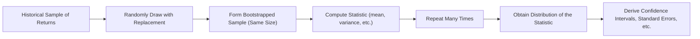

## Overview and Motivation

Bootstrap resampling might sound fancy, but at its core, it’s all about making the most of the data you already have. You may have come across situations where you’re not entirely sure about an asset’s return distribution—or maybe you worry that using a simple theoretical distribution, like normal or lognormal, can lead you astray. The bootstrap method helps you tackle this uncertainty by resampling from your original data to generate many plausible “alternate realities.” In each of these realities, you measure whatever statistic you care about—mean, variance, Sharpe ratio, alpha—then collect all those measurements to build an empirical distribution to gauge confidence intervals, standard errors, and more.

Unlike parametric methods that assume a specific distribution, bootstrapping stays flexible: you mostly rely on your data, not on an assumption that markets always behave in a certain “textbook” way. Let’s delve into why this approach resonates so strongly in finance and how you can apply it in your own analyses.

## Key Concepts

### Resampling and “With Replacement”

• Resampling: Any technique in which you reuse sample data to assess the variability or stability of a statistic.  
• With Replacement: Each time you draw an observation from your sample, you place it “back” into the pool, so it can be drawn again in the same bootstrap sample. This approach ensures the newly formed sample has the same size as the original one while retaining the possibility of repeated observations.

### Why Bootstrap?

• Distribution Agnostic: The bootstrap doesn’t force you to assume, for instance, that returns follow a normal distribution.  
• Versatility: You can bootstrap pretty much any statistic—mean return, volatility, correlation, Sharpe ratio, alpha, even more esoteric metrics.  
• Enhanced Confidence Intervals: By resampling many times, you build up a distribution of your statistic, making it straightforward to approximate confidence intervals.  
• Bias & Standard Error Estimates: The bootstrap is great for spotting bias in your estimator. Plus, it provides robust estimates of standard errors without complicated formulas or strong assumptions.

## The Bootstrap Process: Step by Step

Below is a high-level outline of how bootstrap resampling typically flows in a financial context:



1. Start with a historical sample, say monthly returns over the past five years.  
2. Draw a new sample the same size as the original by sampling with replacement. (Some data points might appear multiple times, others might not appear at all.)  
3. Calculate the statistic of interest (e.g., average monthly return).  
4. Repeat this process—often thousands of times—to get a distribution of that average monthly return.  
5. Use that distribution to gauge confidence intervals, standard errors, or to test hypotheses (e.g., “Is the Sharpe ratio significantly above zero?”).

## Implementation in Practice

### A Simple Example

Let’s walk through a short example, even if it feels a bit contrived:

1. Suppose you have five annual returns for a fund: 5%, 10%, –3%, 7%, 12%.  
2. You want to estimate the mean return and its 95% confidence interval using bootstrapping.

   (a) Draw five returns with replacement from this set. Example of a possible draw: [10%, 12%, 10%, –3%, 5%].  
   (b) Compute the mean of the bootstrapped sample (in this case, (10% + 12% + 10% – 3% + 5%) ÷ 5 = 6.8%).  
   (c) Repeat many times—say 1,000 or 10,000 replications—and store each mean.  
   (d) Sort these 1,000 means (or create a distribution plot) and look at the 2.5th percentile and 97.5th percentile to form your 95% confidence interval.  

Yes, it’s as straightforward as that. Just keep in mind that if your data has certain quirks—like strong serial correlation (think time-series momentum) or structural breaks in the economy—bootstrapping might not cure all problems. But for a lot of stable or near-stable processes, it’s super handy.

Here’s a small snippet of how you might implement this in Python:

```python
import numpy as np

returns = np.array([0.05, 0.10, -0.03, 0.07, 0.12])
n = len(returns)

num_replications = 10000

boot_means = []
for _ in range(num_replications):
    # Draw a sample with replacement
    sample_indices = np.random.randint(low=0, high=n, size=n)
    sample = returns[sample_indices]
    boot_means.append(np.mean(sample))

boot_means = np.array(boot_means)

lower_bound = np.percentile(boot_means, 2.5)
upper_bound = np.percentile(boot_means, 97.5)
point_estimate = np.mean(returns)

print("Bootstrap 95% CI: {:.2%} to {:.2%}".format(lower_bound, upper_bound))
print("Original Mean Return: {:.2%}".format(point_estimate))
```

Perhaps one day you’ll code something like this in your next portfolio analytics project or your final exam practice.

## Uses in Investments

### Assessing Performance Statistics

Bootstrapping is frequently used to gauge how “trustworthy” performance metrics might be. For instance, you could:

• Compute your fund’s Sharpe ratio from historical returns.  
• Bootstrap the returns to create a distribution of Sharpe ratios.  
• Evaluate the 5th percentile of that distribution: if it’s well above zero, you have decent evidence that your strategy’s Sharpe ratio isn’t just a fluke.

### Model Validation

Another big reason finance practitioners reach for bootstrap methods is to see whether parametric assumptions (like normality) hold water. You could compare your bootstrapped distribution against a theoretical normal distribution to check for skew, kurtosis, or heavier tails. If the bootstrap distribution isn’t at all aligned with your theoretical model, that’s a red flag.

### Decision Making

Say you’re analyzing how stable a model’s estimated parameters—like alpha, beta, or factor loadings—are over time. If you fear that your strategy’s alpha is not stable, you can repeatedly resample the historical data. If in many of these resamples you see alpha come out near zero or negative, that might be your cue to reconsider your conviction.

## Advantages and Limitations

### Advantages

1. Fewer Distributional Assumptions  
   Bootstrapping works with minimal assumptions. You only assume that your historical sample is somewhat representative of the future (stationary enough), without specifying any rigid parametric form.

2. Ease of Implementation  
   Thanks to modern computing power, it’s straightforward to run thousands of replications quickly, even in big data contexts.

3. Broad Applicability  
   It’s not restricted to a handful of statistics. You can bootstrap all sorts of estimators—even complex ones like Value-at-Risk or portfolio risk decompositions.

### Limitations

1. Stationarity Assumption  
   If we push the data as though every future scenario comes straight from a stationary distribution—while in reality, the economy has changed drastically—you can get misleading results.

2. Serial Correlation and Clustering  
   Typical bootstrap methods treat each observation as independent. If returns are autocorrelated (common in time-series data), normal bootstrapping might overstate or understate the true variability.

3. Lack of New Information  
   Bootstrapping draws samples only from what you have. If your original data is limited and doesn’t reflect all types of market conditions, your bootstrap distribution might not capture extremes (e.g., extreme meltdown or euphoria periods).

## Best Practices and Pitfalls

• Check for Data Quality: Ensure your dataset is accurate, consistent, and free of outliers caused by data errors. The bootstrap method only “knows” what your dataset shows.  
• Consider Block Bootstrap Variants: If you have reason to believe your data has autocorrelation, a block bootstrap can keep correlated blocks of data together.  
• Avoid Overinterpretation of Results: Bootstrapping can yield neat confidence intervals, but these intervals only make sense if your data is fairly representative of the environment you’ll face.  
• Cross-Validation with Other Methods: Sometimes you’ll want to combine bootstrapping with additional checks (e.g., parametric confidence intervals) to see if your conclusions align.

## Exam Relevance for CFA Candidates

From an exam standpoint, you’re likely to encounter bootstrap resampling in discussions about sampling, estimation, or portfolio performance evaluation. You might see a question where you’re given a few sample returns, asked to derive a confidence interval for the mean (or Sharpe ratio) using a bootstrapping approach. Or you might be asked to comment on the pros and cons of bootstrapping biases in portfolio analysis.

Common pitfalls in exam questions often revolve around misapplication of the stationarity assumption: it’s easy to forget that real-world financial time series can shift drastically over time. If you see an exam question with structural breaks or regime changes, that’s a cue to mention the limitations of bootstrapping.

## Practical Exam Tips

• Know the Steps: Be prepared to outline or describe the bootstrap procedure if asked for a short-answer or constructed-response question.  
• Watch Assumptions: If the question highlights that data might not be independent, mention block bootstrap or other corrections.  
• Confidence Intervals: Understand conceptually how to form percentile-based confidence intervals from the bootstrapped distribution.  
• Compare vs. Parametric Methods: If you’re asked to compare or combine bootstrap approaches with parametric approaches, highlight which method might fit best under given conditions (e.g., for non-normal or heavy-tailed distributions, the bootstrap can be more robust).

## References

• Efron, Bradley & Tibshirani, Robert. “An Introduction to the Bootstrap.” CRC Press.  
• Davison, A.C. & Hinkley, D.V. “Bootstrap Methods and Their Application.” Cambridge University Press.  
• CFA Institute Level I Curriculum, topics on Sampling and Estimation.

-----

## Test Your Knowledge: Bootstrap Resampling in Finance



### Which of the following best describes the main advantage of bootstrap resampling?

- [ ] It guarantees unbiased estimates in all scenarios.
- [ ] It provides a closed-form formula for standard errors.
- [x] It makes minimal assumptions about the return distribution.
- [ ] It requires data to follow a normal distribution.

> **Explanation:** The bootstrap method’s greatest advantage is that it does not require strong assumptions about the underlying distribution. It simply relies on sampling with replacement from the observed data.

### When conducting bootstrap resampling on a dataset of 100 historical monthly returns, which step is most appropriate?

- [x] Randomly select 100 returns from the dataset with replacement to form each replicate sample.
- [ ] Randomly select 50 returns from the dataset, ensuring no overlaps.
- [ ] Randomly select 100 returns but exclude those that appear more than once.
- [ ] Randomly generate returns from a normal distribution with the same mean as the dataset.

> **Explanation:** In bootstrap resampling, each replicate sample must have the same size as the original dataset and be drawn with replacement so that some data points may appear multiple times and some not at all.

### If your time series of returns exhibits significant autocorrelation, which approach to bootstrapping could help account for this?

- [ ] Parametric bootstrap
- [ ] Simple random sampling bootstrap
- [x] Block bootstrap
- [ ] Regression-based bootstrap

> **Explanation:** Block bootstrap methods preserve local time dependencies by treating the series in “blocks” rather than sampling individual points independently.

### Which of the following is a key limitation of bootstrap resampling in performance evaluation?

- [ ] It overestimates the true return distribution in all cases.
- [ ] It requires large sample sizes only for skewed distributions.
- [ ] It cannot produce confidence intervals for performance metrics.
- [x] It assumes historical returns adequately represent future behavior.

> **Explanation:** A common limitation is the assumption that past data (the sample) reflects a stable environment. If the future differs drastically from the past, inferences may be inaccurate. 

### What is the primary purpose of creating a distribution of estimates by repeating the resampling procedure multiple times?

- [ ] To eliminate the influence of outliers in the dataset.
- [ ] To artificially inflate the sample size to any desired amount.
- [x] To approximate the uncertainty (variance) around the estimated statistic.
- [ ] To prove that the data follows a normal distribution.

> **Explanation:** By resampling and recalculating the statistic repeatedly, you can observe the variation in the estimates and thereby approximate the distribution (and uncertainty) of the statistic of interest.

### Suppose you compute a portfolio’s average return from a single bootstrap analysis of 1,000 replicates. Which of the following statements is most accurate?

- [ ] The bootstrap mean always equals the sample mean.
- [x] The bootstrap distribution allows you to form approximate confidence intervals for the mean.
- [ ] The bootstrap can correct market regimes and periods with structural breaks.
- [ ] The bootstrap eliminates serial correlation within the data.

> **Explanation:** The bootstrap distribution gives you a way to form approximate confidence intervals. On the other hand, it does not inherently eliminate serial correlation, nor does it guarantee the same mean as the original sample.

### For a performance measure like the Sharpe ratio, in which scenario might bootstrapping be especially valuable?

- [x] When the return distribution is suspected to be non-normal.
- [ ] When the return distribution is perfectly normal.
- [ ] When the sample size is excessively large with no anomalies.
- [ ] Bootstrap is never recommended for risk-adjusted metrics.

> **Explanation:** Bootstrapping is particularly helpful when there is no certainty about normality. Many real-world returns show skewness, kurtosis, and heavier tails, making non-parametric methods more robust.

### What is a possible danger of repeatedly applying bootstrap on a sample with only 24 monthly returns?

- [ ] Too many outliers can be eliminated.
- [ ] The mean estimate will become biased toward zero.
- [x] The sample may be too small to capture the true variability, leading to unreliable bootstrap distributions.
- [ ] Short samples generally improve the bootstrap’s accuracy.

> **Explanation:** A very small sample might not encompass the underlying variability of the asset or strategy in question. Bootstrapping repeatedly on a limited data range can produce biased estimates.

### Which statement is most closely aligned with the "stationarity" assumption related to bootstrap methods in time series?

- [ ] Future returns always follow the exact pattern in the past.
- [x] The statistical properties (mean, variance) of returns do not change over time.
- [ ] Only short-term volatility changes are allowed, but long-term factors remain constant.
- [ ] The risk-free rate remains constant, so risk premiums must be stationary.

> **Explanation:** Stationarity means that the fundamental statistical characteristics of a time series remain constant over time. Returns that dramatically shift regime or have structural breaks would violate stationarity assumptions behind basic bootstrap.

### True or False: A primary benefit of the bootstrap is that it can be used for hypothesis testing without knowing the exact distribution of the test statistic.

- [x] True
- [ ] False

> **Explanation:** One of the most powerful applications of the bootstrap is for hypothesis testing and constructing confidence intervals when the distribution of the test statistic is unknown or difficult to derive analytically.


