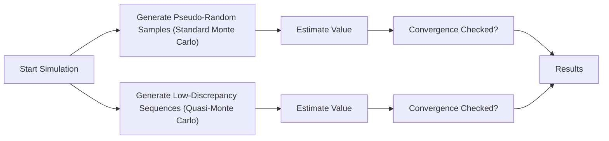

## Overview of Quasi‑Monte Carlo Methods

If you’ve ever tried plain old Monte Carlo simulations, you probably know how it feels to re-run them over and over, hoping for a slightly quicker convergence on your option pricing or portfolio risk estimates. Well, maybe that's just me—but I still remember the relief I felt when I first heard about quasi‑Monte Carlo methods. They’re built on the idea that we can replace purely random sampling with something more systematic, which often gives us better coverage of the “sample space” (the domain we’re simulating) in fewer steps.

Now, standard Monte Carlo simulations rely on sequences of pseudo-random numbers—numbers generated by a computer algorithm that should emulate randomness. Quasi‑Monte Carlo, on the other hand, uses low-discrepancy sequences. These sequences (e.g., Sobol’ or Halton) spread sample points more uniformly across the space. This uniform coverage can deliver more consistent results and potentially reduce simulation errors.

In financial applications—from pricing exotic options to evaluating Value at Risk (VaR) across large portfolios—the goal is to estimate integrals or expected values involving random processes. By placing sample points “cleverly” rather than randomly, quasi‑Monte Carlo usually converges to the true solution faster in many high-dimensional problems (though not always, depending on the distribution and structure of the model).

### Low-Discrepancy Sequences: A Closer Look

A “low-discrepancy sequence” is designed to cover the [0,1]^d hypercube (where d is the dimension of your problem) in a more uniform way than standard pseudo-random sequences. The measure of how evenly distributed these points are is called “discrepancy.” The lower the discrepancy, the more uniformly the points fill the space.

• Sobol’ Sequences: One of the most popular low-discrepancy sequences in quantitative finance. Often used for derivative pricing, portfolio analytics, and even scenario generation for risk management.  
• Halton Sequences: Another classical family of sequences for uniform coverage, though they can have correlation issues in higher dimensions.

Think of it like scatter points on a dartboard. Random tossing might land you some clusters or big gaps. Quasi-random throws are more evenly spaced, so you get more balanced coverage in fewer throws.

Below is a simple conceptual flowchart comparing Standard Monte Carlo and Quasi‑Monte Carlo:



## Variance Reduction Techniques

Even with quasi‑Monte Carlo, sometimes you want to squeeze more accuracy out of your simulations without simply doubling or tripling the computational effort. Variance reduction techniques (those fancy methods that reduce the volatility, or variance, of your simulation outputs) are exactly what you need. Here are four big ones:

### 1. Antithetic Variates

This trick is all about pairing each random draw X with its “opposite” draw −X. For instance, if your model uses standard normal draws Z for simulating stock returns, you take each Z and also use –Z in a complementary run.

• Why it helps: The payoff function resulting from Z and –Z often has negatively correlated outcomes, which can partially cancel each other out, reducing overall variance.  
• Simplified example: Suppose you simulate a call option payoff that depends on a normally distributed shock ε. For every random ε, you also run the simulation with −ε. The average result across each pair typically has lower variance than running two independent draws.

### 2. Control Variates

Control variates leverage the fact that for many simpler (but related) problems, you have a known analytical solution. You can incorporate that simpler problem into your simulation to “control” or reduce the variance of your more complex target.

• How it works:  
  1. Identify a variable whose expected value you know exactly.  
  2. Include this variable in each simulation run, and measure its difference from its known expected value.  
  3. Use this difference to adjust the results of your main variable of interest, thereby reducing variance.

• Example: Suppose you’re pricing an exotic derivative but also embed a standard option payoff in each simulation, for which you already have a closed-form (e.g., Black–Scholes) price. Any deviation in the standard option payoff from its known theoretical value helps correct the estimate for the exotic payoff.

### 3. Stratified Sampling

Stratified sampling is about dividing your range of possible outcomes into subranges, or “strata.” Then you sample proportionally within each stratum.

• Reasoning: By forcing coverage in each subrange, you avoid the randomness that might leave certain parts of the distribution underserved.  
• Common usage: In equity risk modeling, you might partition the possible daily returns into strata (e.g., large positive returns, moderate returns, small negative returns, large negative returns) to ensure each category is adequately represented.

### 4. Importance Sampling

Sometimes the real action in your simulation happens in the tails: for instance, stress events in risk management. With importance sampling, you deliberately oversample the “important” region (“tail events”) to achieve better estimates there.

• Practical advantage: If you want to estimate rare event probabilities (like default risk or catastrophic market moves), generating enough tail samples in a regular Monte Carlo can be painfully slow. You might see only a few such events out of thousands of draws.  
• Implementation detail: You shift or tilt the distribution toward the tail by choosing a new distribution that’s more concentrated in the region of interest. Then you weight the outcomes by their likelihood ratio (adjusting for the fact that you’re not sampling purely from the original distribution).

## Practical Uses in Finance

1. Derivative Pricing  
   • Complex payoffs (e.g., exotic paths, barrier features) can be priced more efficiently when you combine quasi‑Monte Carlo sampling with variance reduction.  
   • Example: Pricing a CDO (Collateralized Debt Obligation) where you have many correlated underlying assets. Quasi-random sequences can help navigate high-dimensional integrals.  

2. Risk Management  
   • For VaR or tail-risk estimation, importance sampling is particularly handy because you can zero in on extreme events that drive losses.  
   • Stratified sampling ensures that you have balanced coverage across a wide range of potential outcomes, which can be helpful when you need a consistent view of risk across multiple sub-portfolios.

3. Portfolio Analytics  
   • Quasi‑Monte Carlo methods can help when analyzing robust portfolio allocations or stress testing. By distributing sampling points more uniformly, you’ll get a more comprehensive look at how multiple factors might move simultaneously.

## Implementation Tips and Common Pitfalls

• Dimensionality Matters: Quasi‑Monte Carlo often shows greater benefits in higher dimensions, but in extremely high dimensions, even low-discrepancy sequences can lose their advantage.  
• Combining Techniques: You can get incremental gains by combining, say, antithetic variates with quasi‑Monte Carlo or by applying a control variate technique to further reduce variance. But be mindful of the extra complexity.  
• Distribution Fit: Some low-discrepancy sequences are inherently well-suited for uniform distributions on [0,1]. If you’re sampling from lognormal or gamma distributions, you’ll need a transformation.  
• Implementation Complexity: Importance sampling is powerful, but you need to be absolutely sure your “importance function” and the associated weighting scheme are correct. A rare event might become over-sampled, incorrectly skewing your estimates if you miscalculate the weights.  
• Code Maintenance: Some of these methods require a deeper understanding of random number transformations. Make sure your team knows how to verify correctness—in other words, do a sanity check with small-scale tests or known results.

## Example: Pricing an Exotic Option with Quasi‑Monte Carlo + Control Variates

Let’s do a short hypothetical:

1. You want to price a complex barrier option dependent on multiple underlying assets—maybe five currency pairs and three equity indexes.  
2. You generate 50,000 low-discrepancy Sobol’ draws instead of 100,000 or more pseudo-random draws.  
3. As a control variate, you embed a standard basket call option in each simulation, for which you know the theoretical Black–Scholes–Merton price.  
4. You compute the difference between the simulated value and the known theoretical value of that standard option in each path.  
5. You adjust your barrier option payoff using this difference, leading to a reduced variance in the final estimate.  

In practice, you might discover your variance is 20–30% smaller, giving more precision for the same number of draws. Or you can go the other way around—achieve the same precision with fewer draws.

Below is a simple snippet in Python-like pseudocode to illustrate:

```python
import numpy as np

def sobol_sequence(n, d):
    # Placeholder function: you would typically use a library
    # like 'sobol_seq' for real Sobol' sequence generation
    return np.random.rand(n, d)  # Not truly Sobol', just for example

def barrier_option_payoff(paths):
    # Hypothetical payoff function
    return np.maximum(paths.mean(axis=1) - 100, 0)

def standard_call_payoff(paths):
    return np.maximum(paths.mean(axis=1) - 95, 0)

N = 50000
D = 8  # dimension

sobol_points = sobol_sequence(N, D)

# For demonstration, let's skip that step.

barrier_payoffs = barrier_option_payoff(sobol_points)
standard_call = standard_call_payoff(sobol_points)
standard_call_price = 5.0  # hypothetical closed-form price

barrier_mean = np.mean(barrier_payoffs)
control_variate = np.mean(standard_call)
cov_bc = np.cov(barrier_payoffs, standard_call)[0, 1]
var_c = np.var(standard_call)
optimal_alpha = cov_bc / var_c

barrier_adjusted = barrier_payoffs - optimal_alpha * (standard_call - standard_call_price)
barrier_cv_price = np.mean(barrier_adjusted)

print("Estimated Barrier Option Price =", barrier_cv_price)
```

Despite being a simplified illustration, it highlights the mechanics of combining quasi-random draws (though we called a random function in the placeholder) with a control variate approach.

## Conclusion

Quasi‑Monte Carlo and variance reduction techniques are powerful ways to push your simulations closer to truth without brute-forcing with tens or hundreds of thousands of extra samples. They can be a bit tricky to set up, and each has its sweet spot depending on the problem at hand. In portfolio risk scenarios, beyond just run-of-the-mill scenario analyses, these methods can fast-track your ability to discover vulnerabilities and properly price complex instruments.

Whether you opt for Sobol’ sequences, importance sampling, or antithetic variates, the overarching principle remains the same: better coverage, faster convergence, and less random noise. It can feel a bit like magic at first, but behind that magic are well-studied numerical techniques that are standard in advanced financial modeling.

## References and Further Reading

• Glasserman, P. (2003). Monte Carlo Methods in Financial Engineering. Springer.  
• Morokoff, W.J. & Caflisch, R.E. (1994). “Quasi-Monte Carlo Integration.” Journal of Computational Physics, 122(2), 218–230.  
• Caflisch, R.E. (1998). “Monte Carlo and Quasi‑Monte Carlo Methods.” Acta Numerica, 7, 1–49.  

## Practical Exam Tips

• Evaluate possible synergy: See if combining multiple variance-reduction techniques is worthwhile for your scenarios.  
• Watch for dimension blow-up: Quasi‑Monte Carlo sequences generally help in moderate-to-high dimensions, but if your dimension leaps into the hundreds or thousands, performance may degrade.  
• Understand weighting in importance sampling: A common exam pitfall is forgetting to adjust for the altered probability measure.  
• In essay (constructed-response) questions, illustrate the logic behind choosing specific variance-reduction techniques. Don’t just state which technique you used—explain why.  
• Time management: For item sets, you might see questions about matching a technique to a scenario (e.g., best approach for tail analysis = importance sampling).  

------------------------------------------------------------------------------

## Quasi‑Monte Carlo and Variance Reduction Techniques Quiz



### Which statement best describes the advantage of quasi‑Monte Carlo methods over standard Monte Carlo methods?

- [ ] They allow random draws from any arbitrary distribution without transformations.  
- [ ] They guarantee a perfect solution in fewer steps than standard Monte Carlo.  
- [x] They often cover the sample space more evenly with low-discrepancy sequences, potentially reducing simulation error.  
- [ ] They eliminate the need for variance reduction techniques.  

> **Explanation:** Quasi‑Monte Carlo uses low-discrepancy sequences designed to more uniformly populate the sample space, which can reduce the number of draws needed for a comparable level of accuracy.


### What is the main goal of variance reduction techniques in simulation?

- [x] Decreasing the variance of simulation outputs without increasing the number of samples.  
- [ ] Simplifying the payoff function to achieve closed-form solutions.  
- [ ] Eliminating the need to use large sample sizes.  
- [ ] Generating random numbers faster than standard pseudo-random methods.  

> **Explanation:** Variance reduction techniques seek to lower the dispersion of simulation results, enabling more accurate estimates for the same sample size.


### In the antithetic variates method, how are random samples typically paired?

- [ ] By choosing every third random number.  
- [ ] By sorting random numbers in ascending order.  
- [x] By pairing each random draw X with its “opposite” (e.g., −X).  
- [ ] By converting random draws to a uniform distribution.  

> **Explanation:** Antithetic variates require taking each random draw X (often standard normal) and pairing it with −X to reduce variance through negatively correlated outcomes.


### Which statement specifically relates to control variates?

- [x] They involve using a related variable with a known expected value to help adjust the primary estimate.  
- [ ] They require sampling more heavily in the tails of a distribution.  
- [ ] They rely on partitioning the sample space into multiple layers or strata.  
- [ ] They use negative pairs of random numbers to cancel out variance.  

> **Explanation:** Control variates use a known-value variable to reduce the variance of the target variable; the difference in the known variable’s observed and theoretical mean is used for correction.


### What is a noted benefit of stratified sampling?

- [ ] It ensures 100% coverage in each part of the distribution.  
- [ ] It eliminates the need for any randomness.  
- [x] It enforces balanced coverage in each subrange or “stratum,” reducing sampling variability.  
- [ ] It always provides faster convergence than antithetic variates.  

> **Explanation:** Stratified sampling partitions the range into subgroups and draws samples within each subgroup, leading to a more balanced representation across the distribution.


### Why is importance sampling particularly useful for tail risk analysis in finance?

- [ ] It calculates the exact probability of rare events without simulation.  
- [x] It oversamples the critical regions (such as the tail), improving estimates of event probabilities and payoffs.  
- [ ] It can handle infinite-dimensional problems.  
- [ ] It replaces the original distribution with uniform sampling.  

> **Explanation:** Importance sampling focuses more of the simulation effort on parts of the distribution that are critical to the measured outcome (often the tail), improving the estimates for rare events.


### In derivative pricing, why might combining control variates with quasi‑Monte Carlo be advantageous?

- [ ] Low-discrepancy methods conflict with control variates, leading to poor results.  
- [x] The uniform coverage from quasi‑Monte Carlo can be further refined by a control variate, reducing variance even more.  
- [ ] Control variates are ineffective in pricing derivatives.  
- [ ] Quasi‑Monte Carlo automatically includes control variates.  

> **Explanation:** Quasi‑Monte Carlo helps by providing more uniform sampling, and control variates complement it by adjusting the estimate based on known results, thereby often yielding additional variance reduction.


### Which is a common pitfall when using importance sampling?

- [ ] Forgetting to pair each draw with its negative counterpart.  
- [x] Failing to correctly reweight samples when changing the probability measure.  
- [ ] Mixing up the known expected value of related variables.  
- [ ] Sampling exactly the same number of times in each stratum.  

> **Explanation:** In importance sampling, you choose a new distribution that concentrates on the important region. You must reweight samples according to their likelihood ratio, and an incorrect weight adjustment can severely bias the results.


### When might low-discrepancy sequences lose their advantage over pseudo-random sequences?

- [ ] In problems with two or three variables.  
- [x] In problems of extremely high dimensions, where the uniform coverage advantage may degrade.  
- [ ] In parametric tests or hypothesis testing.  
- [ ] In computing standard error of the simulation.  

> **Explanation:** Although quasi‑Monte Carlo typically helps with moderate-to-high dimensions, in extremely high-dimensional problems, the benefits can diminish due to the complexity of mapping low-discrepancy sequences effectively across so many dimensions.


### True or False: Quasi‑Monte Carlo methods eliminate the need for any other variance reduction techniques.

- [x] True  
- [ ] False  

> **Explanation:** Actually, this statement is false—quasi‑Monte Carlo can be combined with other variance reduction methods to further improve results. It does not completely eliminate the need for them.


