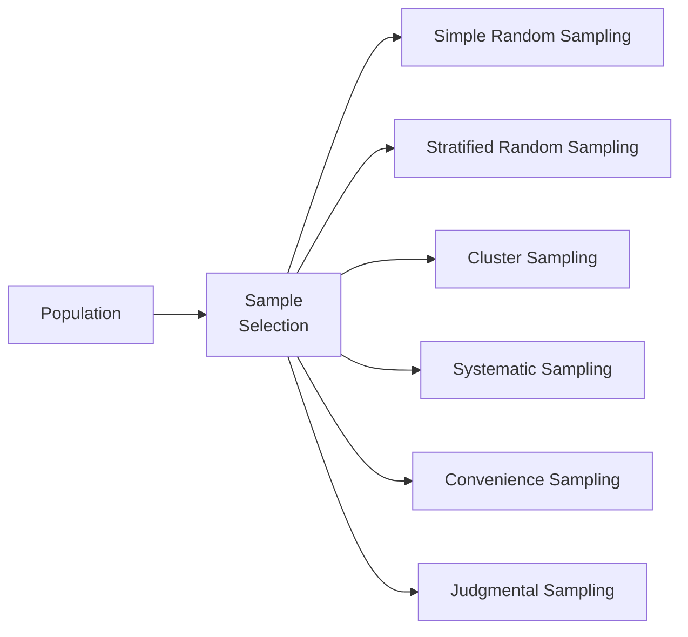

## Overview

Sampling is a fundamental technique in finance and many other fields. At its core, it’s about selecting a manageable subset (a sample) from a larger group (a population) so we can make statements about that larger group without having to examine every single member. In finance, we might draw samples of past returns to forecast future performance, sample bond issuers to understand credit risk trends, or sample investors to gauge sentiment. 

Although the term “sampling” might sound straightforward, there are multiple ways to do it, and each approach comes with its own strengths, weaknesses, and biases. On the bright side, a well-chosen sampling method can save enormous amounts of time and money, while providing insights that are close to what you’d get if you studied everyone (or everything). On the darker side, a poor sampling choice can lead to misleading results and potentially disastrous investment decisions.

I remember a time, early in my career, when I was working on a quick internal survey of portfolio managers to measure how much value they believed active management provided versus passive investing. I relied on convenience sampling—basically asking the folks in my immediate network—and ended up with a skewed set of results: nearly everyone was outraged by the idea of indexing because they were a specialized group of active managers. That personal experience really highlighted for me how sampling method can be critical. If you pick the wrong approach, well, your “insights” won’t be so insightful.

Below, we explore the various sampling methods, disclose how you might apply them in an investment context, and show how to minimize both sampling and non-sampling errors for more robust conclusions.

## Key Concepts in Sampling

Before diving into specific sampling methods, let’s clarify a few terms you’re bound to encounter:

- Population: The entire set of items you care about. For instance, all publicly traded equity securities in a global market.
- Sample: A subset of the population you observe or measure. 
- Parameter: A numerical characteristic of the population (e.g., the true mean return of a market index).
- Statistic: A numerical characteristic computed from the sample (e.g., the sample mean return).
- Sampling Error: The difference between the sample statistic and the actual population parameter. 
- Non-Sampling Error: Errors not related to the sampling process itself, such as measurement mistakes or data-entry errors.

In a perfect world, your sample’s statistic would precisely reflect the population’s parameter. In reality, samples are never perfect. Part of our job as analysts is to choose a method of sampling and a sample size that balance practicality with accuracy.

## Common Sampling Methods

### Simple Random Sampling

Simple random sampling is the foundation. Each member of the population has an equal probability of being chosen, and selections are made entirely by chance. This approach is popular because it’s conceptually straightforward and often considered the gold standard for unbiasedness—assuming you can truly randomize the selection.

In a practical investment scenario, simple random sampling might mean pulling random stock returns from a comprehensive list of thousands of global equities. If all securities truly have the same chance of being selected, you minimize selection bias. However, pure randomness can be challenging to ensure in practice (especially if your database has structural issues), and it can become very expensive or time-consuming for large populations. 

### Stratified Random Sampling

Stratified sampling involves dividing the population into subgroups (called strata) based on certain characteristics—maybe geography, market capitalization, sector, or credit rating—and then randomly sampling within each subgroup. If each stratum’s internal population is relatively homogeneous on some key trait, stratified sampling can yield more precise estimates.

In portfolio management, you might stratify by market cap (small-cap, mid-cap, large-cap). Then, you randomly sample a certain number of stocks within each group. This approach ensures you capture small-cap patterns even if the total proportion of small-cap stocks in the market is modest. In practice, stratification often leads to lower variance in your estimates (like mean returns) compared to a simple random sample, especially if the strata are well-chosen.

### Cluster Sampling

Cluster sampling flips the stratification concept somewhat by dividing the population into heterogeneous groups that ideally resemble mini versions of the entire population. Then you randomly select a few clusters and study either all or a random selection of members within those clusters.

For instance, you might cluster by global region—say, North America, Europe, Asia-Pacific—and hope each region has a diverse set of investments. You then pick a random sample of these regions and collect all your data from within the chosen clusters. It’s more cost-effective than traveling to every possible region or company, but it can introduce higher sampling error if your clusters vary significantly from each other.

### Systematic Sampling

Systematic sampling involves picking a random starting point and then choosing members at regular intervals (the skip or sampling interval). In a list of 10,000 subscribers to an investment newsletter, you might randomly pick someone in the first 100, then select every 100th subscriber thereafter.

It’s an easy approach to implement—especially if you have a neatly ordered list—but watch out for hidden patterns. For example, if the list is ordered by zip code and you inadvertently skip entire types of neighborhoods, you might end up with a weirdly biased sample.

### Convenience Sampling

Convenience sampling is like picking fruit from the lowest branch of a tree: you just grab whatever is easiest. This might be volunteers who respond to a call for feedback on a website or passersby in a busy financial district.

It’s quick and cost-effective but can be spectacularly biased. People with strong opinions or abundant free time may be overrepresented. Despite its flaws, convenience sampling can be a practical preliminary tool in finance projects—especially if you’re under a severe time constraint and just need some early-stage feel for data. Still, any major conclusions drawn from convenience samples are suspect.

### Judgmental (Purposive) Sampling

Judgmental sampling relies on the researcher’s expertise to choose what they believe is a representative sample. For instance, an investment manager might pick “best-in-class” corporate bonds for a fixed-income study, believing those selections represent bond market performance overall.

The risk is that the researcher’s judgment might be off (or simply biased). This approach can be valuable when genuine expertise is available—like a senior analyst who thoroughly knows a niche market—but you always have to weigh the possibility of unintentional bias.

## Diagram: Sampling Method Overview

Below is a Mermaid diagram summarizing the relationship among different sampling approaches:

## Sampling Error vs. Non-Sampling Error

Sampling error is essentially the gap between the sample statistic (like the sample mean) and the true population parameter (like the true mean). Even in a perfectly executed random design, there’s no full escape from sampling error unless you sample the entire population. This is part of the reason analysts rely on confidence intervals and hypothesis testing (covered in subsequent sections) to assess uncertainty.

But it’s not just about random chance. Non-sampling errors can be equally deadly. Imagine you have a small glitch in your code that misclassifies certain bonds as having zero coupon. Or consider that some respondents might lie in a survey about their risk tolerance. These are non-sampling issues and can compromise your entire analysis—even if you used the world’s best sampling technique.

In an investment firm, non-sampling errors might arise from data snooping or incorrectly labeled data sets. As you might guess, controlling for these errors requires rigorous data cleaning, consistency checks, and robust operational processes.

## Reducing Sampling Error

One straightforward way to reduce sampling error is to increase the sample size. The more data points you have, the closer your sample mean is likely to be to the true mean (by virtue of the Law of Large Numbers). However, in analyzing, say, global stock returns, you can’t just keep collecting data forever—it might be cost-prohibitive or logistically impossible.

Another strategy is to choose a more effective sampling method for the problem at hand. If the population naturally segments into meaningful subgroups, stratified sampling can yield narrower confidence intervals than a simple random sample of the same size. Similarly, if practical constraints hamper your ability to gather data from diverse corners of the market, cluster sampling might be the only cost-effective design.

## Practical Example for Portfolio Management

Let’s connect sampling to a scenario you could well see in your investment practice. Suppose you oversee a multi-asset portfolio with positions in global equities, bonds, and alternative investments. You want to estimate the overall volatility of this portfolio over the next quarter to stress-test your capital requirements.

• If you draw a simple random sample of historical daily returns, you might omit the fact that certain markets are rarely traded during certain times, leading to biases in your variance estimate.  
• A stratified approach might separate equities by region (North America, EMEA, Asia-Pacific), then sample daily returns within each region. You’d do something similar for bonds and alternatives. This ensures representation of all key subgroups.  
• Alternatively, if you have consistent historical data for only a handful of markets, you might cluster these by geographical zone. You’d randomly pick a few representative zones and gather historical returns data from each. This cuts data collection costs.  

Your choice depends on data availability, cost, and the level of precision you need. The final takeaway: the better the sampling design, the more confidence you can have in your risk estimates and subsequent capital allocation decisions.

## Implications for the CFA® Exam

Sampling is a significant topic on the CFA® exams, especially in quantitative methods sections. At the Level I stage, you’re expected to know definitions, rationale, and basic calculations (like how sample mean differs from population mean). By Level II and Level III, you’ll face more advanced applications—like how to interpret regression outputs or how sampling design can target a particular research question in portfolio analysis. For instance, in a performance attribution scenario, you might see vignettes about how they formed their data sample and be asked to judge sample reliability and potential biases.  

In the broader context of ethical standards (CFA Institute Code of Ethics and Standards of Professional Conduct), using an unreliable sample to make inflated performance claims can easily violate the responsibility to clients and the market. So, thorough knowledge of sampling designs isn’t just academic—it helps preserve integrity and trust in your analyses.

## Best Practices and Common Pitfalls

• Always question your sampling approach: Is it truly capturing the population, or is there hidden systematic bias?  
• Confirm your sampling frame is complete and up to date, especially in fast-changing fields like emerging market equities or cryptocurrencies.  
• Document your assumptions and processes. If you use cluster sampling, justify your cluster definitions and check if they indeed represent miniature versions of the overall population.  
• Watch out for convenience and judgmental sampling biases. Sometimes you have no choice (maybe you have a single data vendor), but at least be mindful of the limits of your design.

## Exam Tips

• Know the key differences: For instance, how stratified sampling differs from cluster sampling.  
• Expect item-set questions where a portfolio manager used systematic sampling incorrectly because of a cyclical listing of securities.  
• Practice short calculations: For example, identifying sample mean, sample standard deviation, or sampling error from a small data set.  
• Be prepared for conceptual questions about the trade-off between cost and accuracy in a real-world scenario.  
• Before tackling more advanced topics like hypothesis testing (Chapter 8) or regression (Chapters 10 and 14), make sure you’re comfortable with how your data was sampled in the first place.

## References

- Quantitative Investment Analysis by CFA Institute (particularly sections on sampling and data analysis).  
- Montgomery, D. C., & Runger, G. C. (2018). Applied Statistics and Probability for Engineers. Wiley.  
- Cochran, W. G. (1977). Sampling Techniques. Wiley.  

## Engage with Key Sampling Concepts



### Which of the following statements best defines stratified random sampling in a financial-context scenario?

- [ ] Each security in the market has an equal chance of being selected, ensuring no bias.
- [x] The market is segmented into subgroups (e.g., by sector), and random samples are taken from each subgroup.
- [ ] The market is divided into many self-contained clusters, and all securities are sampled from chosen clusters.
- [ ] You pick the first security at random, then select every nth security along a list.

> **Explanation:** Stratified random sampling partitions a population into meaningful subgroups (strata) and then applies random sampling within each stratum. This helps preserve representation and potentially reduce variance.

### In practice, what is the main advantage of cluster sampling over simple random sampling when analyzing globally distributed bond issuers?

- [ ] It guarantees less bias in the sample.
- [ ] It always requires fewer observations to achieve the same level of confidence.
- [x] It can significantly reduce data collection costs when populations are large and geographically dispersed.
- [ ] It ensures each subgroup of interest is represented proportionally in the sample.

> **Explanation:** Cluster sampling often lowers data collection costs. Instead of gathering data across all regions or companies, you randomly choose a few clusters (like geographic regions) and collect from those alone.

### Which statement most accurately characterizes non-sampling error?

- [ ] It can only occur in convenience sampling and never in random methods.
- [x] It includes errors such as data-entry mistakes, response biases, or coding glitches unrelated to how the sample was drawn.
- [ ] It arises purely because some proportion of the population was not included in the sample.
- [ ] It primarily involves the difference between sample and population means.

> **Explanation:** Non-sampling error arises from aspects outside the sampling process itself, for instance, measurement errors, incorrect data coding, or untruthful responses in surveys.

### When using systematic sampling to select stocks from a sorted list, which hidden risk can affect the validity of the sample?

- [ ] Over-coverage of minority sectors.
- [ ] A guaranteed introduction of non-sampling error.
- [x] Accidentally matching the sampling interval to a cyclical pattern in the list, causing biased results.
- [ ] Difficulty in computing a sample mean.

> **Explanation:** If the population ordering has cyclical features that align with your skip interval, you could repeatedly pick only certain types of stocks, thus introducing bias.

### A firm conducts a survey of client risk tolerance using volunteers from its website. Which statement best describes this approach?

- [ ] This is an example of systematic sampling.
- [x] This is a convenience sample that might systematically exclude less-engaged clients.
- [ ] This is a simple random sample because anyone could potentially fill out the survey.
- [ ] This is a stratified design split by high-, medium-, and low-risk clients.

> **Explanation:** Soliciting volunteers on a website typically leads to a convenience sample, which can easily introduce bias. More engaged or web-savvy users might be overrepresented.

### What is the essential property of a simple random sample?

- [x] Every member of the population has an equal chance of being selected.
- [ ] Each sub-stratum of the population is represented proportionally.
- [ ] You pick items based on the researcher’s judgment of representativeness.
- [ ] Data collection is minimized by picking fewer clusters.

> **Explanation:** In a simple random sample, each population member has an equal probability of inclusion, which, in theory, limits selection bias.

### If the total population is divided into subgroups such that they are relatively homogeneous internally, and more precise estimates are obtained by sampling each subgroup, which term describes this method?

- [x] Stratified random sampling.
- [ ] Simple random sampling.
- [ ] Convenience sampling.
- [ ] Judgmental sampling.

> **Explanation:** When each subgroup is internally homogeneous for key attributes, stratified random sampling improves estimate accuracy.

### For a global equity study, an analyst selects five stock markets at random and includes all listed stocks from those five markets in the data. Which of the following best describes this sampling approach?

- [x] Cluster sampling.
- [ ] Stratified random sampling.
- [ ] Simple random sampling.
- [ ] Systematic sampling.

> **Explanation:** Choosing entire markets (clusters) and studying every component within them is a classic example of cluster sampling.

### Which is the best way to reduce sampling error without fundamentally changing the sampling method?

- [ ] Switch to systematic sampling from simple random sampling.
- [x] Increase the sample size.
- [ ] Rely solely on your expert judgment to pick “best” data points.
- [ ] Decrease the number of subgroups in stratification.

> **Explanation:** Generally, increasing the sample size reduces the standard error of the estimate, leading to a smaller sampling error.

### True or False: Non-sampling errors can be completely eliminated by using a larger sample.

- [ ] True
- [x] False

> **Explanation:** Non-sampling errors (e.g., response bias, measurement errors) aren’t mitigated simply by increasing the sample size. They stem from issues unrelated to sample selection.


