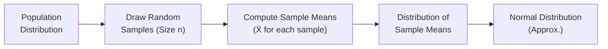
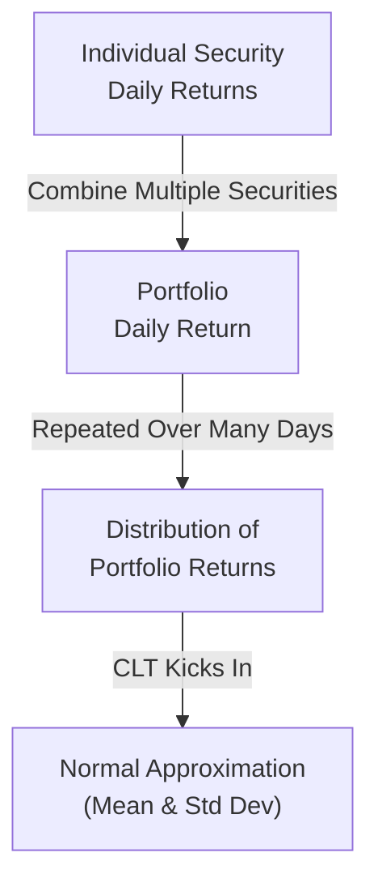

## Introduction

So, I was chatting with a friend the other day—someone who’s fairly new to statistics and was curious about why everyone in finance seems so obsessed with the normal distribution. And, you know, I found myself explaining the Central Limit Theorem (CLT) in a pretty casual way: if you take enough samples from any population (with finite variance, of course), the average of those samples gets close to a bell-shaped, or normal, distribution. That’s kind of the brilliant heart of the CLT. It’s a big deal in all sorts of financial applications—from modeling portfolio returns to viable risk assessments.

Below, we’ll explore why the CLT is so important, how it explains the distribution of the sample mean, and how it practically shows up in the financial world. We’ll do our best to keep this discussion engaging and straightforward, complete with real-world examples, some short references to advanced portfolio management contexts, and a few cautionary notes. Let’s dig in.

## Conceptual Foundation of the Central Limit Theorem

The Central Limit Theorem says (in slightly fancy terms) that if you have a population with a mean μ and standard deviation σ (and that population’s variance is finite), then for sufficiently large sample sizes n, the distribution of the sample mean will be approximately normal:

• Sample Mean: X̄  
• Expected Value: E(X̄) = μ  
• Standard Error: σ / √n

Formally, if we draw many independent samples of size n from any population, the distribution of the sample means, X̄, converges toward a normal distribution as n → ∞. This is true regardless of what the initial distribution looks like—be it skewed, uniform, or multimodal—so long as we have a finite variance.

### A Quick Thought Experiment

Imagine a jar filled with numerous small balls labeled with different numbers—these numbers represent draws from some distribution. If you repeatedly take, let’s say, 30 balls at a time, calculate their average, and write that average down, you end up with many averages written on a sheet of paper. Eventually, if you chart these averages, you’ll start to see a shape that looks more and more like a bell curve. That’s the CLT in action.

## Distribution of the Sample Mean

The probability distribution of the sample mean, X̄, is central to inferential statistics because it helps investors, analysts, and risk managers figure out how confident they can be about an estimate of a population mean.

• If the population standard deviation σ is known, then the standard error of the sample mean is:  
  
  \sigma_{\bar{X}} = \frac{\sigma}{\sqrt{n}}
  

• If σ is unknown, we typically estimate it with the sample standard deviation s, giving:
  
  s_{\bar{X}} = \frac{s}{\sqrt{n}}
  

That standard error is basically your best friend in deciding how “spread out” the sample mean might be around the true mean.

### Mermaid Diagram: From Population to Sampling Distribution

Below is a simple Mermaid diagram that shows the conceptual flow from a population to repeated sampling and toward the normal approximation:



If you imagine drawing bigger and bigger samples (n getting larger), the distribution of those sample means D starts to look more like E, the normal distribution.

## Role of the Standard Error

The standard error is pivotal for confidence intervals and hypothesis testing. Let’s say we want to test whether a portfolio’s average return is some value μ₀ or see if it differs from μ₀. With a large sample—thanks to the CLT—we can rely on normal-based methods. The standard error dictates just how precise our estimates are:

• A larger n shrinks the standard error, making X̄ more likely to be very close to μ.  
• A small n, though, yields a relatively big standard error, meaning more uncertainty around our estimate.

In short, if you’re reading about “confidence intervals around the mean” or “z-tests on the mean,” the standard error is right in the thick of it, courtesy of the CLT.

## Large-Sample Considerations and Practical Advice

Once n crosses around 30 (though “30” is more of a rule-of-thumb than a magic cutoff), the CLT is typically robust enough to let you use z-tests for confidence intervals and hypothesis tests—even if your original data aren’t perfectly normal. Of course, you want to be mindful of outliers or extreme skewness in your data set. And in practice, 30 might be too small if the underlying distribution is heavily fat-tailed (common in real finance data sets). 

### A Word on Financial Returns

Now, building on your advanced knowledge—some might say daily stock returns or portfolio returns can be somewhat (or markedly) non-normal, with skewness and kurtosis. However, once you aggregate or average returns across multiple days, or across a large cross-section of securities, the CLT tends to help in approximating an overall normal distribution for the mean. That is, many models in risk management (like Value at Risk) still rely on normal assumptions strictly due to the CLT’s power. But always remember: real markets can produce “fatter tails” than normal—and that’s definitely something to keep in mind.

## Small-Sample Considerations

When n < 30, or your data are in some way not well-behaved (maybe it’s super skewed, or maybe it has outliers that defy typical normal assumptions), you can’t simply rely on the CLT. In such a scenario:

• If the population distribution is truly normal (or nearly so), you can use t-distribution based approaches for inference (instead of z).  
• If the population distribution is unknown or not normal, you may consider nonparametric methods or, if feasible, collect more data.  

It’s possible that in the real world of investment performance measurement—like if you’re dealing with monthly returns and don’t have decades’ worth of data—the t-distribution might provide a better approach.

## Real-World Scenario: Stress Testing and Risk Assessment

Imagine a portfolio manager who wants to estimate the mean daily P/L (profit and loss). The manager has data on daily P/L over the past year (roughly 252 trading days). According to the CLT, the sampling distribution for the mean daily P/L from these 252 observations can be approximated as normal. This assumption underpins constructing a confidence interval around the average daily P/L:


\bar{X} \pm Z_{\alpha/2} \times \frac{\sigma}{\sqrt{n}}


Here, \\(\bar{X}\\) is the sample mean of the daily P/L, \\(\sigma\\) is the sample standard deviation over those 252 days, and \\(Z_{\alpha/2}\\) is the z-value for the given confidence level (say 1.96 for 95% confidence).  

If the manager subsequently wants to incorporate this estimate into a stress test scenario—like a hypothetical market crash—some advanced models might continue to rely on normal approximations, while others will incorporate distribution tail adjustments to account for potential outliers or extreme events.

## Best Practices, Common Pitfalls, and Challenges

• Always Inspect Your Data: If your data set is super skewed or shows signs of heavy tails, the normal approximation might not be perfect—even if your sample is “big.”  
• Know When n Is “Large Enough”: The typical threshold n ≥ 30 is context-dependent. In finance, heavy tail distributions sometimes necessitate an even larger n for normal approximations.  
• Combine the CLT with Other Tools: For small samples, you might rely on the t-distribution or try nonparametric tests. For outliers, robust statistics or direct transformations might help.  
• Recognize Real-World Limitations: While the CLT is powerful, real markets can behave in ways that deviate from standard assumptions, especially in terms of correlation shifts during stress periods.

## Quick Python Snippet: Simulating the CLT

Below is a short snippet showing how you might simulate the CLT for a large sample in Python. We generate a lognormal distribution for the population, then compute sample means repeatedly:

```python
import numpy as np
import matplotlib.pyplot as plt

np.random.seed(42)

population_size = 10_000_000
population = np.random.lognormal(mean=0, sigma=1, size=population_size)

sample_size = 100
num_samples = 2000

sample_means = []
for _ in range(num_samples):
    sample = np.random.choice(population, size=sample_size, replace=False)
    sample_means.append(np.mean(sample))

plt.hist(sample_means, bins=30, alpha=0.7, color='blue', density=True)
plt.title("Distribution of Sample Means (Lognormal Population)")
plt.xlabel("Sample Mean")
plt.ylabel("Frequency")
plt.show()
```

Even though the original population is lognormal (which is definitely not symmetric), the histogram of sample means tends to appear more bell-shaped as the sample size grows.

## Diagram of CLT’s Impact on Portfolio Returns

Another short Mermaid diagram can illustrate how the CLT concept extends to portfolio returns:



By averaging returns across many securities (and many time periods), the portfolio’s average daily return might be estimated with a near-normal distribution. This is used frequently in portfolio optimization and risk management decisions.

## Ties to Other Topics

As you progress, you’ll encounter the CLT in countless areas. In hypothesis testing (Chapter 8), you’ll see how the test statistic for the mean uses normal (or t) distribution assumptions. In regression (Chapters 10 and 14), the error terms are often assumed normal or become normal in large samples thanks to the CLT.  

Beyond that, in portfolio mathematics (Chapter 5), we reason about expected returns and risk using aggregated or average returns across multiple assets—again, the CLT helps justify normal-based assumptions for large cross-sections.

## Summary and Exam Tips

• The Central Limit Theorem allows us to use normal approximations for the distribution of the sample mean when n is large.  
• For the CFA exam context, remember that the CLT backs up most large-sample methods, from z-tests on population means to advanced portfolio risk assessments.  
• Time constraints in the exam: If you see a question about an unknown distribution but the sample size is large (≥ 30 is conventional), you can often apply normal-based methods.  
• Watch for the trick: If data are heavily skewed, extremely volatile, or the sample is small, you may need a t-distribution or a nonparametric approach.  
• In scenario-based or item-set questions, be prepared to link the CLT to questions on confidence intervals, chance of returns exceeding a threshold, or stress testing in portfolio management.

In short, the CLT is a truly foundational theorem that you’ll see repeated at every turn in advanced finance—almost like a best friend who follows you around in your exam prep, reminding you that much of inferential stats rests on the normal distribution. So keep it close, trust it when conditions are right, but remember to stay vigilant about real-world data.

## References

• Ross, S. M. (2017). “Introduction to Probability Models.” Academic Press.  
• DeFusco, R. A., et al. (2020). “Quantitative Investment Analysis,” CFA Institute.  
• Introductory online resource explaining CLT with simulations: Khan Academy – Central Limit Theorem (https://www.khanacademy.org/).  
• Basel Committee on Banking Supervision documents on risk management (covers normal-based approaches and limitations).  

---

## Test Your Knowledge: Central Limit Theorem and Sample Mean Mastery



### The Central Limit Theorem applies under which of the following conditions?

- [ ] The population distribution is perfectly normal only.  
- [x] The population has a finite variance, and the sample size is sufficiently large.  
- [ ] The population has no outliers or skewness.  
- [ ] The sample is drawn from multiple distinct populations.  

> **Explanation:** The CLT merely requires that the population have a finite variance and that the sample size is large enough. It doesn't require normality of the underlying population.

### If the population standard deviation is known, then the standard error of the sample mean can be computed by:

- [x] σ / √n  
- [ ] s / √n  
- [ ] (X̄ - μ) / s  
- [ ] μ / √n  

> **Explanation:** The correct formula for the standard error of the mean, given a known population standard deviation, is σ / √n.

### Which of the following is a direct consequence of the CLT for large samples?

- [x] The distribution of the sample mean approaches a normal distribution.  
- [ ] The sample mean will be exactly equal to the population mean.  
- [ ] Variance of the sample mean grows without bound.  
- [ ] Sample means must come from a standard normal distribution initially.  

> **Explanation:** As sample size grows, the distribution of X̄ converges to normal. That’s the punchline of the CLT.

### When relying on the CLT, what assumption is required for accurate results?

- [ ] The population distribution is heavy-tailed.  
- [x] The population from which samples are taken has a finite variance.  
- [ ] The sample size is less than 10.  
- [ ] The sample is drawn with replacement from multiple distributions.  

> **Explanation:** A key assumption is that the population variance is finite. Heavy-tailed distributions or infinite variance can violate typical CLT conditions.

### For a small sample (n < 30) from a normal population, which distribution is most appropriate for confidence intervals on the mean?

- [ ] Standard Normal distribution  
- [x] Student’s t-distribution  
- [ ] Chi-square distribution  
- [ ] Uniform distribution  

> **Explanation:** If the population is normal but the sample is small, the t-distribution is generally recommended for inference on the mean.

### In constructing a 95% confidence interval for the mean of returns, you use a sample standard deviation of 5% and a sample size of 100. The standard error of the mean is:

- [x] 0.5%  
- [ ] 1.5%  
- [ ] 5.0%  
- [ ] 5.5%  

> **Explanation:** Standard error = 5% / √100 = 5% / 10 = 0.5%.

### A large bank wants to estimate the mean daily net inflows across all its branches. It samples 200 branches over 180 days each. Why is the CLT helpful here?

- [x] Because the sample size is large enough for the distribution of the sample mean to be approximately normal.  
- [ ] Because 200 × 180 is too small for normal-based methods.  
- [ ] Because the flow data does not need a finite variance.  
- [ ] Because the population must come from a known normal distribution.  

> **Explanation:** The combined sample size is large, so even if each branch’s inflow distribution is not normal, the sample mean will tend toward normal.

### Which of the following best characterizes the role of the standard error in a large-sample setting?

- [x] It measures how precisely the sample mean estimates the population mean.  
- [ ] It shows the distribution of population outliers.  
- [ ] It replaces the need for a sample standard deviation.  
- [ ] It indicates the population median’s spread.  

> **Explanation:** The standard error is the standard deviation of the sampling distribution of the mean, capturing how precisely X̄ estimates μ.

### A key difference between a small-sample scenario and a large-sample scenario is:

- [x] Small samples may rely on t-distribution if the population standard deviation is unknown.  
- [ ] Large samples are always skewed.  
- [ ] Small samples never require normal assumptions.  
- [ ] Large samples require the sample mean to exceed the population mean.  

> **Explanation:** If the sample is large, we can typically rely on normal-based methods. If sample size is small and population variance is unknown, a t-distribution is often used.

### The CLT helps justifies many parametric tests conducted in investment analysis. True or False?

- [x] True  
- [ ] False  

> **Explanation:** Absolutely. Parametric methods like z-tests rely on normal assumptions about the sampling distribution of the mean, which the CLT helps justify after sufficient sampling.


