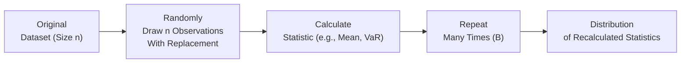

## Introduction

Resampling techniques can be surprisingly powerful when you’re wrestling with real-world data. They’re like that friend who’s always around to give you a second (or thousandth) opinion. By creating new datasets from your existing one, methods such as the bootstrap and the jackknife let us look at the variability (or uncertainty) in our estimates without relying too heavily on assumptions about the theoretical distribution of our data. In finance, these techniques help us measure risk, test portfolio performance, and estimate key parameters when the classic analytical formulas just don’t cut it.

In this section, we’ll explore two major resampling methods—Bootstrap and Jackknife—and see how they’re used in investment analysis. We’ll walk through the key steps, reflect on some personal experiences, and highlight practical issues you might face in the real world. In the end, you’ll have a robust understanding of how to inject more confidence (pun intended) into your parameter estimates.

## Bootstrap Method

### Conceptual Overview

The bootstrap method is based on the idea of sampling with replacement from your observed dataset. Think about your original sample of size n—it might be daily returns from a mutual fund for n days, or monthly returns from a hedge fund for n months. From this data, you create a new sample (each of size n) by drawing observations with replacement. Each newly created sample is called a “bootstrap sample.” Then you recalculate the statistic of interest for each of these bootstrap samples. By repeating this process many times—often thousands—an empirical distribution of the statistic emerges. This distribution provides insight into standard errors, bias, and confidence intervals for that statistic.

You might wonder, “But aren’t we just recycling the same data?” Absolutely. However, sampling with replacement means that some observations appear multiple times, while others might not appear at all, effectively capturing sampling variability as if we had many parallel universes. In finance, the bootstrap is used for tasks such as:

• Estimating the volatility of portfolio returns.  
• Calculating Value at Risk (VaR) without making strong distributional assumptions.  
• Building confidence intervals for the Sharpe Ratio or other performance metrics.

I remember the first time I tried this approach for a small portfolio. I had maybe 50 daily returns (which is a bit tiny, I admit). Although it wasn’t perfect, I was able to generate a rough distribution of possible performance metrics. It felt almost magical that I could get these empirical confidence intervals without referencing any normal distribution tables.

### Steps in the Bootstrap

1. From the original dataset of size n (e.g., n daily returns), draw n observations with replacement to form a bootstrap sample.  
2. Compute the statistic of interest—say, the mean return—on this bootstrap sample.  
3. Repeat steps 1 and 2 a large number (B) of times, such as 1,000 or 10,000.  
4. Collect all these replicated statistics (e.g., the 1,000 mean return estimates). This forms your empirical sampling distribution.  
5. Estimate the standard error by taking the standard deviation of all these replicated statistic values.  
6. Form a confidence interval (usually by cutoffs like the 2.5th and 97.5th percentiles for a 95% interval), or use other quantiles if you prefer a different confidence level.

### Example: Portfolio Returns

Suppose you have 12 months of returns from a small-cap equity portfolio:

• Original returns [in decimals]: 0.02, 0.015, –0.01, 0.045, … (12 total values).  

To bootstrap the mean return:

1. Randomly select 12 returns from the original 12 (with replacement). Some returns will appear more than once; some will not appear at all.  
2. Compute the average of those 12 returns.  
3. Repeat 5,000 times.  
4. Plot the distribution of these 5,000 average returns and find the 2.5th and 97.5th percentiles. These become the lower and upper bounds of a 95% bootstrap confidence interval for the portfolio’s average return.

### Implementation in Python (Illustration)

Below is a tiny snippet in Python to illustrate a basic bootstrap. Of course, in professional data analytics, you’d want to refine it with better data management and more robust code.

```python
import numpy as np

returns = np.array([0.02, 0.015, -0.01, 0.045, 0.03, 0.025, 0.005, -0.005, 0.04, 0.035, 0.01, 0.02])
n = len(returns)
B = 5000
boot_means = []

for _ in range(B):
    sample_idx = np.random.randint(0, n, n)  # with replacement
    sample = returns[sample_idx]
    boot_means.append(sample.mean())

boot_means = np.array(boot_means)
mean_estimate = np.mean(boot_means)
lower_95 = np.percentile(boot_means, 2.5)
upper_95 = np.percentile(boot_means, 97.5)

print(f"Bootstrap Mean Estimate: {mean_estimate}")
print(f"95% Bootstrap CI: ({lower_95}, {upper_95})")
```

### Visual Representation

Below is a simple Mermaid diagram that illustrates conceptually what’s happening in the bootstrap process:



## Jackknife Method

### Conceptual Overview

While the bootstrap is usually the star of the show, the jackknife is an older yet still reliable technique. Distilled to its essence, the jackknife method systematically removes one observation from the dataset at a time, computes the statistic, and then cycles through so that each observation gets left out exactly once. If your dataset has n observations, you end up with n recalculated values of the statistic. The variance of those n values is used to estimate the standard error of your statistic.

When is the jackknife especially handy? It’s great for simpler statistics such as the mean or the median, and for quick bias and variance estimates. Because you only recalculate n times, the jackknife is often less computationally demanding than the bootstrap (which might require thousands of recalculations). However, it can be less robust if your statistic is heavily influenced by every single data point, or if the statistic is complicated—for example, an extreme quantile or a multi-parameter risk measure.

### Steps in the Jackknife

1. Identify your data of size n.  
2. Remove observation i to form a jackknife sample of size (n – 1).  
3. Compute your statistic of interest for this sample.  
4. Repeat steps 2 and 3 for i = 1 to n.  
5. Obtain the mean of these n statistics.  
6. Estimate the bias and variance using well-known jackknife formulas. Typically, jackknife estimates of variance rely on how each “leave-one-out” statistic deviates from the overall mean.

### Example: Single Stock Return Series

Let’s say you track the daily returns of a single stock for 10 days, and each day’s return is r₁, r₂, …, r₁₀. Suppose you want to estimate the mean return’s standard error via the jackknife:

1. Remove r₁, compute the mean of the remaining returns.  
2. Remove r₂, compute the mean of the remaining returns.  
3. Continue this for all 10 returns.  
4. With these 10 partial means, compute the average.  
5. Use the variance formula from the jackknife to get the standard error.  

Personally, I like to do a quick back-of-the-envelope check of these partial means to see if any single data point is drastically shifting my average. It reveals how sensitive the estimate might be to outliers.

## Practical Considerations

1. **Data Bias**: Both bootstrap and jackknife rely on the assumption that the dataset you have is representative. If there’s a systematic bias in your dataset (e.g., you collected returns during a bull market only), then resampling the same data won’t magically fix that bias.  
2. **Sample Size**: With very small samples, you might get unstable estimates. Bootstrap can mitigate small-sample issues to some extent, but if the sample is too tiny, the distribution derived might still be unreliable.  
3. **Computational Cost**: The bootstrap, especially in large datasets or with complex statistics, can be computationally expensive—though modern hardware helps. The jackknife is simpler in terms of repeated computation (only n times).  
4. **Choice of B**: For the bootstrap, the number of replications B can affect the stability of the variance and confidence intervals. Typical choices range from 1,000 to 10,000.  
5. **Software Tools**: Both methods are straightforward to implement in Python, R, or specialized statistical software.  
6. **Finance Applications**: In finance, these methods are widely used for:  
   • Estimating risk metrics: VaR, volatility, or expected shortfall.  
   • Generating robust standard errors for regression coefficients (especially with small or heteroskedastic data).  
   • Stress-testing portfolio metrics without imposing strong parametric assumptions.

## Illustration: VaR Estimation with Bootstrap

Value at Risk (VaR) is a common risk measure frequently used by portfolio managers. For an α% VaR, you’re looking for the loss level that’s exceeded α% of the time. If you’ve got 1,000 daily returns, an analytical distribution might not be best—perhaps your returns are not normal, or you have heavy tails. The bootstrap approach is:

1. Sample 1,000 returns with replacement to create a new “bootstrapped series” of 1,000 data points.  
2. Sort these returns in ascending order (worst to best).  
3. Identify the αth percentile in the sorted returns (like the 5th percentile if you’re looking at 95% VaR). This is the VaR for that particular bootstrap iteration.  
4. Repeat many times and get the distribution of VaR across all bootstrap samples.  
5. Construct a confidence interval for VaR from that distribution.

## Summary and Best Practices

• **Bootstrap** is your go-to method when you want a flexible, data-driven approach to estimate confidence intervals or standard errors. It’s especially valuable when you’re unsure about the underlying distribution or find the analytical formulas complicated.  
• **Jackknife** provides a conceptually simpler alternative for estimating bias and variance, particularly effective for well-behaved statistics like the mean. It’s less computation-heavy but can be less accurate for certain complex measures.  
• **In All Cases**, watch out for data quality. If your dataset fails to represent the real variability—say you only have data from a single regime or from a short time window—the resampling might lull you into a false sense of confidence.

## References

• Efron, B., & Tibshirani, R. J. (1993). “An Introduction to the Bootstrap.” Chapman & Hall.  
• Shao, J., & Tu, D. (2012). “The Jackknife and Bootstrap.” Springer.  
• Gentle, J. E. (2009). “Computational Statistics.” Springer.  

## Final Exam Tips

• For exam questions, be prepared to articulate the key differences between parametric inference and resampling.  
• Don’t forget to specify exactly how you generate your samples in a bootstrap question—understand “with replacement” thoroughly.  
• If you see a question about bias or variance estimates, recall the formulaic approach for the jackknife.  
• Manage your time. Some candidates get bogged down computing each resample iteration. Instead, focus on the conceptual steps and the interpretation of results.  

## Assessing Mastery: Resampling Techniques in Finance



### Which of the following best describes a bootstrap sample?

- [ ] A subset of the data chosen without replacement and of smaller size.  
- [x] A sample of the same size as the original dataset, drawn with replacement.  
- [ ] A sequentially chosen sample that removes one observation at a time.  
- [ ] A sample that consists of smoothed weights applied to each observation.  

> **Explanation:** A bootstrap sample is formed by drawing the same number of observations as the original dataset, but with replacement.

### In the bootstrap procedure, how is the standard error of a statistic commonly estimated?

- [ ] By computing the square root of the sample variance in the original dataset.  
- [x] By taking the standard deviation of the statistic computed across all bootstrap resamples.  
- [ ] By subtracting the mean of all bootstrap estimates from zero.  
- [ ] By using the t-distribution approach with n–1 degrees of freedom.  

> **Explanation:** The bootstrap standard error is determined by the dispersion (standard deviation) of the estimates across the bootstrap resamples.

### One key assumption underlying both the bootstrap and jackknife is:

- [ ] The underlying distribution is known and normally distributed.  
- [x] The observed sample is representative of the population.  
- [ ] The sample is large enough to invoke the Central Limit Theorem.  
- [ ] The data is free of any outliers.  

> **Explanation:** A representative sample is crucial; otherwise, resampling the same biased data only perpetuates that bias.

### In finance, which of the following is often estimated using bootstrap due to heavy tails and non-normal distributions?

- [ ] Annual interest rates for risk-free bonds.  
- [x] Risk measures such as Value at Risk (VaR).  
- [ ] The yield curve for government securities.  
- [ ] Preferred dividend payout ratios.  

> **Explanation:** VaR and other risk measures are common bootstrap targets in finance because market return distributions can exhibit heavy tails and do not always follow normal assumptions.

### How does the jackknife method differ from the bootstrap in terms of computational burden?

- [x] The jackknife is less computationally intensive because it creates exactly n resamples.  
- [ ] The jackknife requires random draws with replacement.  
- [ ] The bootstrap is less computationally intensive because it only needs a few resamples.  
- [ ] They require the same number of resamples in practice.  

> **Explanation:** The jackknife creates exactly n resamples by removing one observation at a time, while the bootstrap typically involves thousands of resamples.

### What is typically the main limitation of the jackknife for complex statistics?

- [ ] It always overestimates bias for any sample.  
- [x] It may not capture the full variability when the statistic is highly sensitive to single observations.  
- [ ] It cannot estimate bias, only variance.  
- [ ] It systematically excludes outliers entirely.  

> **Explanation:** The jackknife can be inaccurate for complicated statistics, especially those impacted strongly by individual data points.

### Suppose you have a sample of quarterly returns for five years (20 data points). You perform a jackknife on the mean return. How many recalculations of the mean do you perform?

- [x] 20 recalculations.  
- [ ] 40 recalculations.  
- [ ] 200 recalculations.  
- [ ] 2,000 recalculations.  

> **Explanation:** Each observation is omitted once, so you get 20 jackknife samples if the dataset has 20 observations.

### When constructing a 95% confidence interval via bootstrap, which percentile bounds are commonly used?

- [ ] 1% and 99%  
- [x] 2.5% and 97.5%  
- [ ] 5% and 95%  
- [ ] 10% and 90%  

> **Explanation:** The typical 95% interval uses the 2.5th and 97.5th percentiles, though other bounds can be applied if desired.

### A portfolio manager wants to assess the confidence interval of the Sharpe Ratio but worries about normality assumptions. Which resampling method is generally preferred?

- [ ] Ordinary Least Squares (OLS).  
- [x] Bootstrap, because it can flexibly estimate non-normal variation.  
- [ ] Jackknife, because it performs fewer computations.  
- [ ] Standard parametric tests based on the t-distribution.  

> **Explanation:** The bootstrap is commonly chosen for performance metrics like the Sharpe Ratio when the distribution is not clearly normal.

### True or False: The bootstrap method always reduces bias if the original dataset is not representative of the population.

- [ ] True  
- [x] False  

> **Explanation:** If your original data is biased, reusing that data via bootstrap won’t remove the bias. Resampling cannot create new information that wasn’t in your original dataset.


