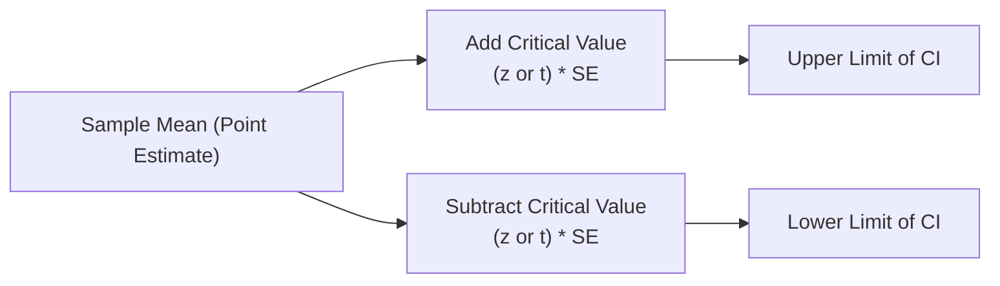

## Overview

Confidence intervals (CIs) play a central role in statistical inference for finance professionals, particularly for those of us getting ready to apply these tools in portfolio management and investment analysis. They help quantify the uncertainty surrounding estimates of population parameters—like true mean returns, true standard deviations, or even proportions of some event (e.g., default rates).

In plain English, a confidence interval kindly gives us a best guess (your point estimate) for a parameter, plus a margin of error that acknowledges we’re working with imperfect information from a sample. A 95% confidence interval, for example, tries to capture the parameter such that if we repeated the sampling process many times, approximately 95% of those intervals would contain the true value.

Still, let me pause and share a personal anecdote: I remember analyzing a small-cap equity portfolio during my early internship. I constructed a “neat little confidence interval" for the portfolio’s average monthly return, but I forgot that the distribution was a bit skewed. Long story short, I got an interval that wasn’t quite accurate because I’d blindly assumed normality. That taught me an important lesson: the reliability of a confidence interval hinges on assumptions about the data. Let’s walk through how to do it properly.

## Key Foundations

### Point Estimates and Margin of Error

A confidence interval is typically built around a point estimate of a population parameter—like the sample mean (denoted as \\(\bar{x}\\)) or sample proportion (\\(\hat{p}\\)). The formula for a general \\( (1-\alpha)\\) confidence interval often looks like:


\text{Point Estimate} \;\pm\; (\text{Critical Value}) \times (\text{Standard Error}).


• Point Estimate: A single number from the sample (e.g., mean, standard deviation, proportion).  
• Critical Value: Chosen from a statistical distribution (z- or t-distribution) for the desired confidence level.  
• Standard Error (SE): Reflects how spread out the sampling distribution likely is.

If you set your confidence level at 95%, \\(\alpha\\) = 0.05, and the “two-tailed” nature of the confidence interval means 0.025 in each tail. The 95% z-critical value is about 1.96, as you probably remember from your earlier studies. 

### When to Use z vs. t

Determining which distribution to use—z or t—usually hinges on whether the population variance is known and on sample size:

• z-distribution: Preferred if the population variance \\(\sigma^2\\) is known or if the sample is large (commonly \\( n > 30\\)), in which case we rely on the Central Limit Theorem.  
• t-distribution: Appropriate if the population variance is unknown and the sample size is small. The t-distribution’s shape looks similar to the normal distribution but has heavier tails—leading to slightly larger critical values for the same confidence levels.

As an example, if your sample size is 15 and you have no clue about the population variance, you’d typically resort to a t-distribution with \\( n-1 = 14\\) degrees of freedom.

## Constructing Confidence Intervals Step by Step

### 1. Identify the Parameter of Interest

Decide if you’re estimating a population mean, difference between two means, a proportion, or something else. For instance, a portfolio analyst might want to estimate the average monthly return of a certain equity index.

### 2. Gather Sample Data

Collect your sample—perhaps monthly returns over the past five years—and calculate key sample statistics: mean \\(\bar{x}\\), sample standard deviation \\( s\\), and sample size \\(n\\). If you studied Chapter 7.2 on sampling distributions, you know these stats feed directly into your confidence interval formula.

### 3. Determine the Appropriate Distribution

Confirm whether a z-distribution or t-distribution is needed. If \\(n\\) is large (e.g., 50 monthly returns is borderline but often considered large enough) and if you’re comfortable approximating the population variance with your sample variance, you might simply use the z-distribution. Otherwise, if \\(n\\) is quite small, the t-distribution is safer, especially if your data’s underlying distribution is roughly symmetric or at least not severely non-normal.

### 4. Find the Critical Value

For a 95% confidence interval under a z-distribution, the critical value is \\( z_{\alpha/2} = 1.96\\) (two-tailed). For a 99% CI, it’s \\( z_{\alpha/2} = 2.58\\). With a t-distribution, you use a t-table (or software) for your desired confidence level along with your degrees of freedom \\(n - 1\\).

### 5. Calculate the Standard Error

For a mean, the standard error is:

\text{SE}_{\bar{x}} = \frac{s}{\sqrt{n}}

if you’re using the sample’s standard deviation \\(s\\). If the population standard deviation \\(\sigma\\) is known (more common in theoretical exercises), it becomes \\(\frac{\sigma}{\sqrt{n}}\\).

### 6. Construct the Interval

Put it all together:

\bar{x} \;\pm\; (z_{\alpha/2} \text{ or } t_{\alpha/2, n-1}) \times \text{SE}.


In practice, you might do a Python snippet to confirm your calculations:

```python
import math
import statistics
from scipy.stats import t

returns = [0.02, 0.01, 0.015, -0.005, 0.03, 0.025, 0.0, 0.01]
n = len(returns)
x_bar = statistics.mean(returns)
s = statistics.stdev(returns)
confidence = 0.95

alpha = 1 - confidence
t_critical = t.ppf(1 - alpha/2, n - 1)

SE = s / math.sqrt(n)
margin_of_error = t_critical * SE
CI_lower = x_bar - margin_of_error
CI_upper = x_bar + margin_of_error

print(f"95% CI: [{CI_lower:.4f}, {CI_upper:.4f}]")
```

If you run something like this, you get a sense of how a t-based interval is computed in practice.  

### A Quick Mermaid Diagram

Below is a simple diagram to illustrate how we take a point estimate and then extend it on both sides to form a confidence interval.



## Interpretation

It’s easy to misinterpret what a confidence interval is telling you. A 95% CI does not mean there is a 95% probability the interval contains the true mean—rather, it means that if you repeatedly took new samples and built intervals the same way, 95% of those intervals would contain the true parameter.

### Real-World Finance Example

Consider a bond analyst wanting the true average yield on a newly issued bond. They sample 20 yields from different markets. Suppose they get a sample mean of 5.20% with a sample standard deviation of 0.25%. If they form a 95% t-based confidence interval and get (5.09%, 5.31%), that means if they repeatedly took different random samples of 20 yields from the same population, about 95% of such intervals would capture the true mean yield. It doesn't say there's a 95% chance that 5.09%–5.31% includes the true mean yield, but the repeated-sampling interpretation is the correct one.

## Common Pitfalls and How to Avoid Them

• Misinterpretation: People often say “there’s a 95% probability the true mean is in my interval.” That’s not strictly correct in frequentist statistics. You might consider Bayesian methods (discussed in 4.3 Conditional Probability and Bayesian Updating) for a probability statement about the parameter.  
• Distorted by Non-Normality: If the distribution is heavily skewed or has extreme kurtosis (as introduced in Section 3.3 on Skewness and Kurtosis), the confidence interval from a small sample might not be reliable.  
• Overreliance on Large n: The Central Limit Theorem (Section 7.2) helps, but “large” can be fuzzy if the distribution is extremely heavy-tailed.  
• Multiple Intervals Issue: Constructing many intervals from the same data set (like 20 different intervals for 20 different variables) inflates the chance that at least one interval is off. You might need “family-wise” adjustments like the Bonferroni correction.  
• Violating Independence: If your sample data are correlated (e.g., time-series data with autocorrelation from Chapter 12), standard formulas for standard error can be misleading.  

## Practical Applications in Investment Management

### Portfolio Return Estimates

Portfolio managers often rely on confidence intervals to judge the range of expected returns. For instance, if you're testing whether your portfolio’s average return is significantly different from a benchmark, you might form a confidence interval for the difference in mean returns. If that entire interval is above zero, you have evidence your portfolio beat the benchmark.

### VAR and Risk Assessment

While Value at Risk (VAR) typically uses quantiles of loss distributions, the idea behind constructing intervals around expected loss or expected tail risk is still valuable. Confidence intervals can help express the uncertainty around risk metrics, especially in stress tests as discussed in Chapter 13 on Back-Testing and Scenario Analysis.

### IFRS and US GAAP Considerations

In certain IFRS or US GAAP contexts (notably around provisioning or fair value measurements), analysts may rely on statistical estimates of the “fair” or “expected” asset value. Confidence intervals provide a more robust sense of the potential range for these estimates, though you have to carefully disclose assumptions and methods in financial statements.

## Best Practices

1. Check Normality: Perform residual analysis and normality checks if your sample is small (e.g., construct histograms, check skewness/kurtosis, or do a Shapiro-Wilk test).  
2. Consider Alternative Distributions: If your data are not normal at all, you might need a nonparametric interval or robust methods (like a bootstrap CI, see Section 7.3).  
3. Look at Confidence Levels: 90%, 95%, and 99% are common, but choose the one that best balances Type I and Type II error trade-offs for your specific financial decision.  
4. Document Assumptions: If you’re building a confidence interval for a client or internal stakeholders (under the CFA Code of Ethics, you want full transparency), clearly state your sample size, distribution assumptions, the statistic being estimated, and how you arrived at your critical value.  
5. Remember Reality is Messy: Market conditions change, and assumptions about stationarity can be violated. Confidence intervals can only reflect the data you have, not future structural shifts.

## A Note on Exam Relevance

For the CFA exam, you’ll see confidence interval concepts tested in both item-set vignettes and straightforward short-answer questions. Key points include knowing when to apply z vs. t, how to interpret the results, and how to handle practical issues such as unknown population variances or small sample sizes. You might see a question that provides a sample mean, standard deviation, and sample size, then asks you to compute a 95% or 99% CI. Or you could see a scenario where the data are skewed, prompting you to decide whether a standard normal approach or a bootstrap-based approach is more suitable.

In constructed-response questions, always show your formula, identify the correct critical value, and confirm which assumptions you’re making. This approach demonstrates not only that you can do the calculations but also you understand the theory behind them.

## Final Considerations and Exam Tips

• Watch your Time: Quick mental approximations of critical values (1.65 for 90%, 1.96 for 95%, 2.58 for 99%) can save precious time.  
• Keep an Eye on Rounding: The exam might instruct you to round to four decimal places or fewer.  
• Link to Hypothesis Testing: If a 95% confidence interval for the mean does not include 0, that’s consistent with rejecting \\(H_0: \mu = 0\\) at the 5% significance level.  
• Don’t Over-Promise with “Probabilities”: Remember that frequentist intervals are about repeated sampling, not a direct probability statement about the parameter.  
• Use Software Wisely: In real life, you’d rely on statistical software or even spreadsheets. But in the exam or a theoretical environment, you’ll need to do it by hand or with a basic calculator.

## References

• DeGroot, M. H., & Schervish, M. J. (2012). “Probability and Statistics.” Pearson.  
• Casella, G., & Berger, R. L. (2002). “Statistical Inference.” Duxbury.  
• NIST/SEMATECH e-Handbook of Statistical Methods: https://www.itl.nist.gov/div898/handbook/

---

## Test Your Knowledge: Confidence Intervals for Hypothesized Population Parameters



### A portfolio manager sampled monthly returns for a fund. She constructs a 95% confidence interval for the fund's mean monthly return using a z-distribution. Which of the following is required for this approach to be appropriate?

- [ ] The sample mean must be greater than the median return.  
- [x] The population variance is assumed known or the sample is large enough for the Central Limit Theorem to apply.  
- [ ] The monthly returns must be skewed to the right.  
- [ ] The population mean must equal zero.  

> **Explanation:** A z-distribution requires either known variance or sufficiently large sample size for the sample variance to act as a reliable proxy (through the Central Limit Theorem).  

### If a 95% confidence interval for a population mean is calculated (assuming normality) and the interval is found to be (10.2, 14.6), what is the correct interpretation?

- [ ] There is a 95% probability that the parameter lies within (10.2, 14.6).  
- [x] If many such intervals were constructed using new samples, about 95% of those would contain the true mean.  
- [ ] Exactly 95% of the population data lies in that range.  
- [ ] An increase in sample size widens this interval.  

> **Explanation:** The standard interpretation of a confidence interval under frequentist statistics is about repeated sampling, not the probability of the parameter being in that interval.  

### Using a t-distribution rather than a z-distribution is primarily necessary when:

- [x] The population variance is unknown and the sample size is small.  
- [ ] The population variance is known but the sample mean is unknown.  
- [ ] The sample median is smaller than the population median.  
- [ ] The confidence level is 99% or higher.  

> **Explanation:** A t-distribution is chosen when the population variance is not known and the sample size is small, so the extra “fatter” tails help account for uncertainty in estimating the standard deviation.  

### A Chief Risk Officer wants to construct a 99% confidence interval for credit losses based on a sample. If all else stays the same, how does moving from a 95% to a 99% confidence level typically affect the interval?

- [x] The interval becomes wider.  
- [ ] The interval becomes narrower.  
- [ ] The interval shifts to the right but does not change in width.  
- [ ] The interval remains the same.  

> **Explanation:** A higher confidence level increases the critical value, thereby widening the interval.  

### An analyst uses daily stock returns over five years to estimate a confidence interval for the mean annual return. She decides to employ a bootstrap method. Which reason might justify her choice?

- [x] The returns have heavy skew or kurtosis, violating normality assumptions.  
- [ ] The sample size is too large, and the Central Limit Theorem cannot handle it.  
- [x] She wants a flexible, data-driven approach that does not rely strictly on parametric assumptions.  
- [ ] She wants to increase the risk of a Type I error.  

> **Explanation:** Bootstrapping is nonparametric and particularly valuable if normality assumptions are questionable. It resamples from the observed data to build an empirical distribution of the statistic.

### Suppose a 90% confidence interval is narrower than a corresponding 95% confidence interval for the same data. Why is that?

- [x] Lower confidence corresponds to a smaller critical value, thus a narrower interval.  
- [ ] The 90% interval is more accurate.  
- [ ] The sample standard deviation is smaller at 90% than at 95%.  
- [ ] The 95% interval is always incorrect if the 90% is narrower.  

> **Explanation:** The only difference is the critical value. For 90%, you use a smaller z- or t-critical value than for 95%, resulting in a narrower interval.  

### An equity analyst constructs 10 different confidence intervals, each at the 95% confidence level, on the same dataset to estimate different metrics. Which statement is most accurate?

- [x] The chance that at least one interval does not contain its true parameter is higher than 5%.  
- [ ] Each interval must contain its true parameter because they are all at 95% confidence.  
- [x] The intervals must overlap significantly.  
- [ ] Only one interval is likely valid.  

> **Explanation:** Constructing multiple intervals raises the probability that at least one will fail to include its true parameter. This is the multiple comparisons problem.  

### If your confidence interval for the population mean return on a stock excludes zero, what does this imply about a corresponding two-sided hypothesis test at the same significance level?

- [x] The null hypothesis that the mean return equals zero would be rejected.  
- [ ] The stock’s mean return must be negative.  
- [ ] The hypothesis test is inconclusive.  
- [ ] Confidence intervals are unrelated to hypothesis testing.  

> **Explanation:** If 0 isn’t in the interval, that aligns with rejecting \\(H_0: \mu = 0\\) at the specified significance level.  

### When forming a confidence interval for the mean, an analyst accidentally uses a t-critical value for 95% confidence instead of a z-critical value, even though the sample size is large and the population variance is known. How does this likely affect the resulting interval?

- [x] The interval will be slightly wider than necessary.  
- [ ] The interval remains the same.  
- [ ] The interval is narrower than necessary.  
- [ ] The interval does not exist.  

> **Explanation:** The t-value for a large sample is close but still slightly larger than the z-value for the same level, thus the interval will be marginally wider.  

### A 95% confidence interval for the difference in mean returns between two funds is (-0.3%, 0.5%). Which of the following is a correct conclusion?

- [x] We do not have sufficient evidence to claim one fund’s mean return is significantly higher than the other at the 5% level.  
- [ ] The true difference is guaranteed to be in the interval.  
- [ ] At 95% confidence, the difference must be exactly 0.0%.  
- [ ] Both funds have negative returns.  

> **Explanation:** Because the interval includes 0, we cannot conclude a statistically significant difference in means at the 5% level.


