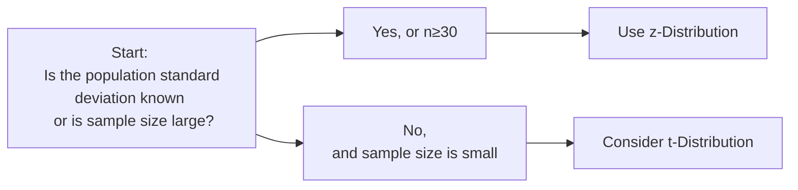
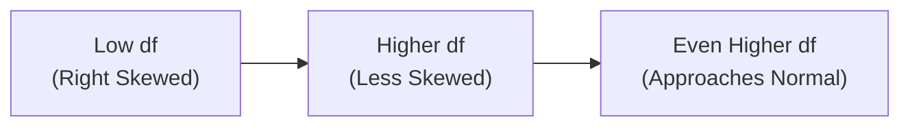

## Overview and Context in Estimation 

So, you know how sometimes in finance you’re staring at your sample data—maybe a handful of returns from a mutual fund or some monthly revenue numbers—and thinking to yourself, “I want to estimate the broader population’s behavior, but I only have what’s right in front of me?” That’s precisely where probability distributions step in to help. In parameter estimation, it’s crucial to figure out which distribution applies, because the distribution you pick drives how you construct confidence intervals, how you do hypothesis testing (you’ll see more on that in Chapter 8), and how you interpret results.

In earlier sections of Chapter 7 (particularly 7.2 on the Central Limit Theorem), we learned that the distribution of the sample mean starts to look bell-shaped if you have a large enough sample—this is part of the reason the normal distribution is such a superstar in statistics. But real life isn’t always so straightforward. Sometimes the population variance is unknown, sometimes the sample size is super small, or maybe you need to test something about a variance rather than a mean. Each of these situations calls for a special probability distribution, and we’re about to explore four of these: the z-distribution, the t-distribution, the Chi-square distribution, and the F-distribution. 

This section aims to give you a thorough tour of why and how each distribution is used in parameter estimation. We’ll walk through key properties, typical financial and investment applications, and best practices. We’ll even toss in a few pitfalls to avoid—and trust me, I’ve been there, you don’t want to mix up your distributions on test day. Sometimes it’s easy to do that under time pressure!

## The z-Distribution (Standard Normal)

### Key Concepts

The z-distribution, also called the standard normal distribution, is central (pun intended!) to modern statistics. Its mean is 0 and standard deviation is 1. When you’re reading about “z-scores” or “z-values,” they reference this distribution. 

This distribution is especially handy for:  
- Large-sample inferences about a population mean.  
- Situations where the population variance is known a priori (admittedly, this is rare in practice, but it’s a theoretical backbone).  

The normal distribution is symmetrical, and we have well-studied tables (or software) that give us probabilities for various z-values. If we say that a sample mean follows a normal distribution, then we can standardize it (transform it into a z-score) like this:


z = \frac{\bar{X} - \mu_0}{\sigma / \sqrt{n}},


where \\(\bar{X}\\) is the sample mean, \\(\mu_0\\) is the hypothesized population mean, \\(\sigma\\) is the true population standard deviation, and \\(n\\) is the sample size.

### Practical Financial Example

Imagine you’re analyzing the monthly returns of a widely traded index—maybe the S&P 500. Because the number of monthly returns in your sample is large and you can approximate the population standard deviation closely, you might adopt a z-based confidence interval for the index’s average return. If your sample is large enough (say 120 months of data), your standard error estimates become reasonably stable, and you can proceed with a z-based approach.

### Visualizing the z-Distribution

Below is a simple Mermaid diagram showing how you might decide if a z-based approach is appropriate:



### Common Pitfalls

• Using a z-distribution when you really have a small sample size and an unknown true variance can lead to overconfident intervals.  
• Confusing z and t values: for a large sample, z and t can become almost indistinguishable, but they’re not if your sample is small.  

## The t-Distribution

### Key Concepts

Well, let’s say you never quite got your hands on that true population variance. That’s normal in finance. Most of the time, it’s an “unknown” we have to estimate. This is exactly why the t-distribution comes into play. If your sample is smaller (for instance, less than 30 observations), or if the population variance is unknown and you have to use the sample variance, the t-distribution is the recommended tool. 

The t-distribution happens to look similar to the normal but with fatter tails—that’s how it accounts for the extra uncertainty from not really knowing the population variance. The degree of “fattiness” depends on the degrees of freedom (df). Typically, in an estimation context, \\(\mathrm{df} = n - 1\\), where \\(n\\) is the sample size used to estimate the parameter. As \\(n\\) grows, the t-distribution morphs gradually into the standard normal distribution.

The classic t-statistic for a confidence interval or hypothesis test about the mean is given by:


t = \frac{\bar{X} - \mu_0}{s / \sqrt{n}},


where \\(\bar{X}\\) is the sample mean, \\(\mu_0\\) is the hypothesized mean, \\(s\\) is the sample standard deviation, and \\(n\\) is the sample size.

### Practical Financial Example

So maybe you’re examining the returns of a brand-new hedge fund, and you only have 10 months of data. Trying to use a z-test with a sample size that small is likely to be misleading (and definitely not recommended in exam context!). Instead, you’d build a t-based confidence interval: 


\bar{X} \pm t_{\alpha/2, n-1} \times \frac{s}{\sqrt{n}},


where \\(t_{\alpha/2, n-1}\\) is the critical value from the t-distribution with \\(n-1\\) degrees of freedom.

### Choosing Between z and t

This is one of the most common dilemmas for new analysts. Here’s a short guide:

- Use a z-distribution if your sample is large and you can approximate \\(\sigma\\) or it’s known explicitly.  
- Use a t-distribution if the sample is relatively small, or if you’re forced to estimate the variance from the sample data.  

### Personal Anecdote

I remember, back in my early days as an analyst, I was desperate to show that a new stock-picking strategy was profitable, but I only had a handful of monthly returns (like 8 or 9). I automatically used a normal-based approach. Turns out my standard errors were way off because I had no real handle on the true volatility. I learned quickly that I should have used the t-distribution to reflect that extra wiggle room.

## The Chi-Square Distribution 

### Key Concepts

Now, shifting gears: let’s talk about the Chi-square (\\(\chi^2\\)) distribution. It’s not symmetrical the way the normal or t is. Instead, it’s skewed to the right, and it changes shape based on its degrees of freedom. The Chi-square distribution emerges naturally when you sum up the squares of normally distributed variables.

We often see it used for:  
- Constructing confidence intervals for a population variance (a big deal if you need to estimate a portfolio’s variance).  
- Hypothesis testing about a single variance. For instance, is the variance equal to some target value?  
- Goodness-of-fit tests in more general statistics (less so in our typical finance contexts, but it’s definitely in the broader statistical toolbox).  

If you assume your underlying data are normally distributed, the following statistic has a Chi-square distribution with \\(n-1\\) degrees of freedom:


\chi^2 = \frac{(n-1)s^2}{\sigma^2},


where \\(s^2\\) is the sample variance and \\(\sigma^2\\) is the true population variance.

### Practical Financial Example

Let’s say you want to be 95% sure about the level of volatility of a certain bond index. You can use the Chi-square distribution to build a confidence interval for the variance (and by extension the standard deviation). Sure, it’s not as common in everyday finance, but for exam and theoretical purposes, it’s key that you know how to do it:


\left( \frac{(n-1)s^2}{\chi^2_{\alpha/2, n-1}}, \frac{(n-1)s^2}{\chi^2_{1-\alpha/2, n-1}} \right)


where \\(\chi^2_{\alpha/2, n-1}\\) and \\(\chi^2_{1-\alpha/2, n-1}\\) are the critical Chi-square values at the lower and upper tails, respectively.

### Visualizing the Degrees of Freedom Effect

For a quick sense of how degrees of freedom shape the Chi-square distribution, check out the following small diagram:



As the degrees of freedom get large, the Chi-square distribution starts to look more “normal” (though it never becomes perfectly symmetric). 

## The F-Distribution

### Key Concepts

The F-distribution is basically a ratio of two scaled Chi-square variables, each divided by its corresponding degrees of freedom. Symbolically:


F = \frac{\chi^2_1 / d_1}{\chi^2_2 / d_2},


where each \\(\chi^2\\) is a Chi-square random variable, and \\(d_1\\) and \\(d_2\\) are their respective degrees of freedom. The shape and critical values depend on both \\(d_1\\) and \\(d_2\\).

We use the F-distribution primarily for:  
- Testing the equality of two variances. For instance, checking if one portfolio’s variance is the same as another’s.  
- Regression analysis, particularly the overall significance of a regression model via the ANOVA (Analysis of Variance) F-test.  
  (For more on regression, see Chapter 10, especially section 10.4 on Measures of Fit.)

### Practical Financial Example

Picture this: you have two active fixed-income funds. You want to see if they have the same volatility or if one is truly riskier than the other. The F-test is a straightforward test of the ratio of their sample variances. If the F-statistic is large enough (or small enough, depending on how you set it up), you reject the hypothesis that the variances are equal.

In regression, you might recall the F-statistic is used to test whether at least one of the regression coefficients (beyond the intercept) is significantly different from zero. If your F-test shows significance, you have evidence that your regression model is possibly capturing something meaningful.

### Example Calculation (Variance Comparison)

Suppose we have two independent samples (Fund A and Fund B) with sample variances \\(s_A^2\\) and \\(s_B^2\\), and degrees of freedom \\(n_A - 1\\) and \\(n_B - 1\\), respectively. To test if these variances are equal:


F = \frac{s_A^2}{s_B^2}.


We look up the critical values in an F-table with \\((n_A - 1)\\) and \\((n_B - 1)\\) degrees of freedom. If \\(F\\) is greater than the critical value at our chosen significance level, we conclude that the variance of \\(A\\) likely exceeds that of \\(B\\) or vice versa (depending on how we structure the test).

## Software, Critical Value Tables, and Hybrid Approaches

In real-world practice, almost every single test statistic is computed using statistical software (like Python, R, or specialized financial platforms). But for the CFA exam, you might have to rely on summarized distribution tables or typical z/t/Chi-square/F critical values at common alpha levels (like 5%). The exam usually provides or references standard tables if such calculations are required, or it simplifies the numbers so that you only need to conceptually determine whether the test statistic is beyond the critical value.  

Below is a brief code snippet in Python to show how you might compute these distributions. If you’re new to coding, just see it as a demonstration of how easily we can call in these distributions from a library:

```python
import scipy.stats as st

df = 10  # degrees of freedom
t_value = 2.228  # say this is your test statistic
p_value = 1 - st.t.cdf(t_value, df)
print("P-value for the t statistic:", p_value)

dfn = 5  # numerator degrees of freedom
dfd = 10 # denominator degrees of freedom
F_value = 3.45
p_value_f = 1 - st.f.cdf(F_value, dfn, dfd)
print("P-value for the F statistic:", p_value_f)
```

## Integration with Other Topics

• In Chapter 8 (Hypothesis Testing), you’ll see these distributions in action across different testing scenarios, such as one-tailed vs. two-tailed tests.  
• In Chapter 9 (Parametric and Non-Parametric Tests of Independence), some of these distributions pop up again (especially Chi-square for contingency tables).  
• In Chapter 10 (Simple Linear Regression) and Chapter 14 (Multiple Regression), we rely on t-tests for coefficients and F-tests for the overall regression model.  

Understanding these distributions cements the mathematical foundation for almost every type of parametric inference you’ll do in finance and investments.

## Best Practices and Common Pitfalls

• Check your sample size: If \\(n < 30\\), strongly consider the t-distribution for mean inferences.  
• Confirm normality assumptions when using t and Chi-square for precise inference. If your sample data deviate wildly from normal, you might need alternative approaches or transformations.  
• Watch out for large test statistics that might come from outlier data—particularly in small samples.  
• In the presence of high kurtosis or heavy tails in real return data, your standard t-test or z-test might be too optimistic.  

## Exam Focus and Time Management Tips

Sometimes the exam will throw you a curveball: maybe you’re certain you’re supposed to use a z-test, but the question states “sample standard deviation was calculated from 12 data points.” Or, you might be all set to use a t-test, but the question quietly mentions “the population variance is known from historical data.” These sorts of details matter for distribution selection.  

On exam day, watch for:  
• Mentions of “population variance known” → z.  
• “Sample size less than 30 or unknown variance” → t.  
• “Variance or standard deviation test” → Chi-square or F.  
• “Equality of variances for two samples” or “ANOVA F-test” → definitely F.  

## Conclusion

Selecting the correct probability distribution is like choosing the right tool from a well-stocked toolbox. If you misjudge the problem—like using a normal distribution for a tiny sample—the inferences you make can be either too wide or too narrow. And in financial decision-making, that can be quite costly (like ignoring a risk that’s bigger than you realized).

These distributions (z, t, Chi-square, and F) collectively represent some of the key pillars of statistical inference. Actively practice identifying the right scenario, matching it with the right distribution, and applying the correct formula. As you move forward, you’ll see these distributions reappear in everything from volatility estimation to complex regression models. They’re as fundamental to finance as discounting cash flows or computing expected returns.

## References and Further Reading

• Zar, J. H. (2010). “Biostatistical Analysis.” Pearson Prentice Hall.  
• Hamilton, L. C. (2009). “Statistics with Stata.” Cengage Learning.  
• Online Distribution Calculators:  
  – https://stattrek.com/  
  – https://www.danielsoper.com/statcalc/  
  – Many built-in libraries in R, Python, and other platforms.  
• Chapter 8 of this text for deeper coverage of Hypothesis Testing.  
• Chapter 10 for an introduction to Simple Linear Regression (leveraging t and F).  

--------------------------------------------------------------------------------

## Mastering Probability Distributions for Parameter Estimation Quiz



### Which probability distribution is most appropriate when the population variance is known and the sample size is large?  
- [x] z-Distribution  
- [ ] t-Distribution  
- [ ] Chi-square Distribution  
- [ ] F-Distribution  

> **Explanation:** The z-distribution (standard normal) is typically used when the population variance is known or for large-sample approximation.  

### Which distribution has heavier tails for smaller sample sizes but converges to the standard normal distribution as sample size grows?  
- [ ] z-Distribution  
- [x] t-Distribution  
- [ ] Chi-square Distribution  
- [ ] F-Distribution  

> **Explanation:** The t-distribution has fatter tails representing extra uncertainty with unknown population variance. As degrees of freedom increase, it approaches the z-distribution.  

### The Chi-square distribution is:  
- [ ] Symmetric around zero.  
- [ ] Bimodal.  
- [x] Skewed to the right and depends on degrees of freedom.  
- [ ] Always above the F-distribution in magnitude.  

> **Explanation:** The Chi-square distribution is right-skewed, and its shape varies with the degrees of freedom.  

### What is an appropriate use of the Chi-square distribution in the context of finance?  
- [ ] Constructing confidence intervals for the population mean.  
- [ ] Testing the difference in two sample means.  
- [x] Constructing confidence intervals for the population variance.  
- [ ] Testing the overall significance of regression coefficients.  

> **Explanation:** The Chi-square distribution provides a basis for inferences about the variance of a single sample if the data are assumed normal.  

### When comparing two sample variances from independent samples in order to see if they are equal, you would most likely use:  
- [ ] t-Distribution  
- [ ] Chi-square Distribution  
- [x] F-Distribution  
- [ ] z-Distribution  

> **Explanation:** The F-statistic is used to compare two variances, typically with an F-test.  

### In which scenario would a t-distribution definitely NOT be the correct choice for constructing a confidence interval for the mean?  
- [x] When the population variance is known and the sample size is significantly large.  
- [ ] When the population variance is unknown and the sample size is 15.  
- [ ] When large tails in the data suggest extra uncertainty.  
- [ ] When the degrees of freedom are small.  

> **Explanation:** If the population variance is genuinely known and the sample is large, you would prefer the z-distribution instead of a t-distribution.  

### The shape of the t-distribution is most influenced by:  
- [x] The degrees of freedom.  
- [ ] The mean of the population.  
- [ ] The standard deviation of the population.  
- [ ] The alpha level of the test.  

> **Explanation:** The degrees of freedom control how “fat” or “thin” the tails of the t-distribution are.  

### An F-statistic is computed as:  
- [ ] The ratio of two sample means.  
- [ ] The difference between two variances.  
- [x] The ratio of two sample variances (each scaled by their respective degrees of freedom).  
- [ ] A squared z-statistic.  

> **Explanation:** The F-statistic is essentially the ratio of two scaled Chi-square variables, which is often represented as the ratio of two sample variances.  

### Which of the following describes what happens to the F-distribution as both degrees of freedom (numerator and denominator) become large?  
- [ ] It becomes perfectly symmetric around zero.  
- [ ] It approaches the t-distribution.  
- [x] It becomes closer to 1 (i.e., less spread out) and is approximately normal only in certain transformations.  
- [ ] It collapses into a standard normal distribution.  

> **Explanation:** As the degrees of freedom increase, the F-distribution’s mean and variance shift, but it doesn’t become symmetric around zero. Instead, it centers around 1 in many situations, because large samples reduce differences in variance estimates.  

### True or False: The z-distribution and t-distribution are identical for large degrees of freedom.  
- [x] True  
- [ ] False  

> **Explanation:** As the number of degrees of freedom in a t-distribution grows, it converges to the standard normal (z-distribution).  


