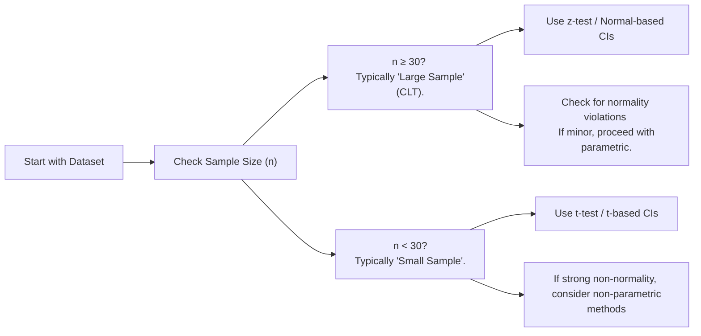

## Introduction

I remember the first time I crunched some numbers trying to estimate a population mean for an equity market study. Everything was going smoothly—until I realized I had, like, only 12 monthly observations. It felt a little like walking on thin ice: I wasn’t sure exactly how stable my results would be. On the flip side, a few years later, I found myself with thousands of daily returns for high-frequency analysis, and it was way easier to rely on established parametric tests. Those experiences, well, they really underscored the critical role that sample size plays in both the choice of estimation methods and our confidence in the results.

Below, we’ll dig into why large-sample frameworks can make your life easier (thank you, Central Limit Theorem!), and why small-sample conditions demand a bit more care and nuance. We’ll cover formal definitions, typical thresholds (like n ≥ 30 for large samples—though that’s more of a rule-of-thumb than a universal guarantee), and highlight specific tests and distribution assumptions. We’ll also walk through some real-world and exam-relevant examples to illustrate how these considerations appear in practice.

## Large-Sample Properties

When we talk about large samples in finance, we usually mean something like n ≥ 30 data points. But in truth, “large” can go beyond 30 if the underlying data distribution is particularly unusual or if you’re analyzing higher moments (like skewness or kurtosis). Still, 30 is a handy benchmark because of two major results:

• The Central Limit Theorem (CLT)  
• The Law of Large Numbers (LLN)

### The Central Limit Theorem in Action

The Central Limit Theorem states that as the sample size (n) grows, the distribution of the sample mean (and many other sample statistics) approximates a normal distribution—even if the population itself is not normally distributed. This is a really big deal. It means that you can:

• Use z-tests and normal-based confidence intervals with decent accuracy.  
• Assume many statistical estimators behave nicely (e.g., consistent and efficient).  

In financial contexts, you might be examining daily returns of a broad market index over many years. If your dataset spans thousands of trading days, the CLT suggests that your sample mean of returns will be approximately normal. That typically allows you to employ straightforward parametric tests for hypothesis testing, such as:  
(1) Testing whether the mean equals zero (to see if there’s a drift in returns).  
(2) Calculating confidence intervals around your estimated mean return.

### The Law of Large Numbers (LLN)

The Law of Large Numbers ensures that the sample average converges to the “true” population mean as n becomes very large. If you’re studying, say, the historical volatility (standard deviation) of an asset, the LLN says that with more data, your estimated volatility will get closer and closer to the asset’s actual long-run volatility. In practice, this is especially handy for risk management and portfolio planning, because it helps reduce estimation risk as your data sample grows.

### Robustness of Parametric Methods

One of the most comforting takeaways of large-sample inference is that parametric methods become more robust to minor deviations from strict normality assumptions. For instance, if the distribution has small to moderate skewness, the large-sample size compensates, allowing standard tests to remain fairly accurate. However, keep an eye out for extremes like regime shifts or heavy-tail phenomena (common in financial time-series), where even large-sample assumptions can be undermined by unusual data patterns.

## Small-Sample Constraints

Now, let’s talk about those times you only have a handful of observations. Perhaps you’re looking at monthly returns of a brand-new hedge fund that’s only existed for 18 months. Or maybe you’re analyzing corporate earnings that only come out quarterly, and you don’t have the luxury of decades of data. In many academic or textbook examples, small usually means n < 30, but that threshold is not chiseled in stone.

### The t-Distribution as a Go-To Tool

When the population variance is unknown and your sample is small, the t-distribution is typically your best friend for inference on the mean. Specifically, you’d:

(1) Estimate the sample mean x̄.  
(2) Estimate the sample standard deviation s.  
(3) Use the t-distribution with (n – 1) degrees of freedom to build confidence intervals and perform hypothesis tests on the mean.

Formally, you might see a confidence interval for the population mean framed as:


  x̄ \pm t_{\alpha/2,\, n-1} \cdot \frac{s}{\sqrt{n}}


Here, \\( t_{\alpha/2,\, n-1} \\) is the critical value from the t-distribution. The smaller the sample, the heavier the tails of the t-distribution, meaning you need a larger margin of error to account for added uncertainty.

### Checking Assumptions More Carefully

With smaller samples, you’re more vulnerable to any violations in the underlying assumptions, such as:

• Normality: If the population is not roughly normal, your t-based inferences risk being off.  
• Independence: If the observations aren’t independent (e.g., autocorrelation in returns), you might need time-series models or robust standard errors.  
• Outliers: Extreme data points can strongly skew a small sample.  

If you suspect your data is heavily skewed or doesn’t meet these assumptions, non-parametric methods (like the Wilcoxon Signed-Rank test or Mann–Whitney test) are an alternative. However, be sure you understand the reduced power and interpretability that can come with them.

### Balancing Non-Parametric Methods

Non-parametric methods can be helpful in small-sample settings or if your data looks bizarre (just think of distributions with multiple peaks or extremely heavy tails). The trade-off is usually a cost to power: you could need a lot more data to find statistically significant effects. So, ironically, non-parametric methods are often best used when you suspect the distribution is so far from normal that your parametric approach is basically worthless.

## Implications for Practitioners

### Large Datasets

For a large, balanced dataset (say, 10 years of daily returns, giving around 2,500 data points), you can often apply standard parametric inference:

• Construct z-based confidence intervals.  
• Rely on standard F-tests to compare variances.  
• Implement robust regression models to handle mild outliers or heteroskedasticity.

The law of large numbers should give you a good sense that your estimates (mean, variance, correlations) are capturing the underlying population parameters. Plus, the Central Limit Theorem helps justify using normal-based tests.

### Small Datasets

In a small-sample context—maybe an emerging market’s daily return for only one month (about 22 observations)—you must tread carefully:

• Use t-distribution confidence intervals and tests.  
• Investigate the data distribution: if you see significant skew or outliers, consider transformations (log or square root) or non-parametric alternatives.  
• Keep in mind that any single data point can disproportionately shift your results.  

In finance, small-sample challenges pop up frequently. Venture capital deals, for instance, might have fewer data points (companies or time periods). Or you might want to estimate a credit spread’s reaction to macro events over only a few known crisis episodes. In each scenario, watch your assumptions—a single outlier can flip your conclusions if your dataset is tiny.

## Visualizing the Decision Flow

Sometimes, it’s handy to visualize the thought process for deciding between large and small-sample approaches:



As the diagram suggests, you start by evaluating whether n is large enough to invoke the CLT reliably. If yes, standard parametric approaches are typically fine, though you should always keep an eye out for severe outliers or structural breaks. If the sample turns out to be small, shift focus to the t-distribution or, if needed, non-parametric solutions.

## Case Study: Estimating a Fund’s Monthly Return

Imagine you’re analyzing a newly launched hedge fund. You have only nine months of return data (n = 9). You want to estimate the average monthly return confidently and test whether it’s significantly different from 2% per month.

• Because n < 30, you’d likely use a t-distribution approach.  
• You’d compute x̄ and s from your nine observations.  
• Your test statistic for H0: μ = 2% would be:


  t = \frac{x̄ - 0.02}{s/\sqrt{9}}


• Critical values would come from a t-distribution with 8 degrees of freedom.  
• If your t-statistic is way larger (in absolute value) than the critical t, you reject H0 at your chosen significance level.  

In a real investment scenario, you’d need to be mindful that nine monthly observations might not capture the full volatility or macroeconomic shifts that a strategy could face. That’s partly why institutional investors often wait for longer track records before committing substantial assets.

## Example Python Snippet

If you want to see how you might automate this in Python, here’s a quick demonstration. Let’s assume you have a list of returns representing that small sample:

```python
import numpy as np
from scipy import stats

monthly_returns = np.array([0.025, 0.018, 0.030, 0.022, 0.027, 0.019, 0.014, 0.029, 0.031])

sample_mean = np.mean(monthly_returns)
sample_std = np.std(monthly_returns, ddof=1)  # sample standard deviation
n = len(monthly_returns)

mu_hypothesis = 0.02

t_statistic = (sample_mean - mu_hypothesis) / (sample_std / np.sqrt(n))

df = n - 1

p_value = 2 * (1 - stats.t.cdf(abs(t_statistic), df))

print("Sample Mean:", sample_mean)
print("Sample Std Dev:", sample_std)
print("t-statistic:", t_statistic)
print("p-value:", p_value)
```

The results would tell you if there’s evidence the true monthly return is significantly different from 2%. Remember, with only nine data points, the power of this test is limited, and your confidence interval will be relatively wide.

## Best Practices and Common Pitfalls

• Always plot your data. Especially with small samples, a quick scatter plot or histogram might reveal outliers or strong skew that classical methods can’t handle well.  
• Don’t blindly use n ≥ 30. That magic number might not be so magical if distributional assumptions are severely violated or if you need to estimate higher moments like kurtosis.  
• For large samples, parametric approaches are tempting, but watch out for hidden regime changes in financial time-series data. A large sample from two entirely different regimes can mislead you.  
• Consider domain knowledge. If you know the asset’s returns are systematically skewed by macro conditions, incorporate that understanding in your choice of statistical technique.  

## Additional Perspectives in Investments

In multi-asset portfolio construction, you’ll often compare means, variances, and covariances across asset classes. Large historical databases (say, 30+ years of monthly data) can help you form relatively robust estimates, though it doesn’t guarantee future performance. In contrast, if you’re assessing an esoteric alternative asset with only a few years of data, you might have to rely on small-sample methods or external proxies.

Traders sometimes use high-frequency data—millions of observations—and the CLT is usually in their favor. However, a subtlety is that high-frequency data often exhibits strong intraday autocorrelation and microstructure noise, meaning your “large-sample” might not be quite as large and “clean” as you think. In that case, more sophisticated time-series methods might be required.

## Exam Tips and Strategies

• Be precise on whether you’re using a z-distribution or a t-distribution (watch for the signal that the population variance is unknown and the sample is small).  
• Expect to see “rule-of-thumb” references about n ≥ 30. This is typical in exam questions, but also watch for tricky questions that mention heavy skew or outliers. That might push you towards t-tests or non-parametric methods, even if n is technically “large.”  
• Time-series correlation questions can blend large vs. small-sample considerations with issues of autocorrelation. If you see time-series data, confirm that the independence assumption is valid.  
• For item-set questions, you might be given a small-sample scenario (like n=12) and asked which distribution or test statistic is appropriate.  
• Don’t forget degrees of freedom. If you’re using a t-test, indicate n – 1 in your solution. That detail matters.  

## References

- Wasserman, L. (2004). “All of Statistics: A Concise Course in Statistical Inference.” Springer.  
- Newbold, P., Carlson, W. L., & Thorne, B. (2013). “Statistics for Business and Economics.” Pearson.  
- Brooks, C. (2019). “Introductory Econometrics for Finance.” Cambridge University Press.  

These readings provide deeper discussions on the formal proofs behind the Central Limit Theorem, t-distribution intricacies, and advanced guidance on real-world data complexities. Recommended if you want a more mathematically rigorous exploration of the topics.

## Test Your Knowledge: Large-Sample vs. Small-Sample Considerations Quiz



### 1. In the context of financial data, which concept explains why increasing sample size helps the sample mean converge to the true population mean?

- [ ] Central Limit Theorem
- [x] Law of Large Numbers
- [ ] t-distribution
- [ ] Heteroskedasticity

> **Explanation:** The Law of Large Numbers dictates that as the sample size grows, the sample mean converges to the true population mean.


### 2. A researcher has 200 monthly return observations for a broad stock market index. Which approach is most appropriate to construct a confidence interval for the mean return if the population variance is unknown?

- [ ] Use a non-parametric test such as Wilcoxon Signed-Rank
- [x] Use a z-based interval (the sample is large enough for normal approximation)
- [ ] Use a t-based interval with 199 degrees of freedom
- [ ] Use Poisson regression analysis

> **Explanation:** Even though the population variance may be unknown, 200 observations are considered large enough for the CLT. Typically, a normal approximation (z) is reasonable, and you can estimate the variance from the sample.


### 3. When the sample size is below 30, which distribution is typically used for hypothesis testing on the mean, assuming the data is approximately normal and the population variance is unknown?

- [ ] F-distribution
- [x] t-distribution
- [ ] Binomial distribution
- [ ] No distribution is valid

> **Explanation:** For small samples (n < 30) with unknown population variance and relatively normal data, the t-distribution is used.


### 4. Which statement best describes the impact of the Central Limit Theorem for large financial data samples?

- [ ] It only applies when the underlying population is already normal.
- [x] It allows sample averages to be considered approximately normal, even if the data are not perfectly normal.
- [ ] It indicates that outliers cannot occur in large samples.
- [ ] It provides exact p-values for small data samples.

> **Explanation:** The CLT states that the distribution of the sample mean approaches normality as sample size grows, regardless of the original population’s shape (with some regularity conditions).


### 5. An analyst is testing if the mean daily return of a new hedge fund differs from zero, but only has 10 days of data. Which method is most appropriate?

- [ ] Use linear regression with dummy variables
- [x] Use a t-test with 9 degrees of freedom
- [ ] Use a z-test with the population standard deviation
- [ ] Use a chi-square test

> **Explanation:** With such a small sample (n=10) and unknown population variance, a t-test is recommended, and the degrees of freedom are n – 1 = 9.


### 6. If an analyst suspects that the distribution of returns is heavily skewed and they only have 15 observations, which approach might be most suitable?

- [x] Non-parametric methods
- [ ] Z-test with a large sample approximation
- [ ] Continuously compounded returns
- [ ] Fisher’s exact test

> **Explanation:** When the sample is small (15) and the data is heavily skewed, non-parametric methods are less sensitive to violations of normality assumptions.


### 7. A large-sample approach is typically considered valid if:

- [x] The sample draws upon a reasonably stable distribution and n is sufficiently large to invoke the CLT.
- [ ] The sample is from at least 3 different countries.
- [ ] All outliers are included without any checks.
- [ ] The sample has no correlation among data points.

> **Explanation:** Large-sample inferences primarily rely on n being large enough for the CLT to apply. Stability and independence of observations improve the reliability of the normal approximation.


### 8. Which of the following best characterizes the term “robustness” in statistics?

- [ ] The degree to which the distribution of errors follows a chi-square distribution
- [x] The resilience of an estimation method to violations of assumptions
- [ ] The ability of a test to provide exact p-values
- [ ] The need for an alternative estimator if distribution is normal

> **Explanation:** Robustness refers to how well an estimation or testing technique performs even if some assumptions (e.g., perfect normality) are not fully met.


### 9. For a sample of n=100 daily returns, the analyst finds that the distribution is slightly leptokurtic (fat-tailed). The best immediate course of action would be:

- [ ] Immediately switch to a non-parametric test
- [x] Proceed with a large-sample z-test but remain cautious about extreme outliers
- [ ] Use an entirely new dataset
- [ ] Assume returns follow a uniform distribution

> **Explanation:** With n=100, the CLT generally applies. Slight leptokurtosis may not drastically invalidate a large-sample z-test, but the analyst should be mindful of outliers.


### 10. True or False: For very large samples, even significant deviations from normality necessarily invalidate the use of parametric tests.

- [ ] True
- [x] False

> **Explanation:** With very large samples, the Central Limit Theorem often ensures that the sample mean or sums approximate normality. While extreme deviations may require caution, parametric methods can still often be applied successfully.


