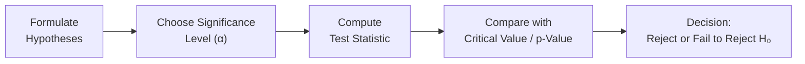

## Overview and Motivation

Let’s be honest: if you’ve ever tried to make an investment decision based on a data analysis (maybe something as simple as checking whether a strategy gave you better returns than the market), you’ve basically flirted with hypothesis testing. We often want to claim that some parameter—like the expected return of a portfolio—is different from a benchmark. But to do that confidently, we need a structured way to go about it. That’s where hypotheses and significance levels come in. Think of them as the rules of engagement in the epic showdown between data and uncertainty.

This section will walk you through formulating the null hypothesis (H₀) and the alternative hypothesis (H₁ or Hₐ), choosing a significance level (α), and explaining why these decisions matter for investment and statistical analyses. Yes, we’ll do a bit of math, but we’ll also keep it practical with real-world-like examples and a friendly tone.

## Defining Null and Alternative Hypotheses

Most hypothesis tests revolve around two (often competing) statements about a population parameter:

• Null Hypothesis (H₀): This is like the “status quo” or baseline stance. It usually says something like “no difference,” “no effect,” or “the parameter is equal to a specific value.” For investments, H₀ might say, “The true average return of this mutual fund is 5%,” or “There’s no difference in the volatility between two portfolios.”

• Alternative Hypothesis (H₁ or Hₐ): This is the statement you suspect or want to show. It typically indicates a difference, a change, or an effect. For example, “The true average return is not 5%” (two-sided) or “The average return is greater than 5%” (one-sided).

Sometimes, you’ll see people using Hₐ and sometimes H₁. They mean the same thing: whichever notation you prefer is fine, as long as it’s consistent.

### Example of Hypothesis Formulation

Let’s say you’re evaluating a new options-based trading strategy that some folks in your office claim outperforms the S&P 500. You might set up the hypotheses like this:

• H₀: The strategy’s mean monthly return ≤ 0.5%  
• H₁: The strategy’s mean monthly return > 0.5%

This way, if you find sufficiently strong evidence in your sample analysis that mean monthly returns exceed 0.5%, you can reject H₀ and conclude there’s a statistically significant reason to believe the strategy is better than the baseline.

## Choosing a Significance Level (α)

The significance level (α) determines how aggressive or conservative we are when concluding that H₀ should be rejected. Common α levels are 0.10, 0.05, and 0.01, though many investment analyses prefer α = 0.05 to balance the risk of incorrect rejection with the desire to detect a real effect.

Here’s the critical point: if H₀ really is true but our data sampling leads us to reject it, we make a Type I error. This error happens with a probability equal to α. So, if α = 0.05, there’s a 5% chance we reject a true H₀ by mistake.

But if you lower α too much (like α = 0.001), it’s super difficult to reject H₀—even if there’s a real difference. You’ll reduce the chance of Type I errors, but ramp up the chance of missing a real effect, known as a Type II error. Striking a balance here is key, and your choice depends on the stakes: if the cost of incorrectly rejecting H₀ is huge (e.g., making an investment mistake that might cause large losses), you might choose a lower α. If the cost of missing a great opportunity is high, you might be more lenient with α.

## The Hypothesis Testing Process

It’s helpful to visualize the flow of hypothesis testing. Below is a simple Mermaid diagram that shows the typical steps:



1. Formulate the hypotheses (H₀ and H₁).  
2. Decide on an acceptable α (risk of Type I error).  
3. Collect data and compute the test statistic (for instance, a z-statistic, t-statistic, or other).  
4. Determine the critical value or find the p-value.  
5. Make your decision: reject H₀ or fail to reject H₀.  

Notice how we say “fail to reject H₀” rather than “accept H₀.” If we can’t reject H₀ with the data and test design, it doesn’t necessarily mean H₀ is absolutely correct. It just means the evidence at hand wasn’t strong enough to discard it.

## Calculating the Test Statistic

Depending on the nature of your data and assumptions, you’ll choose a test statistic. For a test about a population mean when the population standard deviation is known, you might use a z-statistic:


z = \frac{\bar{X} - \mu_0}{\sigma / \sqrt{n}},


where  
• \\(\bar{X}\\) is the sample mean,  
• \\(\mu_0\\) is the hypothetical mean under H₀,  
• \\(\sigma\\) is the population standard deviation,  
• \\(n\\) is the sample size.

If \\(\sigma\\) is unknown, you’d typically use a t-statistic:


t = \frac{\bar{X} - \mu_0}{s / \sqrt{n}},


where \\(s\\) is the sample standard deviation. Once you have the test statistic, you compare it to the critical value (z or t) at your chosen α. Alternatively, many software packages give you a p-value that you compare directly to α.

## Personal Anecdote: Testing a “No Talk” Rule

Years ago, I worked on a small team analyzing daily stock returns. We had a funny hypothesis: “Not discussing the market at lunch leads to higher post-lunch trading efficiency.” So, H₀ was “Talking or not talking makes no difference,” while H₁ was “There is a difference.” Our significance level was 0.05. After several weeks of data, the p-value turned out to be 0.12, which was well above 0.05. We concluded we couldn’t reject H₀—though we all felt we were trading better when we stayed silent during lunch. That taught me that you can’t always rely on a small sample, and p-values don’t always match our gut feelings.

## Interpreting Results for Investment Decisions

In an investment context, rejecting H₀ means the data provides statistically significant evidence in favor of H₁. For example, if H₁ states that a particular asset has a higher expected return than some benchmark, rejecting H₀ suggests you might want to consider adding that asset to your portfolio. “Failing to reject” H₀ means you don’t have sufficient evidence to conclude the asset’s return is different. It’s not a death sentence for new strategies, but you might want to gather more data or refine your assumptions before moving forward.

It’s also important to combine statistical evidence with professional judgment, risk analysis, and your broader financial context. Hypothesis testing alone won’t give you all the answers, but it’s a powerful method to verify or challenge your assumptions.

## Decision Errors: Type I and Type II

Type I Error: Rejecting H₀ when, in fact, H₀ was true. The probability of this error is α. Think of it as a “false positive.”

Type II Error: Failing to reject H₀ when, in fact, H₁ is true. The probability of this error is β. The complement of β is called power (1 − β), which is the probability of correctly rejecting H₀ when H₁ is true. Higher sample sizes, stronger effects, and proper test design can reduce this error.

## Why Significance Levels Matter in Finance

In capital markets, risk is everywhere. If you set α too high, you risk “seeing” effects that aren’t really there—like concluding your new high-frequency strategy absolutely crushes the market, only to lose money on it in the real world (been there, done that). Conversely, a super-low α might mean you never take a bold stance and may miss out on real opportunities.

Set your α by asking:  
• How costly is it to be wrong in each direction?  
• What’s the broader risk tolerance of the organization, fund, or personal investment philosophy?

## Practical Tips and Common Pitfalls

• Clearly define your hypotheses. Make them specific.  
• Choose α carefully; it influences more than just your test—it influences your interpretation and your risk strategy.  
• Always keep an eye on sample size, especially in finance where data might be limited or not perfectly representative.  
• Watch out for data snooping. If you run many tests, your entire pre-set α might not apply the same way (think about adjusting for multiple comparisons).  
• “Not rejecting” H₀ isn’t a stamp of scientific truth. It’s just a statement about the strength of your evidence.  
• For exam success, practice reading scenarios carefully, so you know if you’re doing a one-sided or two-sided test, and confirm which significance level is appropriate for the question asked.

## A Quick Python Example

Below is a snippet illustrating how you might use Python’s SciPy library to perform a simple one-sample t-test. It’s optional, but it helps to see how a typical software approach would appear:

```python
import numpy as np
from scipy import stats

daily_returns = [0.3, 0.4, 0.2, 0.55, -0.1, 0.6, 0.0, 0.7, 0.45, 0.1]
mu_0 = 0.25

t_statistic, p_value = stats.ttest_1samp(daily_returns, mu_0)

print(f"T-statistic: {t_statistic:.4f}")
print(f"P-value: {p_value:.4f}")

alpha = 0.05
if p_value < alpha:
    print("Reject H0: There's evidence the mean return is different from 0.25%.")
else:
    print("Fail to reject H0: Not enough evidence to say it's different.")
```

This snippet calculates the test statistic and the p-value on a small sample of returns. If the resulting p-value is below your chosen α, you reject H₀.

## Final Exam Tips

For the CFA exam, keep these points in mind when you see a question about hypothesis testing:

• Confirm the correct formulation of H₀ and H₁. Know if it’s a one-tailed or two-tailed test.  
• Identify the correct test statistic (z, t, chi-square, F, etc.) based on the data’s distribution, sample size, and known/unknown variance.  
• Understand how α translates into critical values or p-value thresholds for rejecting H₀.  
• Relate the result back to the investment context described in the question.  
• Look out for the difference between statistical significance and economic significance. You can statistically prove a difference that might be economically trivial.  
• Time management: these concepts often pair with quick calculations. Stay organized and watch your time across the entire exam.

## References

• CFA Institute. (2020). Quantitative Investment Analysis.  
• DeGroot, M. & Schervish, M. (2012). Probability and Statistics (4th ed.). Pearson.  
• NIST/SEMATECH e-Handbook of Statistical Methods: https://www.itl.nist.gov/div898/handbook/  
• Sharpe, W. (1966). “Mutual Fund Performance.” Journal of Business.  

## Test Your Knowledge: Hypothesis Formulation and Significance Levels Quiz



### Which of the following best describes the idea of a null hypothesis (H₀)?

- [x] It is the baseline statement of no difference or effect that we assume to be true.  
- [ ] It is the hypothesis that the mean is always greater than zero.  
- [ ] It is the hypothesis that always has a 5% chance of being rejected.  
- [ ] It is a statement that always requires Type II errors to be zero.  

> **Explanation:** The null hypothesis is typically the default assumption of “no difference” or “no effect.”

### If an analyst chooses a significance level α = 0.10 instead of α = 0.05, which of the following will happen?

- [ ] The test automatically becomes less likely to reject H₀.  
- [ ] The test’s p-value becomes half of what it was.  
- [x] The test becomes more likely to reject H₀, increasing the risk of a Type I error.  
- [ ] The test’s critical value for rejection becomes stricter.  

> **Explanation:** A larger α makes rejection regions wider, increasing the probability that H₀ will be rejected when it might actually be true (Type I error).

### In hypothesis tests about a population mean, when the population variance (σ²) is unknown, which test statistic is preferred?

- [ ] z-statistic  
- [x] t-statistic  
- [ ] chi-square  
- [ ] F-statistic  

> **Explanation:** With unknown population variance, the t-statistic is typically used, especially for smaller sample sizes.

### What is the correct interpretation of "fail to reject H₀"?

- [ ] H₀ is definitely true.  
- [ ] The test was not performed correctly.  
- [x] The sample data did not provide sufficient evidence against H₀ at the chosen α.  
- [ ] There must not be an alternative hypothesis.  

> **Explanation:** Failing to reject H₀ means we could not prove H₁; it does not necessarily prove H₀ is true.

### Type I error occurs when:

- [x] The null hypothesis is true, but we reject it.  
- [ ] The alternative hypothesis is true, but we accept the null hypothesis.  
- [ ] The sample size is too large for the significance level.  
- [x] Both the second and third statements are also correct.  

> **Explanation:** Type I error is rejecting a true H₀. The sample size or alternative statement doesn’t define Type I. However, be cautious: in some references, “accept” of H₀ is rarely used—“fail to reject” is more precise. 

### Type II error occurs when:

- [ ] The sample shows a large effect, but α is too high.  
- [x] The null hypothesis is false, but we fail to reject it.  
- [ ] Both Type I and Type II errors are zero at α=0.05.  
- [ ] We set up both H₀ and H₁ incorrectly.  

> **Explanation:** Type II error is failing to reject H₀ when H₁ is actually true.

### Which choice reflects a one-sided alternative hypothesis?

- [x] H₁: Mean return > 5%.  
- [ ] H₁: Mean return ≠ 5%.  
- [ ] H₁: Mean return = 5%.  
- [ ] H₁: Mean return < 5% and > 2%.  

> **Explanation:** A one-sided (right-tailed) test states a direction, such as "greater than 5%."

### You conduct a two-sided test at α=0.05, and your p-value is 0.03. What is your conclusion?

- [x] Reject H₀.  
- [ ] Fail to reject H₀.  
- [ ] Increase α to 0.06 to confirm your results.  
- [ ] Decrease α to 0.01 to confirm your results.  

> **Explanation:** Since p-value = 0.03 is below 0.05, reject H₀ in favor of H₁.

### Which statement most accurately explains the difference between statistical significance and economic significance?

- [x] A statistically significant effect may not be large enough to matter economically.  
- [ ] A high α is always required for an economically significant effect.  
- [ ] Economic significance and statistical significance are synonymous.  
- [ ] If an effect is statistically significant, it must be impactful for all investors.  

> **Explanation:** Statistically significant results might have negligible financial impact if the effect size is small.

### Rejecting the null hypothesis in a one-tailed test at α=0.05 implies:

- [x] The p-value is below 0.05 for that direction of change.  
- [ ] The difference is automatically economically significant.  
- [ ] Type II error is zero.  
- [ ] It is impossible for the same hypothesis to be rejected at α=0.10.  

> **Explanation:** Rejection at α=0.05 in a one-sided test indicates that the data supports H₁ strongly enough that p < 0.05.


