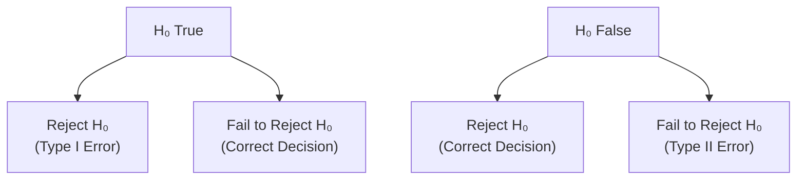

## Introduction and Context

When we talk about hypothesis testing in finance—whether it’s to see if a fund manager is truly adding alpha or if a new investment strategy is yielding better-than-average returns—we inevitably come face-to-face with the concepts of Type I and Type II errors, as well as the idea of test power. If you’re revisiting your statistics fundamentals or encountering them for the first time in the CFA Program, it’s helpful to see why these ideas matter and how they flow through practical investment contexts.

If you’ve ever worried “What if I decide to reject or accept something and it turns out I was wrong?” you’re basically concerned with the risk of committing a Type I or Type II error. For instance, I once collaborated with a trader who tried developing a new trading signal that seemed to do wonders in historical backtests. But after a few months, the signals turned out to be misleading—unfortunately, we had fallen victim to a Type I error (a false positive). It was a painfully expensive lesson, and one that underscores just how real these statistical concepts are when money is on the line.

## Revisiting Key Definitions

Before diving more deeply, let’s set out some fundamental definitions in the context of hypothesis testing:

• Null Hypothesis (H₀): The baseline statement we assume to be true unless there is strong evidence to the contrary.  
• Alternative Hypothesis (H₁ or Hₐ): The competing claim we’re trying to support or prove valid.  

Example: Testing whether a manager can generate alpha might set H₀: α ≤ 0 (no skill) vs. H₁: α > 0 (manager has skill).

The test procedure uses a significance level α, which controls the probability of a Type I error. That’s where our conversation picks up.

## Type I Error: The False Positive

A Type I error occurs when you reject H₀ even though it is true. It’s like concluding that your manager is skillful when, in reality, their returns are no different (or even lower) than the market. Also called a “false positive,” this is essentially sounding the alarm when there’s no real fire.

• Symbol: α (alpha)  
• Interpretation: α is the probability (often expressed as a percentage) that you will reject a true null hypothesis.  
• Typical Values: 1%, 5%, or 10% in financial literature, though it can vary by context and risk tolerance.  

In an investment performance example, a Type I error (α) might mean you risk capital on a seemingly skilled manager who actually lacks real positive alpha. That’s obviously not ideal. But as we’ll see, lowering α to be extra sure you don’t pick a poor manager can ironically increase your risk of missing out on truly good managers—this is where Type II errors (and β) come in.

## Type II Error: The False Negative

A Type II error happens when you fail to reject H₀ even though it is false. Yes, that’s a bit of a tongue twister, but think of it as a missed opportunity or a “false negative.” If a manager truly has skill (i.e., α > 0), yet our test fails to pick up that skill, that misclassification is a Type II error.

• Symbol: β (beta)  
• Interpretation: β is the probability you miss a real effect that is genuinely there.  
• Consequence: In a market context, you risk ignoring a genuinely positive opportunity because your test suggests “there’s nothing special.”

Whether you find that more or less worrisome than a Type I error depends on the stakes. If you’re a hedge fund on the lookout for exceptional talent, a Type II error might mean missing the next star manager. That could be as bad—or even worse—than picking up a manager who falsely appears to have skill.

## The Power of a Test: Probability of Detecting What’s Really There

In hypothesis testing, the complement of β is called the power:

Power = 1 − β

This represents the probability that your test correctly rejects a false H₀. Put differently, it’s the probability that you detect an actual “signal” that truly exists. We often want this probability to be as high as possible—in the 80% to 90% range for many practical applications, though preferences vary based on context.

• A powerful test effectively separates “signal” from “noise.”  
• A test with low power can lead to frequent Type II errors.  

In the investment manager example, a highly powered test means, if the manager does generate positive alpha, you have a strong shot at concluding so accurately, rather than dismissing it as randomness.

## Trade-Offs Between α and β

So, you might be thinking, “Wait, I’d like α to be minuscule so I don’t keep picking the wrong manager, and also I want power to be huge so I never miss a good one!” Well, yes—so do we all. But lowering α (making it more difficult to reject H₀) tends to increase β, the probability of a Type II error, unless you make other adjustments like increasing your sample size. This trade-off is essential:

• Lowering α too much → You virtually eliminate false positives but increase the risk of false negatives.  
• Boosting power by letting α float up → You reduce Type II errors but might accept more Type I errors.  

In a high-stakes environment (say, a pharmaceutical safety test), you might choose a very low α because you really don’t want to declare a drug safe if it isn’t. On the other hand, traders or portfolio managers might accept a slightly higher α if they want to quickly identify potential winners without letting them slip through the net. This balancing act is context-driven.

## Increasing the Power of a Test

If you want to keep α at a certain level but raise 1 − β, your best bet is to increase sample size. By sampling more data points—think longer historical track records, more cross-sectional data, or daily rather than monthly returns—your standard errors shrink, making it easier to detect small but meaningful differences. Alternatively, better measurement methods (reducing noise or variability) can also help. The main strategies for powering up your test include:

• Increasing sample size (n).  
• Reducing the variability of your data (σ).  
• Increasing the effect size (e.g., the difference between hypothesized and actual values, if feasible).  

A typical approach is formal statistical power analysis, where you choose your desired α, hypothesize what the “true difference” might be, and solve for sample size n that delivers your target power (1 − β). This approach is common in academic research and can be relevant in finance when designing a test for a new trading strategy or investigating historical performance data.

## Practical Investment Scenario: Type I vs. Type II

Here’s a scenario often cited in the financial world:

• H₀: α ≤ 0 (Manager does not generate positive alpha or skill).  
• H₁: α > 0 (Manager does generate positive alpha or skill).  

Type I Error: You conclude (reject H₀) that the manager has skill, even though they do not. In that case, you might allocate capital to them, only to discover they underperform or simply track the market. That’s obviously not a pleasant situation.

Type II Error: You fail to reject H₀ and pass over the manager, but this is a bummer if the manager really can beat the market. The false negative means you say “no” to a manager who was truly good, losing a potentially valuable opportunity to earn above-market returns.

At the end of the day, the costs of each error differ from one investment firm to another. A risk-averse pension fund might be more worried about Type I errors (and losing principal on a false strategy), while a nimble hedge fund could be more worried about Type II errors (and missing the next big thing).

## Visual Representation

Below is a simple mermaid diagram to highlight the two states of nature (H₀ true or H₀ false) and the possible decision outcomes:

• If H₀ is actually true and you reject it, that’s a Type I error.  
• If H₀ is actually false and you fail to reject it, that’s a Type II error.  

## Real-World Nuances

Sometimes in finance, data are far from perfectly normally distributed, and outliers can wreak havoc on your test assumptions. The interplay of Type I and Type II errors can become even trickier with big data sets or multiple tests (where “p-hacking” can occur if you keep searching for any difference that hits significance).

In practice, you might see a researcher or analyst run a power analysis to figure out how many months or years of performance data they need to confidently gauge a manager’s alpha. Meanwhile, they keep an eye on α to ensure they don’t chase random noise. It’s a delicate dance.

## Best Practices and Common Pitfalls

• Thoughtfully Set α: Avoid defaulting to 5% without considering the cost of false positives vs. false negatives in your investment scenario.  
• Analyze Effect Size: If the difference you want to detect is tiny, you’ll need more data to achieve your desired power.  
• Don’t Overlook Type II: Finance professionals often fixate on α but rarely compute or even mention β. That can lead to being overly cautious and missing real opportunities.  
• Use Adequate Sample Sizes: Insufficient data can lead to very low power, especially in volatile markets.  
• Consider Multiple Comparisons: If you test multiple strategies, correct for the increased probability of a Type I error.  

## Strategies to Overcome Challenges

• Increase Your Sample: Gather more observations across time periods or securities.  
• Use More Refined Metrics: For instance, use risk-adjusted measures of returns.  
• Conduct Pilot Studies or Preliminary Analyses: If you’re uncertain about effect sizes, you can run smaller tests first to estimate the variance.  
• Deploy Bayesian Methods: Some finance professionals use Bayesian approaches for updating beliefs as data accumulate.  

## Conclusion and Exam Tips

Type I and Type II errors, along with the power of a test, form the bedrock of hypothesis testing in finance and broader statistical analysis. Every investment decision that relies on a statistical procedure—be it evaluating a manager’s alpha, testing a new trading rule, or verifying whether an economic indicator predicts recessions—tests your mettle on balancing these two errors. For exam day (and in real life!) keep these key pointers in mind:

• Know your α vs. β trade-off, and remember that 1 − β is the power of the test.  
• Understand real-world implications: what’s the cost of a false positive or a false negative?  
• Remember that bigger sample sizes are your friend if you want high power without raising α.  
• Provide context-driven justifications for your chosen α and desired power.  

That’s pretty much it, but “it” is huge in real-world importance. Don’t let the manager with genuine skill slip away—but also don’t get dazzled by illusions. Striking a balance is the hallmark of good financial analysis.

## References

• CFA Program Curriculum Level I, “Hypothesis Testing.”  
• Montgomery, D. (2012). “Applied Statistics and Probability for Engineers.” Wiley.  
• Cohen, J. (1988). “Statistical Power Analysis for the Behavioral Sciences.” Lawrence Erlbaum Associates.  

## Test Your Knowledge of Type I and Type II Errors



### Which of the following best describes a Type I error in hypothesis testing?

- [x] Rejecting a true null hypothesis.
- [ ] Failing to reject a false null hypothesis.
- [ ] Accepting a false null hypothesis.
- [ ] None of the above.

> **Explanation:** Type I error is also known as a “false positive.” You reject H₀ when H₀ is in fact true.

### If you reduce the significance level α without changing anything else, what is the usual effect on β?

- [ ] β generally goes down.
- [ ] β remains unaffected.
- [x] β generally goes up.
- [ ] β becomes zero.

> **Explanation:** Lowering α makes it harder to reject H₀, so you’re more prone to miss a real effect. Thus, β typically increases.

### Which of the following statements about test power (1 − β) is correct?

- [ ] Test power is the probability of accepting H₀ when it’s true.
- [ ] Test power equals α when H₀ is false.
- [x] Test power is the probability that you correctly reject a false H₀.
- [ ] Test power has no relationship with α or β.

> **Explanation:** The power of a test is the chance you correctly reject H₀ when H₀ is false. It is defined as 1 − β.

### In an investment context, a Type II error arising from an alpha-generating strategy would mean:

- [ ] Concluding a manager has skill when no alpha exists.
- [x] Failing to detect a manager’s real skill.
- [ ] Setting α too low and thus decreasing β.
- [ ] Overestimating an effect size for the strategy tested.

> **Explanation:** A Type II error in this scenario means missing a truly good manager—that is, failing to reject H₀ when H₀ is false.

### Which is NOT a common way to increase the power of a test?

- [x] Raising the variability or standard deviation in the data.
- [ ] Increasing the sample size.
- [ ] Designing a test to reduce sources of noise.
- [ ] Accepting a slightly higher α to reject H₀ more easily.

> **Explanation:** To increase power, you typically want to reduce variability (not increase it), collect more data, or accept a higher false positive rate.

### Suppose you perform multiple hypothesis tests at the same α level. What is a key concern?

- [x] You may inflate your overall Type I error rate.
- [ ] You reduce Type II error through multiple testing.
- [ ] Sample size does not matter anymore.
- [ ] The power of the tests automatically increases.

> **Explanation:** Conducting many tests at the same α inflates the overall probability of making at least one Type I error (false positive).

### Which of the following is the best definition of α?

- [x] The probability of rejecting H₀ when H₀ is true.
- [ ] The probability of failing to reject H₀ when H₀ is false.
- [ ] The probability of a correct decision.
- [ ] The significance of effect size.

> **Explanation:** By definition, α is the probability of a Type I error, also known as “false positive.”

### How can greater sample size affect the trade-off between α and β?

- [x] It can simultaneously keep α unchanged and reduce β.
- [ ] It can reduce α but automatically increase β.
- [ ] It makes both α and β larger.
- [ ] It has no effect on α or β.

> **Explanation:** Increasing sample size typically decreases the test’s standard error, thereby reducing β (and increasing power) without needing to raise α.

### In a hypothesis test with α = 5% and power = 80%, what is β?

- [ ] 5%
- [ ] 15%
- [ ] 85%
- [x] 20%

> **Explanation:** Power = 1 − β = 80%. Therefore, β = 20%.

### True or False: A Type II error is sometimes called a “false negative.”

- [x] True
- [ ] False

> **Explanation:** Yes, a Type II error occurs when you fail to reject H₀ even though H₀ is false—in other words, you get a negative test result when you should have gotten a positive.


