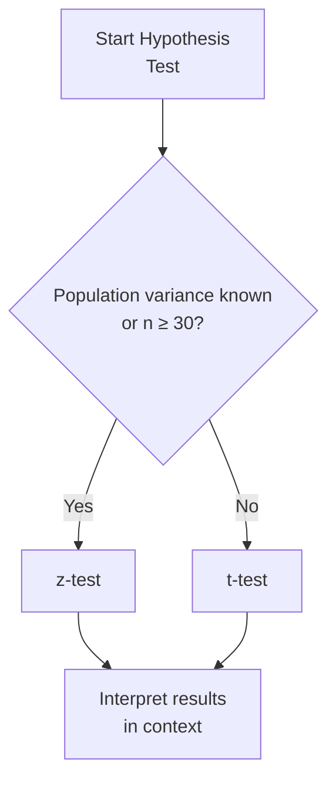

## Introduction

How often have you sat there, staring at sample returns data, wondering if you can confidently say, “Yes, these returns are truly different from zero—this isn’t just luck”? Well, that’s essentially what hypothesis testing is all about. In particular, we lean on parametric test procedures—like the z-test and the t-test—when we assume that the underlying data follows a known distribution (commonly normal). And in finance, where a lot of returns data can be assumed approximately normal (especially as sample sizes grow large), these tests become handy. I still remember the first time I tried to see whether my newly constructed “algorithmic trading strategy” had non-zero average excess returns. It was exciting and a bit scary—because if I messed up the test, I might chase illusions rather than real alpha.

In this section, we’ll explore how and when to apply z-tests and t-tests, interpret their outcomes, and connect them to investment scenarios. By the time we’re done, you’ll have the essential tools to decide if your data supports your hypothesis—or not.

## Parametric Tests: An Overview

Before we zoom in on z-tests and t-tests, let’s step back for a moment. Parametric tests rely on assumptions regarding the underlying distribution of the data. Usually, we assume:

• The data is drawn from a normally distributed population.  
• For a z-test, we either know the population variance or have a large sample (often n ≥ 30) so that the Central Limit Theorem (CLT) kicks in.  
• For a t-test, we do not know the population variance, and the sample is relatively small or moderate—but still from (or close to) a normal population.

In finance, we often talk about returns being “approximately normal,” especially when we have large samples. However, if you suspect significant skew or non-normal behavior (like fat tails or outliers), parametric assumptions might break down. That’s when you’d consider nonparametric or robust testing, but that’s a different story for another section (see Section 8.4 Nonparametric Alternatives).

## The z‑Test

### When to Use a z‑Test
The z‑test is typically your first stop if:
• The population variance (σ²) is known.  
• Or you have a large sample size (n ≥ 30), so the distribution of the sample mean is close to normal by the CLT, and you have a decent estimate of the population standard deviation.

In real-world finance, we rarely know the true population variance. But with large sample sizes, we treat our sample standard deviation s as a decent approximation of the true σ, and we proceed with a z‑test.

### Test Statistic for a One‑Sample z‑Test
Mathematically, our one‑sample z‑test statistic for testing H₀: μ = μ₀ is:

(1)  
z = (x̄ − μ₀) / (σ / √n)

Here:  
• x̄ = sample mean  
• μ₀ = hypothesized population mean  
• σ = population standard deviation (or a suitable estimate for large n)  
• n = sample size  

The rationale is pretty straightforward: we measure how many standard errors the sample mean is away from the hypothesized mean.

### Critical Values and p-Values
We compare the z-statistic to critical values from the standard normal distribution (z ~ N(0,1)), or we compute a p-value.  
• If |z| is large (exceeding the critical boundary for your chosen α), you reject H₀.  
• Alternatively, if p-value ≤ α, you reject H₀.  

As a quick aside, α is your significance level, like 0.05 for a 5% test. If you observe a result so extreme that it’d only happen (under H₀) 5% of the time—or even less—then you decide that H₀ might be false.

### An Example in Investments
Let’s say you have a large fund that claims its daily excess return is 0.02%. You gather 100 days of data, find your sample mean is 0.03%, and your sample standard deviation is 0.01%. With n=100 (which is ≥30, so large enough for a z‑test), you want to test if the true mean could still be 0.02%.

Using equation (1):  
z = (0.0003 − 0.0002) / (0.0001 / √100)  
  = 0.0001 / (0.0001 / 10) = 0.0001 / 0.00001 = 10  

That’s a z-statistic of 10, which is obviously huge. If you check any z-table, a z = 10 is well beyond typical critical values. You’d reject H₀ and likely conclude that the mean is different from 0.02%. (Of course, it’s a simplified, somewhat unrealistic example. But it shows how the test works.)

## The t‑Test

### When to Use a t‑Test
A t‑test becomes your go-to if:
• The population variance is unknown.  
• Your sample size is small (n < 30, or even moderately sized but not large enough for z-approximation).  
• The sample is (at least approximately) drawn from a normal distribution.

In finance, you might rely on a t-test for quirks like a specialized small-cap sample or a limited data set for a newly launched portfolio. For instance, “my new alpha strategy has only 20 trading days of returns so far—can I test if the average return is zero?” The t-test says: “Yes, but be cautious with degrees of freedom.”

### Test Statistic for a One‑Sample t‑Test
The typical form when testing H₀: μ = μ₀ is:

(2)  
t = (x̄ − μ₀) / (s / √n)

Here:  
• x̄ = sample mean  
• μ₀ = hypothesized mean  
• s = sample standard deviation  
• n = sample size  

The test statistic follows a t-distribution with df = n − 1 degrees of freedom (assuming a simple one-sample test). The t‑distribution is a bit “thicker” in the tails than the standard normal, reflecting the extra uncertainty from estimating σ.

### Degrees of Freedom
Yes, you keep hearing about “df.” Intuitively, out of n observations, we need to estimate the mean as well as the variance, so we lose a bit of freedom in the process. That’s why df = n − 1. The smaller the sample, the heavier the tails in the t-distribution, and the more conservative your critical boundaries become.

### A Quick Investment Example
Imagine your firm started a new bond-trading strategy last month, and you only have 15 daily return observations. The sample has a mean of 0.04% return per day and a sample standard deviation of 0.03%. You want to test H₀: μ = 0 (the strategy has no net daily return). From equation (2):

t = (0.0004 − 0) / (0.0003 / √15)  
  = 0.0004 / (0.0003 / 3.873)  
  = 0.0004 / 0.0000774  
  ≈ 5.17  

Now, for df = 14, you check the t-table for a significance level of 5%. A t-value above around 2.14 (two-tailed) is enough to reject H₀. With 5.17, it’s significantly higher. In real life, you’d look up the exact p-value, see it’s way below 0.05, and conclude that your strategy’s daily returns are likely nonzero.

## Confidence Intervals and Relation to Hypothesis Testing

Confidence intervals (CIs) and hypothesis tests are two sides of the same coin. If you construct a 95% CI for μ, and the hypothesized mean—even a value like 0%—falls outside that interval, it implies rejection of H₀ at α = 0.05.

To illustrate:

• For a z‑based 95% CI:  
  x̄ ± z(α/2) * (σ / √n)

• For a t‑based 95% CI:  
  x̄ ± t(α/2, df) * (s / √n)

where t(α/2, df) is the critical value for the t-distribution with df = n − 1. If μ₀ (the hypothesized mean) lies outside the CI, you reject H₀ at the 5% level.

## p‑Values

The p-value is the smallest significance level at which your data would lead to rejecting H₀. If p ≤ α, you reject H₀. If p > α, you do not reject H₀. It’s basically a measure of how “surprising” or “extreme” your data is, assuming H₀ is actually true. A tiny p-value means it’s quite unlikely H₀ generated the data you see.

In practice, many financial analysts prefer p-values over critical values because it’s more intuitive to say, “We found a p = 0.01, so there’s only a 1% chance we’d see something this extreme if H₀ were really true.”

## Choosing z‑Test vs. t‑Test in Investment Analysis

For big samples (≥ 30, or even 40 if you want extra caution) and a decent handle on standard deviation, a z-test is acceptable. If your sample is under 30 and your data is roughly normal, the t-test is the safer route because it accounts for the uncertainty in estimating the variance. 

Yes, there’s some wiggle room in practice. People often use a t-test even with n = 40 or n = 50, simply because the difference in critical values between t and z becomes minor as n increases.

Bear in mind that many financial return distributions are only “approximately” normal. If your data is heavily skewed or has major outliers, you might consider transformations (like log returns) or look at robust / nonparametric approaches.

## A Visual Decision Flow

Below is a simple mermaid flowchart to help you decide which test is appropriate, at least in a textbook sense:



## Practical Example: Algorithmic Strategy Return

Let’s say you’re evaluating a new algorithmic strategy’s performance. You have 25 daily returns (n < 30, so that’s not large), and your sample standard deviation is not well-established. This sets off alarm bells: “We probably need a t‑test here.” You check if the daily returns look roughly normal—no massive outliers or major skew—and you proceed with the t‑test to see if the mean daily return is, say, 0.05%.

If your t-test statistic crosses the threshold for significance (given df = 24), then you’ll interpret that to mean the strategy’s mean return is significantly different from 0.05%. Alternatively, if you had gathered 200 daily returns, the z‑test would be simpler to use.

## Short Python Snippet to Compute Test Statistics

Below is a tiny snippet that demonstrates how you might quickly compute z or t statistics in Python (just a casual example—real production code would handle many more checks):

```python
import math

def z_statistic(x_bar, mu, sigma, n):
    """
    Computes the z-statistic for a known sigma (population stdev) or large n.
    """
    return (x_bar - mu) / (sigma / math.sqrt(n))

def t_statistic(x_bar, mu, s, n):
    """
    Computes the t-statistic for an unknown sigma and smaller sample.
    """
    return (x_bar - mu) / (s / math.sqrt(n))

# z_val = z_statistic(0.03, 0.02, 0.01, 100)
```

You’d then compare z_val or t_val to the appropriate distribution table, or compute a p‑value using a statistics library (e.g., SciPy’s stats module).

## Best Practices and Pitfalls

• Check Normality Assumptions: Real financial data often exhibits skew or leptokurtosis (fat tails). If the data is drastically non-normal, parametric test results may be misleading.  
• Watch for Data Snooping: Testing multiple hypotheses repeatedly can inflate your chance of false positives (type I errors). Adjust your significance level or use corrections if you’re testing many strategies.  
• Large n Doesn’t Solve All Problems: Outliers can still wreak havoc. Use robust or trimmed means if you have extreme data.  
• Don’t Overlook Variance Changes: In finance, the volatility might shift over time. A single standard deviation estimate might not capture that if your data is from multiple market regimes.  

And yes, there are times we get so excited about a new strategy’s “significance” that we forget about practical significance. A p-value might show that returns are “significantly different from zero,” but the difference could be so tiny that it’s not profitable after fees and transaction costs. Keep an eye on effect size!

## Conclusion

When you’re dealing with investment data and want to test if a mean return or alpha is significantly different from a benchmark or zero, parametric tests like the z-test and t-test are often your starting point—provided you’re comfortable with the normality assumption and the respective conditions (population variance known or large sample for z-test; unknown variance and smaller sample for t-test). They’re powerful shortcuts to glean insights from your data.

But never treat these tests in isolation. In a real finance context, you’re juggling multiple factors: changing volatility, transaction costs, risk exposures, and unexpected shocks. Use these tests as a guiding light, not an absolute truth. And remember, repeating them too often, rummaging for a “significant” result, can lead to data-mining biases and unjustified optimism.

## References for Further Exploration

• Newbold, P., Carlson, W., & Thorne, B. (2013). “Statistics for Business and Economics.” Pearson.  
• CFA Institute. (2023). “Quantitative Methods: Hypothesis Testing.”  
• Wooldridge, J. (2020). “Introductory Econometrics.”  
• Chapter 7 of this text (“Estimation and Inference”) for insights into sampling distributions.  
• Chapter 8.2 for an in-depth look at hypothesis formulation, significance levels, and error types.  

--------------------------------------------------------------------------------

## Test Your Knowledge of Parametric Test Procedures (z‑tests, t‑tests)



### Which of the following is a primary assumption underlying parametric tests like the z-test and t-test?

- [x] The data are (approximately) normally distributed.
- [ ] The sample standard deviation is always known.
- [ ] The sample is always larger than 100 observations.
- [ ] The sample does not include any negative values.

> **Explanation:** Parametric tests typically assume data come from a normally distributed population. Knowing the sample standard deviation or having a large sample is helpful, but not always mandatory for “parametric” to apply.


### You have a sample size of 35 daily returns data points, with no known population standard deviation. Which test is generally more appropriate?

- [x] t-Test
- [ ] z-Test
- [ ] Chi-square test
- [ ] F-Test

> **Explanation:** If the population variance is unknown, even with 35 data points, you generally still rely on the t-test. With 35 (which is borderline large), some practitioners might approximate using a z-test, but the official guidance remains to employ a t-test when σ is not known.


### If your z test-statistic is calculated to be 2.45 for a two-tailed test at a significance level of 5%, what should you do?

- [x] Reject the null hypothesis because 2.45 exceeds the critical value of approximately 1.96.
- [ ] Fail to reject the null hypothesis because 2.45 is less than 2.58.
- [ ] Reject the null hypothesis only if p-value is exactly 0.
- [ ] Perform a Monte Carlo simulation to confirm the result.

> **Explanation:** For a two-tailed test with α = 0.05, the critical z-value is about ±1.96. Since 2.45 lies outside that range, we reject H₀.


### You have only 10 observations of returns for a specialized bond portfolio, and the population variance is unknown. Which distribution should you use to determine the critical value for your test statistic?

- [x] A t-distribution with 9 degrees of freedom
- [ ] A z-distribution
- [ ] A Chi-square distribution
- [ ] An F-distribution

> **Explanation:** For small-sample tests where σ is not known, we use the t-distribution with df = n − 1.


### Suppose your one-sample t-statistic with 20 observations is 2.3 when testing H₀: μ = 0 at α = 0.05 (two-tailed). The critical t-value is about 2.09. What conclusion should be drawn?

- [x] Reject H₀ because 2.3 exceeds 2.09.
- [ ] Fail to reject H₀ because 2.3 is less than 2.09.
- [ ] Collect more data before drawing a conclusion.
- [ ] Perform a nonparametric test instead.

> **Explanation:** Since the computed t = 2.3 is larger than the t-critical of about 2.09, you reject the null hypothesis.


### True or False: The p-value represents the probability that the alternative hypothesis is true.

- [ ] True
- [x] False

> **Explanation:** The p-value is the probability, assuming H₀ is true, of observing a result as extreme or more extreme than your sample statistic. It does not directly tell you the probability that Hₐ is true.


### In a hypothesis test where the sample standard deviation is a good proxy for the population standard deviation (due to a large sample size), you might choose to use:

- [x] z-Test
- [ ] t-Test
- [ ] Mann–Whitney U test
- [ ] Chi-square goodness-of-fit test

> **Explanation:** With a large sample size, the sample standard deviation is often treated as a stand-in for σ, making the z-test viable.


### What is a typical consequence if we ignore the fact that the sample size is small and erroneously use a z-test instead of a t-test?

- [x] The resulting p-values and confidence intervals might be overly optimistic (Type I error inflation).
- [ ] There is no difference in test outcomes.
- [ ] The resulting test statistic will decrease drastically.
- [ ] The test will always be more conservative.

> **Explanation:** Using the z instead of t in a small sample ignores the extra uncertainty from estimating σ, leading to narrower intervals and a higher chance of rejecting H₀ incorrectly (type I error inflation).


### Which of the following statements is correct regarding the relationship between confidence intervals and hypothesis testing?

- [x] If a hypothesized mean lies outside the confidence interval, we reject the null hypothesis at that confidence level.
- [ ] If the confidence interval has a width of zero, the null is automatically rejected.
- [ ] Hypothesis tests and confidence intervals are always contradictory.
- [ ] Confidence intervals are only for large samples.

> **Explanation:** A 95% confidence interval for μ is directly connected to a two-tailed test at α = 0.05. If μ₀ is outside that interval, you reject the null. If it’s inside the interval, you do not reject.


### True or False: In financial research, it is advisable to run repeated parametric tests on the same data set until a significant p-value appears.

- [ ] True
- [x] False

> **Explanation:** Running repeated tests inflates the chance of type I errors (false positives). This practice is a common pitfall (sometimes called data snooping) and is discouraged.


