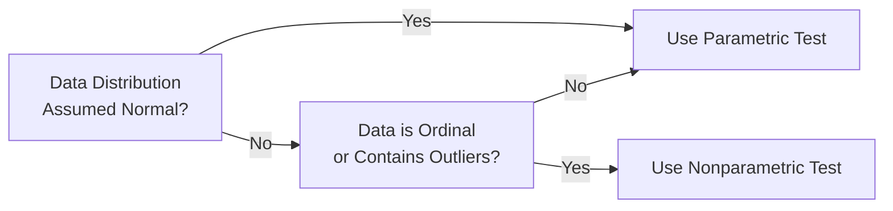

## Overview

Sometimes, in statistics, we rely on tests like the z-test or t-test. These belong to a family of tools typically called “parametric tests.” Parametric, as you might recall, means that they assume a particular underlying distribution—often the normal distribution. But, let’s be honest, in finance, data aren’t always neat and nicely distributed. You might run into heavy tails, outliers, or sample sets too small to reliably guess at the shape of a distribution. This is where nonparametric tests step in to save the day.

Nonparametric methods largely ignore the strict distributional assumptions of parametric tests, focusing instead on rank-ordering or other robust approaches. I remember once analyzing a set of monthly returns for a thinly traded security. The data had an odd cluster of extremely large negative returns (thanks to harsh liquidity conditions), and my parametric t-test results kept throwing bizarre p-values. Switching to a nonparametric approach gave a more sensible result because it didn’t insist on normality when the data simply weren’t normal.

Below, we’ll explore why nonparametric tests make sense in certain scenarios, examine a few popular examples you should absolutely know for your CFA exams—like Wilcoxon, Mann–Whitney, and Kruskal–Wallis—and discuss how they help in finance. Let’s dig in.

## Reasons to Use Nonparametric Methods

• Distribution-Lite: These tests place milder demands on your data. Specifically, they don’t require the population to be normally distributed or any particular form of distribution.  
• Ordinal Data: Sometimes, the data you’re looking at are purely ranks—think of credit ratings or analyst rankings. There’s no way to treat these as numeric data that obey standard parametric assumptions.  
• Skewed Data and Outliers: If your distribution is heavily skewed or has extreme outliers (e.g., major drawdowns or unusual spikes in returns), a nonparametric approach is often more robust.  
• Small Sample Sizes: Parametric tests need a minimum sample size to reliably approximate normal conditions (often 30 observations is the “rule of thumb” for a t-test). Nonparametric tests can be useful when n is small.  

In short, nonparametric tests are the right tool when parametric assumptions are broken or questionable. But keep in mind: if your data actually are normal, and you have a reasonably large sample, a parametric test is often more “powerful,” meaning it might be more likely to detect a true effect (a difference in means, for instance).

## Rank-Based Approaches

Nonparametric tests often rely on rank-ordering observations rather than using their absolute numeric values. Here’s a quick illustration:

• Suppose you have five return observations: 14%, 9%, 25%, 1%, and 12%.  
• Ranks would be assigned:  
  – 1% → Rank 1  
  – 9% → Rank 2  
  – 12% → Rank 3  
  – 14% → Rank 4  
  – 25% → Rank 5  

Once you convert all observations to these ranks, the tests compare sums of ranks, differences in ranks, or some function of ranks. That’s what keeps the approach distribution-free and robust against outliers.

## Common Nonparametric Tests

Below are some tests you’ll see in both the CFA curriculum and in real-world analytics when normality assumptions fail. Each has a slightly different setup, but they all share the idea: let’s compare medians or distributions without assuming normal data.

### Wilcoxon Signed-Rank Test

When you’re comparing paired samples (like the same group of investors before and after a big market event) or checking if a single set of observations differs from a hypothesized median, the Wilcoxon signed-rank test is your new best friend. It:

• Ranks the absolute differences.  
• Considers the sign (positive or negative) relative to the hypothesized median (often zero).  
• Aggregates these signed ranks to see if the median difference is significantly different from zero.  

I once used this test when evaluating whether a portfolio’s monthly alpha was consistently above zero. The alpha series was pretty lumpy (some big positive hits, some negative stumbles). The t-test assumptions felt shaky, so the Wilcoxon gave a better sense of the “typical” performance outcome.

### Mann–Whitney U Test

Mann–Whitney U compares two independent samples, checking whether they come from the same population median. It’s often framed as a nonparametric alternative to the two-sample t-test. Perhaps you have two different strategy returns—one strategy invests in emerging markets, and the other invests in developed markets—and you want to see if the typical (median) return differs.

• Pool and rank all observations from both samples, then see how the ranks are distributed between the two groups.  
• The test statistic reflects whether one group’s ranks overall are higher or lower than the other’s.  
• Works great when sample sizes are small or distribution assumptions are untenable.

### Kruskal–Wallis Test

What if you need to compare more than two groups—like the returns of three or four different funds? The Kruskal–Wallis test is a generalization of the Mann–Whitney U to more than two groups. Think of it as a nonparametric alternative to one-way ANOVA. 

Just like ANOVA tries to see if any of the groups differ in their means, Kruskal–Wallis tries to see if any differ in their medians. If the test indicates there is at least one different group, you can follow up with pairwise rank comparisons to pinpoint which group(s) are significantly different.

## Diagram: Choosing Between Parametric and Nonparametric

Here’s a simple flowchart for deciding whether to go parametric or nonparametric. Sometimes, such a high-level guide can save you hours of second-guessing.



In real practice, it’s rarely black-and-white. You might do an initial normality test (e.g., Shapiro–Wilk) and visually inspect a histogram or Q–Q plot. But it’s nice to have a mental model.

## Practical Examples in Investments

• Lightly Traded Assets: If you have a small sample of returns on a lightly traded asset, or you suspect that daily returns are not well-behaved (e.g., extremely illiquid markets), a rank-based test might make your day.  
• Subjective Ratings: Nonparametric methods shine for ordinal data like credit ratings (e.g., AAA still outranks BBB, but the “distance” between AAA and BBB is not necessarily the same as between BBB and BB).  
• Algorithmic R&D: Quants sometimes do a quick and dirty nonparametric test to see if a new strategy outperforms an existing one in terms of median daily PnL (Profit and Loss), especially when outliers or autocorrelation might break parametric rules.  

## Advantages and Disadvantages

### Advantages

• Robustness: They’re less brittle when assumptions of normality or homoscedasticity (equal variances) are violated.  
• Versatility: They handle ordinal data and heavily skewed distributions.  
• Simplicity: Rank-based approaches are conceptually straightforward.

### Disadvantages

• Less Power if Parametric Assumptions Are True: If your data really do meet parametric criteria, you might miss insights or fail to reject the null hypothesis when you actually should.  
• Less Detailed Insights: A rank-based test will tell you about medians and distribution differences, but it won’t let you do the same deep analysis you can with parametric models, such as analyzing differences in means or building confidence intervals around the mean.  

## Python Snippet: Mann–Whitney U Test

While you may not need to code in the CFA exam, it never hurts to see how accessible these tests can be, especially in a data-driven environment:

```python
import numpy as np
from scipy.stats import mannwhitneyu

np.random.seed(42)
returns_group1 = np.random.lognormal(mean=0.01, sigma=0.10, size=15)
returns_group2 = np.random.lognormal(mean=0.02, sigma=0.15, size=15)

statistic, p_value = mannwhitneyu(returns_group1, returns_group2, alternative='two-sided')
print("Mann-Whitney U statistic:", statistic)
print("p-value:", p_value)
```

This snippet demonstrates how easy it is to run a nonparametric test in Python. If the p-value is smaller than your chosen significance level (e.g., 0.05), you’d reject the hypothesis that both samples come from the same distribution (i.e., have the same median).

## Exam Tips and Key Takeaways

• Aligned with Chapter 8.3 (Parametric Test Procedures), nonparametric tests serve as important backups or even primary methods when data are clearly non-normal, heavily skewed, or ordinal.  
• Be mindful of your sample size. Nonparametric tests can be more effective with small samples if parametric assumptions are questionable.  
• In the context of the CFA exam, don’t forget: Wilcoxon signed-rank is used for paired data (or single-sample median testing), Mann–Whitney U is for two independent samples, and Kruskal–Wallis is for more than two independent samples.  
• Understand the trade-off: less power when parametric assumptions hold, but stronger validity when these assumptions are violated.  
• Consistently check your distributions. Chapter 3 covered skewness and kurtosis, and from that knowledge, you can quickly identify if your data distribution might break parametric test rules.  

And, hey—remember to stay flexible. If your data do look normal and you have a large enough sample, a parametric test is nothing to be afraid of. But if you suspect the data are more rebellious, nonparametrics often come to the rescue.

## References

- Conover, W. J. (1999). Practical Nonparametric Statistics. Wiley.  
- CFA Institute Level I Curriculum: Discussions on Nonparametric vs Parametric Tests.  
- Sprent, P., & Smeeton, N. (2007). Applied Nonparametric Statistical Methods. CRC Press.  

## Test Your Knowledge: Nonparametric Testing Essentials



### Which of the following is the primary reason to use nonparametric tests over parametric tests?

- [ ] To more accurately estimate population variance.  
- [ ] To increase the power of the test under normal conditions.  
- [ ] To reduce the need for calculations involving mean returns.  
- [x] To avoid strict assumptions about the underlying distribution of the data.  

> **Explanation:** Nonparametric tests are chosen when parametric assumptions (e.g., normality of the underlying data) are not met, or the data are ordinal, or there are significant outliers.

### A financial analyst wants to compare median returns of the same 10 funds before and after a major market disruption. Which nonparametric method is most appropriate?

- [ ] Mann–Whitney U Test  
- [ ] Kruskal–Wallis Test  
- [x] Wilcoxon Signed-Rank Test  
- [ ] Spearman Rank Correlation  

> **Explanation:** The Wilcoxon signed-rank test is used for paired data (e.g., the same funds before and after an event) to test for a shift in median.

### When comparing the median returns of three different equity portfolios, which nonparametric test would you select?

- [ ] Mann–Whitney U Test  
- [x] Kruskal–Wallis Test  
- [ ] Wilcoxon Signed-Rank Test  
- [ ] Sign Test  

> **Explanation:** Kruskal–Wallis is the natural extension of Mann–Whitney to more than two groups.

### Which of the following best describes a key disadvantage of nonparametric tests?

- [ ] They are less robust to outliers than parametric tests.  
- [x] They often have reduced power compared to parametric tests if parametric assumptions hold.  
- [ ] They can only be used for large sample sizes.  
- [ ] They cannot handle ordinal data.  

> **Explanation:** If a data set truly meets normal distribution assumptions, parametric tests typically have more power (i.e., are more likely to detect actual differences).

### The Mann–Whitney U Test:

- [x] Compares medians of two independent samples.  
- [ ] Compares means of two related samples.  
- [x] Uses rank ordering of data.  
- [ ] Assumes normality in both samples.  

> **Explanation:** Mann–Whitney U looks at two independent samples, focusing on whether their population medians differ by relying on rank-ordered data.

### Which of the following situations would most likely call for a nonparametric test?

- [x] Daily returns with large outliers in a small sample.  
- [ ] A large dataset of returns proven to be normal.  
- [ ] Data with minimal skewness.  
- [ ] A dataset strictly involving integer counts from a Poisson distribution.  

> **Explanation:** Nonparametric tests are especially favored when sample sizes are small and data contain extreme outliers or do not follow a known distribution.

### The Wilcoxon Signed-Rank Test can be used to test:

- [x] Whether the median of paired differences is zero.  
- [ ] Equality of variances between two distributions.  
- [x] Equality of a single sample’s median to a hypothesized value.  
- [ ] Correlation between two variables.  

> **Explanation:** Wilcoxon signed-rank is commonly used in both a paired-sample median comparison and a single-sample median test.

### In a Kruskal–Wallis test, rejecting the null hypothesis implies:

- [x] At least one group’s median may differ significantly from another group’s median.  
- [ ] All group medians are equal.  
- [ ] The largest group has the highest mean.  
- [ ] Correlation among the groups is zero.  

> **Explanation:** A significant Kruskal–Wallis outcome implies not all medians are the same, warranting post-hoc multiple comparisons to detect differences between specific groups.

### What is the main ranking-based approach for nonparametric tests?

- [x] Converting raw data into ranks and analyzing sums or differences of those ranks.  
- [ ] Sorting means into ascending order.  
- [ ] Creating probability plots for each distribution.  
- [ ] Binning raw data into equal-frequency bins.  

> **Explanation:** Nonparametric tests typically replace raw data with ordered ranks, which are then used for test statistics.

### True or False: Nonparametric tests should never be used when parametric assumptions hold.

- [x] True  
- [ ] False  

> **Explanation:** While “never” is a strong word, parametric tests are generally preferred if assumptions hold because they’re more powerful. However, in practice, analysts might still opt for nonparametric tests for their robustness or simplicity.


