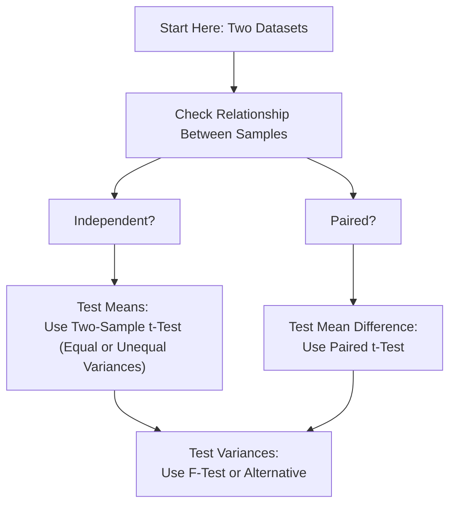

## Overview

Imagine you're an analyst comparing two investment funds. Fund A has a track record in one market environment, and Fund B was tested in another. You might wonder: “Are these two funds really different in terms of returns or risk?” That’s where tests for differences in means and variances step in. In finance, these methods help you decide if two data samples—like returns from two different strategies—truly come from distinct populations. 

But there’s more nuance. Sometimes those two data samples are entirely unrelated (independent), and other times they’re “matched” or “paired.” For instance, you might compare the same fund’s performance before and after a strategic overhaul. In either scenario, we typically rely on tests like two-sample t-tests (for means) and F-tests (for variances). Let’s walk through both the theoretical aspects and practical tips you might want to store in your mental toolbox.

## Independent Samples vs. Paired Samples

### Independent Samples

Independent samples arise when each observation in Sample 1 is unrelated to every observation in Sample 2. For example, you have weekly returns for Fund A over a six-month window, and you have separate weekly returns for Fund B over a different six-month window. Because the funds (and the time frames) are different in nature, we consider these data sets independent.

### Paired Samples

With paired samples, each observation in Sample 1 matches or “pairs” naturally with one in Sample 2. Think of measuring the same portfolio’s returns:
• Before an economic event (Sample 1).  
• After that event (Sample 2).

In a way, each data point from before has a matching “after” observation. You’re really analyzing changes or differences per subject rather than the raw values from two distinct groups.

Sometimes it’s easy to forget that with paired tests, the key variable is the difference between each pair. So if a fund achieved 5% return in January before regulatory changes and 6.5% after those changes, your data point of interest is the 1.5% difference.

## Testing Differences in Means (Independent Samples)

When you have two independent samples and want to test whether their population means are different, the typical approach is a two-sample t-test. 

### Equal Variances: The Pooled-Variance t-Test

If you’re (fairly) confident both samples come from populations with the same variance, use the pooled-variance t-test. In finance, this might be true if we assume two funds are of similar style and volatility. The test statistic often appears as:


t = \frac{(\bar{X}_1 - \bar{X}_2) - ( \mu_1 - \mu_2 )_{H_0}}{s_p \sqrt{\frac{1}{n_1} + \frac{1}{n_2}}}


Here,  
• \\(\bar{X}_1\\) and \\(\bar{X}_2\\) are the sample means,  
• \\((\mu_1 - \mu_2)_{H_0}\\) is typically 0 if you want to test for equality of means,  
• \\(n_1\\) and \\(n_2\\) are sample sizes,  
• \\(s_p\\) is the pooled standard deviation, defined by combining sample variances while weighting by degrees of freedom.  

Anyway, you compute that test statistic and then compare to a t-distribution with \\(n_1 + n_2 - 2\\) degrees of freedom (assuming equal variances and normal distributions).

### Unequal Variances: The Separate-Variance t-Test

But what if you suspect they don’t share the same volatility profile? That’s when you use a separate-variance (or Welch’s) t-test, which modifies the denominator:


t = \frac{(\bar{X}_1 - \bar{X}_2) - ( \mu_1 - \mu_2 )_{H_0}}{\sqrt{\frac{s_1^2}{n_1} + \frac{s_2^2}{n_2}}}.


The degrees of freedom calculation here is more complicated (thanks to the Welch–Satterthwaite formula). This approach is a bit more general as it doesn’t assume equal variances.

### Decision Rules in Practice

The big question is: “Which test do I choose?” Well, it depends on your assumptions:
1. If you’re comfortable with the idea that both populations share the same variance, go for the pooled-variance approach.
2. If you’re uncertain whether they share the same variability, use the separate-variance approach.

On a side note, in real finance practice, we often can’t be 100% sure our data are normal or have matched variances. So a healthy dose of caution or robust methodologies is advisable.

## Testing Differences in Means (Paired Samples)

Paired samples—like the before-and-after returns for the same fund—call for a slightly different approach. You basically create a new dataset of differences:


d_i = X_{i,\text{after}} - X_{i,\text{before}},


where \\(d_i\\) might represent the difference in returns for each time period \\(i\\). Then you check whether the average difference \\(\bar{d}\\) is significantly different from zero (or some hypothesized mean difference). 

The test statistic looks just like a one-sample t-test but applied to the \\(d_i\\) values:


t = \frac{\bar{d} - d_0}{s_d / \sqrt{n}},


where \\(s_d\\) is the sample standard deviation of the differences and \\(d_0\\) is the hypothesized difference (often 0). Usually, we assume the differences \\(d_i\\) come from a normal distribution. 

This method is super handy for analyzing the effect of a new trading strategy introduced to a single fund or scenario-based returns on the same portfolio. If the test says the mean difference is zero, you might deduce that, on average, the new strategy had no effect. If it’s significantly greater than zero, you might brag that your new strategy improved returns.

## Testing for Differences in Variances 

Sometimes, you might ask: “Do two funds have different risk levels?” Risk is often proxied by variance (or volatility). So we compare whether \\(\sigma_1^2 \neq \sigma_2^2\\). A popular parametric test for that is the F-test:


F = \frac{s_1^2}{s_2^2},


where \\(s_1^2\\) and \\(s_2^2\\) are the sample variances. Under the null hypothesis \\(H_0\!: \sigma_1^2 / \sigma_2^2 = 1\\), the ratio follows an F-distribution, provided normal assumptions hold (yep, that’s quite an assumption sometimes). Usually, you’d define your F-test as:

• If \\(F\\) is too large or too small (depending on your alternative hypothesis), you reject \\(H_0\\).  
• Degrees of freedom are \\((n_1 - 1, n_2 - 1)\\).  

In real-world finance, you might not always be confident that two sets of returns are truly normal, so you could consider a nonparametric approach. Some folks turn to alternative tests of scale (like the Levene’s test or Brown–Forsythe test) or rank-based strategies that are less sensitive to outliers. 

Below is a quick flow diagram to remind you of the thought process when deciding which test to use. The grouping is simplified, but it provides a nice visual:



## Practical Usage in Finance

• Underwriting new strategies: Are you sure the new approach yields a higher mean return? Conduct a paired t-test pre- vs. post-implementation.  
• Evaluating portfolio risk: Before merging two portfolios, you might want to check if they have significantly different volatilities (use an F-test).  
• Comparing two funds: If returns appear normal and you suspect equal variances, a pooled-variance t-test might do the trick. But if you see a difference in risk, or can’t assume equal variance, proceed with a separate-variance t-test.  

I remember once, I had to compare a sector-focused fund vs. a broad market ETF. The sector fund had ridiculous variance. So we ended up using the separate-variance approach. Honestly, it was eye opening—there’s no one-size-fits-all solution.

## Example with Python

For those who like code, here’s a quick snippet (using hypothetical data) that demonstrates a two-sample t-test with unequal variances in Python:

```python
import numpy as np
from scipy import stats

strategy_A = np.array([0.003, 0.002, -0.001, 0.004, 0.0025, 0.001])
strategy_B = np.array([0.0025, 0.0011, -0.0005, 0.0035, 0.0032, 0.0008])

t_stat, p_value = stats.ttest_ind(strategy_A, strategy_B, equal_var=False)
print("Welch's t-statistic:", t_stat)
print("p-value:", p_value)
```

And you’ll get a t-statistic plus a p-value. A small p-value (below your chosen significance level) might indicate a significant difference in means.

## Best Practices, Pitfalls, and Strategies

• Always check assumptions: normality, independence, or equal variances if appropriate.  
• Avoid data snooping: if you run repeated tests on the same data, you might inflate your Type I error rate.  
• Consider outliers: extremely volatile financial returns might blow up your standard deviations and distort significance.  
• Nonparametric alternatives: if your data heavily violate normality assumptions, consider the Mann–Whitney test (for independent means) or Wilcoxon signed-rank test (for paired means).  

## References and Further Reading

- Lehmann, E. & Romano, J. (2005). “Testing Statistical Hypotheses.” 3rd Ed., Springer.  
- CFA Program Curriculum (Level I), “Statistical Concepts and Market Returns.”  
- Anderson, D.R., Sweeney, D.J., & Williams, T.A. (2014). “Statistics for Business and Economics.”  
- For advanced reading on distribution-free approaches, Nonparametric Statistical Methods by Hollander, Wolfe, & Chicken is insightful.

Keep practicing these tests in real or simulated data scenarios—because, trust me, you’ll often end up confronting them in portfolio analytics and fund comparisons.

## Tests for Differences in Means and Variances Quiz



### Which of the following statements best describes paired samples?

- [ ] They come from unrelated sets of observations where Fund A and Fund B operate in different time frames.
- [ ] They assume both samples have the same variance.
- [x] They involve naturally matched or repeated observations, such as before-and-after measurements.
- [ ] They never require a t-distribution.

> **Explanation:** Paired samples come in matched pairs (e.g., before and after a strategy change for the same fund).  

### Which test is used to compare two sample variances under the assumption of normally distributed populations?

- [x] The F-test
- [ ] The paired t-test
- [ ] The Mann–Whitney test
- [ ] The Kruskal–Wallis test

> **Explanation:** The F-test is used to compare two sample variances from normal populations.  

### If two samples are independent but we suspect unequal population variances, which test is most appropriate?

- [x] Welch’s (separate-variance) two-sample t-test
- [ ] Pooled-variance t-test
- [ ] Paired t-test
- [ ] Wilcoxon signed-rank test

> **Explanation:** Welch’s t-test is specifically designed for independent samples where variances are not assumed equal.  

### What is the main difference in procedure between a paired t-test and a two-sample t-test?

- [ ] Paired t-test compares group medians.
- [x] Paired t-test uses differences within individual pairs; two-sample t-test uses each sample’s raw observations separately.
- [ ] Two-sample t-test always assumes equal variance.
- [ ] Paired t-test requires a z-distribution.

> **Explanation:** In a paired t-test, the main focus is on the difference between matched observations. In a two-sample test, each group is analyzed independently.  

### In the pooled-variance t-test, what assumption is made about the two populations?

- [ ] They have equal means.
- [x] They have equal variances.
- [ ] Both sets of observations are paired.
- [ ] They have different sample sizes.

> **Explanation:** The fundamental assumption for a pooled-variance t-test is that the two populations share the same variance.  

### Which of the following situations would most likely require a paired t-test rather than an independent-samples t-test?

- [ ] Comparing daily returns of two unrelated equity funds.
- [x] Measuring return data for the same strategy before and after a macroeconomic event.
- [ ] Evaluating variance differences between two stock portfolios.
- [ ] Assessing correlation between two securities.

> **Explanation:** A paired t-test is used for repeated measurements on the same fund or subject.  

### A fund manager wants to see if the variance of Fund A is different from that of Fund B. The best initial parametric approach is:

- [x] An F-test on the ratio of the two sample variances.
- [ ] The pooled-variance t-test.
- [ ] The Mann–Whitney U-test.
- [ ] The Wilcoxon signed-rank test.

> **Explanation:** The F-test compares two variances under normality assumptions.  

### Which nonparametric test can be used to compare medians in two independent samples when normal distribution assumptions are questionable?

- [ ] Paired t-test
- [x] Mann–Whitney U-test
- [ ] F-test
- [ ] Kruskal–Wallis test (used for more than two samples)

> **Explanation:** The Mann–Whitney U-test compares two independent samples without assuming normal distribution.  

### A researcher applies a separate-variance t-test and obtains a very large p-value. Which conclusion is most justified?

- [x] There is insufficient evidence to conclude that the two population means differ.
- [ ] The two population means are definitely different.
- [ ] The data must violate normality assumptions.
- [ ] Both samples come from exactly the same distribution in all aspects.

> **Explanation:** A large p-value generally indicates that the difference is not statistically significant under the chosen level.  

### Under the null hypothesis in an F-test comparing two variances, the ratio of the variances is assumed to be:

- [x] 1
- [ ] -1
- [ ] 0
- [ ] Indeterminate

> **Explanation:** The F-test null hypothesis states \\(\sigma_1^2 = \sigma_2^2\\), implying the ratio is 1.  


