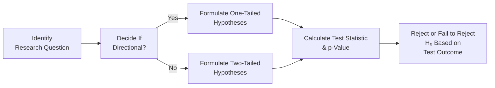

## Introduction and Context

In investment analysis and research, understanding when (and why) to use a one‑tailed test versus a two‑tailed test can be surprisingly crucial. You might be testing whether an investment strategy beats the market (i.e., generates alpha greater than zero), or you could be examining whether a new risk model significantly changes volatility in either direction. The correct choice of test affects not just the interpretation of results but also your professional credibility when communicating statistical findings to clients, colleagues, or examiners.

In Section 8.1, we introduced hypothesis formulation, and in Section 8.3, we covered parametric test procedures like z‑tests and t‑tests. Now, in this section, we focus on the directional aspect of hypothesis testing—whether we’re searching for evidence of a difference specifically on the upside (or downside) only, or whether we’re looking for any difference at all. You’ll notice that the choice here is both a matter of conceptual framing (i.e., do we only want to detect an improvement in returns?) and a statistical implication (i.e., how we split our significance level between one or two ends of a distribution). Let’s explore both.

## One‑Tailed Tests: A Direction‑Specific Perspective

A one‑tailed test confines the test’s rejection region to one tail of the probability distribution. This approach is used when your null and alternative hypotheses explicitly focus on a direction, like “greater than” or “less than.” For instance, if you hypothesize that a fund’s alpha is strictly greater than 0, your null hypothesis might be H₀: α ≤ 0, while the alternative is H₁: α > 0. 

Why might we do this in practice? Imagine you’re interested only in showing that your strategy outperforms its benchmark. You don’t particularly care if the strategy drastically underperforms; your main question is, “Is alpha > 0?” If your test statistic is large enough to land you in the upper rejection region, you’ll formally reject H₀ in favor of H₁. 

However, there’s a known risk: if you only set up your test to detect positive outperformance, you might fail to notice if your strategy suffers significant underperformance (which would appear in the negative tail). 

### Practical Application: Testing Fund Alpha

Let’s say you run a hedge fund and want to test if your alpha (α) is greater than zero. Using daily returns over several years, you compute average excess returns relative to a benchmark. If your t‑statistic is sufficiently large in the positive direction—beyond the critical t-value at your chosen significance level—you reject H₀: α ≤ 0. 

But if results are borderline or negative, you simply fail to reject H₀. You don’t investigate the other tail under this approach, because your original question is strictly about outperformance, not underperformance. This is perfectly valid if your economic rationale is that the strategy has to do better than the benchmark to be viable. Conversely, it could be a big oversight if you’re ignoring the possibility of large drawdowns or negative alpha that also matter for risk management. 

## Two‑Tailed Tests: Checking Both Directions

A two‑tailed test, on the other hand, splits the rejection region into both tails. The typical null hypothesis is H₀: μ = μ₀ (or H₀: μ − μ₀ = 0), and the alternative is H₁: μ ≠ μ₀. This means we care about whether the parameter is meaningfully different from μ₀, either positively or negatively. 

This approach is the more general one, often favored by researchers or analysts who do not have a strong directional view. If you suspect that a new portfolio construction method might improve performance or might do the opposite, a two‑tailed test helps detect both improvements and deteriorations.

### Common Case:Testing Sharpe Ratio Differences

Suppose you want to see whether a newly devised portfolio rebalancing strategy changes the Sharpe ratio compared to your old method. You’re open‑minded—it could be better, or it could be worse. So you set:

• H₀: (Sharpe Ratio)New − (Sharpe Ratio)Old = 0  
• H₁: (Sharpe Ratio)New − (Sharpe Ratio)Old ≠ 0  

You collect a sample of returns pre- and post-implementation. If the difference in sample means is large enough in either direction to pass the critical threshold of your chosen significance level, you’ll reject H₀ in favor of H₁. That indicates you have statistical evidence of a difference, not necessarily an improvement or deterioration (that requires a sign check and further analysis).

## Comparing One‑Tailed and Two‑Tailed Tests

It’s easy to get stuck deciding whether you need a one‑tailed or a two‑tailed test, but keep these guidelines in mind:

• If your research question is thoroughly directional—e.g., “Is the average alpha strictly above 1%?”—go with a one‑tailed test.  
• If you’re uncertain which direction the effect might go—e.g., “Is the average alpha simply different from 1%?”—a two‑tailed test is safer.  
• Two‑tailed tests protect you from missing large movements in the opposite direction.  
• One‑tailed tests, if incorrectly applied, can lead to overlooking significant signals that appear on the wrong side of your hypothesized direction.

Below is a quick comparison table:

| Aspect                 | One‑Tailed Test                 | Two‑Tailed Test                       |
|------------------------|---------------------------------|---------------------------------------|
| Alternative Hypothesis | H₁: μ > μ₀   or   H₁: μ < μ₀   | H₁: μ ≠ μ₀                            |
| Directional            | Yes, a single direction         | No, both directions matter            |
| Rejection Region       | Entirely in one tail            | Split across two tails                |
| Risk of Missing        | Potential movement on other side| Only missing extremely small effects  |
| Typical Use            | Strict performance threshold    | General difference detection          |

## Decision Flowchart

Sometimes, it helps to visualize your testing process. The following diagram highlights a simplified path from research question to the test decision.



In this flowchart, if your question is strictly about a positive or negative direction, you pick a one‑tailed test (C). If you’re open to effects in both directions, you use a two‑tailed test (D). In either case, the next steps—calculating the test statistic and p‑value—remain essentially the same.

## Quick Python Example

Just so you see how this might look in code, here’s a quick Python snippet that shows how to perform a one‑tailed t-test. Suppose you want to test whether the mean daily return of an asset is greater than 0.

```python
import numpy as np
from scipy.stats import ttest_1samp

daily_returns = np.array([0.0012, 0.0005, -0.0003, 0.0021, 0.0018, 0.0011, -0.0002])

# Alternative Hypothesis H₁: Mean return > 0

t_stat, p_val_two_tailed = ttest_1samp(daily_returns, 0)

if t_stat > 0:
    p_val_one_tailed = p_val_two_tailed / 2
else:
    p_val_one_tailed = 1 - (p_val_two_tailed / 2)

print("t-statistic:", t_stat)
print("One-tailed p-value:", p_val_one_tailed)

```

In a two‑tailed test, you’d just keep the original p_val_two_tailed. That’s your measure of whether the mean daily return is different from 0 in either direction.

## Best Practices and Potential Pitfalls

• Double‑Check the Direction: Do you strongly expect a single direction? If not, you could fail to detect the “wrong side” effect.  
• Overeager Claims: One‑tailed tests might tempt you to claim significance at a lower threshold. If your t‑stat barely scrapes by that threshold, you risk overstating your results.  
• Setting Significance Levels: In a one‑tailed test at 5% significance, the entire 5% area is in one tail—making it “easier” to reject H₀ in that direction. In a two‑tailed test, you get 2.5% in each tail.  
• Validating the Model: Refer back to Section 8.2 for the ramifications of Type I (false reject) and Type II (false fail to reject) errors. Typically, a one‑tailed test has a higher chance of missing critical signals in the untested tail unless your theory strongly rules out that tail.  
• Real-World Implications: For major investment decisions, especially if there's large capital at stake, an incorrectly specified test (particularly a one‑tailed test) might be quite costly if the truly significant effect lies in the “wrong” direction.

## Linking to Other Topics

Remember that your choice of one‑tailed or two‑tailed test can interact with other aspects of hypothesis testing:

• Section 8.2 on Type I and Type II errors: Understand how these errors shift if we only test one tail.  
• Section 8.4 on Nonparametric Alternatives: One‑tailed vs. two‑tailed decisions arise for nonparametric tests, too (e.g., Wilcoxon rank-sum).  
• Section 9.1 (Tests of Correlation Coefficient): The concept of directionality also appears when testing if a correlation is positive, negative, or simply nonzero.  

## Conclusion and Final Exam Tips

When you’re tasked with hypothesis testing on the CFA exam (or in your real-world investment research), carefully define your research question. If you must detect only one specific direction—like “Is the fund’s alpha positively greater than some benchmark?”—a one‑tailed test might be justified. If you care about deviations in both directions, a two‑tailed test is definitely the way to go.

In practice, be cautious. Many professional analysts use two‑tailed tests by default to avoid missing out on unexpected downside developments, especially in high-stakes investment settings. On the exam, watch out for question wording. Does it explicitly state that you only care about improvement, or does it say something like “materially different”? The phrasing can guide your tail choice. 

Finally, don’t fall into the trap of picking a one‑tailed test solely because you want a lower p-value. Examiners often detect that rationale and can penalize you for improperly formulated hypotheses. Instead, ground your decision in strong economic rationale, or simply follow best practice by employing a two‑tailed test unless you have a well‑justified reason to do otherwise.

## References

• Rumsey, D. (2016). “Statistics for Dummies.” John Wiley & Sons.  
• Griffiths, W. (2012). “Basic Econometrics.”  
• CFA Institute, “Quantitative Methods” curriculum readings.  

---------------------------------------------------------------------------------------------------

## Test Your Knowledge: One-Tailed vs. Two‑Tailed Hypothesis Testing



### A portfolio manager wants to demonstrate that her new strategy’s alpha is strictly higher than zero. Which type of test should she use?

- [ ] Two‑tailed test with H₀: α = 0
- [x] One‑tailed test with H₀: α ≤ 0 and H₁: α > 0
- [ ] Two‑tailed test with H₀: α = 0 and H₁: α ≠ 0
- [ ] Multiple regression test with H₀: α = 0

> **Explanation:** The manager cares only about alpha being higher than zero (a single direction). Hence, a one‑tailed test is most appropriate.

### In a one‑tailed test with a 5% significance level, which statement is correct?

- [ ] 5% is divided into two tails, 2.5% each.
- [x] The rejection region for the null hypothesis is all 5% in one tail.
- [ ] The alternative hypothesis must be two‑sided.
- [ ] The test inherently has a higher Type I error rate than a two‑tailed test.

> **Explanation:** In a one‑tailed test at 5% significance, the entire 5% is allocated to one tail. This does not automatically imply a different Type I error rate—it’s still 5%, but concentrated on one side.

### A researcher unsure if a new portfolio construction method increases or decreases average returns should do which of the following?

- [ ] One‑tailed test for H₀: μ ≤ 0
- [x] Two‑tailed test for H₀: μ = μ₀
- [ ] One‑tailed test for H₀: μ ≥ μ₀
- [ ] None of the above

> **Explanation:** When uncertain about the direction of the difference, a two‑tailed test is appropriate, capturing deviation in both directions.

### Which statement best describes the “risk” of using a one‑tailed test incorrectly?

- [ ] It may lead to a higher chance of rejecting H₀ on the correct side.
- [ ] It is impossible to miss negative deviations if the test is designed for positive deviations.
- [ ] One‑tailed tests are never used in professional research.
- [x] It can overlook significant deviations in the opposite direction of the hypothesized effect.

> **Explanation:** The biggest danger is ignoring large, significant shifts in the untested direction.

### If you have a strong thesis that a fund’s alpha is less than zero, how would you set up the one‑tailed test?

- [ ] H₀: α ≥ 0 and H₁: α < 0
- [x] H₀: α ≥ 0; H₁: α < 0
- [ ] H₀: α = 0; H₁: α ≠ 0
- [ ] H₀: α ≤ 0; H₁: α < 0

> **Explanation:** For a negative direction, you hypothesize H₀: α ≥ 0 and the alternative H₁: α < 0, focusing on whether alpha is below zero.

### In a two‑tailed test, the rejection region at a 5% significance level is typically:

- [x] 2.5% in each tail.
- [ ] 5% in each tail.
- [ ] 10% in each tail.
- [ ] Split 3% in the upper tail and 2% in the lower tail.

> **Explanation:** With a two‑tailed test at a 5% significance, the usual approach is to place 2.5% in each tail.

### What is the main reason an analyst might default to using a two‑tailed test?

- [ ] It requires less data.
- [ ] It reduces Type I errors.
- [ ] It always yields a smaller p-value.
- [x] It covers both directions, reducing the risk of missing an effect where direction is uncertain.

> **Explanation:** A two‑tailed test is often considered safer because it checks both upside and downside.

### In the context of performance evaluation, which practical scenario typically calls for a one‑tailed test?

- [ ] Comparing Sharpe ratios for two unknown strategies.
- [ ] Testing if a stock’s return is significantly different from its historical mean.
- [x] Verifying that an active portfolio’s alpha is above a certain benchmark.
- [ ] Determining if a strategy is either undervalued or overvalued.

> **Explanation:** When specifically evaluating whether alpha is above a particular benchmark threshold, it’s a directional question.

### Suppose you incorrectly formulated a test that should have been two‑tailed as one‑tailed. Which outcome is possible?

- [x] You might fail to detect a significant effect in the untested direction.
- [ ] You automatically reduce the probability of a Type I error.
- [ ] You'll detect negative effects more easily than positive ones.
- [ ] It has no impact on analysis if the effect truly is positive.

> **Explanation:** By using a one‑tailed test, you might place all your rejection area on one side and miss equally important negative deviations on the other side.

### True or False: In a two‑tailed test with significance 5%, the p‑value is based on both tails of the distribution.

- [x] True
- [ ] False

> **Explanation:** Yes. For a two‑tailed test, we gather evidence from both ends of the distribution, so the resulting p-value accounts for both directions.


