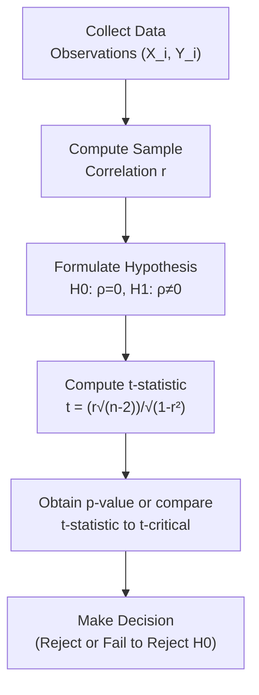

## Introduction

Well, let’s dive right in and talk about testing the population correlation coefficient—perhaps one of the most common challenges in quantitative finance. Sometimes, people get worried about whether two assets (or any two variables, really) have a relationship in the big, wide population beyond just the data we see in front of us. Do they move together or not? This can be an especially big deal in portfolio management when you’re deciding which assets to mix for diversification. In plain English: if two assets are highly correlated, they tend to move in the same direction; if they’re negatively correlated, one tends to go up when the other goes down. If there’s basically zero correlation, their returns dance to different tunes. 

But how do we know if the sample correlation we observe is the “real thing” or just a random fluke? That’s where hypothesis testing on the population correlation coefficient, usually denoted ρ (the Greek letter rho), enters the scene.

## Rationale for Testing Correlation

We often test whether ρ is equal to zero (i.e., no linear relationship in the population). A simple example might be if you observe a sample correlation of, say, 0.30 between monthly returns on a tech stock index and monthly returns on a utilities stock index. That 0.30 suggests a moderate positive association, but it could be just noise if your sample includes a particularly unusual time period. You might want to see if there’s enough evidence to reject the notion of “no correlation at all” in the entire market environment.

In finance, verifying whether two return streams truly move in tandem helps with risk management, portfolio construction, and countless modeling decisions. If the correlation is real, the potential portfolio-level volatility could be higher (in case of a positive correlation) or lower (in case of a negative correlation) than expected. If it’s not real, you might be overestimating (or underestimating) the benefits of diversification.

## The Pearson Product-Moment Correlation

The typical parametric test is based on Pearson’s product-moment correlation (often just called Pearson’s correlation). This measure is well-known, but let me quickly restate its formula for clarity:

(1)  
r = 
( Σ (Xᵢ − X̄)(Yᵢ − Ŷ) )  
/  
( √( Σ (Xᵢ − X̄)² ) √( Σ (Yᵢ − Ŷ)² ) ),  

where X̄ is the sample mean of the X variable, and Ŷ is the sample mean of the Y variable. The result, r, is our sample correlation coefficient, nestled between −1 and +1.  

We use r as an estimator of ρ, the population correlation. When r is close to +1 or −1, that implies a strong (positive or negative) linear relationship between the two variables. A value near zero suggests little or no linear relationship. But, as we all know, one outlier can wreak havoc on correlation values, so watch out for that.

## Key Assumptions

Before you can throw a test statistic on the table, parametric correlation testing generally assumes:

• Approximate normality in both variables.  
• A linear relationship.  
• Independence of the observations.  

If any of these assumptions are severely violated—like if the data are heavily skewed, or the relationship is obviously nonlinear—then this test could produce misleading results. (By the way, you might want to check out rank-based methods, discussed in Section 9.3, for data that fail these assumptions.)

I remember once during an internship, I had to analyze returns for an emerging markets bond fund and a large-cap equity fund. The returns looked suspiciously “lumpy,” so I used a normality check. Turned out the bond fund returns had these big jumps, messing up the normality assumption. So we ended up using a nonparametric approach. Moral of the story: testing assumptions might save you from drawing unlucky conclusions.

## Hypothesis Setup

Student researchers typically begin with the null hypothesis (H₀) stating that the population correlation is zero:

• H₀: ρ = 0  
• H₁: ρ ≠ 0  

A two-tailed approach is pretty standard, meaning you’re testing if ρ could be significantly different from zero, in either the positive or negative direction. Of course, if you have reason to believe that the correlation is likely to be positive (for instance, with two broad equity indices from highly related markets), you could do a one-tailed test. But in practice, the two-tailed test is more common for general analysis.

## The Test Statistic

Under the null hypothesis, if the sample correlation r truly arose from a population with ρ = 0, the following statistic—often referred to as a “t-test”—approximately follows a t distribution with (n − 2) degrees of freedom:


 t = \frac{r \, \sqrt{n - 2}}{\sqrt{1 - r^2}}.


Here,  
• n is the number of pairs of observations, and  
• r is your sample correlation coefficient.

In finance, n is often the number of months or quarters you used in your analysis. Suppose you’ve got 60 monthly return observations for two assets. Then n = 60, so your degrees of freedom is 58. If your computed t-value is “too large” in magnitude, you reject H₀ at your chosen significance level (e.g., 5%). 

### Steps in the Process

It might be helpful to visualize the process. Below is a Mermaid flowchart illustrating typical steps for testing the population correlation coefficient:

## A Brief Numerical Example

Let’s say you have 10 weeks of daily returns on two different stocks—Stock A and Stock B—and you condensed them into weekly returns. Now you have 10 data points (n = 10). You compute the sample correlation coefficient, r = 0.62. You want to test H₀: ρ = 0 against H₁: ρ ≠ 0 at the 5% level.

1. Compute the test statistic:

   t = r × √(n − 2) / √(1 − r²)  
   = 0.62 × √(10 − 2) / √(1 − 0.62²)  
   = 0.62 × √8 / √(1 − 0.3844)  
   = 0.62 × 2.828 / √(0.6156)  
   = 1.752 / 0.7846 ≈ 2.23  

2. Determine the critical t-value or find the p-value. For a two-tailed test with n − 2 = 8 degrees of freedom and a 5% significance level, the critical t-value is around ±2.306. Our computed t = 2.23 is not quite as large as +2.306. So, we fail to reject H₀ (though it’s borderline). The p-value in this scenario is roughly 0.057, slightly greater than 0.05.  

3. Conclusion. We narrowly fail to reject the null at the 5% significance threshold, implying that the evidence is not quite strong enough to claim a statistically significant correlation. We might, however, consider a 10% significance threshold or examine more data to see if that correlation pattern holds.

## Testing ρ Against Values Other than Zero

Sometimes you want to test whether ρ is equal to some nonzero value, say 0.30. Perhaps your risk model or some theory suggests a correlation must be at least 0.30 to matter for hedging. In that scenario, you might use a Fisher z-transformation approach. That technique can accommodate a hypothetical ρ ≠ 0. But it’s a bit more specialized and often not the first test you perform. If you’re curious, advanced statistics references (like Newbold, Carlson, and Thorne) show the procedure for that test.

## Practical Tips and Pitfalls

• Scatter plots first. I know it sounds basic, but I can’t stress this enough—plotting a scatter chart is a lifesaver. You’d be amazed how often you see a curved relationship or random clusters that violate linearity.  
• Check for outliers. A single rogue point can drastically inflate or deflate the correlation coefficient.  
• Consider transformations. If the variables are returns and you suspect non-normality, maybe transform them to log returns to achieve something closer to normal.  
• Avoid data snooping. If you “cherry-pick” data ranges, correlation might look artificially strong or weak. Keep your sample selection unbiased.  
• Remember sample size. With small samples, the t distribution is “heavy-tailed,” so your computed t might not be as stable.  

When you’re dealing with real portfolios—especially big ones—sometimes you might do multiple correlation tests (e.g., checking correlations among many pairs of asset classes). But be careful: the more tests you run, the more likely you are to get spurious significant findings. Adjust your significance levels or use advanced multiple-comparison techniques if necessary.

## Applications for Investment Analysis

You’ll recall from Chapter 5 (Portfolio Mathematics) that correlation plays a massive role in calculating portfolio variance, the efficient frontier, and many diversification strategies. Testing for a true correlation, rather than relying on a potentially random sample correlation, can help you avoid illusions of diversification. 

For instance, if you discover that the correlation between two assets is not statistically different from zero, you’ll be more confident about combining them to dampen overall portfolio volatility—or at least you’ll be less concerned about them moving in sync. On the flip side, if a strong correlation does exist, your portfolio might be more at risk during volatile market periods. 

## A Tiny Personal Reflection

I can’t help but recall a project where I was analyzing the correlation between an automotive manufacturer index and an energy sector index. My gut told me they should be uncorrelated, especially in the short run, because the fundamentals differ a lot. But the data from a 6-month window showed a sample correlation of 0.40, which was surprising. I ran the standard correlation test, only to realize near the end that a few outlier weeks—when energy prices skyrocketed—had distorted that correlation. Once I accounted for those outliers, the correlation basically vanished. Sometimes a little test statistic can save you big headaches.

## Larger Perspectives: When Corset-Like Assumptions Don’t Fit

If normality or linearity assumptions don’t hold, or if your data sets are quite small or very heavily skewed, you might want to jump to Section 9.3 of this chapter, which covers rank correlation tests like Spearman’s or Kendall’s tau. Those approaches don’t require normal distributions or strictly linear relationships. Additionally, robust correlation methods exist that reduce sensitivity to outliers. 

## Reference Materials

Feel free to check out the following resources for a beefier exploration of correlation tests:

• DeFusco, R. A., McLeavey, D. W., Pinto, J. E., & Runkle, D. E. (CFA Institute). “Probability Concepts” and standard “Correlation Tests” found in quantitative methods references.  
• Newbold, Carlson, and Thorne’s “Statistics for Business and Economics” for deeper theoretical coverage and the Fisher z-transformation.  
• The “CFA Program Curriculum, Level I: Quantitative Methods” for specific finance-oriented examples of correlation testing across different instruments.

## Exam Tips and Key Takeaways

• Always articulate your null and alternative hypotheses clearly.  
• Remember: t = (r√(n−2))/√(1−r²).  
• Use two-tailed or one-tailed tests as appropriate, typically with a significance level of 5%.  
• Watch out for data assumptions—linearity, normality, and independence must hold.  
• Graphical analysis is your friend: it may reveal nonlinearity or outliers.  
• Keep an eye on sample size.  
• In an exam scenario, highlight the degrees of freedom and compare your computed test statistic to the critical value from a t table (or use a p-value approach).  

If your correlation is statistically significant, it’s likely to persist—at least in similar market regimes. If not, you may need more data or a different measure of association.  

Happy correlating!

--------------------------------------------------------------------------------

## Test Your Knowledge: Correlation and Parametric Tests of Independence



### A researcher wants to test the hypothesis that the population correlation between two variables is zero. Which of the following best represents the null hypothesis?

- [ ] H₀: ρ > 0
- [ ] H₀: ρ < 0
- [x] H₀: ρ = 0
- [ ] H₀: ρ ≠ 0

> **Explanation:** The standard null hypothesis for testing no linear relationship is that the population correlation equals zero.

### In the test statistic t = (r√(n – 2)) / √(1 – r²), which distribution does t approximately follow under the null hypothesis?

- [ ] Normal distribution with mean 0 and variance 1
- [ ] F distribution with (n−2) and (n−2) degrees of freedom
- [ ] Chi-square distribution with (n−2) degrees of freedom
- [x] t distribution with (n−2) degrees of freedom

> **Explanation:** Under H₀: ρ = 0, the test statistic follows a t distribution with (n – 2) degrees of freedom, assuming the usual conditions hold.

### A sample of 20 observations yields a correlation coefficient of 0.50. The computed t-statistic is 2.58. At a 5% significance level for a two-tailed test, the critical t-value (df = 18) is approximately 2.101. Which of the following is the most appropriate conclusion?

- [x] Reject H₀ because 2.58 exceeds 2.101
- [ ] Fail to reject H₀ because 2.58 is slightly above 2.101
- [ ] Reject H₀ because 2.101 is always the threshold
- [ ] Fail to reject H₀ because the correlation is not large enough

> **Explanation:** Since the computed |t| (2.58) is greater than the critical |t| (2.101), we reject the null hypothesis of no correlation.

### If the correlation coefficient for a sample is 0.85 based on 10 observations, which situation is most likely to concern the analyst when interpreting the result?

- [ ] The possibility of linear data patters
- [ ] The possibility of high sample size
- [x] The possibility that an outlier might have inflated the correlation
- [ ] The possibility that the test is robust to outliers

> **Explanation:** A single extreme point can significantly raise or lower the sample correlation. Analysts often investigate outliers carefully, especially with small samples.

### Which of the following is a common assumption when conducting Pearson’s correlation test?

- [ ] The variables must be skewed
- [x] The variables are approximately normally distributed
- [ ] The number of observations is less than 5
- [ ] The slope of each regression line must be zero

> **Explanation:** Pearson’s correlation test assumes that both variables are (approximately) normally distributed when using the t distribution approach.

### When a researcher computes a correlation of 0.75 between daily returns of two different stocks, the next immediate step for hypothesis testing should be:

- [ ] Automatically concluding that the correlation is significant
- [x] Calculating the appropriate t statistic and comparing with t-critical or p-value
- [ ] Using a Chi-square test for independence
- [ ] Applying a rank correlation test

> **Explanation:** After finding r, you compute the test statistic and compare it against the appropriate distribution (t-distribution), rather than automatically concluding significance.

### You are testing the correlation between monthly returns on a U.S. equity index and monthly returns on a European equity index over the last five years. You think the correlation should be positive. However, you still choose a two-tailed test for significance. Which of the following is the best reason why?

- [x] A two-tailed test is more general and can detect both positive and negative significant relationships
- [ ] It is required by all correlation tests
- [ ] The sample size is likely too large for a one-tailed test
- [ ] Regulators do not allow one-tailed tests

> **Explanation:** A two-tailed test is the standard approach when you are not 100% certain of the direction or if you want to allow for the possibility of a negative correlation.

### If the sample size is very small and you suspect non-normality in both variables, which approach might be more appropriate than Pearson’s correlation?

- [ ] Larger sample correlation test
- [ ] Chi-square independence test
- [ ] Confidence interval using z distribution
- [x] A rank correlation method (e.g., Spearman’s rho)

> **Explanation:** Spearman’s rank correlation does not require normality or strictly linear relationships, making it more suitable for small or non-normal samples.

### The decision rule for rejecting H₀: ρ = 0 at the 5% significance level in a two-tailed test often states:

- [ ] Reject H₀ if the absolute value of the test statistic is less than the critical value
- [ ] Only reject H₀ if the observed correlation is negative
- [ ] Always reject H₀ if n−2 ≤ 30
- [x] Reject H₀ if |t| > t-critical at α = 5%

> **Explanation:** The standard rule is to reject the null hypothesis if the absolute value of the computed t statistic exceeds the critical value from the t table at the chosen significance level.

### True or False: If the sample correlation is statistically significant, it guarantees that the two variables have a perfect linear relationship in the population.

- [x] False
- [ ] True

> **Explanation:** Statistically significant does not imply a perfect linear relationship; it only suggests that the population correlation is likely different from zero (or the tested value). There can still be variability in the degree of that relationship.


