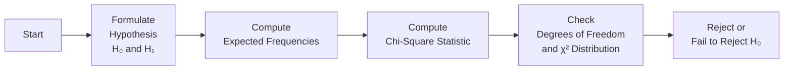

## Introduction
I remember the first time I realized how powerful a simple contingency table could be. I was scanning through some market data—listings of bond ratings and whether each issuance came from a corporate issuer or a municipality. I had this sinking suspicion (well, maybe more like a curious itch) that the ratings might be related to whether the issuer was in one category or another. A friend casually asked, “Have you tried a chi-square test for independence?” and I just stood there, feeling both surprised and a bit sheepish that I hadn’t. That moment revealed how these apparently humble tables, combined with a straightforward statistical procedure, can become a powerful tool for investment analysis.

This section explores the chi-square test of independence—one of the most widely used non-parametric methods for determining whether two categorical variables are associated. We will discuss its theoretical underpinnings, walk step by step through how to compute and interpret the chi-square statistic, and delve into its practical uses in investment contexts. By the end, you’ll be able to confidently interpret cross-tabulated data in your finance work, whether you’re analyzing rating migrations, sector allocations versus default rates, or any number of important decisions that hinge on categorical data.

## Underpinnings of the Chi-Square Test of Independence
Before we get into the nitty-gritty, let’s clarify a couple of key points:
- We’re dealing with categorical variables. These are variables that put each observation into discrete “bins,” such as industry sector, credit rating, or risk classification (like “high,” “medium,” or “low”).  
- The test is all about independence. Specifically, we’re checking whether the occurrence of one category is tied in any systematic way to another category.

### Why We Use the Chi-Square Test
The chi-square test (χ²) for independence lets us see whether an observed frequency distribution differs significantly from an expected distribution that would hold if each pair of categories were completely unrelated. For instance, if we have a table showing the number of technology versus non-technology companies (rows) that received upgrades or downgrades (columns), the chi-square test can tell us if the difference in frequencies for each cell is just random or if “being a tech stock” is somehow linked to “the probability of an upgrade.”

The test statistic follows a chi-square distribution under the null hypothesis (H₀) of independence. If that test statistic is large enough (relative to degrees of freedom and a chosen significance level), we reject H₀ and conclude that an association exists.

## Hypothesis Setup
Statistical hypothesis testing always begins with two competing hypotheses:
- H₀ (Null Hypothesis): The row and column variables are independent; we assume no relationship between the categories.  
- H₁ (Alternative Hypothesis): The row and column variables are not independent; there is some association between row and column categories.

If our tests indicate that the data deviate significantly from the no-relationship assumption, we’ll reject H₀ and presumably accept that H₁ has some merit.

## Anatomy of a Contingency Table
A contingency table—sometimes called a cross-tabulation or “cross-tab”—collects frequency counts of observations falling into each combination of row and column categories. For example, in a 2×2 table, the rows might represent “Downgrade” or “Upgrade,” while the columns might represent “Corporate Bond” or “Municipal Bond.” The counts inside each cell reflect how many observations belong in both categories (e.g., out of 100 total observations, 25 might be “Downgrades of Corporate Bonds”).

### Example Layout
Let’s take a conceptual look at a 3×2 table:

         | Category A  | Category B  | Category C |  Row Totals
------------------------------------------------------------
Group 1  |     O₍1,1₎   |     O₍1,2₎   |    O₍1,3₎   |   ...
Group 2  |     O₍2,1₎   |     O₍2,2₎   |    O₍2,3₎   |   ...
------------------------------------------------------------
Column Totals  ...         ...           ...

Where Oᵢⱼ is the observed count in row i and column j.

## Calculation Steps
The chi-square test can be boiled down to three main steps:

### Step 1: Compute Expected Frequencies
Under the null hypothesis that the two variables are completely independent, the probability of falling into a certain row should have no effect on the probability of falling into a certain column. The expected frequency Eᵢⱼ (i.e., the number of observations we’d “expect” in cell (i, j) if H₀ were true) is:


  E_{ij} = \frac{(\text{Row}_i \ \text{total}) \times (\text{Column}_j \ \text{total})}{\text{Grand Total}}


### Step 2: Compute the Chi-Square Statistic
Once the expected frequencies Eᵢⱼ are computed, we compare them to the actual observed frequencies Oᵢⱼ. The chi-square statistic is:


  \chi^2 = \sum_{\text{all cells } i,j} \frac{(O_{ij} - E_{ij})^2}{E_{ij}}


The summation extends over all cells in the table.

### Step 3: Determine the Degrees of Freedom and Compare
The degrees of freedom (df) for a chi-square test of independence with r rows and c columns is:


  \text{df} = (r - 1) \times (c - 1)


Once you have the computed chi-square statistic and know the degrees of freedom, compare the statistic to a chi-square distribution with those df. If your computed chi-square is larger than the critical chi-square value for your chosen significance level (often α = 0.05), you reject H₀. Alternatively, if p-value < α, that also supports rejecting the null.

Below is a visual flowchart of these steps:



## Interpreting the Results
- If you fail to reject H₀: The data do not provide sufficient evidence that the row and column variables are related.  
- If you reject H₀: The data do suggest there is an association. Keep in mind this does not guarantee causality—only that the variables’ frequencies are not independent.

## Practical Financial Example: Rating Upgrades and Sectors
Let’s consider a scenario from the real world—something akin to the one that sparked my own aha moment.

### Hypothetical Data
Suppose you have the following cross-tab of credit upgrades (“Upgrade”) or downgrades (“Downgrade”) for companies in either the Technology (“Tech”) or Non-Technology (“Non-Tech”) sector over the last quarter:

|                   | Tech  | Non-Tech | Row Total |
|-------------------|-------|----------|-----------|
| Upgrade           | 20    | 10       | 30        |
| Downgrade         | 15    | 25       | 40        |
| **Column Total**  | 35    | 35       | 70        |

We want to know if the frequency of upgrades versus downgrades is independent of whether a company is Tech or Non-Tech.

1. Compute expected frequencies.   
   - E₍Upgrade,Tech₎ = (Row total × Column total) / Grand total  
     = (30 × 35) / 70 = 15  
   - E₍Upgrade,Non-Tech₎ = (30 × 35) / 70 = 15  
   - E₍Downgrade,Tech₎ = (40 × 35) / 70 = 20  
   - E₍Downgrade,Non-Tech₎ = (40 × 35) / 70 = 20  

2. Compute χ².  
   - For Upgrade, Tech: (O-E)²/E = (20-15)²/15 = 25/15 = 1.67  
   - For Upgrade, Non-Tech: (10-15)²/15 = 25/15 = 1.67  
   - For Downgrade, Tech: (15-20)²/20 = 25/20 = 1.25  
   - For Downgrade, Non-Tech: (25-20)²/20 = 25/20 = 1.25  

   Summing these up:  
   χ² = 1.67 + 1.67 + 1.25 + 1.25 = 5.84  

3. Degrees of freedom (df):  
   df = (r – 1)(c – 1) = (2 – 1)(2 – 1) = 1  

4. Compare χ² to the distribution.  
   For df = 1 and α = 0.05, the critical χ² value is approximately 3.84. Because 5.84 > 3.84, we reject H₀ at the 5% level, suggesting that upgrades vs. downgrades are not independent of whether the firm is Tech or Non-Tech. This would be a clue that sector membership might influence or be associated with rating changes.

### Interpretation
Rejecting H₀ means there’s a statistically significant relationship between being Tech or Non-Tech and experiencing upgrades or downgrades in this data set. The story that emerges might be that tech companies fared better in upgrades relative to what we’d expect if there were no relationship between rating changes and the type of sector.

## When to Use the Chi-Square Test
- When dealing with two categorical variables.
- When sample sizes are “large enough”—the typical rule of thumb is that expected cell frequencies should be at least 5 for the approximation to the chi-square distribution to be valid.

If you have smaller sample sizes (or a large portion of cells with expected frequencies below 5), you might prefer Fisher’s Exact Test (see Section 9.5 for instance). This is why it’s crucial to examine the contingency table carefully before plunging into your chi-square calculation.

## Limitations and Assumptions
1. **Data Must be Randomly Sampled**: The test assumes independence across observations. Violations can happen if data collection is biased or heavily dependent on external factors.  
2. **Expected Frequency Rule of Thumb**: As mentioned, if many Eᵢⱼ < 5, the chi-square test may not be reliable.  
3. **Only Detects Association, Not Causation**: Even if we reject H₀, we can’t automatically conclude that one variable causes changes in the other. We’re simply noticing a non-random link.  
4. **Categorical Data Only**: The test is not relevant for continuous variables (e.g., stock returns measured in percentages). If you have numeric data, you’ll usually consider other tests (like correlation or regression).

## Best Practices for Analysts
- **Check the expected frequencies** upfront to ensure they’re sufficient.  
- **Stay mindful of Type I errors**, especially in the presence of multiple tests. If you test many different variables or time periods, you might get “significant” findings purely by chance. Adjust your significance level or use a multiple-comparison correction procedure if needed.  
- **Combine categories carefully** if you have too many categories with small counts. For instance, you might merge categories of credit rating from AAA, AA, A, BBB, etc. into a smaller set if it helps ensure adequate counts, but obviously remain consistent with standard practice.  
- **Cross-check and visualize**. Often it helps to do a quick data visualization, like a bar chart comparing frequencies, to see if the differences jump out.  
- **Document thoroughly**. The CFA Institute Code of Ethics and Standards of Professional Conduct highlight the importance of diligence and thoroughness in research. Ensure your choice of statistical test is adequately disclosed and that your data sources are reliable.

## Additional Financial Applications
- **Contingency Tables for Market Regimes**: Sometimes you might categorize a market as “bull,” “bear,” or “sideways,” and then track whether certain stock groups undergo positive or negative earnings surprises.  
- **Event Studies**: You could check if “event occurrence” vs. “no event” is independent of an index crossing a certain threshold.  
- **Compliance & Risk Monitoring**: Regulators or risk managers might use contingency tables to see if certain flagged trades (e.g., suspicious or not suspicious) correlate with specific desks or times of day.

## Python Snippet (Optional)
If you want to run a quick chi-square test in Python (perhaps for a more robust simulation or large-scale analysis), you can use:

```python
import pandas as pd
from scipy.stats import chi2_contingency

observed = pd.DataFrame([[20, 10],
                         [15, 25]],
                        columns=['Tech', 'Non-Tech'],
                        index=['Upgrade', 'Downgrade'])

chi2_stat, p_val, dof, expected = chi2_contingency(observed)

print(f"Chi-Square Stat: {chi2_stat}")
print(f"p-value: {p_val}")
print(f"Degrees of Freedom: {dof}")
print("Expected Frequencies:")
print(expected)
```

This snippet sets up a DataFrame for the observed frequencies, runs the chi-square test, and prints out the results—perfect for quickly evaluating independence in your own data sets.

## Conclusion
The chi-square test of independence is a quick statistical tool that can reveal often-overlooked relationships in categorical data. For finance professionals, whether analyzing the link between sector classification and rating changes or capturing correlations between default events and economic cycles, a chi-square test can easily uncover patterns worth investigating. Just remember that large counts help ensure the test’s accuracy and that rousing a “significant” outcome does not prove causation—only that the variables move in tandem more than you’d expect under a purely random scenario.

## Final Exam Tips
1. **Check Your Degrees of Freedom**: Make sure to calculate (r – 1)(c – 1) precisely. Mixing up row totals and column totals can lead to the wrong df on exam day.  
2. **Read the Question Prompt Carefully**: In an item-set or constructed-response segment, the question might provide partial frequency data. Carefully build the contingency table yourself to avoid a careless error.  
3. **Beware of “Expected Counts < 5”**: The exam may see if you remember the assumption rules. If many cells have expected counts below 5, consider alternative tests like Fisher’s Exact Test.  
4. **Don’t Confuse Association with Causation**: The exam might test conceptual understanding that rejecting H₀ only means the relationship is not random.  
5. **Time Management**: Quickly compute row totals, column totals, and check the p-value or standard chi-square table. If you sense you’re spending too long, move on and come back if time permits.  

## References
- Freedman, D., Pisani, R., & Purves, R. (2007). “Statistics” (4th ed.).
- CFA Institute (2025). “Quantitative Investment Analysis” for further depth on contingency tables in finance.
- Agresti, A. (2007). “An Introduction to Categorical Data Analysis.”

## Test Your Knowledge: Chi-Square Tests of Independence



### Which of the following best describes the null hypothesis for a chi-square test of independence?

- [ ] There is a significant relationship between the row and column variables.
- [ ] The data are drawn from a normal distribution.
- [x] The row and column variables are independent.
- [ ] The means of the two groups are equal.

> **Explanation:** For a chi-square test of independence, H₀ states that the two categorical variables in the contingency table are independent (no association).

### In calculating a chi-square statistic, which of the following is needed?

- [x] Expected frequencies for each cell.
- [ ] The median of each row total.
- [ ] The sum of squared differences between each column total and the grand total.
- [ ] Regression coefficients for each category.

> **Explanation:** The heart of the chi-square computation involves comparing observed frequencies with expected frequencies in each cell.  

### In a 2×3 contingency table, which formula gives the degrees of freedom for a chi-square test of independence?

- [ ] (2 – 1) + (3 – 1) = 3
- [x] (2 – 1)(3 – 1) = 2
- [ ] (2 × 3) – 1 = 5
- [ ] None of the above

> **Explanation:** The correct df formula is (r – 1)(c – 1), so that is (2 – 1)(3 – 1) = 2.

### When expected counts in multiple cells are below 5, why might the chi-square test be less reliable?

- [ ] The formula does not work for small integers.
- [x] The chi-square distribution approximation becomes inaccurate.
- [ ] The critical chi-square values are not defined for small sample sizes.
- [ ] It is impossible to calculate degrees of freedom in such a scenario.

> **Explanation:** The chi-square test relies on a large-sample approximation. If many expected counts are too small, the distribution approximation is compromised.

### Suppose your computed chi-square statistic is 5.84, with 1 degree of freedom and α = 0.05. The critical chi-square value is 3.84. What is the conclusion?

- [x] Reject the null hypothesis; there is evidence of association.
- [ ] Fail to reject the null hypothesis; there is no evidence of association.
- [ ] Accept the alternative hypothesis; the variables are correlated.
- [ ] The data are insufficient to reach a conclusion.

> **Explanation:** Since 5.84 exceeds the critical value of 3.84, we reject H₀ and conclude there is significant evidence the variables are associated.

### Analysts want to test if the frequency of default events depends on whether a bond is sovereign or corporate. They create a 2×2 contingency table. Which test would be most appropriate?

- [ ] A paired t-test.
- [x] A chi-square test of independence.
- [ ] ANOVA F-test.
- [ ] A regression of bond type on default rate.

> **Explanation:** Because both variables (bond type, default event yes/no) are categorical, the chi-square test of independence is appropriate.

### Which step should an analyst perform first in a chi-square test for independence?

- [ ] Calculate the deviations (O – E) for each cell.
- [x] Write down or set up the null and alternative hypotheses.
- [ ] Identify the critical chi-square value from a table.
- [ ] Summarize the row totals first.

> **Explanation:** Always define the hypothesis (H₀ and H₁) before performing calculations.  

### Why is it important to interpret a rejected null hypothesis in the context of business or investment logic?

- [ ] Because a test result automatically implies a profitable trading strategy.
- [x] To avoid concluding causation from mere association.
- [ ] Statistical practice always dictates ignoring real-world implications.
- [ ] Securities regulations prohibit ignoring the null hypothesis.

> **Explanation:** Even if the null is rejected, it doesn’t imply causation. Analysts should interpret the result within a sensible context.

### If a chi-square test yields a p-value greater than α, what is the correct conclusion?

- [x] Fail to reject the null hypothesis.
- [ ] Reject the null hypothesis.
- [ ] Accept the alternative hypothesis.
- [ ] There is a significant association.

> **Explanation:** A p-value larger than α means the evidence is not strong enough to reject H₀.

### True or False: A chi-square test can determine if variable A causes variable B.

- [ ] True
- [x] False

> **Explanation:** The test only helps determine if there is a non-random association between the two variables, not whether one causes the other.


