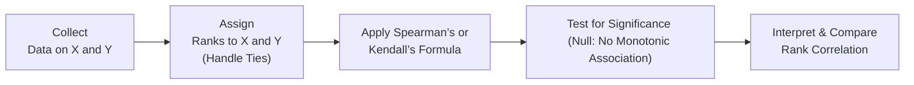

## Understanding Rank Correlation for Non-Parametric Data

Sometimes, we come across data that just doesn’t fit neatly into the usual parametric assumptions. Maybe the data are heavily skewed, or we only have ordinal ranks (like “1st place,” “2nd place,” “3rd place,” and so on). When I was first learning about correlation in grad school—years before prepping for the CFA exams—I remember encountering a dataset on credit ratings vs. analyst recommendations. Everything was an ordered category, not a numeric score, and I thought: “Um, how on earth do I measure correlation here?” That’s pretty much how I stumbled upon rank correlation tests.

Rank correlation tests are designed to capture the association between two sets of ranks or ordinal data. Unlike the standard Pearson correlation coefficient (which assumes normally distributed data and linear relationships), rank correlations measure how well the two variables move together in a monotonically increasing or decreasing fashion—even if that relationship is not linear. This approach can be more robust to outliers and skewness, letting you see if higher ranks in one variable coincide in some consistent way with higher or lower ranks in another.

These techniques are valuable to CFA candidates because financial data often violate normality assumptions (think about how certain returns can be skewed), or you might be dealing with ordinal ratings (like “Strong Buy,” “Buy,” “Hold,” “Sell”). In these cases, Spearman’s rank correlation (ρs) or Kendall’s Tau (τ) might help you get a clearer—but still statistically sound—picture of the relationship.

## Key Measures: Spearman’s Rank Correlation and Kendall’s Tau

Spearman’s Rank Correlation (ρs) is, in many ways, the most popular non-parametric correlation measure. Conceptually, it converts each variable in a dataset into ranks (e.g., 1 for the smallest value, 2 for the next smallest, etc.) and then calculates the usual Pearson correlation on these ranks. A Spearman’s ρs close to +1 indicates that as one set of ranks goes up, the other set of ranks goes up in nearly the exact same order. A value close to –1 indicates the ranks are reversed; if you’re in the top rank in one dataset, you’re in the bottom rank in the other. 

Kendall’s Tau (τ) is another measure that counts the number of “concordant” vs. “discordant” pairs of data. A pair of observations is concordant if both variables move in the same rank order (i.e., if one pair is higher or lower than another pair for both variables). If they move in opposite directions, they’re a discordant pair. Kendall’s Tau might have some interpretational advantages with small samples: it tells you how frequently the observations “agree” in terms of rank ordering, relative to the total possible pairs.

### Concordant and Discordant Pairs

• Concordant Pair: (x₁, y₁) and (x₂, y₂) are concordant if x₁ < x₂ and y₁ < y₂, or if x₁ > x₂ and y₁ > y₂.  
• Discordant Pair: They are discordant if x₁ < x₂ and y₁ > y₂, or x₁ > x₂ and y₁ < y₂.  

In other words, a concordant pair moves “together” (both up or both down), while a discordant pair moves in opposite directions.

## Calculation Steps for Spearman’s ρs

Even though I prefer software to do the heavy lifting nowadays, it’s good to know how to compute Spearman’s ρs manually. Let’s outline the steps:

• First, you rank each dataset separately. Sometimes, you’ll have repeated values (ties), and there are techniques to assign average ranks to tied values. For example, if you have observations 5, 5, 8 with a rank order of 1, 1, 3, then the two “5” observations might each take rank (1+2)/2 = 1.5.  
• Second, you compute the Pearson correlation coefficient on the ranks (not the original data). The Pearson correlation coefficient r between two sets of ranks (Rₓ and Rᵧ) is generally given by:


\rho_s \;=\; \frac{\sum\limits_{i=1}^n (R_{x_i} - \bar{R}_x)(R_{y_i} - \bar{R}_y)}{\sqrt{\sum\limits_{i=1}^n (R_{x_i} - \bar{R}_x)^2 \;\sum\limits_{i=1}^n (R_{y_i} - \bar{R}_y)^2}}


Here, \\(R_{x_i}\\) is the rank of \\(x_i\\) in the first dataset, and \\(\bar{R}_x\\) is the average rank in that dataset. Similarly, \\(R_{y_i}\\) and \\(\bar{R}_y\\) apply to the second dataset.

### Addressing Hypothesis Tests

For Spearman’s ρs, the null hypothesis typically states that there is no monotonic association—i.e., ρs = 0. The test statistic often involves transforming ρs to something approximating a t-distribution for large samples, although exact methods exist for small sample sizes. 

## Real-World Applications in Investments

A common scenario in investments is comparing different analysts’ ordinal recommendations across various stocks. You might have one analyst who ranks companies from most bullish to least bullish, while another analyst has a separate rank ordering. If you want to see whether these two analysts’ perspectives are aligned in a monotonic fashion, Spearman’s ρs or Kendall’s τ is a great fit. Another scenario could involve intangible metrics (like brand power on a 1-to-5 scale) combined with a risk rating on a 1-to-5 scale. Because both metrics are ordinal, you’d want a rank-based non-parametric correlation test to see if brand power correlates with risk rating.

In my own experience, I once had to compare a rank-based ESG (Environmental, Social, and Governance) score—where companies were simply assigned ranks from “Top-tier sustainable” to “Lowest-tier sustainable”—against a rank-based measure of stock performance potential. I used Spearman’s ρs to see if companies with high ESG ranks tended to have higher performance potential ranks. It was way simpler than trying to force classical linear correlation on data that weren’t normal (or interval-scaled) to begin with.

## Strengths and Limitations

### Strengths

• Monotonic Relationship Capture: Rank correlation is great for monotonic relationships—one variable consistently increases with the other, though not necessarily in a straight line.  
• Handling Outliers: Outliers in the original data have a smaller effect because we use only the rank order rather than the raw values.  
• Robustness: If your data are ordinal or heavily non-normal, rank correlation typically remains valid.  

### Limitations

• Less Power If Data Are Actually Normal: If your data are truly normally distributed, Pearson correlation might be more statistically powerful for detecting linear relationships.  
• Potential Information Loss: Converting numeric data to ranks discards some magnitude information.  
• Tied Ranks: Ties might become tricky. Assigning average ranks for ties can be a bit complicated, and large sets of ties can decrease the test’s discriminatory power.

## Common Pitfalls and Best Practices

• Not Checking Ties Properly: If you have many duplicate values, be sure to carefully assign average ranks. Sloppy handling of ties can skew results.  
• Forgetting Monotonic vs. Linear Distinction: Spearman’s ρs or Kendall’s τ only reflect consistent rank ordering. If your data are linear but have no rank-based traction, or if they have a more complex non-monotonic relationship, rank correlation may mislead.  
• Ignoring Underlying Data Type: These tests are typically used for ordinal or rank-based data. If you have interval or ratio data that are normally distributed, you might want Pearson correlation for better power and interpretability.

## Visualizing Rank Correlation with a Mermaid Diagram

Below is a simple conceptual flow diagram showing how rank correlation tests link two variables (X and Y) through their ranks:

• Step A: Gather your data.  
• Step B: Convert each series into rank form, carefully handling ties.  
• Step C: Calculate Spearman’s ρs or Kendall’s τ.  
• Step D: Use appropriate statistical tables or software to test whether the rank correlation is significantly different from zero.  
• Step E: Draw conclusions about how the rank ordering of one variable relates to the rank ordering of the other.

## Conclusion and Exam Tips

Rank correlation tests provide a powerful way to measure association when your data are ordinal, potentially skewed, or you simply want a test that handles outliers more gracefully. Keep in mind that non-parametric methods can sometimes lack the power of parametric tests. On the CFA exam, you might see a scenario where you want to confirm if risk ratings from two different agencies align. Or maybe you want to confirm a monotonic relationship between brand equity rank and market share rank. That’s precisely when you’d consider Spearman’s or Kendall’s tests.

From an exam strategy perspective:  
• Understand when to use Spearman’s ρs vs. Pearson’s correlation. If data are ranked or not normally distributed, suspect a rank-based approach.  
• Remember how concordant and discordant pairs work in Kendall’s τ.  
• Know the overall test structure: hypothesize that ρs = 0, find the test statistic, and then interpret the p-value.  
• Watch out for sample size. In small samples, normal approximations may not hold, so you might rely on exact distributions or specialized methods.  

You might see item set questions or short-answer questions in which you have to compute correlation on small data sets with ranks. Lay out your steps carefully—assign ranks, handle ties, compute. It’s also possible the question will ask about choosing the most “appropriate” test. Non-parametric rank correlation is usually a top pick for ordinal or heavily skewed data.  

Practicing with real or mocked-up ordinal data is invaluable. It’s easy to slip on details like tie handling if you only do it “in theory.” If you find yourself short on time during the exam, at least identify the correct method if the question is about choosing rank-based over parametric tests.

## References

• Conover, W.J. (1998). Practical Nonparametric Statistics.  
• Neave, H.R. and Worthington, P.L. Distribution-Free Tests.  
• Sheskin, D.J. Handbook of Parametric and Nonparametric Statistical Procedures.  

These sources will give you deeper insights on how to implement and interpret rank correlation tests more rigorously.

## Test Your Knowledge of Rank Correlation for Non-Parametric Data



### When is it most appropriate to use a rank correlation test (e.g., Spearman’s ρs) rather than a Pearson correlation?

- [x] When the data are ordinal or heavily non-normal.
- [ ] When the data are normally distributed.
- [ ] When we are sure the relationship is strictly linear.
- [ ] When there are no outliers in the dataset.

> **Explanation:** Rank correlation tests are ideal for ordinal or heavily skewed data where normality assumptions might not hold.  

### What is one key advantage of using Spearman’s rank correlation over Pearson’s correlation in finance?

- [ ] It directly measures covariance.
- [x] It reduces the impact of outliers by focusing on rank order.
- [ ] It requires larger sample sizes.
- [ ] It only applies to interval-scaled data.

> **Explanation:** Spearman’s rank correlation is robust to outliers because it depends on rank order rather than raw values.  

### Which statement correctly describes Kendall’s Tau?

- [x] It measures the proportion of concordant pairs minus the proportion of discordant pairs.
- [ ] It requires large samples to be valid.
- [ ] It always produces higher absolute values than Spearman’s ρs.
- [ ] It is computed by taking the Pearson correlation of the ranks.

> **Explanation:** Kendall’s Tau is based on classifying pairs of observations as concordant or discordant and measuring that difference as a proportion.  

### If two variables have a perfect negative rank correlation (e.g., Spearman’s ρs = –1), which of the following is true?

- [x] High ranks of one variable consistently match low ranks of the other.
- [ ] Both variables increase monotonically together.
- [ ] There is no monotonic relationship.
- [ ] There is a strictly linear relationship.

> **Explanation:** A rank correlation of –1 indicates that when one variable is at a high rank, the other variable is at a low rank, signifying a perfect inverse relationship.  

### Why might rank correlation tests have reduced power if the data truly follow a normal distribution?

- [x] Because the process of ranking discards magnitude information.
- [ ] Because normal distributions are always skewed.
- [ ] Because rank methods require larger sample sizes to be valid.
- [ ] Because normality implies ties.

> **Explanation:** By converting data to ranks, some information about the actual scale or magnitude of differences is lost, potentially reducing power.  

### Which scenario best illustrates a use case for non-parametric rank correlation in an investment context?

- [x] Measuring whether higher brand quality ranks are associated with higher market share ranks.
- [ ] Calculating the risk-return trade-off for different stocks based on their volatility.
- [ ] Determining whether two variables are causally related.
- [ ] Estimating the slope of a linear trend for monthly returns.

> **Explanation:** When both brand quality and market share are expressed in ordinal ranks, rank correlation helps measure their association without requiring normally distributed numeric data.  

### What is a “discordant” pair in the context of Kendall’s Tau?

- [ ] A pair of observations that are identical.
- [x] A pair of observations where one variable ranks higher but the other variable ranks lower.
- [ ] A pair of observations that do not affect the test result.
- [ ] A pair of observations that is missing data.

> **Explanation:** A discordant pair is when two data points move in opposite rank order (one goes up while the other goes down).  

### In Spearman’s rank correlation, how are tied values typically handled?

- [x] They are assigned the average of the rank positions they would occupy.
- [ ] They are ignored from the dataset.
- [ ] They are assigned a random rank within the tie range.
- [ ] They are assigned the midpoint of the dataset range.

> **Explanation:** When multiple observations share the same value, they receive the average of the ranks that would have been assigned if the values were distinct.  

### Which of the following is true regarding the null hypothesis for Spearman’s rank correlation?

- [x] The null hypothesis is usually that the rank correlation is zero (no monotonic association).
- [ ] The null hypothesis always states that any correlation is linear.
- [ ] The null hypothesis must be tested with a chi-square test.
- [ ] The null hypothesis is that the data are non-ordinal.

> **Explanation:** Typically, the hypothesis tested is that ρs = 0, indicating no monotonic association.  

### A rank correlation test can be considered robust if:

- [x] It maintains its validity under non-normal data and the presence of outliers.
- [ ] It only handles normally distributed data.
- [ ] It guarantees equality of variances.
- [ ] It requires strictly continuous variables.

> **Explanation:** Rank correlation tests are considered robust because they do not rely on normality assumptions and are less sensitive to outliers.  


